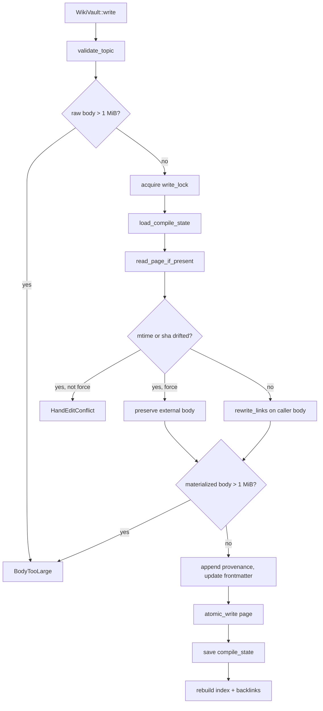

# crates — librefang-memory-wiki

# `librefang-memory-wiki`

A durable markdown knowledge vault for the LibreFang Agent OS. Each page is a hand-editable Markdown file carrying YAML frontmatter that records **who captured the claim** (agent, session, channel, turn, timestamp) and a content hash the vault uses to detect external edits. The vault is designed to be opened in Obsidian, edited by humans, and re-read safely by the compiler on the next run.

It is the *navigable* counterpart to `librefang-memory` (the SQLite + vector substrate). Where the memory substrate answers "find me the K nearest snippets", this crate answers "give me a navigable knowledge base with audit trails".

The vault is **off by default** and v1 wires only `isolated` mode — an own vault, own writes, no dependency on the active memory plugin. `bridge` and `unsafe_local` modes are reserved variants on the same trait surface, stubbed with `WikiError::ModeNotImplemented`.

## Enabling

```toml
[memory_wiki]
enabled = true
mode = "isolated"              # isolated | bridge | unsafe_local  (only isolated is wired)
vault_path = "~/.librefang/wiki/main"
render_mode = "native"         # native | obsidian
ingest_filter = "tagged"       # tagged | all  (all has no effect in v1)
```

Construction returns `WikiError::Disabled` unless `enabled = true`, and `WikiError::ModeNotImplemented("bridge"|"unsafe_local")` for the two reserved modes. When `vault_path` is unset the vault root is resolved under the caller-supplied `home_dir` (the kernel's `KernelConfig.home_dir`, not the env-derived `LIBREFANG_HOME`), so embedded profiles and tests don't silently share data with a developer's personal vault.

## On-disk layout

```text
<vault_path>/
  <topic>.md              # one page per topic: frontmatter + body
  index.md                # auto-generated alphabetical index (rebuilt every write)
  _meta/
    compile-state.json    # { topic -> { mtime_ns, sha256 } } from last compile
    backlinks.json        # { target -> [source, ...] } from every [[link]]
```

`index.md` and the `_meta/` directory are owned by the compiler. Topics starting with `_` and the literal topic `index` are rejected by `validate_topic`.

## Page format

```markdown
---
topic: project-conventions
created: 2026-05-06T10:30:00Z
updated: 2026-05-06T11:00:00Z
content_sha256: 6a4f...
provenance:
  - agent: agent_xyz
    session: sess_abc
    channel: cli
    turn: 4
    at: 2026-05-06T10:30:00Z
---

body markdown ...
```

`content_sha256` is `Frontmatter::hash_body`, computed over the body with a single trailing newline stripped so an editor adding/removing a final newline doesn't flip the hash. It is the field the compiler uses to detect external edits.

### Tolerant parsing

`frontmatter::split` and `read_page_if_present` are deliberately forgiving:

- **No frontmatter block** — returns the raw text as the body; the caller synthesises a default header (`Frontmatter::default_for` sets `created = updated = now`, empty provenance, empty hash recomputed on the next compiler pass).
- **Malformed YAML** — `read_page_if_present` logs a warning and falls back to a synthetic header instead of bricking every subsequent `get`. The next successful `wiki_write` re-renders the page with a clean header.
- **CRLF line endings** — raw bytes are normalised to LF on read before `split`, so hand-authored pages saved by Windows editors or `git core.autocrlf=true` checkouts parse correctly. The vault's own `render()` always emits LF.

## Authoring contract

`wiki_write` callers pass body markdown using `[[topic]]` placeholders for cross-references — this is the canonical authoring form, portable across render modes. The vault rewrites placeholders at flush time:

| `RenderMode` | `[[topic]]` becomes |
| --- | --- |
| `Native` (default) | `[topic](topic.md)` |
| `Obsidian` | `[[topic]]` (identity) |

Because the body itself is otherwise unchanged, a vault can be re-rendered in the other mode without losing data.

`RenderMode::extract_links` recognises **both** forms for backlink indexing (the canonical `[[topic]]` *and* the rewritten native `[topic](topic.md)`), so the backlinks map is invariant under render-mode flips and works against pages on disk regardless of which mode wrote them. Native-form links are only counted as backlinks when the visible text equals the target stem — `[click here](foo.md)` is a generic link, not a topic reference.

## The write path and hand-edit safety

Every `write` goes through this sequence. The hand-edit detector is the central safety property (acceptance criterion #4 from issue #3329): if a human edited the file between compiler runs, the edit is preserved rather than silently overwritten.



Key invariants of the write path:

- **Provenance is monotonic.** Every `write` appends to the existing provenance list; the vault never drops history. Repeated writes to the same topic accumulate entries.
- **Body-size cap is enforced on the materialised body.** `Native` render mode expands each `[[topic]]` (5 bytes) into `[topic](topic.md)` (≥9 bytes), so a raw body just under the 1 MiB cap can exceed it on disk. The pre-rewrite check is a cheap early reject; the authoritative check runs on `chosen_body` after rewrite.
- **Forced writes preserve the external body verbatim.** When `force = true` and the on-disk content has drifted, the caller's body is discarded and the external body is kept (only link rewriting and provenance appending happen). `WikiWriteOutcome::merged_with_external_edit` is `true` so the caller can report that a human edit was preserved.
- **Writes are atomic.** `atomic_write` lands bytes to `<page>.tmp.write` then renames into place, so a crash mid-write never leaves a truncated page.
- **Writes are serialised per-vault.** A `Mutex` inside `WikiVault` prevents two concurrent `write` calls from racing on compile-state; the acceptance test `concurrent_writes_to_same_topic_are_serialised` asserts that every thread either lands cleanly or is rejected by the hand-edit detector — never data loss.

## Compile state and drift detection

`_meta/compile-state.json` maps each topic to a `PageState`:

```rust
struct PageState {
    mtime_ns: String,   // SystemTime::modified as decimal nanoseconds since UNIX_EPOCH
    sha256: String,     // Frontmatter::hash_body of the body emitted by the last compile
}
```

A page is considered *drifted* when either field differs from the current on-disk value. The dual check survives filesystems with coarse (1-second) mtime precision — a human save with identical mtime still flips the SHA. `mtime_ns` is stored as a canonical decimal string so two snapshots compare equal byte-for-byte.

## Topic validation

`validate_topic` enforces:

- Non-empty, ≤ 100 characters.
- Character class `[a-zA-Z0-9_-]+`.
- Not the reserved word `index`.
- Must not start with `_` (reserved for vault metadata).

Violations return `WikiError::InvalidTopic` with a static `reason` string.

## Search

`WikiVault::search` is a v1-naive case-insensitive substring scan across every page body and topic, kept dependency-free. Scoring:

- Topic-name match: `+10.0`
- Each body occurrence: `+ln(1 + count)` (sub-linear so one long page can't bury short topic-only matches)

Results are sorted by score descending, then topic ascending, and truncated to `limit` (minimum 1). Snippets are built by `build_snippet`, which is Unicode-correct: because `str::to_lowercase` is not length-preserving (e.g. `İ` U+0130 → `i̇` grows 2→3 bytes), the snippet builder maintains a byte-offset map from the lowercased copy back to the original body so match offsets stay aligned. Surrounding context is clipped at ±60 bytes on char boundaries, newlines are flattened to spaces, and `…` ellipses mark truncation.

Vector / FTS5 ranking is tracked as a #3329 follow-up.

## Index and backlinks

`rebuild_index_and_backlinks` runs after every successful write. It scans every `<topic>.md`, extracts links from each body, and writes:

- `index.md` — alphabetical topic list with per-page `updated` timestamps, rendered in the active `RenderMode`.
- `_meta/backlinks.json` — `{ target: [source, ...] }` with sources sorted and de-duplicated.

`WikiVault::backlinks` reads the JSON back and returns a flat `Vec<BacklinkEntry>` sorted by `(target, source)`.

## Key types

| Type | Role |
| --- | --- |
| `WikiVault` | The store. Constructed via `WikiVault::new` (config-gated) or `WikiVault::with_root` (tests / post-validation). Holds the vault root, `RenderMode`, `ingest_filter`, and the write `Mutex`. |
| `WikiPage` | A read page: `topic`, `Frontmatter`, `body`. |
| `Frontmatter` | Typed YAML header. `default_for(topic)` synthesises a blank one; `hash_body` computes the canonical SHA. |
| `ProvenanceEntry` | One audit record: `agent`, optional `session` / `channel` / `turn`, required `at`. |
| `WikiWriteOutcome` | Return value of `write`: resolved `path`, `content_sha256`, and `merged_with_external_edit` flag. |
| `SearchHit` | One search result: `topic`, `snippet`, `score`. |
| `BacklinkEntry` | One `(source, target)` edge. |
| `RenderMode` | `Native` \| `Obsidian`, with `link`, `rewrite_links`, and `extract_links`. |

## Error model

`WikiError` is a `thiserror::Error` enum. Notable variants:

- `Disabled` — operator hasn't set `enabled = true`.
- `ModeNotImplemented("bridge"|"unsafe_local")` — reserved modes.
- `InvalidTopic { topic, reason }` — failed `validate_topic`.
- `BodyTooLarge { topic, size, cap }` — body exceeded the 1 MiB cap (checked on both raw and materialised body).
- `NotFound(topic)` — `get` on a missing page.
- `HandEditConflict { topic }` — external edit detected and `force` was not passed.
- `Frontmatter { topic, source }` — YAML parse error.
- `Io { path, source }` — filesystem failure; constructed via the crate-local `WikiError::io(path, source)` helper.

`WikiResult<T> = Result<T, WikiError>`.

## `WikiAccess` trait contract

`librefang-kernel-handle` defines the JSON shape the builtin tools (`wiki_get`, `wiki_search`, `wiki_write`) must return when a kernel impl wires the vault. The kernel-handle crate has no vault to test against, and the kernel impl's full build is unavailable in the sandboxed image — so `tests/wiki_handle_contract.rs` ships a shadow `WikiHandle` adaptor (mirroring the production kernel-side adaptor verbatim) and pins the JSON shape every caller is allowed to rely on:

- `wiki_get(topic)` → `{ topic, frontmatter: { topic, created, updated, content_sha256, provenance: [...] }, body }`
- `wiki_search(query, limit)` → `[{ topic, snippet, score }, ...]`
- `wiki_write(topic, body, provenance, force)` → `{ topic, path, content_sha256, merged_with_external_edit }`; rejects malformed `provenance` with `KernelOpError::InvalidInput`.

When the vault is absent (disabled config), each method returns `KernelOpError::Unavailable("<method>")` — the per-method channel name lets callers distinguish *feature off* from *transient failure*.

## Out of scope for v1

Tracked under #3329 follow-ups:

- **`bridge` mode** — read shared artifacts from the memory substrate via public seams. Trait surface is the same (`WikiVault`); the `MemoryWikiMode` variant already exists; read path stubbed with `ModeNotImplemented`.
- **`unsafe_local` mode** — same-machine escape hatch for an existing Obsidian vault. Same trait, same stub.
- **Memory-event subscription** — the `ingest_filter = "all"` setting is reserved; v1 ingests only via explicit `wiki_write` calls, so the field has no behavioural effect today (a non-default value logs a warning). The hook contract is left to #3326's `before_prompt_build` infrastructure.
- **LLM-assisted topic extraction** — v1 requires explicit `topic` tags.
- **`memory_search` cross-corpus parameter** (`corpus = all|kv|wiki`) — the builtin lives in `librefang-runtime`; extending it touches the runtime tool surface and should land as a follow-up so this crate stays independently usable.

## External consumers

`frontmatter::split` is also called from outside the crate:

- `librefang-api::acp_pipe::handle_connection`
- `librefang-cli::acp::run_pipe_proxy`
- `tool_runner::shell::tool_shell_exec`

These rely on the documented tolerant split contract (missing or malformed frontmatter returns the raw text as body). Changes to the delimiter matching or the round-trip property (`split(render(fm, body)) == body`) must be coordinated with those callers.