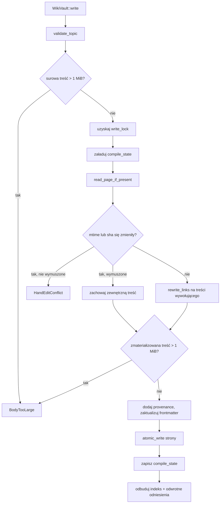

# crates — librefang-memory-wiki

# `librefang-memory-wiki`

Trwały magazyn wiedzy w formacie Markdown dla systemu LibreFang Agent OS. Każda strona to edytowalny ręcznie plik Markdown z nagłówkiem YAML rejestrującym **kto uchwycił daną informację** (agent, sesja, kanał, tura, znacznik czasu) oraz skrótem treści, którego magazyn używa do wykrywania zewnętrznych edycji. Magazyn jest zaprojektowany tak, aby można go było otwierać w Obsidian, edytować przez ludzi i bezpiecznie odczytywać ponownie przez kompilator przy kolejnym uruchomieniu.

Jest to *nawigowalny* odpowiednik `librefang-memory` (podłoża SQLite + wektorowe). Tam gdzie podłoże pamięci odpowiada na pytanie „znajdź K najbliższych fragmentów", ten crate odpowiada na pytanie „udostępnij mi nawigowalną bazę wiedzy z audytem zmian".

Magazyn jest **domyślnie wyłączony**, a v1 obsługuje tylko tryb `isolated` — własny magazyn, własne zapisy, bez zależności od aktywnego wtyczki pamięci. Tryby `bridge` i `unsafe_local` to zastrzeżone warianty na tej samej powierzchni traitu, zrealizowane jako stuby zwracające `WikiError::ModeNotImplemented`.

## Włączanie

```toml
[memory_wiki]
enabled = true
mode = "isolated"              # isolated | bridge | unsafe_local  (tylko isolated jest podłączony)
vault_path = "~/.librefang/wiki/main"
render_mode = "native"         # native | obsidian
ingest_filter = "tagged"       # tagged | all  (all nie ma efektu w v1)
```

Konstrukcja zwraca `WikiError::Disabled`, chyba że `enabled = true`, oraz `WikiError::ModeNotImplemented("bridge"|"unsafe_local")` dla dwóch zastrzeżonych trybów. Gdy `vault_path` nie jest ustawiony, główny katalog magazynu jest określany na podstawie `home_dir` dostarczonego przez wywołującego (`KernelConfig.home_dir` jądra, a nie pochodzący ze zmiennej środowiskowej `LIBREFANG_HOME`), dzięki czemu wbudowane profile i testy nie współdzielą po cichu danych z osobistym magazynem dewelopera.

## Struktura na dysku

```text
<vault_path>/
  <topic>.md              # jedna strona na temat: frontmatter + treść
  index.md                # automatycznie generowany indeks alfabetyczny (odbudowywany przy każdym zapisie)
  _meta/
    compile-state.json    # { temat -> { mtime_ns, sha256 } } z ostatniej kompilacji
    backlinks.json        # { cel -> [źródło, ...] } z każdego [[linku]]
```

`index.md` i katalog `_meta/` są zarządzane przez kompilator. Tematy zaczynające się od `_` oraz dosłowny temat `index` są odrzucane przez `validate_topic`.

## Format strony

```markdown
---
topic: project-conventions
created: 2026-05-06T10:30:00Z
updated: 2026-05-06T11:00:00Z
content_sha256: 6a4f...
provenance:
  - agent: agent_xyz
    session: sess_abc
    channel: cli
    turn: 4
    at: 2026-05-06T10:30:00Z
---

treść markdown ...
```

`content_sha256` to `Frontmatter::hash_body`, obliczany na podstawie treści z usuniętym pojedynczym końcowym znakiem nowej linii, aby edytor dodający/usuwający końcową nową linię nie zmieniał skrótu. To pole służy kompilatorowi do wykrywania zewnętrznych edycji.

### Tolerancyjna analiza

`frontmatter::split` i `read_page_if_present` są celowo pobłażliwe:

- **Brak bloku frontmatter** — zwraca surowy tekst jako treść; wywołujący syntetyzuje domyślny nagłówek (`Frontmatter::default_for` ustawia `created = updated = teraz`, pustą historię pochodzenia, pusty skrót przeliczany przy kolejnym przebiegu kompilatora).
- **Zniekształcony YAML** — `read_page_if_present` loguje ostrzeżenie i przechodzi do syntetycznego nagłówka zamiast psuć każdy kolejny `get`. Kolejny udany `wiki_write` ponownie renderuje stronę z czystym nagłówkiem.
- **Zakończenia linii CRLF** — surowe bajty są normalizowane do LF przy odczycie przed `split`, więc ręcznie tworzone strony zapisane przez edytory Windows lub checkuty z `git core.autocrlf=true` są poprawnie analizowane. Własna funkcja `render()` magazynu zawsze emituje LF.

## Umowa autorska

Wywołujący `wiki_write` przekazują treść markdown używając symboli zastępczych `[[temat]]` dla odniesień krzyżowych — to kanoniczna forma autorska, przenośna między trybami renderowania. Magazyn przepisuje symbole zastępcze w momencie zapisu:

| `RenderMode` | `[[temat]]` staje się |
| --- | --- |
| `Native` (domyślny) | `[temat](temat.md)` |
| `Obsidian` | `[[temat]]` (bez zmian) |

Ponieważ treść jest inaczej niezmieniona, magazyn może być ponownie renderowany w drugim trybie bez utraty danych.

`RenderMode::extract_links` rozpoznaje **oba** formaty do indeksowania odwrotnych odniesień (kanoniczny `[[temat]]` *oraz* przepisany natywny `[temat](temat.md)`), więc mapa odwrotnych odniesień jest niezmienna przy przełączaniu trybów renderowania i działa na stronach na dysku niezależnie od tego, który tryb je zapisał. Linki w formie natywnej są traktowane jako odwrotne odniesienia tylko wtedy, gdy widoczny tekst jest równy rdzeniowi celu — `[kliknij tutaj](foo.md)` to ogólny link, a nie odniesienie do tematu.

## Ścieżka zapisu i bezpieczeństwo ręcznych edycji

Każdy `write` przechodzi przez tę sekwencję. Detektor ręcznych edycji jest centralną właściwością bezpieczeństwa (kryterium akceptacji #4 z issue #3329): jeśli człowiek edytował plik między uruchomieniami kompilatora, edycja jest zachowana, a nie po cichu nadpisana.



Kluczowe niezmienniki ścieżki zapisu:

- **Historia pochodzenia jest monotoniczna.** Każdy `write` dołącza do istniejącej listy provenance; magazyn nigdy nie usuwa historii. Powtarzające się zapisy tego samego tematu akumulują wpisy.
- **Limit rozmiaru treści jest egzekwowany na zmateriałizowanej treści.** Tryb renderowania `Native` rozwija każdy `[[temat]]` (5 bajtów) do `[temat](temat.md)` (≥9 bajtów), więc surowa treść ledwie poniżej limitu 1 MiB może go przekroczyć na dysku. Sprawdzenie przed przepisaniem to tani wczesny odrzut; autorytatywne sprawdzenie wykonuje się na `chosen_body` po przepisaniu.
- **Wymuszone zapisy zachowują zewnętrzną treść dosłownie.** Gdy `force = true` i treść na dysku uległa zmianie, treść wywołującego jest odrzucana, a zewnętrzna treść jest zachowana (następuje tylko przepisywanie linków i dołączanie provenance). `WikiWriteOutcome::merged_with_external_edit` ma wartość `true`, dzięki czemu wywołujący może zgłosić, że edycja człowieka została zachowana.
- **Zapisy są atomowe.** `atomic_write` zapisuje bajty do `<strona>.tmp.write`, a następnie zmienia nazwę na właściwą, więc awaria w trakcie zapisu nigdy nie pozostawia obciętej strony.
- **Zapisy są serializowane per magazyn.** `Mutex` wewnątrz `WikiVault` zapobiega rywalizacji dwóch współbieżnych wywołań `write` na stanie kompilacji; test akceptacji `concurrent_writes_to_same_topic_are_serialised` potwierdza, że każdy wątek albo zapisuje poprawnie, albo jest odrzucany przez detektor ręcznych edycji — nigdy nie dochodzi do utraty danych.

## Stan kompilacji i wykrywanie zmian

`_meta/compile-state.json` mapuje każdy temat na `PageState`:

```rust
struct PageState {
    mtime_ns: String,   // SystemTime::modified jako dziesiętne nanosekundy od UNIX_EPOCH
    sha256: String,     // Frontmatter::hash_body treści emitowanej przez ostatnią kompilację
}
```

Strona jest uważana za *zmienioną*, gdy którekolwiek z pól różni się od bieżącej wartości na dysku. Podwójne sprawdzenie przetrwa systemy plików z grubą (1-sekundową) precyzją mtime — zapis człowieka z identycznym mtime wciąż zmienia SHA. `mtime_ns` jest przechowywany jako kanoniczny ciąg dziesiętny, więc dwa migawki porównują się równo bajt po bajcie.

## Walidacja tematów

`validate_topic` egzekwuje:

- Niepusty, ≤ 100 znaków.
- Klasa znaków `[a-zA-Z0-9_-]+`.
- Nie zastrzeżone słowo `index`.
- Nie może zaczynać się od `_` (zastrzeżone dla metadanych magazynu).

Naruszenia zwracają `WikiError::InvalidTopic` z statycznym ciągiem `reason`.

## Wyszukiwanie

`WikiVault::search` to naiwne skanowanie podciągów bez uwzględnienia wielkości liter w v1, obejmujące treść i temat każdej strony, utrzymywane bez zależności. Punktacja:

- Dopasowanie nazwy tematu: `+10.0`
- Każde wystąpienie w treści: `+ln(1 + liczba)` (sub-liniowe, aby jedna długa strona nie mogła zakopać krótkich dopasowań tylko w temacie)

Wyniki są sortowane malejąco według wyniku, następnie rosnąco według tematu i obcięte do `limit` (minimum 1). Fragmenty są budowane przez `build_snippet`, który jest poprawny pod kątem Unicode: ponieważ `str::to_lowercase` nie zachowuje długości (np. `İ` U+0130 → `i̇` rośnie z 2 do 3 bajtów), budowniczy fragmentów utrzymuje mapę przesunięć bajtowych z kopii z małymi literami z powrotem do oryginalnej treści, aby przesunięcia dopasowań pozostały wyrównane. Kontekst jest przycinany o ±60 bajtów na granicach znaków, nowe linie są spłaszczane do spacji, a wielokropki `…` oznaczają obcięcie.

Ranking wektorowy / FTS5 jest śledzony jako następstwo w ramach #3329.

## Indeks i odwrotne odniesienia

`rebuild_index_and_backlinks` uruchamia się po każdym udanym zapisie. Skanuje każdy `<temat>.md`, wyodrębnia linki z każdej treści i zapisuje:

- `index.md` — alfabetyczną listę tematów z sygnaturami czasowymi `updated` dla każdej strony, renderowaną w aktywnym `RenderMode`.
- `_meta/backlinks.json` — `{ cel: [źródło, ...] }` ze źródłami posortowanymi i bez duplikatów.

`WikiVault::backlinks` odczytuje JSON z powrotem i zwraca płaski `Vec<BacklinkEntry>` posortowany według `(cel, źródło)`.

## Kluczowe typy

| Typ | Rola |
| --- | --- |
| `WikiVault` | Magazyn. Konstruowany przez `WikiVault::new` (warunkowo wg konfiguracji) lub `WikiVault::with_root` (testy / po walidacji). Przechowuje główny katalog magazynu, `RenderMode`, `ingest_filter` oraz `Mutex` zapisu. |
| `WikiPage` | Odczytana strona: `topic`, `Frontmatter`, `body`. |
| `Frontmatter` | Typizowany nagłówek YAML. `default_for(topic)` syntetyzuje pusty; `hash_body` oblicza kanoniczny SHA. |
| `ProvenanceEntry` | Jeden rekord audytu: `agent`, opcjonalne `session` / `channel` / `turn`, wymagane `at`. |
| `WikiWriteOutcome` | Wartość zwracana przez `write`: rozstrzygnięta `path`, `content_sha256` oraz flaga `merged_with_external_edit`. |
| `SearchHit` | Jeden wynik wyszukiwania: `topic`, `snippet`, `score`. |
| `BacklinkEntry` | Jedna krawędź `(źródło, cel)`. |
| `RenderMode` | `Native` \| `Obsidian`, z metodami `link`, `rewrite_links` i `extract_links`. |

## Model błędów

`WikiError` to enum `thiserror::Error`. Godne uwagi warianty:

- `Disabled` — operator nie ustawił `enabled = true`.
- `ModeNotImplemented("bridge"|"unsafe_local")` — zastrzeżone tryby.
- `InvalidTopic { topic, reason }` — nieudane `validate_topic`.
- `BodyTooLarge { topic, size, cap }` — treść przekroczyła limit 1 MiB (sprawdzane na surowej i zmateriałizowanej treści).
- `NotFound(topic)` — `get` na nieistniejącej stronie.
- `HandEditConflict { topic }` — wykryto zewnętrzną edycję, a `force` nie zostało przekazane.
- `Frontmatter { topic, source }` — błąd analizy YAML.
- `Io { path, source }` — awaria systemu plików; konstruowany przez lokalną funkcję pomocniczą `WikiError::io(path, source)` crat'u.

`WikiResult<T> = Result<T, WikiError>`.

## Kontrakt traitu `WikiAccess`

`librefang-kernel-handle` definiuje kształt JSON, jaki wbudowane narzędzia (`wiki_get`, `wiki_search`, `wiki_write`) muszą zwracać, gdy implementacja jądra podłącza magazyn. Crate kernel-handle nie ma magazynu do testowania, a pełna kompilacja implementacji jądra jest niedostępna w sandboxowanym obrazie — dlatego `tests/wiki_handle_contract.rs` dostarcza cień `WikiHandle` adaptor (odzwierciedlający produkcyjny adaptor po stronie jądra dosłownie) i przypina kształt JSON, na którym każdy wywołujący może polegać:

- `wiki_get(topic)` → `{ topic, frontmatter: { topic, created, updated, content_sha256, provenance: [...] }, body }`
- `wiki_search(query, limit)` → `[{ topic, snippet, score }, ...]`
- `wiki_write(topic, body, provenance, force)` → `{ topic, path, content_sha256, merged_with_external_edit }`; odrzuca niepoprawne `provenance` z `KernelOpError::InvalidInput`.

Gdy magazyn jest nieobecny (wyłączona konfiguracja), każda metoda zwraca `KernelOpError::Unavailable("<metoda>")` — nazwa kanału dla każdej metody pozwala wywołującym rozróżnić *funkcja wyłączona* od *przejściowej awarii*.

## Poza zakresem v1

Śledzone jako następstwa w ramach #3329:

- **Tryb `bridge`** — odczyt współdzielonych artefaktów z podłoża pamięci przez publiczne szwy. Powierzchnia traitu jest ta sama (`WikiVault`); wariant `MemoryWikiMode` już istnieje; ścieżka odczytu zrealizowana jako stub z `ModeNotImplemented`.
- **Tryb `unsafe_local`** — drzwi awaryjne na tej samej maszynie dla istniejącego magazynu Obsidian. Ten sam trait, ten sam stub.
- **Subskrypcja zdarzeń pamięci** — ustawienie `ingest_filter = "all"` jest zastrzeżone; v1 przyjmuje tylko przez jawne wywołania `wiki_write`, więc pole nie ma dziś wpływu behawioralnego (niedomyślna wartość loguje ostrzeżenie). Kontrakt haka jest pozostawiony infrastrukturze `before_prompt_build` z #3326.
- **Ekstrakcja tematów wspomagana przez LLM** — v1 wymaga jawnych tagów `topic`.
- **Parametr `memory_search` cross-corpus** (`corpus = all|kv|wiki`) — wbudowane narzędzie znajduje się w `librefang-runtime`; rozszerzenie go dotyka powierzchni narzędzi runtime'u i powinno trafić jako następstwo, aby ten crate pozostał niezależnie użyteczny.

## Zewnętrzni konsumenci

`frontmatter::split` jest również wywoływane spoza crat'u:

- `librefang-api::acp_pipe::handle_connection`
- `librefang-cli::acp::run_pipe_proxy`
- `tool_runner::shell::tool_shell_exec`

Te moduły opierają się na udokumentowanej tolerancyjnej umowie split (brakujący lub zniekształcony frontmatter zwraca surowy tekst jako treść). Zmiany w dopasowywaniu ogranicznika lub właściwości round-trip (`split(render(fm, body)) == body`) muszą być skoordynowane z tymi wywołującymi.
