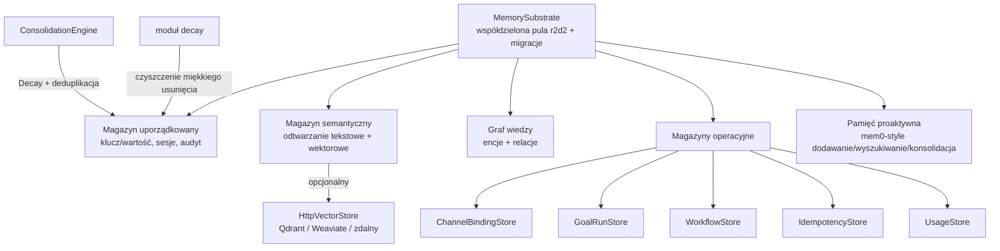

# crates — librefang-memory

# librefang-memory

Podłoże pamięciowe dla LibreFang Agent OS. Dostarcza warstwę trwałości, przez którą agenci, jądro i API odczytują i zapisują dane — obejmującą uporządkowany stan klucz/wartość, semantyczne wyszukiwanie tekstowe/wektorowe, relacje grafu wiedzy, historię wiadomości sesji, proaktywną pamięć (w stylu mem0) oraz kilka magazynów operacyjnych (powiązania kanałów, przebiegi celów, przebiegi workflow, pamięć podręczna idempotencji, śledzenie użycia).

Wszystkie magazyny współdzielą jedną pulę połączeń SQLite zarządzaną przez `r2d2` w ramach `MemorySubstrate`, z migracjami aplikowanymi przy starcie przez `migration::run_migrations`.

## Architektura



## Kluczowe koncepcje

### Współdzielona pula połączeń

Każdy magazyn opakowuje to samo `Pool<SqliteConnectionManager>` przekazywane przez `MemorySubstrate`. Utrzymuje to cały utrwalony stan w jednym pliku WAL i unika zbędnych wywołań otwarcia. Magazyny są tanimi klonami — wewnętrznie trzymają jedynie `Arc` do puli.

**Konstrukcja magazynu wymaga wcześniejszego uruchomienia migracji.** Wzorzec w testach:

```rust
let pool = Pool::builder().max_size(1).build(SqliteConnectionManager::memory()).unwrap();
crate::migration::run_migrations(&pool.get().unwrap()).unwrap();
let store = ChannelBindingStore::new(pool);
```

### Niezmiennik miękkiego usunięcia

Tabela `memories` używa kolumny flagowej `deleted` zamiast twardego `DELETE`. Decay, konsolidacja i inicjowane przez użytkownika operacje `forget*` ustawiają `deleted = 1` i oznaczają `deleted_at`. Twarde usunięcie następuje później w `prune_soft_deleted_memories`, zaplanowane przez cykl retencji jądra. Każda wariacja `forget*` musi oznaczyć `deleted_at`, w przeciwnym razie cykl czyszczenia (filtrujący `deleted_at IS NOT NULL`) pominie ją na zawsze, powodując wyciek BLOBa osadzania.

### Izolacja dzierżawców przez `agent_id`

Pamięci, encje/relacje grafu wiedzy oraz zestawy kandydatów konsolidacji są wszystkie zakresowane przez `agent_id`. Silnik konsolidacji przetwarza pamięci każdego agenta w izolacji, aby zapobiec cross-tenantowym scaleniom — identyczna treść należąca do różnych agentów nigdy nie może być porównywana ani scalana.

## Kluczowe moduły

### Magazyn powiązań kanałów (`channel_binding_store.rs`)

Dwupoziomowa wyszukiwarka wysyłania agentów dla wiadomości przychodzących kanału. Zastępuje niedeterministyczny powrót `list_agents().first()`, którego most używał wcześniej.

Dwie tabele napędzają wysyłanie:
- **`channel_instance_defaults`** — jeden wiersz na instancję `[[sidecar_channels]]`, zasiany z konfiguracji przy starcie.
- **`conversation_bindings`** — nadpisanie na poziomie `(instancja, konwersacja)` zapisywane przez komendę `/agent`.

`ChannelBindingStore::resolve` wykonuje wyszukiwanie: nadpisanie konwersacji ma pierwszeństwo, z następującym powrotem do domyślnego instancji, potem `None`. Tabele przechowują **nazwę** agenta (nie per-spawn `AgentId` uuid); most mapuje nazwa → id w czasie wysyłania.

Kluczowe metody:
- `seed_instance_default(instance, agent)` — upsert z konfiguracji przy starcie używający `ON CONFLICT DO UPDATE` (nie `INSERT OR REPLACE`, co usunęłoby i wstawiło ponownie).
- `set_instance_default(instance, agent, bound_by)` — ponowne przypisanie operatora/runtime ze śladem audytu.
- `set_conversation_binding(instance, conversation_id, agent, bound_by)` — akcja `/agent <nazwa>`.
- `resolve(instance, conversation_id)` — dwupoziomowe wyszukiwanie wysyłania.

Ten sam identyfikator konwersacji na dwóch różnych instancjach jest rozwiązywany niezależnie — to ochrona przed cross-botowym wyciekiem #5672.

### Fragmentator (`chunker.rs`)

Dzieli długi tekst na zachodzące na siebie fragmenty do osadzania opartego na pamięci. Strategia podziału w kolejności priorytetu:

1. Podział na granicach akapitów (`\n\n`).
2. Jeśli akapit przekracza `max_size`, podział na granicach zdań (`. ` / `.\n` dla ASCII; `。` / `？` / `！` dla CJK).
3. Jeśli zdanie nadal przekracza `max_size`, twardy podział na granicy znaków z użyciem cięcia bezpiecznego dla granic znaków.

Nachodzenie jest aplikowane przez dodawanie ostatnich `overlap` znaków poprzedniego fragmentu na początek. Wszystkie sprawdzenia długości są oparte na znakach (nie na bajtach) dla poprawnej obsługi Unicode.

```rust
pub fn chunk_text(text: &str, max_size: usize, overlap: usize) -> Vec<String>
```

### Silnik konsolidacji (`consolidation.rs`)

Uruchamiany jako okresowy cykl całego jądra (`kernel/background_lifecycle.rs::memory_consolidation`). Dwie fazy na cykl:

**Faza 1 — Decay:** Zmniejsza pewność pamięci, do których nie uzyskano dostępu w ostatnich 7 dniach, o skonfigurowany współczynnik `decay_rate`, z podłogą na 0.1.

**Faza 2 — Deduplikacja/scalanie:** Dla każdego agenta ładuje do `MAX_CANDIDATES_PER_AGENT` (500) aktywnych pamięci uporządkowanych DESC po pewności, następnie wykonuje O(N²) parowe porównanie podobieństwa tekstowego Jaccarda. Pary przekraczające `duplicate_threshold` (domyślnie 0.85, konfigurowalne przez `[proactive_memory] duplicate_threshold`) są scalane. Co najwyżej `MAX_MERGES_PER_RUN` (100) skaleni jest aplikowanych na cykl.

Semantyka scalania, gdy zachowujący absorbuje przegranego:
- **`access_count`**: sumowane (zachowujący + przegrany)
- **`metadata`**: unia obiektów JSON, zachowujący wygrywa przy kolizji kluczy; ładunki nieobiektywne po dowolnej stronie wracają do dosłownego zachowania zachowującego
- **`embedding`**: ważona pewnością średnia krocząca po wszystkich pochłoniętych przegranych (nie parowe re-blendowanie)
- **`confidence`**: `max(zachowujący, przegrany)`

Wszystkie scalenia w cyklu lądują w jednej zewnętrznej transakcji (jedno fsync), zachowując parową niepodzielność.

Próg duplikacji jest przechowywany jako `f32::to_bits` w `AtomicU32`, więc `set_duplicate_threshold(&self, ...)` może go zaktualizować przez `Arc<MemorySubstrate>` podczas hot-reload bez potrzeby `&mut`.

> Ten silnik jest wyłącznie tekstowy (brak osadzeń per wywołanie w globalnym cyklu). Dla deduplikacji świadomej osadzeń per agent, użyj `ProactiveMemoryStore::consolidate` (trasa `/api/memory/agents/{id}/consolidate`). Oba silniki czytają ten sam skonfigurowany `duplicate_threshold` (H5).

### Decay (`decay.rs`)

Czasowe miękkie usuwanie przestarzałych pamięci na podstawie TTL zakresu:

| Zakres | Reguła |
|--------|--------|
| `user_memory` | Nigdy nie wygasa |
| `session_memory` | Miękko usunięta po `session_ttl_days` bez dostępu |
| `agent_memory` | Miękko usunięta po `agent_ttl_days` bez dostępu |

Porównania sygnatur czasowych używają `datetime(accessed_at) < datetime(cutoff)` zamiast leksykograficznego porównania ciągów, które psuje się, gdy przesunięcia RFC3339 lub precyzja ułamków sekund się różnią.

Dostęp do pamięci resetuje licznik decay — `SemanticStore::recall_with_embedding` aktualizuje `accessed_at` przy każdym odczycie.

`prune_soft_deleted_memories(pool, older_than_days)` wykonuje końcowe twarde `DELETE` wierszy miękkousuniętych poza oknem retencji, odzyskując BLOB osadzania (#3467).

### Magazyn przebiegów celów (`goal_run_store.rs`)

Utrwala aktywny stan przebiegów celów, aby długookresowe przebiegi celów przetrwały restarty demona i utratę zasilania. Cienka warstwa CRUD; serializacja między `GoalRunState` jądra a `GoalRunRow` odbywa się w jądrze.

- `save_run` używa `ON CONFLICT DO UPDATE` z kluczem na `goal_id` (co najwyżej jeden aktywny przebieg na cel). `created_at` jest pominięte z listy INSERT, więc domyślne schematu odpala się raz i jest zachowywane przez aktualizacje.
- `load_all_runs` zwraca wiersze uporządkowane DESC po `started_at` dla deterministycznego odzyskania przy starcie.
- Ograniczenie `CHECK` na kolumnie `phase` odrzuca nieznane wartości faz.
- `wal_checkpoint` wymusza PASSIVE WAL checkpoint po utrwaleniu przebiegów w fazie końcowej, zapewniając trwałość przed kolejnym automatycznym checkpointem.

### Magazyn wektorowy HTTP (`http_vector_store.rs`)

Deleguje operacje wektorowe do zdalnej usługi HTTP/JSON (Qdrant, Weaviate, własna mikrousługa). Implementuje trait `VectorStore` z `librefang-types`.

Oczekiwana umowa API zdalnego:

| Metoda | Ścieżka | Treść żądania |
|--------|---------|---------------|
| POST | `/insert` | `{ id, embedding, payload, metadata }` |
| POST | `/search` | `{ query_embedding, limit, filter? }` |
| DELETE | `/delete` | `{ id }` |
| POST | `/get_embeddings` | `{ ids }` |

Środki utwardzania:
- **Limit czasu żądania** (30s) i **limit czasu połączenia** (10s) zapobiegają zablokowaniu wątku puli `spawn_blocking` przez opóźniony backend (ten magazyn leży na gorącej ścieżce odtwarzania/zapamiętywania).
- **Limit treści odpowiedzi** (`MAX_RESPONSE_BYTES` = 64 MiB) egzekwowany zarówno na ścieżce szybkiej `Content-Length`, jak i w pętli strumieniowania fragmentów, więc wrogi/nieprawidłowo działający backend nie może spowodować OOM demona przez wolne nieograniczone ciało. Ciała odpowiedzi błędów są również limitowane.

### Magazyn idempotencji (`idempotency.rs`)

Pamięć podręczna kluczy idempotencji wspierana przez SQLite współdzielona przez warstwę API. Semantyka middleware HTTP żyje w `librefang-api::idempotency`; ten moduł dostarcza kształt utrwalenia, aby crate API nie zależał bezpośrednio od `rusqlite`.

- 24-godzinne okno powtórki (`TTL_SECONDS = 86400`).
- `lookup` oportunisticznie usuwa wygasłe wiersze i zgłasza je jako `Ok(None)`.
- `put` używa `INSERT OR IGNORE` dla semantyki pierwszy-zapisuje-wygrywa pod współbieżnymi żądaniami.
- `prune_expired` jest wywoływane oportunisticznie przez middleware, więc tabela samoistnie się przycina.
- Trait `IdempotencyStore` jest podłączalny, pozwalając na implementacje w pamięci dla testów jednostkowych w crate API.

Błędy wyczerpania puli zwiększają `librefang_memory_pool_get_failed_total` z etykietami `store` i `op` dla widoczności operatora.

### Graf wiedzy (`knowledge.rs`)

Magazyn encji i relacji wspierany przez SQLite. Encje niosą właściwości JSON; relacje odwołują się do encji po nazwie. Zapytania są zakresowane przez `agent_id`, aby zapobiec cross-tenantowemu wyciekowi relacji. Funkcja `query_graph` parsuje odwołania relacji po nazwie i ujawnia uszkodzone właściwości encji zamiast domyślnego podmieniania.

### ACL przestrzeni nazw (`namespace_acl.rs`)

Zarządza dostępem do odczytu/zapisu przestrzeni nazw pamięci. Wykonywanie płynie przez:

1. Obsługę trasy API (`memory_update`, `memory_query_relations`, itd.)
2. `check_write` / `check_read` w tym module
3. `can_write` / `can_read` w `librefang-types::user_policy`
4. `namespace_glob_matches` + `has_path_traversal` dla dopasowywania wzorców i kontroli bezpieczeństwa

Odmowy dostępu przechodzą przez `namespace_acl::deny`.

### Pamięć proaktywna (`proactive`)

Warstwa pamięci w stylu mem0 eksponująca:
- `ProactiveMemory` — ujednolicone API: `search`, `add`, `get`, `list`
- `ProactiveMemoryHooks` — hooki auto-memorizacji / auto-odtwarzania
- `ProactiveMemoryStore` — implementacja na bazie `MemorySubstrate`

Podmoduły: `chunker`, `consolidation`, `decay`, `migration`, `namespace_acl`, `prompt`, `provider`, `roster_store`, `session`.

## Jak inne craty używają tego modułu

Pętla agenta i jądro są głównymi konsumentami:

- **Pętla agenta** (`src/agent_loop/`) odczytuje/zapisuje wiadomości sesji przez `Session::push_message`, `set_messages`, `mark_messages_mutated` i utrwala interakcje przez `MemorySubstrate::remember` / `remember_with_embedding_async` / `save_session_async`.
- **Jądro** (`librefang-kernel/`) utrwala przebiegi workflow przez `WorkflowStore::upsert_run` / `load_all_runs` / `wal_checkpoint`, rejestruje użycie tokenów przez `UsageRecord` i uruchamia tła konsolidacji/decay.
- **Warstwa API** (`src/routes/memory.rs`) kieruje przez kontrole ACL przestrzeni nazw przed dotknięciem magazynów pamięci.
- **Składanie promptów** (`src/agent_loop/prompt.rs`) używa `mark_messages_mutated` i `remember_interaction_best_effort` do utrwalania interakcji agenta.

## Obsługa błędów

Wszystkie publiczne metody zwracają `LibreFangResult<T>`. Błędy operacji SQLite mapują się na `LibreFangError::memory(...)` lub `LibreFangError::memory_msg(format!(...))` z kontekstem identyfikującym zawodzącą operację (np. `"channel instance default seed failed: {e}"`). Błędy uzyskania puli używają `LibreFangError::memory(r2d2_error)`.
