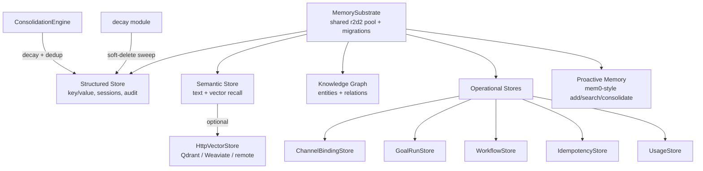

# crates — librefang-memory

# librefang-memory

Memory substrate for the LibreFang Agent OS. Provides the persistence layer that agents, the kernel, and the API all read and write through — covering structured key/value state, semantic text/vector search, knowledge graph relations, session message history, proactive (mem0-style) memory, and several operational stores (channel bindings, goal runs, workflow runs, idempotency cache, usage tracking).

All stores share a single r2d2 SQLite connection pool managed by `MemorySubstrate`, with migrations applied at boot via `migration::run_migrations`.

## Architecture



## Core concepts

### Shared connection pool

Every store wraps the same `Pool<SqliteConnectionManager>` handed out by `MemorySubstrate`. This keeps all persisted state under one WAL file and avoids redundant open calls. Stores are cheap clones — they hold only an `Arc` to the pool internally.

**Constructing a store requires migrations to have run first.** The pattern in tests is:

```rust
let pool = Pool::builder().max_size(1).build(SqliteConnectionManager::memory()).unwrap();
crate::migration::run_migrations(&pool.get().unwrap()).unwrap();
let store = ChannelBindingStore::new(pool);
```

### Soft-delete invariant

The `memories` table uses a `deleted` flag column rather than hard `DELETE`. Decay, consolidation, and user-initiated `forget*` all set `deleted = 1` and stamp `deleted_at`. Hard removal happens later in `prune_soft_deleted_memories`, scheduled by the kernel retention sweep. Every `forget*` variant must stamp `deleted_at` or the prune sweep (which filters `deleted_at IS NOT NULL`) will skip it forever, leaking the embedding BLOB.

### Tenant isolation by `agent_id`

Memories, knowledge graph entities/relations, and consolidation candidate sets are all scoped by `agent_id`. The consolidation engine processes each agent's memories in isolation to prevent cross-tenant merges — identical content belonging to different agents must never be compared or merged.

## Key modules

### Channel binding store (`channel_binding_store.rs`)

Two-level agent dispatch lookup for inbound channel messages. Replaces the non-deterministic `list_agents().first()` fallback the bridge previously used.

Two tables drive dispatch:
- **`channel_instance_defaults`** — one row per `[[sidecar_channels]]` instance, seeded from config at boot.
- **`conversation_bindings`** — per-`(instance, conversation)` override written by the `/agent` command.

`ChannelBindingStore::resolve` performs the lookup: conversation override wins, falling back to the instance default, then `None`. Tables store the agent **name** (not the per-spawn `AgentId` uuid); the bridge maps name → id at dispatch time.

Key methods:
- `seed_instance_default(instance, agent)` — upserts from config at boot using `ON CONFLICT DO UPDATE` (not `INSERT OR REPLACE`, which would delete+reinsert).
- `set_instance_default(instance, agent, bound_by)` — operator/runtime rebind with audit trail.
- `set_conversation_binding(instance, conversation_id, agent, bound_by)` — the `/agent <name>` action.
- `resolve(instance, conversation_id)` — the two-level dispatch lookup.

The same conversation ID on two different instances resolves independently — this is the #5672 cross-bot leak guard.

### Chunker (`chunker.rs`)

Splits long text into overlapping chunks for embedding-based memory. Splitting strategy in priority order:

1. Split on paragraph boundaries (`\n\n`).
2. If a paragraph exceeds `max_size`, split on sentence boundaries (`. ` / `.\n` for ASCII; `。` / `？` / `！` for CJK).
3. If a sentence still exceeds `max_size`, hard-split at the character limit using char-boundary-safe slicing.

Overlap is applied by prepending the last `overlap` characters of the previous chunk. All length checks are char-based (not byte-based) for correct Unicode handling.

```rust
pub fn chunk_text(text: &str, max_size: usize, overlap: usize) -> Vec<String>
```

### Consolidation engine (`consolidation.rs`)

Runs as a periodic kernel-wide sweep (`kernel/background_lifecycle.rs::memory_consolidation`). Two phases per cycle:

**Phase 1 — Decay:** Reduces confidence of memories not accessed in the last 7 days by the configured `decay_rate` factor, floored at 0.1.

**Phase 2 — Dedup/merge:** For each agent, loads up to `MAX_CANDIDATES_PER_AGENT` (500) active memories ordered by confidence DESC, then does an O(N²) pairwise Jaccard text-similarity comparison. Pairs exceeding `duplicate_threshold` (default 0.85, configurable via `[proactive_memory] duplicate_threshold`) are merged. At most `MAX_MERGES_PER_RUN` (100) merges are applied per cycle.

Merge semantics when keeper absorbs a loser:
- **`access_count`**: summed (keeper + loser)
- **`metadata`**: JSON object union, keeper wins on key collision; non-object payloads on either side fall back to preserving the keeper verbatim
- **`embedding`**: confidence-weighted running average across all absorbed losers (not pairwise re-blend)
- **`confidence`**: `max(keeper, loser)`

All merges in a run land in a single outer transaction (one fsync), preserving per-pair atomicity.

The duplicate threshold is stored as `f32::to_bits` in an `AtomicU32` so `set_duplicate_threshold(&self, ...)` can update it through `Arc<MemorySubstrate>` during hot-reload without needing `&mut`.

> This engine is text-only (no per-call embeddings available in the global sweep). For embedding-aware per-agent dedup, use `ProactiveMemoryStore::consolidate` (the `/api/memory/agents/{id}/consolidate` route). Both engines read the same configured `duplicate_threshold` (H5).

### Decay (`decay.rs`)

Time-based soft-delete of stale memories based on scope TTL:

| Scope | Rule |
|-------|------|
| `user_memory` | Never decays |
| `session_memory` | Soft-deleted after `session_ttl_days` of no access |
| `agent_memory` | Soft-deleted after `agent_ttl_days` of no access |

Timestamp comparisons use `datetime(accessed_at) < datetime(cutoff)` rather than lexicographic string comparison, which breaks when RFC3339 offsets or fractional-second precision diverge.

Accessing a memory resets the decay timer — `SemanticStore::recall_with_embedding` updates `accessed_at` on every read.

`prune_soft_deleted_memories(pool, older_than_days)` performs the final hard `DELETE` of rows soft-deleted past the retention window, reclaiming the embedding BLOB (#3467).

### Goal run store (`goal_run_store.rs`)

Persists active goal-run state so long-horizon goal runs survive daemon restarts and power loss. Thin CRUD layer; serialization between the kernel's `GoalRunState` and `GoalRunRow` happens in the kernel.

- `save_run` uses `ON CONFLICT DO UPDATE` keyed on `goal_id` (at most one active run per goal). `created_at` is omitted from the INSERT list so the schema default fires once and is preserved across updates.
- `load_all_runs` returns rows ordered by `started_at DESC` for deterministic boot-time recovery.
- A `CHECK` constraint on the `phase` column rejects unknown phase values.
- `wal_checkpoint` forces a PASSIVE WAL checkpoint after persisting terminal-phase runs, ensuring durability before the next automatic checkpoint.

### HTTP vector store (`http_vector_store.rs`)

Delegates vector operations to a remote HTTP/JSON service (Qdrant, Weaviate, custom microservice). Implements the `VectorStore` trait from `librefang-types`.

Expected remote API contract:

| Method | Path | Request body |
|--------|------|-------------|
| POST | `/insert` | `{ id, embedding, payload, metadata }` |
| POST | `/search` | `{ query_embedding, limit, filter? }` |
| DELETE | `/delete` | `{ id }` |
| POST | `/get_embeddings` | `{ ids }` |

Hardening measures:
- **Request timeout** (30s) and **connect timeout** (10s) prevent a stalled backend from pinning the `spawn_blocking` pool thread (this store sits on the hot recall/remember path).
- **Response body cap** (`MAX_RESPONSE_BYTES` = 64 MiB) enforced both on the `Content-Length` fast path and in the streaming chunk loop, so a hostile/misbehaving backend cannot OOM the daemon via a slow unbounded body. Error-response bodies are also capped.

### Idempotency store (`idempotency.rs`)

SQLite-backed Idempotency-Key cache shared by the API layer. The HTTP middleware semantics live in `librefang-api::idempotency`; this module provides the persistence shape so the API crate doesn't depend on `rusqlite` directly.

- 24-hour replay window (`TTL_SECONDS = 86400`).
- `lookup` opportunistically deletes expired rows and reports them as `Ok(None)`.
- `put` uses `INSERT OR IGNORE` for first-writer-wins semantics under concurrent requests.
- `prune_expired` is called opportunistically by the middleware so the table self-trims.
- The `IdempotencyStore` trait is pluggable, allowing in-memory implementations for unit tests in the API crate.

Pool-exhaustion failures increment `librefang_memory_pool_get_failed_total` with `store` and `op` labels for operator visibility.

### Knowledge graph (`knowledge.rs`)

SQLite-backed entity and relation store. Entities carry JSON properties; relations reference entities by name. Queries are scoped by `agent_id` to prevent cross-tenant relation leakage. The `query_graph` function parses relation references by name and surfaces corrupt entity properties rather than silently defaulting.

### Namespace ACL (`namespace_acl.rs`)

Governs read/write access to memory namespaces. Execution flows through:

1. API route handler (`memory_update`, `memory_query_relations`, etc.)
2. `check_write` / `check_read` in this module
3. `can_write` / `can_read` in `librefang-types::user_policy`
4. `namespace_glob_matches` + `has_path_traversal` for pattern matching and security checks

Access denials go through `namespace_acl::deny`.

### Proactive memory (`proactive`)

mem0-style memory layer exposing:
- `ProactiveMemory` — unified API: `search`, `add`, `get`, `list`
- `ProactiveMemoryHooks` — auto-memorize / auto-retrieve hooks
- `ProactiveMemoryStore` — implementation on top of `MemorySubstrate`

Sub-modules: `chunker`, `consolidation`, `decay`, `migration`, `namespace_acl`, `prompt`, `provider`, `roster_store`, `session`.

## How other crates use this module

The agent loop and kernel are the primary consumers:

- **Agent loop** (`src/agent_loop/`) reads/writes session messages via `Session::push_message`, `set_messages`, `mark_messages_mutated`, and persists interactions through `MemorySubstrate::remember` / `remember_with_embedding_async` / `save_session_async`.
- **Kernel** (`librefang-kernel/`) persists workflow runs via `WorkflowStore::upsert_run` / `load_all_runs` / `wal_checkpoint`, records token usage via `UsageRecord`, and runs background consolidation/decay sweeps.
- **API layer** (`src/routes/memory.rs`) routes through namespace ACL checks before touching the memory stores.
- **Prompt assembly** (`src/agent_loop/prompt.rs`) uses `mark_messages_mutated` and `remember_interaction_best_effort` to persist agent interactions.

## Error handling

All public methods return `LibreFangResult<T>`. SQLite operation failures map to `LibreFangError::memory(...)` or `LibreFangError::memory_msg(format!(...))` with context identifying the failing operation (e.g., `"channel instance default seed failed: {e}"`). Pool acquisition failures use `LibreFangError::memory(r2d2_error)`.