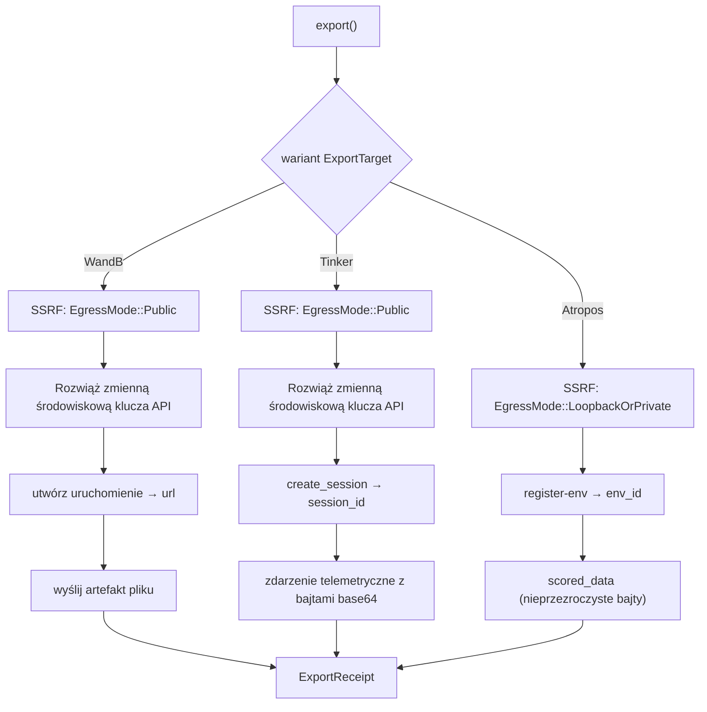

# crate'y — librefang-rl-export

# `librefang-rl-export`

Eksporter trajektorii wdrożenia RL o długim horyzoncie. Ten crate jest warstwą wyjściową LibreFanga, która zamienia zakończone wdrożenie agenta w przesłanie do zewnętrznej usługi śledzenia RL. Jest to realizacja zgłoszenia #3331 i został zaprojektowany jako niezależny od formatu przesyłu (RFC #3330 ustala serializację później, ale ten crate traktuje bajty trajektorii jako nieprzezroczyste).

## Publiczne API

Crate udostępnia jeden asynchroniczny punkt wejścia i cztery typy:

```rust
pub async fn export(
    target: ExportTarget,
    payload: RlTrajectoryExport,
) -> Result<ExportReceipt, ExportError>;
```

**`RlTrajectoryExport`** — ładunek wejściowy. Zawiera trajektorię jako nieprzezroczyste bajty `Vec<u8>` (nie analizowane, nie walidowane, nie transkodowane), `run_id` nadany przez wywołującego, opcjonalne `toolset_metadata` (oczyszczone przed wysłaniem) oraz znaczniki czasowe okna wdrożenia (`started_at` / `finished_at`).

**`ExportTarget`** — enum `#[non_exhaustive]` wybierający usługę nadrzędną. Każdy wariant zawiera tylko konfigurację potrzebną dla danego celu. Klucze API **nigdy nie są wstawiane bezpośrednio** — każdy wariant zawierający tajemnice przechowuje *nazwę* zmiennej środowiskowej (`api_key_env`), rozwiązywaną w momencie wysyłania za pomocą `std::env::var`.

**`ExportReceipt`** — wynik udanego przesłania: `target_run_url` ładowalny w przeglądarce na serwerze nadrzędnym, `bytes_uploaded` oraz lokalny znacznik czasowy `uploaded_at`.

**`ExportError`** — enum błędów `#[non_exhaustive]`. Odrębne warianty istnieją tylko tam, gdzie wywołujący muszą rozgałęziać się według przyczyny; wszystko inne ma bogate ładunki tekstowe, aby operator zobaczył własną diagnostykę serwera nadrzędnego.

## Obsługiwane cele

Każdy cel mapuje ogólny przepływ „zarejestruj uruchomienie, a następnie wyślij dane" na najbliższą parę dwóch wywołań, jaką serwer nadrzędny faktycznie akceptuje:

| Cel | Wywołanie rejestracji | Wywołanie danych | Uwierzytelnienie |
|--------|-------------------|-----------|------|
| **W&B** | `POST /api/runs` | `POST /files/{entity}/{project}/{run_id}` | HTTP Basic (`api:<klucz>`) |
| **Tinker** | `POST /api/v1/create_session` | `POST /api/v1/telemetry` | nagłówek `X-API-Key` |
| **Atropos** | `POST /register-env` | `POST /scored_data` | Brak (lokalna mikrousługa) |



### Weights & Biases (`wandb.rs`)

Tworzy uruchomienie poprzez `POST /api/runs` z projektem, encją, znacznikami czasowymi i zredagowanymi metadanymi, a następnie przesyła surowe bajty trajektorii jako artefakt pliku przez `POST /files/{entity}/{project}/{run_id}`. Pole `entity` jest **wymagane** — poprzedni powrót do `"default"` był zgadywaniem, które cicho umieszczało uruchomienia w niewłaściwym zasobniku. Uwierzytelnienie to HTTP Basic z dosłownym użytkownikiem `api` i kluczem API jako hasłem (udokumentowana konwencja W&B).

### Tinker (`tinker.rs`)

Tinker nie ma dedykowanego punktu końcowego dla nieprzezroczystej trajektorii. Eksporter mapuje na najbliższą stabilną parę: `create_session` (uzyskuje serwerowo przypisany `session_id`), a następnie `telemetry` (przesyła pojedyncze `GenericEvent`, którego `event_data` zawiera bajty trajektorii zakodowane w base64 wraz z oknem wdrożenia). Bajty trajektorii są kodowane w standardowym base64, aby koperta JSON pozostała poprawna niezależnie od formatu przesyłu producenta. Tagi są sortowane dla deterministycznego wyniku na strumieniu.

### Atropos (`atropos.rs`)

Atropos to **lokalna mikrousługa FastAPI**, którą operator uruchamia jako część swojego stosu trenowania — nie jest to usługa chmurowa i nie ma uwierzytelnienia. Eksporter wywołuje `register-env`, aby uzyskać serwerowo przypisany `env_id`, a następnie przesyła bajty trajektorii dosłownie jako ładunek `ScoredData` przez `/scored_data`. Bajty **muszą być już poprawnym JSON-em `ScoredData`** — crate przekazuje je nieprzezroczystie i pozwala Atroposowi zwalidować (błąd 422 przy niepowodzeniu jest zgłaszany jako `UpstreamRejected`).

Istnieje dedykowany wariant błędu `TrainerNotReady` dla przypadku, gdy trener jeszcze nie wystartował: Atropos zwraca HTTP 200 z ciałem sygnalizacyjnym `{"status": "wait for trainer to start"}` i bez `env_id`. Wywołujący powinni odpytywać z wygaszaniem, aż trener będzie gotowy.

## Model bezpieczeństwa

### Obsługa tajemnic

Klucze API używają wzorca pośrednictwa `*_env`: wariant `ExportTarget` przechowuje **nazwę** zmiennej środowiskowej (np. `"WANDB_API_KEY"`), a nie samą tajemnicę. W momencie przesyłania, `resolve_env_secret()` odczytuje zmienną środowiskową i zamyka się z błędem `InvalidConfig`, jeśli jest nieustawiona lub pusta. To utrzymuje tajemnice poza `config.toml`, migawkami historii i zrzutami procesów. Pochodna implementacja `Debug` jest bezpieczna do drukowania, ponieważ pola to nazwy zmiennych środowiskowych, a nie wartości tajemnic.

### Biała lista egress SSRF (`ssrf.rs`)

Crate waliduje każdy wychodzący bazowy URL przed jakimkolwiek wejściem/wyjściem sieciowym za pomocą `validate_egress_url()`. Istnieją dwa tryby egress:

- **`EgressMode::Public`** (W&B, Tinker): Odrzuca adresy loopback, prywatne RFC-1918, link-local, IMDS oraz znane wewnętrzne nazwy hostów. Serwery nadrzędne w chmurze muszą wskazywać na publiczne cele.
- **`EgressMode::LoopbackOrPrivate`** (Atropos): *Tylko* akceptuje adresy loopback (`127.0.0.0/8`, `::1`) i prywatne adresy RFC-1918. Cele publiczne są odrzucane bezwzględnie — Atropos nie ma uwierzytelnienia, więc wystawienie producenta na internet jest z definicji błędne. Adresy link-local/IMDS (`169.254.169.254`) są odrzucane nawet na tej ścieżce.

Zbiór zablokowanych adresów odzwierciedla `librefang_runtime_mcp::mcp_oauth::is_ssrf_blocked_host` (w tym pivoty chmurowych metadanych: `0.0.0.0`, Alibaba CGNAT `100.64/10`, Azure `192.0.0.192`, GCP `metadata.google.internal`). Wzorce są zduplikowane, a nie importowane, aby uniknąć ciągnięcia drzewa zależności jądra do liściowego crate'u; oba muszą zmieniać się razem.

### Blokowanie przekierowań

Wszystkie eksportery budują klienta reqwest z `redirect(Policy::none())`. Biała lista SSRF waliduje tylko początkowy bazowy URL; klient podążający za przekierowaniami pozwoliłby na atakowalną bazę 3xx do wewnętrznego hosta (np. chmurowych metadanych), odtwarzając nagłówek uwierzytelnienia. Zakończone przesyłanie nigdy nie potrzebuje podążać za przekierowaniem — 3xx jest zgłaszane jako `UpstreamRejected`.

### Redakcja poświadczeń (`redact.rs`)

`toolset_metadata` jest oczyszczane w procesie przed wysłaniem. Walker redakcji rekursywnie przepisuje *wartości* tekstowe (nigdy klucze) pasujące do tokenów JWT, ciągów w kształcie `api_key` i długich blobów base64 — zastępując je odpowiednio `<REDACTED:JWT>`, `<REDACTED:CREDENTIAL>` i `<REDACTED:BLOB>`. Zbiór regexów odzwierciedla `librefang_kernel::trajectory::RedactionPolicy`. Test migawki parzystości (`regex_set_matches_kernel_snapshot`) względem `tests/fixtures/kernel_redaction_patterns.txt` głośno zawodzi CI, jeśli jedna ze stron się rozjedzie.

## Strategia powtórzeń (`retry.rs`)

`retry_upload()` otacza każde wychodzące wywołanie HTTP wygaszaniem eksponencjalnym: **3 próby** przy bazowym opóźnieniu **200ms** (200ms, potem 400ms). Jest to celowe odejście od pętli powtórzeń LLM w workspace'ie (`agent_loop.rs`: 4 próby przy bazie 1000ms). Uzasadnienie jest udokumentowane w module: okna limitowania szybkości W&B/Tinker/Atropos są mierzone w sekundach, nie minutach, subsekundowe powtórzenia dają szybszą informację zwrotną o niepowodzeniu, a trajektorie są post-rollout, więc żaden użytkownik nie blokuje się na budżecie powtórzeń.

Błędy przejściowe (`NetworkError`, HTTP 5xx, 429) są ponawiane. Błędy trwałe (`AuthError`, nie-429 4xx, `MalformedResponse`, `InvalidConfig`, `TrainerNotReady`) zwracają się natychmiast przy pierwszej próbie.

## Taksonomia błędów (`error.rs`)

| Wariant | Wyzwalacz | Powtarzany |
|---------|---------|-----------|
| `NetworkError(String)` | Błąd warstwy transportowej (DNS, TCP, TLS, timeout) | Tak |
| `AuthError` | HTTP 401/403 — poświadczenia odrzucone | Nie |
| `UpstreamRejected { status, body }` | Nie-aut 4xx/5xx; ciało obcięte do 4 KiB | Tylko 5xx/429 |
| `MalformedResponse(String)` | Ciało 2xx nie pasuje do oczekiwanego kształtu (dryf API) | Nie |
| `InvalidConfig(String)` | Błąd konfiguracji wyłapany przed jakimkolwiek I/O | Nie |
| `TrainerNotReady { status_label }` | Sygnał Atroposa — trener nie uruchomiony | Odpytaj osobno |

Pomocnik `classify_status()` mapuje 401/403 → `AuthError` (aby wywołujący mogli poprosić o odświeżenie poświadczeń bez ujawniania surowego ciała, które czasem echem zwraca odrzucony token), a wszystko inne → `UpstreamRejected`. Pomocnik `classify_response_decode_error()` rozróżnia błędy dekodowania JSON (dryf API → `MalformedResponse`) od utrat transportu w trakcie odczytu (`NetworkError`).

## Klient HTTP

Wszystkie wychodzące żądania HTTP przechodzą przez `librefang_http::proxied_client_builder()`, współdzielony klient reqwest workspace'u. Jest to niezbywalne zgodnie z AGENTS.md `librefang-extensions` — współdzielony klient przenosi skonfigurowany proxy, zapasowe korzenie TLS i `User-Agent: librefang/<version>`. Każdy eksporter wyłącza podążanie za przekierowaniami na bazie współdzielonego buildera.

## Rozdzielenie formatu przesyłu

`RlTrajectoryExport.trajectory_bytes` to nieprzezroczyste `Vec<u8>`. Crate nie inspektuje, waliduje ani transkoduje ładunku — przesyła bajty do serwera nadrzędnego dosłownie (W&B: surowe bajty jako artefakt pliku; Tinker: zakodowane w base64 w zdarzeniu telemetrycznym; Atropos: surowe bajty JSON jako `ScoredData`). To utrzymuje eksporter stabilnym przez iteracje formatu przesyłu; RFC #3330 może ustalić format później bez zmiany powierzchni `export()`.

## Testowanie

Każdy moduł eksportera ma równoległą suite testową `wiremock::MockServer` obejmującą: poprawny przepływ dwóch wywołań, mapowanie błędów autentykacji (401 → `AuthError`), mapowanie błędów walidacji (422 → `UpstreamRejected` z ciałem), blokowanie przekierowań (3xx musi zwrócić błąd, nie podążać) i walidację konfiguracji przed I/O (pusty projekt/klucz/bajty odrzucone przed kontaktem z siecią). Testy używają wariantów `*_with_base` (udostępnionych jako `pub(crate)`) wskazujących na makiety serwerów loopback; produkcyjni wywołujący przechodzą przez publiczną `export()`, która zawsze najpierw uruchamia walidację SSRF.

## Punkty integracji

Crate jest konsumowany przez warstwę orkiestracji eksportu RL (`src/rl_export/mod.rs`), która wywołuje `build_payload()` → `RlTrajectoryExport` i `maybe_export_on_turn_end()` → `export()`. Crate zależy od `librefang-http` dla współdzielonego klienta proxy, ale nie ma zależności od jądra ani środowiska uruchomieniowego — jest to liściowy crate egress.
