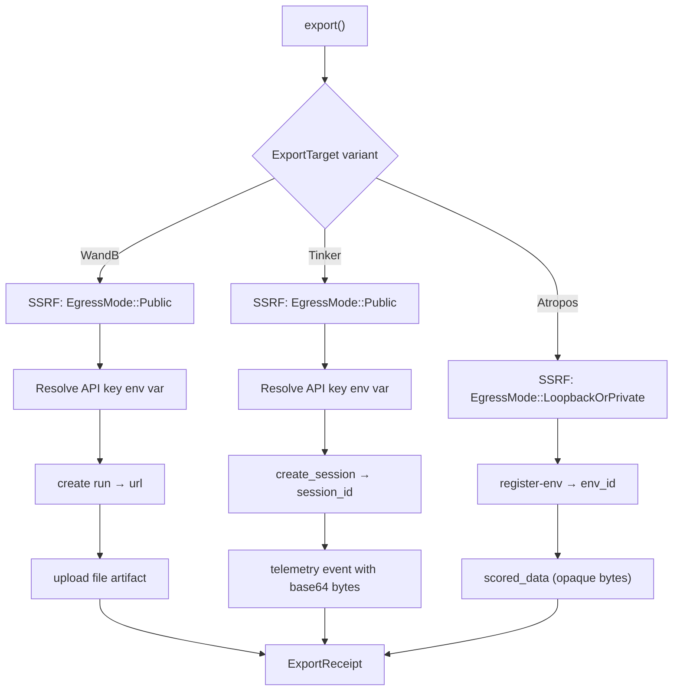

# crates — librefang-rl-export

# `librefang-rl-export`

Long-horizon RL rollout trajectory exporter. This crate is LibreFang's egress surface that turns a finished agent rollout into an upload to an external RL-tracking service. It is the concrete delivery of issue #3331 and is designed to be wire-format-agnostic (RFC #3330 locks the serialization later, but this crate treats trajectory bytes as opaque).

## Public API

The crate exposes a single async entry point and four types:

```rust
pub async fn export(
    target: ExportTarget,
    payload: RlTrajectoryExport,
) -> Result<ExportReceipt, ExportError>;
```

**`RlTrajectoryExport`** — the input payload. Carries the trajectory as opaque `Vec<u8>` bytes (not parsed, validated, or transcoded), a caller-side `run_id`, optional `toolset_metadata` (scrubbed before egress), and the rollout window timestamps (`started_at` / `finished_at`).

**`ExportTarget`** — a `#[non_exhaustive]` enum selecting the upstream service. Each variant carries only the configuration needed for that target. API keys are **never inlined** — every secret-bearing variant stores the *name* of an environment variable (`api_key_env`), resolved at upload time via `std::env::var`.

**`ExportReceipt`** — the result of a successful upload: a browser-loadable `target_run_url` on the upstream, `bytes_uploaded`, and a local `uploaded_at` timestamp.

**`ExportError`** — `#[non_exhaustive]` error enum. Distinct variants only exist where callers need to branch on cause; everything else is string-payload-heavy so the operator sees the upstream's own diagnostic.

## Supported Targets

Each target maps the generic "register the run, then post the data" flow onto the closest two-call pair the upstream actually accepts:

| Target | Registration Call | Data Call | Auth |
|--------|-------------------|-----------|------|
| **W&B** | `POST /api/runs` | `POST /files/{entity}/{project}/{run_id}` | HTTP Basic (`api:<key>`) |
| **Tinker** | `POST /api/v1/create_session` | `POST /api/v1/telemetry` | `X-API-Key` header |
| **Atropos** | `POST /register-env` | `POST /scored_data` | None (local microservice) |



### Weights & Biases (`wandb.rs`)

Creates a run via `POST /api/runs` with project, entity, timestamps, and redacted metadata, then uploads the raw trajectory bytes as a file artifact via `POST /files/{entity}/{project}/{run_id}`. The `entity` field is **required** — the previous `"default"` fallback was a guess that would silently land runs in the wrong bucket. Authentication is HTTP Basic with the literal user `api` and the API key as password (W&B's documented convention).

### Tinker (`tinker.rs`)

Tinker has no dedicated opaque-trajectory endpoint. The exporter maps onto the closest stable pair: `create_session` (recovers a server-assigned `session_id`) then `telemetry` (submits a single `GenericEvent` whose `event_data` carries base64-encoded trajectory bytes plus the rollout window). The trajectory bytes are base64-standard-encoded so the JSON envelope stays valid regardless of the producer's wire format. Tags are sorted for deterministic wire output.

### Atropos (`atropos.rs`)

Atropos is a **local FastAPI microservice** the operator runs as part of their training stack — not a cloud service, and there is no authentication. The exporter calls `register-env` to recover a server-assigned `env_id`, then submits the trajectory bytes verbatim as a `ScoredData` payload via `/scored_data`. The bytes **must already be valid `ScoredData` JSON** — the crate forwards them opaquely and lets Atropos validate (422 on failure surfaces as `UpstreamRejected`).

A dedicated `TrainerNotReady` error variant exists for the case where the trainer hasn't booted yet: Atropos returns HTTP 200 with the sentinel body `{"status": "wait for trainer to start"}` and no `env_id`. Callers should poll with backoff until the trainer is ready.

## Security Model

### Secret Handling

API keys use the `*_env` indirection pattern: the `ExportTarget` variant stores the **name** of the environment variable (e.g., `"WANDB_API_KEY"`), not the secret itself. At upload time, `resolve_env_secret()` reads the env var and fails closed with `InvalidConfig` if unset or empty. This keeps secrets out of `config.toml`, history snapshots, and process dumps. The derived `Debug` is safe to print because the fields are env-var names, not secret values.

### SSRF Egress Allowlist (`ssrf.rs`)

The crate validates every outbound base URL before any network I/O via `validate_egress_url()`. Two egress modes exist:

- **`EgressMode::Public`** (W&B, Tinker): Rejects loopback, RFC-1918 private, link-local, IMDS, and known internal hostnames. Cloud upstreams must point at public destinations.
- **`EgressMode::LoopbackOrPrivate`** (Atropos): *Only* accepts loopback (`127.0.0.0/8`, `::1`) and RFC-1918 private addresses. Public destinations are rejected outright — Atropos has no auth, so exposing the producer to the internet is wrong by design. Link-local/IMDS addresses (`169.254.169.254`) are rejected even on this path.

The block set mirrors `librefang_runtime_mcp::mcp_oauth::is_ssrf_blocked_host` (including cloud-metadata pivots: `0.0.0.0`, Alibaba CGNAT `100.64/10`, Azure `192.0.0.192`, GCP `metadata.google.internal`). The patterns are duplicated rather than imported to avoid dragging the kernel dependency tree into a leaf crate; the two must change together.

### Redirect Blocking

All exporters build a reqwest client with `redirect(Policy::none())`. The SSRF allowlist validates only the initial base URL; a redirect-following client would let an attacker-controlled base 3xx to an internal host (e.g., cloud metadata), replaying the auth header. A finished upload never needs to follow a redirect — a 3xx surfaces as `UpstreamRejected`.

### Credential Redaction (`redact.rs`)

`toolset_metadata` is scrubbed in-process before egress. The redaction walker recursively rewrites string *values* (never keys) matching JWT tokens, `api_key`-shaped strings, and long base64 blobs — replacing them with `<REDACTED:JWT>`, `<REDACTED:CREDENTIAL>`, and `<REDACTED:BLOB>` respectively. The regex set mirrors `librefang_kernel::trajectory::RedactionPolicy`. A parity-snapshot test (`regex_set_matches_kernel_snapshot`) against `tests/fixtures/kernel_redaction_patterns.txt` fails CI loudly if either side drifts.

## Retry Strategy (`retry.rs`)

`retry_upload()` wraps every upstream HTTP call with exponential backoff: **3 attempts** at **200ms base** delay (200ms then 400ms). This is an intentional divergence from the workspace's LLM retry loop (`agent_loop.rs`: 4 attempts at 1000ms base). The rationale is documented in the module: W&B/Tinker/Atropos rate-limit windows are seconds not minutes, sub-second retry gives faster failure feedback, and trajectories are post-rollout so no user is blocking on the retry budget.

Transient errors (`NetworkError`, HTTP 5xx, 429) are retried. Permanent errors (`AuthError`, non-429 4xx, `MalformedResponse`, `InvalidConfig`, `TrainerNotReady`) return immediately on the first attempt.

## Error Taxonomy (`error.rs`)

| Variant | Trigger | Retryable |
|---------|---------|-----------|
| `NetworkError(String)` | Transport-layer failure (DNS, TCP, TLS, timeout) | Yes |
| `AuthError` | HTTP 401/403 — credentials rejected | No |
| `UpstreamRejected { status, body }` | Non-auth 4xx/5xx; body truncated to 4 KiB | 5xx/429 only |
| `MalformedResponse(String)` | 2xx body didn't match expected shape (API drift) | No |
| `InvalidConfig(String)` | Config error caught before any I/O | No |
| `TrainerNotReady { status_label }` | Atropos sentinel — trainer not booted | Poll separately |

The `classify_status()` helper maps 401/403 → `AuthError` (so callers can prompt for credential refresh without surfacing the raw body, which sometimes echoes the rejected token) and everything else → `UpstreamRejected`. The `classify_response_decode_error()` helper distinguishes JSON decode failures (API drift → `MalformedResponse`) from transport drops mid-read (`NetworkError`).

## HTTP Client

All outbound HTTP flows through `librefang_http::proxied_client_builder()`, the workspace's shared reqwest client. This is non-negotiable per the `librefang-extensions` AGENTS.md — the shared client carries the configured proxy, TLS fallback roots, and `User-Agent: librefang/<version>`. Each exporter disables redirect following on top of the shared builder.

## Wire-Format Decoupling

`RlTrajectoryExport.trajectory_bytes` is opaque `Vec<u8>`. The crate does not inspect, validate, or transcode the payload — it forwards bytes to the upstream verbatim (W&B: raw bytes as file artifact; Tinker: base64-encoded in a telemetry event; Atropos: raw JSON bytes as `ScoredData`). This keeps the exporter stable across wire-format iterations; RFC #3330 can lock the format later without changing the `export()` surface.

## Testing

Each exporter module has a parallel `wiremock::MockServer` test suite covering: happy-path two-call flow, auth error mapping (401 → `AuthError`), validation error mapping (422 → `UpstreamRejected` with body), redirect-blocking (3xx must error, not follow), and pre-I/O config validation (empty project/key/bytes rejected before network contact). Tests use `*_with_base` variants (exposed at `pub(crate)`) to point at loopback mock servers; production callers go through the public `export()` which always runs SSRF validation first.

## Integration Points

The crate is consumed by the RL export orchestration layer (`src/rl_export/mod.rs`), which calls `build_payload()` → `RlTrajectoryExport` and `maybe_export_on_turn_end()` → `export()`. The crate depends on `librefang-http` for the shared proxied client but has no dependency on the kernel or runtime — it is a leaf egress crate.