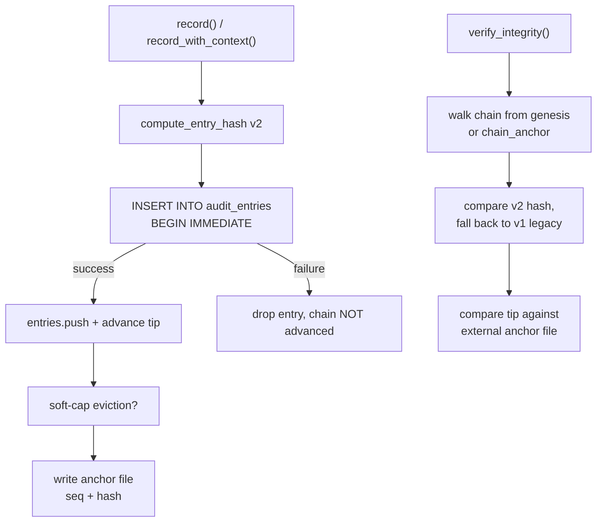

# crates — librefang-runtime-audit

# `librefang-runtime-audit` — Tamper-Evident Audit Log

A Merkle hash chain audit trail for security-critical LibreFang runtime events. Every auditable action is appended to an append-only log where each entry's SHA-256 hash incorporates the previous entry's hash, forming a linked chain that detects retroactive edits. When a SQLite connection pool is supplied, entries persist across daemon restarts. An optional external anchor file extends tamper-evidence beyond what the database alone can prove.

## Architecture

## Core Concepts

### The Merkle Chain

Each `AuditEntry` stores its own `hash` and the `hash` of its predecessor (`prev_hash`). The genesis entry's `prev_hash` is 64 zero characters. Verification walks the chain forward, recomputing every hash and checking each `prev_hash` link. Any field edit — timestamp, agent id, detail, outcome, user attribution — breaks the link at that point.

Two hash layouts exist:

- **v2 (current):** Every field is prefixed with a `\x1f`-delimited tag (`\x1fseq=`, `\x1ftimestamp=`, etc.) so byte content cannot shift across a field boundary. This closes an ambiguity where `agent_id="a", detail="bc"` and `agent_id="ab", detail="c"` produced identical hashes.
- **v1 (legacy):** Pre-delimiter layout — six fields concatenated with no separators, then optionally-tagged `user_id`/`channel`, then bare `prev_hash`. Retained solely so `verify_integrity` can validate entries written before the fix. New entries are never written with this layout.

`verify_integrity` accepts either layout per entry, so upgrading does not raise false tamper alarms on existing logs.

### `AuditAction` — Append-Only Enum

The variant name is folded into the per-entry hash via `Display`. **Adding a new variant is safe**; renaming or reordering is a breaking change that invalidates every persisted hash mentioning it. The `as_str()` and `FromStr` implementations use exhaustive `match` arms (no wildcards), so the compiler forces coverage when a variant is added — preventing the reload path from silently coercing an unmapped action to `ToolInvoke`.

Current variants cover tool invocations, capability checks, agent lifecycle, memory/file/network/shell access, auth, config changes, dream consolidation, RBAC events (`UserLogin`, `RoleChange`, `PermissionDenied`, `BudgetExceeded`), retention self-audit (`RetentionTrim`), and A2A agent lifecycle (`A2aDiscovered`, `A2aTrusted`).

### `AuditEntry`

| Field | Purpose |
|-------|---------|
| `seq` | Monotonically increasing 0-indexed sequence number |
| `timestamp` | ISO-8601 (RFC-3339) recording time |
| `agent_id` | Agent that triggered or is subject of the action |
| `action` | `AuditAction` variant |
| `detail` | Free-form context (tool name, file path, etc.) |
| `outcome` | Result (`"ok"`, `"denied"`, error message) |
| `user_id` | Optional `UserId` attribution (post-M1) |
| `channel` | Optional origin (`"telegram"`, `"api"`, `"cli"`, etc.) |
| `prev_hash` | SHA-256 of predecessor (genesis sentinel for first entry) |
| `hash` | SHA-256 of this entry's content + `prev_hash` |

`user_id` and `channel` are folded into the hash only when present, so pre-M1 entries still verify.

## `AuditLog` Constructors

### `new()` — In-Memory Only

Creates an empty log with no persistence. The tip initializes to the genesis sentinel. Source of truth is the in-memory `Vec<AuditEntry>`.

### `with_db(pool)` — SQLite-Backed

Loads all rows from `audit_entries` ordered by `seq`, recovers any chain anchor left by a prior trim, and runs `verify_integrity` on load. Failures are logged at `WARN` (not `ERROR`) so dev hosts with routine untracked restarts don't drown the operator's `grep ERROR daemon.log` — see #5478. Schema v22 added the `user_id`/`channel` columns; pre-migration rows deserialize as `None` and keep their original hash.

Unknown `action` strings (rows written by a newer daemon) are logged by name and temporarily coerced to `ToolInvoke` rather than dropping the row. The hash will not recompute until the binary is upgraded.

### `with_db_anchored(pool, anchor_path)` — DB + External Witness

Extends `with_db` with an external tip-anchor file. On construction:

1. Entries load from SQLite and the chain re-verifies.
2. If the anchor file exists, its `seq:hash` is compared against the in-DB tip. Divergence logs a loud `error!` pointing at `librefang security verify` and `audit-reset`.
3. If the DB has rows but no anchor exists, the anchor is seeded from the current tip so future rewrites are detectable.
4. A corrupt anchor file is refused — never silently overwritten.

The anchor file format is deliberately human-readable: `<seq> <hex-hash>\n`. Writes are atomic (`.tmp` + rename) so a crash mid-write never leaves a truncated anchor.

#### Threat Model

A DB-only chain is self-consistent but cannot detect a full table rewrite: an attacker with write access to `audit_entries` can wipe every row, insert fabricated history, and recompute every hash from the genesis sentinel forward. The external anchor closes that gap by storing the latest `seq:hash` outside SQLite, where the attacker must tamper with it separately. For stronger guarantees, point `anchor_path` at a location the daemon can write but unprivileged code cannot (chmod-0400 file owned by a different user, systemd `ReadOnlyPaths=` mount, NFS share, or a pipe to `logger`).

## Recording Events

### `record(agent_id, action, detail, outcome) -> String`

Convenience wrapper omitting user/channel attribution. Returns the new entry's hash.

### `record_with_context(agent_id, action, detail, outcome, user_id, channel) -> String`

Full form with optional attribution. The append flow:

1. Lock `entries` and `tip` mutexes.
2. Derive `seq` from `entries.last().seq + 1` (not `len()`, since trim may have dropped a prefix).
3. Compute the v2 hash and build the `AuditEntry`.
4. If DB-backed: `BEGIN IMMEDIATE` → INSERT → commit. **On failure, the entry is dropped and the chain does not advance.** This prevents the chain-break-on-restart class of bugs (#4050/#4078) where an in-memory-only retry queue left orphaned `prev_hash` links on disk after a restart.
5. On success: push to `entries`, advance `tip`, increment `persisted_rows`.
6. **Soft-cap eviction:** if `entries.len()` exceeds `effective_soft_cap()`, drain the oldest prefix and record the last dropped entry's hash as the new `chain_anchor`.
7. If anchored: rewrite the anchor file with the current `persisted_rows` count and tip hash.

`BEGIN IMMEDIATE` acquires a RESERVED lock at the SQLite layer so concurrent processes cannot interleave two appends against the same `prev_hash`.

### Soft Cap and Memory Bounds

Two ceilings govern the in-memory window:

| Constant | Value | Applies When |
|----------|-------|--------------|
| `MAX_AUDIT_ENTRIES` | 10,000 | No operator cap configured |
| `MAX_IN_MEMORY_SOFT_CAP_NUMERATOR / DENOMINATOR` | 3 / 2 (1.5×) | Operator cap is set |

`set_max_in_memory_entries(n)` stores the operator's configured `audit.retention.max_in_memory_entries`. `effective_soft_cap()` returns `n × 1.5` (or the hard 10,000 default when `n == 0`). The 1.5× headroom lets the buffer grow slightly between scheduled `trim()` cycles (#5665) without unbounded growth.

The soft cap drains the **in-memory** window only — DB rows stay on disk. `persisted_rows` tracks the on-disk population separately so the anchor `seq` stays accurate after eviction.

## Retention

### `trim(policy, now) -> TrimReport`

Applies `AuditRetentionConfig` in two passes:

1. **Cap pass:** If `max_in_memory_entries` is set and exceeded, mark the oldest overflow for dropping.
2. **Per-action pass:** Walk forward from the cap boundary. For each entry, if its action has a configured `retention_days_by_action` window and the entry is older than that window, drop it. Stop at the first survivor.

**Dropping is prefix-only.** The chain is a contiguous linked list — you cannot punch holes. The first entry whose retention keeps it halts the trim, so newer entries of "should-drop" actions survive.

Returns a `TrimReport` with per-action drop counts, total dropped, and the new chain anchor hash. The caller (kernel periodic task) is responsible for recording the `RetentionTrim` self-audit row.

**Persist-before-mutate:** the DB `DELETE` runs before the in-memory `drain`. If the DELETE fails, nothing is trimmed and the report is empty — the trim retries on the next tick. This prevents a restart from resurrecting rows that retention removed.

### `prune(retention_days) -> usize`

Legacy day-based retention. Same prefix-only semantics and persist-before-mutate discipline as `trim`. Updates `chain_anchor` to the last dropped entry's hash so `verify_integrity` continues to pass across the prune boundary.

### Chain Anchor Recovery

`chain_anchor` is in-memory only — no schema column. On boot, `with_db` recovers it from the surviving rows: if the first entry's `prev_hash` is not the genesis sentinel, that `prev_hash` **is** the anchor (it points at the dropped predecessor). This keeps verification working across restarts without schema changes.

## Verification

### `verify_integrity() -> Result<(), String>`

1. Seed `expected_prev` from `chain_anchor` (or genesis sentinel).
2. Walk every entry: check `prev_hash` links, recompute the v2 hash (falling back to v1 legacy), fail on first mismatch.
3. If anchored: read the anchor file and compare `seq` against `persisted_rows` and `hash` against the tip. **Missing anchor file fails closed** — a silent disappearance is indistinguishable from an attacker deleting it.

Error messages identify the break point: `"chain break at seq N"` for link failures, `"hash mismatch at seq N"` for content tampering, `"audit anchor mismatch"` for external witness divergence.

## Read Accessors

| Method | Returns |
|--------|---------|
| `tip_hash()` | Current chain tip (or genesis sentinel) |
| `len()` / `is_empty()` | In-memory window size |
| `recent(n)` | Up to `n` most recent entries (cloned) |
| `since_seq(cursor)` | Every entry with `seq > cursor` — for SSE streaming consumers |
| `anchor_path()` | Configured external anchor path, if any |

`since_seq` is strictly greater-than: `since_seq(0)` skips `seq=0`. The SSE handler backfills via `recent` on first poll, then enters the cursor loop.

## Integration Points

| Caller | Usage |
|--------|-------|
| `kernel::boot::boot_with_config` | Constructs the log via `with_db_anchored`, applies `set_max_in_memory_entries` from config |
| `kernel::bindings_and_handle::set_self_handle` | Periodic `prune` calls |
| `routes::audit::entry` | Reads `AuditEntry` for the audit API surface |
| `tui::event::spawn_fetch_audit` | Fetches entries for the TUI audit view |
| `librefang-runtime` | Re-exports at `runtime::audit` (historical path preserved post god-crate split) |

## Operational Notes

- **`librefang security verify`** — Inspects chain integrity from the CLI.
- **`librefang security audit-reset`** — Truncates the chain and re-anchors at zero. Intended for dev environments where untracked restarts have broken the chain. **Never run in compliance/production** — it destroys pre-break forensic value.
- Audit retention config does **not** hot-reload (see `config_reload.rs: build_reload_plan`), so `set_max_in_memory_entries` is typically called once at boot.