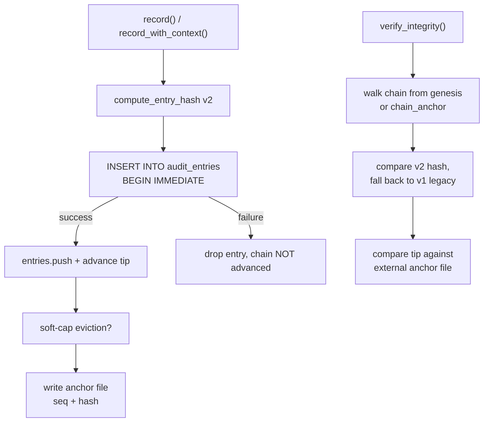

# crates — librefang-runtime-audit

# `librefang-runtime-audit` — Dziennik audytowy odporny na manipulację

Łańcuch audytowy z haszami Merklego dla kluczowych z punktu widzenia bezpieczeństwa zdarzeń środowiska uruchomieniowego LibreFang. Każda audytowalna akcja jest dołączana do dziennika typu append-only, w którym hasz SHA-256 każdego wpisu uwzględnia hasz poprzedniego wpisu, tworząc powiązany łańcuch wykrywający modyfikacje wsteczne. Gdy dostarczona zostanie pula połączeń SQLite, wpisy są utrwalane między restartami demona. Opcjonalny zewnętrzny plik kotwiczny rozszerza ochronę przed manipulacją poza to, co baza danych może udowodnić sama.

## Architektura

## Podstawowe koncepcje

### Łańcuch Merklego

Każdy `AuditEntry` przechowuje własny `hash` oraz `hash` swojego poprzednika (`prev_hash`). `prev_hash` wpisu genezy to 64 znaki zero. Weryfikacja przechodzi łańcuch naprzód, przeliczając każdy hasz i sprawdzając każde powiązanie `prev_hash`. Dowolna modyfikacja pola — znacznik czasu, identyfikator agenta, szczegóły, wynik, przypisanie użytkownika — przerywa powiązanie w tym miejscu.

Istnieją dwa układy haszowania:

- **v2 (bieżący):** Każde pole jest poprzedzone tagiem rozdzielanym znakiem `\x1f` (`\x1fseq=`, `\x1ftimestamp=`, itd.), aby treść bajtowa nie mogła przesunąć się między granicami pól. To zamyka niejednoznaczność, w której `agent_id="a", detail="bc"` i `agent_id="ab", detail="c"` dawały identyczne hasze.
- **v1 (legacy):** Układ sprzed wprowadzenia delimiterów — sześć pól połączonych bez separatorów, następnie opcjonalnie otagowane `user_id`/`channel`, a na końcu goły `prev_hash`. Zachowany wyłącznie po to, aby `verify_integrity` mogło weryfikować wpisy zapisane przed poprawką. Nowe wpisy nie są nigdy zapisywane w tym układzie.

`verify_integrity` akceptuje oba układy dla każdego wpisu, więc uaktualnienie nie powoduje fałszywych alarmów o manipulacji na istniejących dziennikach.

### `AuditAction` — Enum typowy dla append-only

Nazwa wariantu jest włączana do hasza danego wpisu poprzez `Display`. **Dodanie nowego wariantu jest bezpieczne**; zmiana nazwy lub zmiana kolejności jest zmianą łamiącą kompatybilność, która unieważnia każdy utrwalony hasz ją zawierający. Implementacje `as_str()` i `FromStr` używają wyczerpujących gałęzi `match` (bez symboli wieloznacznych), więc kompilator wymusza pokrycie po dodaniu wariantu — zapobiegając śliskiej koercji niezmapowanej akcji do `ToolInvoke` na ścieżce przeładowania.

Bieżące warianty obejmują wywołania narzędzi, sprawdzanie uprawnień, cykl życia agentów, dostęp do pamięci/plików/sieci/shella, autentykację, zmiany konfiguracji, konsolidację snów, zdarzenia RBAC (`UserLogin`, `RoleChange`, `PermissionDenied`, `BudgetExceeded`), samoaudyt retencji (`RetentionTrim`) oraz cykl życia agentów A2A (`A2aDiscovered`, `A2aTrusted`).

### `AuditEntry`

| Pole | Przeznaczenie |
|-------|---------|
| `seq` | Monotonically rosnący, indeksowany od zera numer sekwencyjny |
| `timestamp` | Czas zapisu w formacie ISO-8601 (RFC-3339) |
| `agent_id` | Agent, który wyzwolił akcję lub jest jej podmiotem |
| `action` | Wariant `AuditAction` |
| `detail` | Kontekst w formie wolnej (nazwa narzędzia, ścieżka pliku itd.) |
| `outcome` | Wynik (`"ok"`, `"denied"`, komunikat błędu) |
| `user_id` | Opcjonalne przypisanie `UserId` (po M1) |
| `channel` | Opcjonalne pochodzenie (`"telegram"`, `"api"`, `"cli"`, itd.) |
| `prev_hash` | SHA-256 poprzednika (wartość sygnalizacyjna genezy dla pierwszego wpisu) |
| `hash` | SHA-256 zawartości tego wpisu + `prev_hash` |

`user_id` i `channel` są włączane do hasza tylko gdy są obecne, więc wpisy sprzed M1 nadal przechodzą weryfikację.

## Konstruktory `AuditLog`

### `new()` — Tylko w pamięci

Tworzy pusty dziennik bez utrwalania. Wskaźnik końcowy (tip) inicjalizuje się wartością sygnalizacyjną genezy. Źródłem prawdy jest `Vec<AuditEntry>` w pamięci.

### `with_db(pool)` — Oparte na SQLite

Ładuje wszystkie wiersze z `audit_entries` uporządkowane według `seq`, odzyskuje wszelkie kotwice łańcucha pozostawione przez poprzednie przycinanie i uruchamia `verify_integrity` przy ładowaniu. Błędy są logowane na poziomie `WARN` (nie `ERROR`), aby hosty deweloperskie z rutynowymi niesledzonymi restartami nie zalały operatora wynikami `grep ERROR daemon.log` — zobacz #5478. Schemat v22 dodał kolumny `user_id`/`channel`; wiersze sprzed migracji deserializują się jako `None` i zachowują oryginalny hasz.

Nieznane ciągi `action` (wiersze zapisane przez nowszą wersję demona) są logowane pod nazwą i tymczasowo koercjonowane do `ToolInvoke` zamiast odrzucania wiersza. Hasz nie zostanie przeliczony do czasu uaktualnienia pliku binarnego.

### `with_db_anchored(pool, anchor_path)` — Baza danych + zewnętrzny świadek

Rozszerza `with_db` o zewnętrzny plik kotwiczny wskaźnika końcowego. Podczas konstrukcji:

1. Wpisy ładują się z SQLite, a łańcuch jest ponownie weryfikowany.
2. Jeśli plik kotwiczny istnieje, jego `seq:hash` jest porównywany z końcówką w bazie danych. Rozbieżność loguje głośny `error!` wskazujący na `librefang security verify` i `audit-reset`.
3. Jeśli baza danych zawiera wiersze, ale kotwica nie istnieje, kotwica jest inicjalizowana z bieżącej końcówki, aby przyszłe nadpisywania były wykrywalne.
4. Uszkodzony plik kotwiczny jest odrzucany — nigdy nie jest cicho nadpisywany.

Format pliku kotwicznego jest celowo czytelny dla człowieka: `<seq> <hex-hash>\n`. Zapisy są atomowe (`.tmp` + zmiana nazwy), więc awaria w trakcie zapisu nigdy nie pozostawia obciętej kotwicy.

#### Model zagrożeń

Łańcuch oparty wyłącznie na bazie danych jest samospójny, ale nie może wykryć pełnego nadpisania tabeli: atakujący z prawem zapisu do `audit_entries` może usunąć każdy wiersz, wstawić sfabrykowaną historię i przeliczyć każdy hasz od wartości sygnalizacyjnej genezy naprzód. Zewnętrzna kotwica zamyka tę lukę, przechowując najnowszy `seq:hash` poza SQLite, gdzie atakujący musi ją manipulować oddzielnie. Dla silniejszych gwarancji, wskaż `anchor_path` na lokalizację, do której daemon może zapisywać, ale nieuprzywilejowany kod nie może (plik chmod-0400 należący do innego użytkownika, montaż systemd `ReadOnlyPaths=`, udział NFS lub potok do `logger`).

## Rejestrowanie zdarzeń

### `record(agent_id, action, detail, outcome) -> String`

Wygodny wrapper pomijający przypisanie użytkownika/kanału. Zwraca hasz nowego wpisu.

### `record_with_context(agent_id, action, detail, outcome, user_id, channel) -> String`

Pełna forma z opcjonalnym przypisaniem. Przepływ dołączania:

1. Zablokowanie muteksów `entries` i `tip`.
2. Pochodzenie `seq` z `entries.last().seq + 1` (nie `len()`, ponieważ przycinanie mogło usunąć prefiks).
3. Obliczenie hasza v2 i zbudowanie `AuditEntry`.
4. Jeśli oparte na bazie danych: `BEGIN IMMEDIATE` → INSERT → commit. **W przypadku niepowodzenia wpis jest odrzucany, a łańcuch się nie przesuwa.** Zapobiega to klasie błędów przerwania łańcucha przy restarcie (#4050/#4078), gdzie wyłącznie w pamięci kolejka ponowień pozostawiała osierocone powiązania `prev_hash` na dysku po restarcie.
5. W przypadku sukcesu: dodanie do `entries`, przesunięcie `tip`, inkrementacja `persisted_rows`.
6. **Ewkcja miękkiego limitu:** jeśli `entries.len()` przekracza `effective_soft_cap()`, opróżniany jest najstarszy prefiks, a hasz ostatniego odrzuconego wpisu jest zapisywany jako nowa `chain_anchor`.
7. Jeśli zakotwiczono: nadpisanie pliku kotwicznego bieżącą liczbą `persisted_rows` i haszem końcówki.

`BEGIN IMMEDIATE` nabiera blokady RESERVED na warstwie SQLite, aby współbieżne procesy nie mogły przeplatać dwóch dołączeń przeciwko temu samemu `prev_hash`.

### Miękki limit i ograniczenia pamięci

Dwa pułapy zarządzają oknem w pamięci:

| Stała | Wartość | Stosowane gdy |
|----------|-------|--------------|
| `MAX_AUDIT_ENTRIES` | 10 000 | Brak skonfigurowanego limitu operatora |
| `MAX_IN_MEMORY_SOFT_CAP_NUMERATOR / DENOMINATOR` | 3 / 2 (1,5×) | Limit operatora jest ustawiony |

`set_max_in_memory_entries(n)` przechowuje skonfigurowaną przez operatora wartość `audit.retention.max_in_memory_entries`. `effective_soft_cap()` zwraca `n × 1,5` (lub domyślne twarde 10 000, gdy `n == 0`). Bufor 1,5× pozwala buforowi nieznacznie rosnąć między zaplanowanymi cyklami `trim()` (#5665) bez nieograniczonego wzrostu.

Miękki limit opróżnia tylko okno **w pamięci** — wiersze w bazie danych pozostają na dysku. `persisted_rows` śledzi oddzielnie populację na dysku, aby `seq` kotwicy pozostawał dokładny po ewekcji.

## Retencja

### `trim(policy, now) -> TrimReport`

Stosuje `AuditRetentionConfig` w dwóch przebiegach:

1. **Przebieg limitu:** Jeśli `max_in_memory_entries` jest ustawiony i przekroczony, oznacz najstarsze przepełnienie do usunięcia.
2. **Przebieg per-akcja:** Przejdź naprzód od granicy limitu. Dla każdego wpisu, jeśli jego akcja ma skonfigurowane okno `retention_days_by_action` i wpis jest starszy niż to okno, usuń go. Zatrzymaj się na pierwszym ocalałym.

**Usuwanie ma charakter wyłącznie prefiksowy.** Łańcuch to ciągła lista powiązana — nie można w niej robić dziur. Pierwszy wpis, którego retencja go zachowuje, zatrzymuje przycinanie, więc nowsze wpisy akcji „do usunięcia" przetrwają.

Zwraca `TrimReport` z liczbami usunięć per-akcja, całkowitą liczbą usunięć i nowym haszem kotwicy łańcucha. Wywołujący (periodyczne zadanie jądra) jest odpowiedzialny za zapisanie wiersza samoaudytu `RetentionTrim`.

**Utrwal-przed-modyfikacją:** `DELETE` w bazie danych wykonuje się przed `drain` w pamięci. Jeśli DELETE się nie powiedzie, nic nie jest przycinane, a raport jest pusty — przycinanie powtarza się przy następnym cyklu. Zapobiega to ożywianiu wierszy przez restart, które retencja usunęła.

### `prune(retention_days) -> usize`

Dziedziczna retencja oparta na dniach. Ta sama semantyka wyłącznie prefiksowa i zasada utrwal-przed-modyfikacją co `trim`. Aktualizuje `chain_anchor` do hasza ostatniego usuniętego wpisu, aby `verify_integrity` nadal przechodziło przez granicę przycinania.

### Odzyskiwanie kotwicy łańcucha

`chain_anchor` istnieje wyłącznie w pamięci — brak kolumny w schemacie. Przy starcie `with_db` odzyskuje ją z ocalałych wierszy: jeśli `prev_hash` pierwszego wpisu nie jest wartością sygnalizacyjną genezy, to `prev_hash` **jest** kotwicą (wskazuje na usuniętego poprzednika). Utrzymuje to działanie weryfikacji między restartami bez zmian schematu.

## Weryfikacja

### `verify_integrity() -> Result<(), String>`

1. Inicjalizacja `expected_prev` z `chain_anchor` (lub wartości sygnalizacyjnej genezy).
2. Przejście przez każdy wpis: sprawdzenie powiązań `prev_hash`, przeliczenie hasza v2 (z fallbackiem do v1 legacy), awaria przy pierwszej niezgodności.
3. Jeśli zakotwiczono: odczytanie pliku kotwicznego i porównanie `seq` z `persisted_rows` oraz `hash` z końcówką. **Brak pliku kotwiczego skutkuje awarią w trybie zamkniętym** — ciche zniknięcie jest nieodróżnialne od usunięcia pliku przez atakującego.

Komunikaty błędów identyfikują punkt przerwania: `"chain break at seq N"` dla awarii powiązania, `"hash mismatch at seq N"` dla manipulacji treścią, `"audit anchor mismatch"` dla rozbieżności zewnętrznego świadka.

## Metody dostępu

| Metoda | Zwraca |
|--------|---------|
| `tip_hash()` | Bieżąca końcówka łańcucha (lub wartość sygnalizacyjna genezy) |
| `len()` / `is_empty()` | Rozmiar okna w pamięci |
| `recent(n)` | Do `n` najnowszych wpisów (sklonowanych) |
| `since_seq(cursor)` | Każdy wpis z `seq > cursor` — dla konsumentów strumieniowania SSE |
| `anchor_path()` | Skonfigurowana ścieżka zewnętrznej kotwicy, jeśli ustawiona |

`since_seq` używa ścisłego większe-niż: `since_seq(0)` pomija `seq=0`. Handler SSE wstecznie wypełnia dane przez `recent` przy pierwszym odpytaniu, a następnie przechodzi w pętlę kursora.

## Punkty integracji

| Wywołujący | Zastosowanie |
|--------|-------|
| `kernel::boot::boot_with_config` | Konstruuje dziennik przez `with_db_anchored`, stosuje `set_max_in_memory_entries` z konfiguracji |
| `kernel::bindings_and_handle::set_self_handle` | Okresowe wywołania `prune` |
| `routes::audit::entry` | Odczytuje `AuditEntry` dla powierzchni API audytu |
| `tui::event::spawn_fetch_audit` | Pobiera wpisy dla widoku audytu w TUI |
| `librefang-runtime` | Reeksportuje jako `runtime::audit` (historyczna ścieżka zachowana po podziale god-crate) |

## Uwagi operacyjne

- **`librefang security verify`** — Sprawdza integralność łańcucha z CLI.
- **`librefang security audit-reset`** — Truncuje łańcuch i kotwiczy ponownie od zera. Przeznaczone dla środowisk deweloperskich, gdzie niesledzone restarty zerwały łańcuch. **Nigdy nie uruchamiać w środowiskach compliance/produkcyjnych** — niszczy wartość dowodową sprzed przerwania.
- Konfiguracja retencji audytu **nie** przeładowuje się w locie (zobacz `config_reload.rs: build_reload_plan`), więc `set_max_in_memory_entries` jest zazwyczaj wywoływane raz przy starcie.
