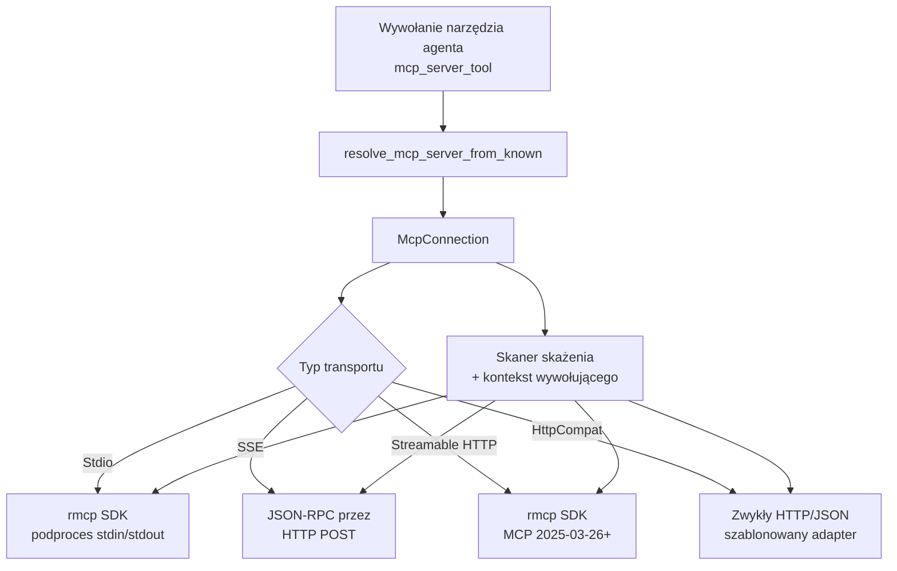
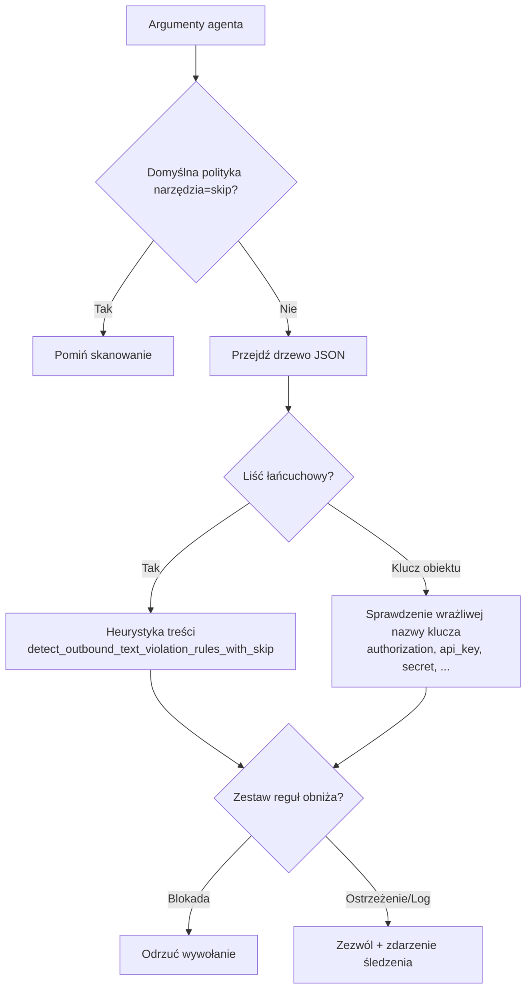

# crates — librefang-runtime-mcp

# librefang-runtime-mcp

Klient MCP (Model Context Protocol), który łączy agentów LibreFang z zewnętrznymi serwerami narzędzi. Obsługuje pełny cykl życia: nawiązywanie transportu, handshake MCP, odkrywanie narzędzi, walidację argumentów, skanowanie skażenia i wywoływanie narzędzi za pośrednictwem czterech odrębnych typów transportu.

## Architektura



## Typy transportu

`McpTransport` to znakowana enum wybierana dla każdego serwera w konfiguracji:

| Wariant | Protokół przewodowy | rmcp SDK | Przypadek użycia |
|---------|--------------|----------|----------|
| `Stdio` | MCP przez stdin/stdout podprocesu | Tak | Lokalne serwery MCP (npx, python, node) |
| `Sse` | JSON-RPC 2.0 przez HTTP POST | Nie (ręcznie napisany) | Przestarzałe serwery zdalne |
| `Http` | Streamable HTTP (MCP 2025-03-26+) | Tak | Nowoczesne serwery zdalne |
| `HttpCompat` | Szablonowany zwykły HTTP/JSON | Nie | Nie-MCP RESTowe API |

Transporty Stdio i Streamable HTTP delegują obsługę protokołu do skrzynki `rmcp`. SSE używa minimalistycznego, ręcznie napisanego klienta JSON-RPC. HttpCompat to wbudowany shim, który mapuje wywołania narzędzi MCP na dowolne punkty końcowe REST za pomocą szablonów ścieżki/ciała/zapytania.

## Cykl życia połączenia

### Połączenie

`McpConnection::connect(config)` wykonuje konfigurację specyficzną dla transportu, handshake MCP `initialize` (tam, gdzie ma to zastosowanie) i odkrywanie narzędzi:

1. **Stdio**: Uruchamia podproces w zesandboksowanym środowisku (zmienne środowiskowe wyczyszczone, przekazywane tylko `SAFE_ENV_VARS` + zadeklarowane zmienne), ustanawia usługę rmcp, wywołuje `list_all_tools()`. Interpretatory powłoki (`bash`, `sh`, `powershell`, ...) są blokowane — operatorzy muszą jawnie wskazać środowisko uruchomieniowe.

2. **SSE**: Tworzy klienta HTTP, buduje mapę nagłówków z zadeklarowanych w konfiguracji nagłówków + buforowanego tokena bearer OAuth, a następnie wykonuje `initialize` → `notifications/initialized` → `tools/list` jako ręcznie napisane żądania JSON-RPC.

3. **Streamable HTTP**: Używa `StreamableHttpClientTransport` z rmcp. Przy kodzie 401, wyodrębnia nagłówek `WWW-Authenticate` i podejmuje próbę odkrycia metadanych OAuth. Jeśli OAuth jest wymagany, ale przepływ nie może zakończyć się automatycznie, zwraca błąd-sentinel `"OAUTH_NEEDS_AUTH"`, aby warstwa API mogła przeprowadzić przepływ PKCE przez interfejs użytkownika.

4. **HttpCompat**: Sonduje bazowy URL pod kątem osiągalności (niekrytyczny przy awarii), następnie statycznie rejestruje narzędzia z konfiguracji. Brak handshake'u.

Po odkryciu narzędzi, `discover_and_register_resources()` sprawdza, czy serwer ogłasza możliwość `resources` i, jeśli tak, rejestruje syntetyczne narzędzia `list_resources` / `read_resource`, aby agenci mogli uzyskiwać dostęp do zasobów MCP przez standardową pętlę wywołań narzędzi.

### Przestrzenie nazw narzędzi

Wszystkie narzędzia są przestrzennie nazwane jako `mcp_{server_name}_{original_tool_name}` za pomocą `format_mcp_tool_name()`. Połączenie utrzymuje `HashMap<String, String>` mapującą nazwy przestrzenne z powrotem na oryginalne nazwy w celu wysyłania. Funkcje `resolve_mcp_server_from_known()`, `normalize_name()` i `is_mcp_tool()` (wywoływane z `tool_runner::dispatch`, `tools_and_skills` oraz procedur obsługi tras) używają tej konwencji nazewnictwa do kierowania wywołań narzędzi agenta do poprawnego połączenia.

### Wywołanie

Wywołanie narzędzia przechodzi przez `call_tool_with_caller()`, który:

1. **Rozwiązuje oryginalną nazwę narzędzia** z nazwy w przestrzeni.
2. **Przechwytuje syntetyczne narzędzia zasobów** (`list_resources`, `read_resource`) i kieruje je do `resources/list` / `resources/read` zamiast `tools/call`.
3. **Waliduje argumenty** względem schematu JSON narzędzia (`validate_args_against_schema`) — sprawdza zgodność `type: "object"` i obecność pól `required`. Jest to lekka straż, a nie pełny walidator schematu JSON.
4. **Skanuje skażenie argumentów** przed jakąkolwiek mutacją jądra (patrz Skanowanie skażenia poniżej).
5. **Usuwa kontekst wywołującego dostarczony przez agenta** z `arguments` (granica bezpieczeństwa — patrz Kontekst wywołującego poniżej).
6. **Wstrzykuje kontekst wywołującego zaświadczonego przez jądro** poza pasmem.
7. **Wysyła** do metody wywołania specyficznej dla transportu.

Dla HttpCompat, wywołanie renderuje szablon żądania (parametry ścieżki, ciało JSON lub ciąg zapytania) względem argumentów, wysyła żądanie HTTP i zwraca treść odpowiedzi.

### Zamknięcie / Drop

`McpConnection::close()` jest asynchroniczne i ograniczone 10-sekundowym limitem czasu. Anuluje usługę rmcp, która upuszcza `TokioChildProcess` i zbiera podproces. Implementacja `Drop` zapewnia najlepszy wysiłek (best-effort): jeśli dostępne jest środowisko wykonawcze tokio, uruchamia zamknięcie jako zadanie w tle; w przeciwnym razie polega na `DropGuard` rmcp do synchronicznego anulowania tokena. Wywołujący wykonujący hot-reload powinni preferować jawne `.close()`, aby zagwarantować zebranie podprocesu przed uruchomieniem nowego połączenia.

## Wstrzykiwanie kontekstu wywołującego

Jądro zaświadcza tożsamość jednostki napędzającej każdą turę agenta i przesyła ją do serwerów MCP w celu autoryzacji per-użytkownik:

```rust
pub struct CallerContext {
    pub peer_id: Option<String>,    // np. identyfikator użytkownika Telegram
    pub channel: Option<String>,    // "telegram", "slack", ...
    pub chat_id: Option<String>,    // identyfikator konwersacji
    pub session_id: Option<String>, // LibreFang SessionId
}
```

**Niezmienność bezpieczeństwa**: agent nie może wpływać na te wartości. Stała `CALLER_CONTEXT_ARG_KEY` (`"_librefang_caller"`) to bezwarunkowy wpis na liście blokującej — `strip_caller_from_arguments()` usuwa go z `arguments` przed każdą transmisją. Wartość z jądra podróżuje poza pasmem:

- **Rmcp / SSE**: w polu żądania `_meta` pod `CALLER_CONTEXT_META_KEY` (`"io.librefang/caller"`)
- **HttpCompat**: w nagłówku HTTP `CALLER_CONTEXT_HEADER` (`X-Librefang-Caller`)

Umieszczenie kontekstu wywołującego w `_meta` zamiast w `arguments` pozwala uniknąć psucia serwerów MCP, które przekazują nieznane argumenty dosłownie do podrzędnych API REST (np. `@notionhq/notion-mcp-server` odrzuca nieskalarne parametry zapytania).

## Skanowanie skażenia

Wychodzące ładunki argumentów są skanowane pod kątem poświadczeń i PII przed transmisją. Skaner przechodzi przez każdy liść łańcuchowy i klucz obiektu w drzewie argumentów JSON:



### Tryby skanowania

- **Pełne skanowanie** (domyślne): uruchamiana jest zarówno heurystyka zawartości (dopasowanie regex/wzorców na wartościach łańcuchowych), jak i sprawdzenie wrażliwych nazw kluczy.
- **`taint_scanning = false`**: heurystyka zawartości jest wyłączona, ale blokowanie według nazwy klucza (`Authorization`, `secret`, `password`, ...) pozostaje zawsze aktywne.

### Polityka skażenia

`McpTaintPolicy` zapewnia precyzyjną kontrolę:

- **Pomijanie per narzędzie**: `default = "skip"` pomija wszystkie skanowanie dla narzędzia.
- **Pomijanie reguł per ścieżka**: wpisy `paths` z wzorcami JSONPath (`$.headers.*`, `$.items[*]`) zwalniają określone ścieżki argumentów z określonych reguł.
- **Nazwane zestawy reguł**: `rule_sets` odwołuje się do zarejestrowanych zestawów `[[taint_rules]]`, które mogą obniżyć `Block` → `Warn` lub `Log`. Gdy wiele zestawów obejmuje tę samą regułę, wygrywa najbardziej liberalna akcja.

Zestawy reguł są przechowywane w `TaintRuleSetsHandle` (`Arc<ArcSwap<Vec<NamedTaintRuleSet>>>`), co umożliwia hot-reload: jądro wywołuje `.store()` przy przeładowaniu konfiguracji, a kolejne skanowanie pobiera nowe reguły bez restartowania połączenia.

**Krytyczna właściwość bezpieczeństwa**: skaner iteruje po *każdej* wyzwolonej regule, nie tylko po pierwszej. Zestaw reguł obniżający regułę A nie może maskować nieautoryzowanej reguły B wyzwolonej w tym samym ładunku.

## Redakcja

Zwracane łańcuchy naruszeń zawierają tylko ścieżkę JSON naruszającego liścia — nigdy wartości ładunku. Błąd wraca do LLM i do logów; echo zablokowanego sekretu zniweczyłoby filtr.

## Sandboxing podprocesów

Serwery MCP działające przez Stdio uruchamiane są w utwardzonym środowisku:

- `env_clear()` — podproces **nie** dziedziczy pełnego środowiska demona.
- Przekazywane są tylko `SAFE_ENV_VARS` (PATH, HOME, LANG, niezbędne systemowe, ścieżki środowisk uruchomieniowych języków) oraz jawnie zadeklarowane wpisy `env`.
- Rozszerzanie zmiennych środowiskowych (`$VAR`, `${VAR}`) w argumentach polecenia jest ograniczone do tej samej listy dozwolonych, zapobiegając szablonom w cichym odczytywaniu sekretów demona takich jak `ANTHROPIC_API_KEY`.
- Stderr dziecka jest opróżniany w zadaniu w tle z limitem 100 linii / 256 bajtów na linię dla logów. Opróżnianie kontynuuje się po przekroczeniu limitu, aby zapobiec blokadom bufora potoków, które zawiesiłyby podproces.

## Ochrona rozmiaru odpowiedzi

`read_response_bytes_capped()` ogranicza wszystkie ciała odpowiedzi HTTP (SSE i HttpCompat) do 16 MiB (`MAX_RESPONSE_BYTES`). Najpierw sprawdza `Content-Length` (szybka ścieżka), a następnie strumieniuje fragment po fragmencie z bieżącym licznikiem bajtów, przerywając w trakcie odczytu, jeśli limit zostanie przekroczony. Zapobiega to złośliwemu lub błędnemu serwerowi w wywoływaniu OOM.

## Ochrona SSRF

`check_ssrf()` uruchamia się przy każdym wychodzącym transporcie HTTP (SSE, Streamable HTTP, HttpCompat). Analizuje adresy URL za pomocą skrzynki `url` (bez dopasowywania podciągów), odrzuca schematy inne niż `http(s)`, blokuje userinfo i blokuje punkty końcowe metadanych chmury (`169.254/16`, `100.64.0.0/10`, `metadata.google.internal`, itd.). Adresy loopback i RFC1918 są dozwolone dla URL serwerów MCP skonfigurowanych przez operatora, ale blokowane na ścieżce odkrywania OAuth, gdzie hosty pochodzą z odpowiedzi zdalnych.

## Zasoby MCP

Gdy serwer ogłasza możliwość `resources`, rejestrowane są dwa syntetyczne narzędzia:

- `list_resources` — wywołuje `resources/list` i `resources/templates/list`, zwraca JSON z URI, nazwami i typami MIME
- `read_resource` — wywołuje `resources/read` z argumentem URI, zwraca treść tekstową (bloki binarne są pomijane jako `[binary resource ...: N base64 bytes elided]`)

Te syntetyczne narzędzia są przechwytywane w `call_tool_with_caller()` przez zbiór `resource_ops` i kierowane do metod zasobów, co zapewnia, że nie przesłaniają rzeczywistych narzędzi serwera o tej samej nazwie.

Bloki treści z wyników narzędzi są renderowane przez `render_rmcp_content_block()` (rmcp) lub `render_json_content_block()` (SSE), które obsługują typy `text`, `resource_link` i osadzone `resource`. `resource_link` staje się pełnoprawną linią (`[resource_link] Nazwa — URI (mime)`) zamiast zapadać się w nieprzezroczysty JSON.

## Tłumaczenie adnotacji narzędzi

Adnotacje MCP `tools/list` (`readOnlyHint`, `destructiveHint`) są tłumaczone na pole `metadata.tool_class` schematu JSON narzędzia przez `inject_annotation_class()`. Mapowanie:

- `readOnly=true, destructive=false` → `"readonly_search"`
- Cokolwiek innego → `"mutating"`

Pozwala to klasyfikatorowi narzędzi środowiska wykonawczego wybierać bezpiecznych kandydatów do równoległości bez analizowania typów adnotacji MCP.

## Podsumowanie publicznego API

| Funkcja / Typ | Przeznaczenie |
|----------------|---------|
| `McpServerConfig` | Konfiguracja per-serwer (transport, limit czasu, env, nagłówki, OAuth, ustawienia skażenia, korzenie) |
| `McpTransport` | Znakowana enum: `Stdio`, `Sse`, `Http`, `HttpCompat` |
| `McpConnection::connect(config)` | Ustanowienie połączenia, handshake, odkrycie narzędzi |
| `McpConnection::call_tool(name, args)` | Wywołanie narzędzia (bez kontekstu wywołującego) |
| `McpConnection::call_tool_with_caller(name, args, caller)` | Wywołanie narzędzia z tożsamością zaświadczonego przez jądro |
| `McpConnection::list_resources()` | `resources/list` |
| `McpConnection::read_resource(uri)` | `resources/read` |
| `McpConnection::close()` | Jawna asynchroniczna rozbiórka z limitem czasu |
| `format_mcp_tool_name(server, tool)` | Utworzenie nazwy narzędzia w przestrzeni |
| `resolve_mcp_server_from_known(name)` | Odwrotne wyszukanie serwera z nazwy w przestrzeni |
| `normalize_name(server)` | Normalizacja nazwy serwera do dopasowania w konfiguracji |
| `is_mcp_tool(name)` | Sprawdzenie, czy nazwa narzędzia jest w przestrzeni MCP |
| `CallerContext` | Tożsamość zaświadczona przez jądro (peer, kanał, czat, sesja) |
| `empty_taint_rule_sets_handle()` / `static_taint_rule_sets_handle(rules)` | Konstrukcja uchwytów zestawów reguł |
| `ResourceInfo` / `ResourceTemplateInfo` | Spłaszczone metadane zasobów z `resources/list` |

## Punkty integracji

Skrzynka jest konsumowana przez:

- **`librefang-runtime::tool_runner::dispatch`** — wywołuje `is_mcp_tool()`, `resolve_mcp_server_from_known()` i `call_tool_with_caller()` do wykonywania wywołań narzędzi MCP
- **`librefang-runtime::kernel::mcp_setup`** — konstruuje `McpServerConfig` i zarządza cyklem życia połączenia (połączenie, ponowne połączenie, przeładowanie)
- **`librefang-runtime::kernel::accessors`** / **`agent_state`** — buduje pulę MCP agenta i rozwiązuje nazwy serwerów
- **`librefang-api::routes::mcp_auth`** — prowadzi przepływ OAuth PKCE używając `discover_oauth_metadata()` i straży SSRF z `mcp_oauth`
- **`librefang-kernel::mcp_oauth_provider`** — odświeżanie tokena przez `is_ssrf_blocked_url()`
