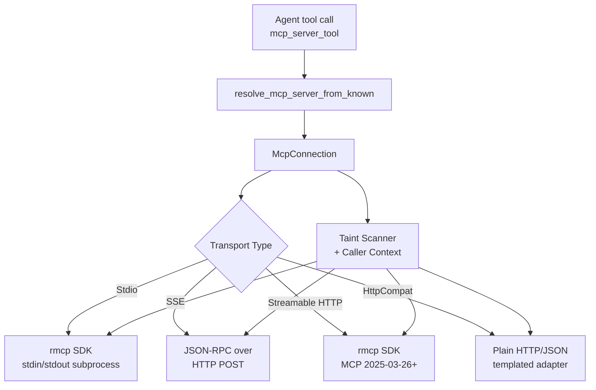
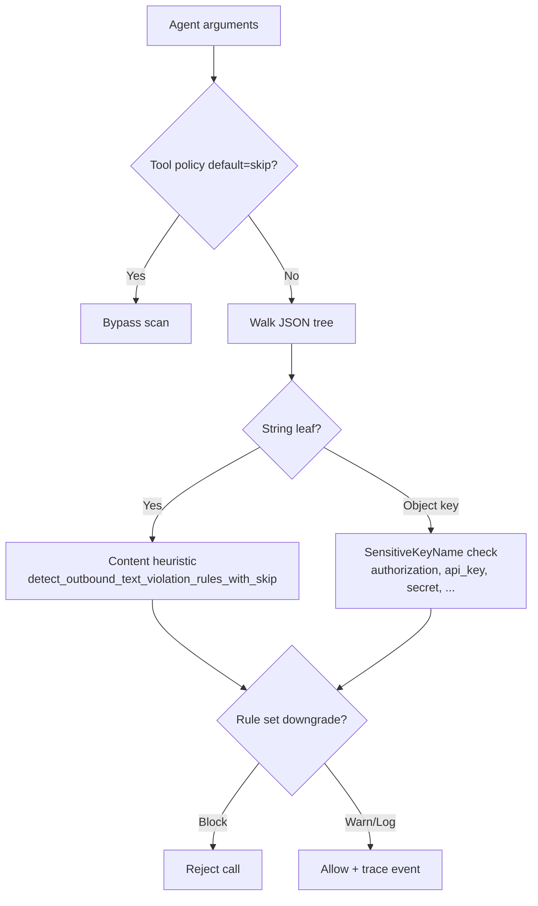

# crates — librefang-runtime-mcp

# librefang-runtime-mcp

MCP (Model Context Protocol) client that connects LibreFang agents to external tool servers. Handles the full lifecycle: transport establishment, MCP handshake, tool discovery, argument validation, taint scanning, and tool invocation across four distinct transport types.

## Architecture



## Transport Types

`McpTransport` is a tagged enum selected per server in config:

| Variant | Wire Protocol | rmcp SDK | Use Case |
|---------|--------------|----------|----------|
| `Stdio` | MCP over subprocess stdin/stdout | Yes | Local MCP servers (npx, python, node) |
| `Sse` | JSON-RPC 2.0 over HTTP POST | No (hand-rolled) | Legacy remote servers |
| `Http` | Streamable HTTP (MCP 2025-03-26+) | Yes | Modern remote servers |
| `HttpCompat` | Templated plain HTTP/JSON | No | Non-MCP REST APIs |

The Stdio and Streamable HTTP transports delegate to the `rmcp` crate for protocol handling. SSE uses a minimal hand-rolled JSON-RPC client. HttpCompat is a built-in shim that maps MCP tool calls onto arbitrary REST endpoints via path/body/query templates.

## Connection Lifecycle

### Connect

`McpConnection::connect(config)` performs transport-specific setup, the MCP `initialize` handshake (where applicable), and tool discovery:

1. **Stdio**: Spawns the subprocess with a sandboxed environment (env vars cleared, only `SAFE_ENV_VARS` + declared vars passed through), establishes the rmcp service, calls `list_all_tools()`. Shell interpreters (`bash`, `sh`, `powershell`, ...) are blocked — operators must specify a runtime directly.

2. **SSE**: Creates an HTTP client, builds a header map from config-declared headers + cached OAuth bearer token, then runs `initialize` → `notifications/initialized` → `tools/list` as hand-rolled JSON-RPC requests.

3. **Streamable HTTP**: Uses rmcp's `StreamableHttpClientTransport`. On 401, extracts the `WWW-Authenticate` header and attempts OAuth metadata discovery. If OAuth is required but the flow can't complete automatically, returns the sentinel error `"OAUTH_NEEDS_AUTH"` so the API layer can drive the PKCE flow via the UI.

4. **HttpCompat**: Probes the base URL for reachability (non-fatal on failure), then statically registers tools from config. No handshake.

After tool discovery, `discover_and_register_resources()` checks whether the server advertised the `resources` capability and, if so, registers synthetic `list_resources` / `read_resource` tools so agents can access MCP resources through the standard tool-call loop.

### Tool Namespacing

All tools are namespaced as `mcp_{server_name}_{original_tool_name}` via `format_mcp_tool_name()`. The connection maintains a `HashMap<String, String>` from namespaced names back to original names for dispatch. The functions `resolve_mcp_server_from_known()`, `normalize_name()`, and `is_mcp_tool()` (called from `tool_runner::dispatch`, `tools_and_skills`, and route handlers) use this naming convention to route agent tool calls to the correct connection.

### Call

Tool invocation goes through `call_tool_with_caller()`, which:

1. **Resolves the original tool name** from the namespaced name.
2. **Intercepts synthetic resource tools** (`list_resources`, `read_resource`) and routes them to `resources/list` / `resources/read` instead of `tools/call`.
3. **Validates arguments** against the tool's JSON Schema (`validate_args_against_schema`) — checks `type: "object"` conformance and `required` field presence. This is a lightweight guard, not a full JSON Schema validator.
4. **Taint-scans the arguments** before any kernel mutation (see Taint Scanning below).
5. **Strips agent-supplied caller context** from `arguments` (security boundary — see Caller Context below).
6. **Injects kernel-attested caller context** out-of-band.
7. **Dispatches** to the transport-specific call method.

For HttpCompat, the call renders the request template (path params, JSON body, or query string) against the arguments, sends the HTTP request, and returns the response body.

### Close / Drop

`McpConnection::close()` is async and bounded by a 10-second timeout. It cancels the rmcp service, which drops the `TokioChildProcess` and reaps the subprocess. The `Drop` impl provides a best-effort fallback: if a tokio runtime is available, it spawns the close as a background task; otherwise it relies on rmcp's `DropGuard` to cancel the token synchronously. Callers doing hot-reload should prefer explicit `.close()` to guarantee subprocess reap before starting a new connection.

## Caller Context Injection

The kernel attests the identity of the entity driving each agent turn and ships it to MCP servers for per-user authorization:

```rust
pub struct CallerContext {
    pub peer_id: Option<String>,    // e.g. Telegram user id
    pub channel: Option<String>,    // "telegram", "slack", ...
    pub chat_id: Option<String>,    // conversation id
    pub session_id: Option<String>, // LibreFang SessionId
}
```

**Security invariant**: the agent cannot influence these values. The constant `CALLER_CONTEXT_ARG_KEY` (`"_librefang_caller"`) is an unconditional denylist entry — `strip_caller_from_arguments()` removes it from `arguments` before every transmit. The kernel value travels out-of-band:

- **Rmcp / SSE**: in the request `_meta` field under `CALLER_CONTEXT_META_KEY` (`"io.librefang/caller"`)
- **HttpCompat**: in the `CALLER_CONTEXT_HEADER` (`X-Librefang-Caller`) HTTP header

Placing caller context in `_meta` rather than `arguments` avoids breaking MCP servers that forward unknown arguments verbatim to downstream REST APIs (e.g. `@notionhq/notion-mcp-server` rejects non-scalar query parameters).

## Taint Scanning

Outbound argument payloads are scanned for credentials and PII before transmit. The scanner walks every string leaf and object key in the JSON argument tree:



### Scan Modes

- **Full scanning** (default): both the value-content heuristic (regex/pattern matching on string values) and the sensitive-key-name check run.
- **`taint_scanning = false`**: content heuristic is disabled, but key-name blocking (`Authorization`, `secret`, `password`, ...) always stays active.

### Taint Policy

`McpTaintPolicy` provides fine-grained control:

- **Per-tool skip**: `default = "skip"` bypasses all scanning for a tool.
- **Per-path rule skips**: `paths` entries with JSONPath patterns (`$.headers.*`, `$.items[*]`) exempt specific argument paths from specific rules.
- **Named rule sets**: `rule_sets` references registered `[[taint_rules]]` sets that can downgrade `Block` → `Warn` or `Log`. When multiple sets cover the same rule, the most permissive action wins.

Rule sets are held in a `TaintRuleSetsHandle` (`Arc<ArcSwap<Vec<NamedTaintRuleSet>>>`), enabling hot-reload: the kernel calls `.store()` on config reload, and the next scan picks up new rules without restarting the connection.

**Critical safety property**: the scanner iterates over *every* fired rule, not just the first. A rule set that downgrades rule A must not mask an unauthorized rule B firing in the same payload.

### Redaction

Returned violation strings contain only the JSON path of the offending leaf — never the payload value. The error flows back to the LLM and into logs; echoing the blocked secret would defeat the filter.

## Subprocess Sandboxing

Stdio MCP servers run with a hardened environment:

- `env_clear()` — the subprocess does **not** inherit the daemon's full environment.
- Only `SAFE_ENV_VARS` (PATH, HOME, LANG, system essentials, language runtime paths) plus explicitly declared `env` entries are passed through.
- Environment variable expansion (`$VAR`, `${VAR}`) in command args is restricted to the same allowlist, preventing templates from silently reading daemon secrets like `ANTHROPIC_API_KEY`.
- The child's stderr is drained in a background task with a 100-line / 256-byte-per-line log cap. The drain continues past the cap to prevent pipe-buffer stalls that would hang the subprocess.

## Response Size Protection

`read_response_bytes_capped()` limits all HTTP response bodies (SSE and HttpCompat) to 16 MiB (`MAX_RESPONSE_BYTES`). It checks `Content-Length` first (fast path), then streams chunk-by-chunk with a running byte counter, aborting mid-read if the cap is breached. This prevents a malicious or buggy server from causing OOM.

## SSRF Protection

`check_ssrf()` runs on every outbound HTTP transport (SSE, Streamable HTTP, HttpCompat). It parses URLs with the `url` crate (no substring matching), rejects non-`http(s)` schemes, blocks userinfo, and blocks cloud-metadata endpoints (`169.254/16`, `100.64.0.0/10`, `metadata.google.internal`, etc.). Local loopback and RFC1918 addresses are allowed for operator-configured MCP backend URLs but blocked on the OAuth discovery path where hosts come from remote responses.

## MCP Resources

When a server advertises the `resources` capability, two synthetic tools are registered:

- `list_resources` — calls `resources/list` and `resources/templates/list`, returns JSON with URIs, names, and MIME types
- `read_resource` — calls `resources/read` with a URI argument, returns text content (binary blobs are elided as `[binary resource ...: N base64 bytes elided]`)

These synthetic tools are intercepted in `call_tool_with_caller()` via the `resource_ops` set and dispatched to the resources methods, ensuring they don't shadow real server tools of the same name.

Content blocks from tool results are rendered through `render_rmcp_content_block()` (rmcp) or `render_json_content_block()` (SSE), which handle `text`, `resource_link`, and embedded `resource` types. A `resource_link` becomes a first-class line (`[resource_link] Name — URI (mime)`) rather than collapsing into opaque JSON.

## Tool Annotation Translation

MCP `tools/list` annotations (`readOnlyHint`, `destructiveHint`) are translated into a `metadata.tool_class` field on the tool's JSON Schema via `inject_annotation_class()`. The mapping:

- `readOnly=true, destructive=false` → `"readonly_search"`
- Anything else → `"mutating"`

This lets the runtime tool classifier select safe parallel candidates without parsing MCP annotation types.

## Public API Summary

| Function / Type | Purpose |
|----------------|---------|
| `McpServerConfig` | Per-server configuration (transport, timeout, env, headers, OAuth, taint settings, roots) |
| `McpTransport` | Tagged enum: `Stdio`, `Sse`, `Http`, `HttpCompat` |
| `McpConnection::connect(config)` | Establish connection, handshake, discover tools |
| `McpConnection::call_tool(name, args)` | Invoke a tool (no caller context) |
| `McpConnection::call_tool_with_caller(name, args, caller)` | Invoke a tool with kernel-attested identity |
| `McpConnection::list_resources()` | `resources/list` |
| `McpConnection::read_resource(uri)` | `resources/read` |
| `McpConnection::close()` | Explicit async teardown with timeout |
| `format_mcp_tool_name(server, tool)` | Produce namespaced tool name |
| `resolve_mcp_server_from_known(name)` | Reverse-lookup server from namespaced name |
| `normalize_name(server)` | Normalize server name for config matching |
| `is_mcp_tool(name)` | Check if a tool name is MCP-namespaced |
| `CallerContext` | Kernel-attested identity (peer, channel, chat, session) |
| `empty_taint_rule_sets_handle()` / `static_taint_rule_sets_handle(rules)` | Construct rule-set handles |
| `ResourceInfo` / `ResourceTemplateInfo` | Flattened resource metadata from `resources/list` |

## Integration Points

The crate is consumed by:

- **`librefang-runtime::tool_runner::dispatch`** — calls `is_mcp_tool()`, `resolve_mcp_server_from_known()`, and `call_tool_with_caller()` to execute MCP tool calls
- **`librefang-runtime::kernel::mcp_setup`** — constructs `McpServerConfig` and manages connection lifecycle (connect, reconnect, reload)
- **`librefang-runtime::kernel::accessors`** / **`agent_state`** — builds the agent MCP pool and resolves server names
- **`librefang-api::routes::mcp_auth`** — drives OAuth PKCE flow using `discover_oauth_metadata()` and SSRF guards from `mcp_oauth`
- **`librefang-kernel::mcp_oauth_provider`** — token refresh via `is_ssrf_blocked_url()`