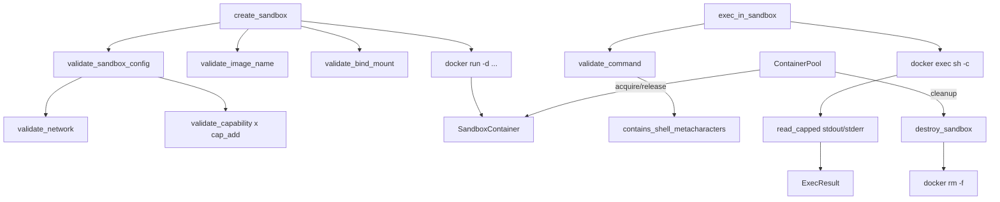

# crates — librefang-runtime-sandbox-docker

# librefang-runtime-sandbox-docker

Izolacja na poziomie systemu operacyjnego dla wykonywania kodu agenta. Uruchamia polecenia wewnątrz kontenerów Docker z rygorystycznymi limitami zasobów, izolacją sieciową, usuwaniem uprawnień (capabilities) oraz walidacją montowań bind.

Wyodrębniony z `librefang-runtime` w ramach podziału „god-crate" (#3710). Crate nadrzędny re-eksportuje go pod historyczną ścieżką (`runtime::docker_sandbox`) za domyślnie włączoną flagą `docker-sandbox`, dzięki czemu importy w dół łańcucha pozostają bez zmian.

---

## Architektura



---

## Model bezpieczeństwa

Każde wywołanie `docker run` i `docker exec` przechodzi przez warstwową ścieżkę walidacji przed przekazaniem do powłoki. Każda warstwa kończy się niepowodzeniem z zachowaniem bezpieczeństwa (fail-closed), zwracając typowany `Err(String)` i wpisując log `error!`, dzięki czemu odrzucenie jest rejestrowane nawet jeśli wywołujący ignoruje `Result`.

### Biała lista uprawnień (`SAFE_CAPS`)

Uprawnienia (capabilities) są całkowicie usunięte (`--cap-drop ALL`), a następnie specyficzne są dodawane z powrotem z ustalonej 14-elementowej białej listy pochodzącej z domyślnych wartości Dockera. Niebezpieczne uprawnienia, które niszczą izolację sandboxa, są z założenia wykluczone:

| Uprawnienie | Powód wykluczenia |
|---|---|
| `SYS_ADMIN` | Mount, kexec, BPF, manipulacja przestrzeniami nazw |
| `NET_ADMIN` | Rekonfiguracja interfejsów/zapory sieciowej, surowe gniazda |
| `SYS_PTRACE` | Inspekcja procesów; omija `no-new-privileges` |
| `SYS_MODULE`, `SYS_BOOT` | Modyfikacja jądra/modułów |
| `BPF`, `PERFMON` | Ucieczka oparta na eBPF |
| `MAC_ADMIN`, `MAC_OVERRIDE` | Omijanie SELinux/AppArmor |

`NET_RAW` jest zachowane na potrzeby narzędzi ping/traceroute; rzeczywistą ochroną przed SSRF jest granica przestrzeni nazw sieciowych (patrz niżej).

Rozmiar białej listy jest przypięty w testach (`SAFE_CAPS.len() == 14`), więc każde przyszłe rozszerzenie wymaga świadomej zmiany.

### Izolacja sieciowa

`validate_network` odrzuca trzy kategorie przed dotarciem do `docker run`:

- **`host`** — współdzieli przestrzeń nazw sieciowych hosta, ujawniając loopback, cloud-metadata (`169.254.169.254`) oraz port demona.
- **`container:<nazwa>`** — dziedziczy przestrzeń nazw innego kontenera, transitywnie niwecząc izolację.
- **Niedozwolone znaki** — wszystko poza `[A-Za-z0-9_-]+`; Docker odrzuciłby to i tak, ale my kończymy z typowanym błędem natychmiast.

Dozwolone: `bridge`, `none` oraz nazwy sieci definiowanych przez użytkownika.

### Walidacja montowań bind

`validate_bind_mount` uruchamia się **przed** `docker run` na ścieżce obszaru roboczego. Bez tej bramki, sprawdzenia zablokowanych ścieżek byłyby martwym kodem — symlinkowany obszar roboczy rozwiązywany do `/etc` nadal zostałby zamontowany.

**Zablokowane domyślnie** (`BLOCKED_MOUNT_PATHS`):

```
/etc  /proc  /sys  /dev  /var/run/docker.sock
/run/docker.sock  /run  /root  /boot
```

`/run` i `/run/docker.sock` są jawnie zablokowane, ponieważ hosty z systemd symlinkują `/var/run` → `/run`, a gniazdo Dockera jest wektorem ucieczki z uprawnieniami roota hosta.

**Sprawdzenie zawierania** (`path_is_within`): uwzględnia komponenty ścieżki — `"/development"` NIE jest wewnątrz `"/dev"`. Używa granic komponentów ścieżki, a nie naiwnego `starts_with`, i normalizuje końcowe ukośniki na skonfigurowanych zablokowanych ścieżkach.

**Ucieczka przez symlink**: ścieżka jest kanonizowana (lub najbliższy istniejący przodek jest kanonizowany dla ścieżek jeszcze nieistniejących), a rozwiązany cel jest ponownie sprawdzany względem zablokowanych ścieżek. Zapobiega to stworzeniu symlinka w nieistniejącej ścieżce, który później rozwiązałby się do `/etc`, `/proc` itd.

**Traversing ścieżki**: każdy komponent `..` jest odrzucany.

### Czarna lista metaznaków powłoki

`validate_command` deleguje do `helpers::contains_shell_metacharacters`, który blokuje wektory wstrzykiwania zanim polecenie dotrze do `sh -c`:

| Metaznak | Powód |
|---|---|
| `` ` `` | Podstawianie polecenia w odwróconych apostrofach |
| `$(` | Podstawianie polecenia `$()` |
| `${` | Rozszerzanie zmiennych |
| `;` | Łączenie poleceń |
| `\|` | Operator potoku |
| `>`, `<` | Przekierowanie wejścia/wyjścia |
| `{`, `}` | Rozszerzanie nawiasów klamrowych |
| `&` | Tło/kontrola zadań |
| `\n`, `\r` | Osadzone znaki nowej linii |
| `\0` | Zera bajtowe |

**Uwzględnia cytowanie**: sekwencje podstawiania poleceń i rozszerzania zmiennych są skanowane na surowym ciągu (działają wewnątrz podwójnych cudzysłowów pod `sh -c`). Metaznaki łączenia/przekierowania/globowania są skanowane na wyniku `strip_quoted_regions`, aby legalne cytowane argumenty nie były fałszywie odrzucane.

Moduł `helpers` jest **celowym duplikatem** `librefang-runtime::subprocess_sandbox` i `librefang-runtime::str_utils`, utrzymywanym jako publiczny, aby crate nadrzędny mógł napędzać test parzystości (`crates/librefang-runtime/tests/docker_sandbox_helpers_parity.rs`) potwierdzający bajt-po-bajcie równoważność. Zapobiega to cichemu rozjazdowi, gdy kanoniczna czarna lista zyskuje nowy wpis.

---

## Cykl życia kontenera

### `create_sandbox`

```rust
pub async fn create_sandbox(
    config: &DockerSandboxConfig,
    agent_id: &str,
    workspace: &Path,
) -> Result<SandboxContainer, String>
```

Uruchamia odłączony kontener (`docker run -d`) skonfigurowany z:

- **Limitami zasobów**: `--memory`, `--cpus`, `--pids-limit`
- **Bezpieczeństwo**: `--cap-drop ALL` + uprawnienia z białej listy `--cap-add`, `--security-opt no-new-privileges`, opcjonalny `--read-only`
- **Siecią**: zwalidowaną wartością `--network`
- **tmpfs**: skonfigurowanymi montowaniami (domyślnie: `/tmp:size=64m`)
- **Obszarem roboczym**: ścieżką hosta zamontowaną tylko-do-odczytu w `config.workdir` (zwalidowaną przez `validate_bind_mount`)
- **Punktem wejścia**: `sleep infinity` aby utrzymać kontener przy życiu dla `exec`

**Nazewnictwo kontenerów**: `{container_prefix}-{sha256(agent_id)[..8]}`. Szesnastkowy sufiks SHA-256 jest bijektywny (8 znaków hex = przestrzeń 2³²), zastępując stratne obcinanie, które wcześniej zrównywało różne identyfikatory agenta takie jak `"foo/bar"` i `"foo-bar"` do tej samej nazwy kontenera Docker.

Kolejność walidacji: `validate_image_name` → `validate_sandbox_config` (sieć + uprawnienia) → `sanitize_container_name` → `validate_bind_mount`.

### `exec_in_sandbox`

```rust
pub async fn exec_in_sandbox(
    container: &SandboxContainer,
    command: &str,
    timeout: Duration,
) -> Result<ExecResult, String>
```

Uruchamia `docker exec sh -c "<command>"` z:

- **`kill_on_drop(true)`**: tokio domyślnie nie zabija procesu potomnego przy zniszczeniu; bez tego, przekroczenie timeoutu wyciekłoby proces `docker exec` po stronie hosta dla każdego przekroczonego wywołania.
- **Limitami strumieniowania wyjścia** (`read_capped`): stdout i stderr są opróżniane do 50 KB buforów, jednocześnie czytając do EOF. Bujne polecenie (`head -c 20G /dev/zero`) nie może spowodować braku pamięci demona przez buforowanie nieograniczonego wyjścia. Jeśli obcięte, dodawany jest znacznik `[obcięte, N bajtów łącznie]`.
- **Timeoutem**: wymuszanym przez `tokio::time::timeout`; zwraca typowany błąd po upływie czasu.

Trzy futures (opróżnianie stdout, opróżnianie stderr, oczekiwanie na proces potomny) działają współbieżnie przez `tokio::join!`.

### `destroy_sandbox`

```rust
pub async fn destroy_sandbox(container: &SandboxContainer) -> Result<(), String>
```

Uruchamia `docker rm -f`. Błędy są logowane na poziomie `warn!`, ale nadal zwracają `Ok(())` — kontener może już nie istnieć.

### `is_docker_available`

```rust
pub async fn is_docker_available() -> bool
```

Sonduje `docker version --format '{{.Server.Version}}'`. Zwraca `false` przy dowolnym niepowodzeniu.

---

## Pula kontenerów

`ContainerPool` używa kontenerów ponownie między sesjami, aby uniknąć kosztu uruchamiania przy powtarzanych `docker run`.

```rust
pub struct ContainerPool { /* oparty na DashMap */ }

let pool = ContainerPool::new();
```

| Metoda | Zachowanie |
|---|---|
| `release(container, config_hash)` | Zwraca kontener do puli, oznaczony znacznikami czasu `last_used` i `created`. |
| `acquire(config_hash, cool_secs)` | Zwraca kontener pasujący do skrótu, którego wiek `last_used` przekracza `cool_secs`. Usuwa go z puli. Zwraca `None` jeśli brak dopasowania. |
| `cleanup(idle_timeout_secs, max_age_secs)` | Niszczy kontenery bezczynne dłużej niż `idle_timeout_secs` lub starsze niż `max_age_secs`. |
| `len()` / `is_empty()` | Zajętość puli. |

`config_hash` haszuje `image`, `network`, `memory_limit` i `workdir` z `DockerSandboxConfig` do `u64`. Kontenery z różnymi konfiguracjami nigdy nie są używane wzajemnie.

---

## Typy

### `SandboxContainer`

```rust
pub struct SandboxContainer {
    pub container_id: String,
    pub agent_id: String,
    pub created_at: chrono::DateTime<chrono::Utc>,
}
```

Uchwyt do uruchomionego kontenera sandbox. Przekazywany do `exec_in_sandbox` i `destroy_sandbox`.

### `ExecResult`

```rust
pub struct ExecResult {
    pub stdout: String,
    pub stderr: String,
    pub exit_code: i32,
}
```

Jeśli wyjście zostało obcięte, odpowiednie pole kończy się `... [obcięte, N bajtów łącznie]`.

---

## Konfiguracja

Konsumuje `DockerSandboxConfig` z `librefang-types`. Wartości domyślne:

| Pole | Domyślne |
|---|---|
| `enabled` | `false` |
| `image` | `"python:3.12-slim"` |
| `container_prefix` | `"librefang-sandbox"` |
| `workdir` | `"/workspace"` |
| `network` | `"none"` |
| `memory_limit` | `"512m"` |
| `cpu_limit` | `1.0` |
| `timeout_secs` | `60` |
| `read_only_root` | `true` |
| `cap_add` | `[]` (puste) |
| `tmpfs` | `["/tmp:size=64m"]` |
| `pids_limit` | `100` |

Wywołaj `validate_sandbox_config(&config)` przy starcie demona, aby szybko zakończyć niepowodzeniem przy niebezpiecznych ustawieniach sieci lub uprawnień. To również emituje logi `error!`, aby odrzucenie było rejestrowane nawet jeśli wywołujący ignoruje `Result`.

---

## Wewnętrzne pomocnicze funkcje

### `read_capped<R>(reader, cap)`

Opróżnia `AsyncReadExt` do `Vec<u8>` z limitem `cap` bajtów, kontynuując do EOF, aby potok nigdy nie blokował procesu potomnego. Zwraca `(captured_bytes, true_total, was_truncated)`. Odbija `LocalBackend::read_capped` w `librefang-runtime/src/tool_exec_backend.rs`; utrzymywane na poziomie modułu dla deterministycznych testów bez aktywnego demona Docker.

### Moduł `helpers`

Moduł publiczny eksponujący `safe_truncate_str` i `contains_shell_metacharacters`. Są to celowe duplikaty kanonicznych implementacji w crate nadrzędnym, utrzymywane poniżej 60 LOC czystej logiki ciągów znaków, aby uniknąć zależności cyklicznej. Test parzystości w `crates/librefang-runtime/tests/docker_sandbox_helpers_parity.rs` chroni przed rozjazdem.

---

## Testowanie

Suite testowa pokrywa granice bezpieczeństwa bez wymagania aktywnego demona Docker:

- **`test_agent_id_suffix_sweep_distinct`**: 1000 unikalnych identyfikatorów agenta daje 1000 unikalnych 8-znakowych sufiksów.
- **`test_docker_metachar_command_substitution_in_double_quotes_blocked`**: asercja parzystości, że `` ` ``, `$()` i `${}` są blokowane wewnątrz podwójnych cudzysłowów.
- **`create_sandbox_rejects_blocked_workspace_mount`**: weryfikuje, że `validate_bind_mount` uruchamia się na ścieżce tworzenia (regresja dla błędu martwego kodu).
- **`test_read_capped_bounds_unbounded_output`**: producent 200 KB obcięty do 50 KB z poprawnym całkowitym licznikiem i flagą obcięcia.
- **`test_safe_caps_size_and_contents`**: przypina `SAFE_CAPS.len() == 14` i wyrywkowo sprawdza włączenia/wykluczenia.
- **`test_validate_bind_mount_sibling_prefix_not_blocked`**: zawieranie uwzględniające komponenty — `/development` nie jest wewnątrz `/dev`.
- **`test_validate_bind_mount_blocks_run_docker_sock`**: pokrycie symlinków systemd `/run`.
