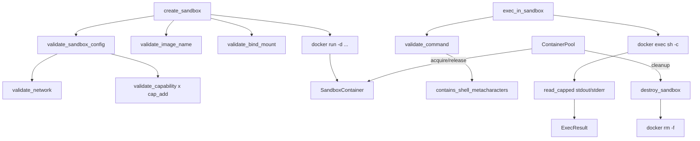

# crates — librefang-runtime-sandbox-docker

# librefang-runtime-sandbox-docker

OS-level isolation for agent code execution. Spawns commands inside Docker containers with strict resource limits, network isolation, capability dropping, and bind-mount validation.

Extracted from `librefang-runtime` as part of the #3710 god-crate split. The parent crate re-exports this at its historical path (`runtime::docker_sandbox`) behind the default-on `docker-sandbox` feature, so downstream imports are unchanged.

---

## Architecture



---

## Security Model

Every `docker run` and `docker exec` invocation passes through a layered validation pipeline before shelling out. Each layer fails closed with a typed `Err(String)` and an `error!` log line, so a rejection is recorded even if the caller swallows the `Result`.

### Capability Allowlist (`SAFE_CAPS`)

Capabilities are dropped entirely (`--cap-drop ALL`), then specific ones are added back from a pinned 14-entry allowlist derived from Docker's defaults. Dangerous capabilities that collapse the sandbox are excluded by design:

| Capability | Why excluded |
|---|---|
| `SYS_ADMIN` | Mount, kexec, BPF, namespace manipulation |
| `NET_ADMIN` | Interface/firewall reconfiguration, raw sockets |
| `SYS_PTRACE` | Process inspection; defeats `no-new-privileges` |
| `SYS_MODULE`, `SYS_BOOT` | Kernel/module tampering |
| `BPF`, `PERFMON` | eBPF-based escape |
| `MAC_ADMIN`, `MAC_OVERRIDE` | SELinux/AppArmor bypass |

`NET_RAW` is retained for ping/traceroute utility; the network-namespace boundary (see below) is the real SSRF protection.

The allowlist is size-pinned in tests (`SAFE_CAPS.len() == 14`) so any future widening requires a conscious diff.

### Network Isolation

`validate_network` rejects three categories before they reach `docker run`:

- **`host`** — shares the host network namespace, exposing loopback, cloud-metadata (`169.254.169.254`), and the daemon port.
- **`container:<name>`** — inherits another container's namespace, transitively defeating isolation.
- **Invalid characters** — anything outside `[A-Za-z0-9_-]+`; Docker would reject it anyway, but we fail fast with a typed error.

Allowed: `bridge`, `none`, and user-defined network names.

### Bind Mount Validation

`validate_bind_mount` runs **before** `docker run` on the workspace path. Without this gate, the blocked-path checks were dead code — a symlinked workspace resolving into `/etc` would still be mounted.

**Blocked by default** (`BLOCKED_MOUNT_PATHS`):

```
/etc  /proc  /sys  /dev  /var/run/docker.sock
/run/docker.sock  /run  /root  /boot
```

`/run` and `/run/docker.sock` are explicitly blocked because systemd hosts symlink `/var/run` → `/run`, and the Docker socket is a host-root escape vector.

**Containment check** (`path_is_within`): component-aware — `"/development"` is NOT inside `"/dev"`. Uses path-component boundaries, not naive `starts_with`, and normalizes trailing slashes on configured blocked paths.

**Symlink escape**: the path is canonicalized (or the nearest existing ancestor is canonicalized for not-yet-existing paths), and the resolved target is re-checked against blocked paths. This prevents a symlink created at a non-existent path from later resolving into `/etc`, `/proc`, etc.

**Path traversal**: any `..` component is rejected.

### Shell Metacharacter Denylist

`validate_command` delegates to `helpers::contains_shell_metacharacters`, which blocks injection vectors before the command reaches `sh -c`:

| Metacharacter | Reason |
|---|---|
| `` ` `` | Backtick command substitution |
| `$(` | `$()` command substitution |
| `${` | Variable expansion |
| `;` | Command chaining |
| `\|` | Pipe operator |
| `>`, `<` | I/O redirection |
| `{`, `}` | Brace expansion |
| `&` | Background/job control |
| `\n`, `\r` | Embedded newlines |
| `\0` | Null bytes |

**Quoting-aware**: command substitution and variable expansion sequences are scanned on the raw string (they fire inside double quotes under `sh -c`). Chaining/redirection/globbing metacharacters are scanned on a `strip_quoted_regions` output so legitimate quoted arguments aren't false-positive rejected.

The `helpers` module is a **deliberate duplicate** of `librefang-runtime::subprocess_sandbox` and `librefang-runtime::str_utils`, kept public so the parent crate can drive a parity test (`crates/librefang-runtime/tests/docker_sandbox_helpers_parity.rs`) asserting byte-for-byte equivalence. This prevents silent drift when the canonical denylist gains a new entry.

---

## Container Lifecycle

### `create_sandbox`

```rust
pub async fn create_sandbox(
    config: &DockerSandboxConfig,
    agent_id: &str,
    workspace: &Path,
) -> Result<SandboxContainer, String>
```

Spawns a detached container (`docker run -d`) configured with:

- **Resource limits**: `--memory`, `--cpus`, `--pids-limit`
- **Security**: `--cap-drop ALL` + allowlisted `--cap-add`, `--security-opt no-new-privileges`, optional `--read-only`
- **Network**: validated `--network` value
- **tmpfs**: configured mounts (default: `/tmp:size=64m`)
- **Workspace**: host path mounted read-only into `config.workdir` (validated via `validate_bind_mount`)
- **Entry point**: `sleep infinity` to keep the container alive for `exec`

**Container naming**: `{container_prefix}-{sha256(agent_id)[..8]}`. The SHA-256 hex suffix is bijective (8 hex chars = 2³² space), replacing a lossy truncation that previously collapsed distinct agent IDs like `"foo/bar"` and `"foo-bar"` into the same Docker container name.

Validation order: `validate_image_name` → `validate_sandbox_config` (network + caps) → `sanitize_container_name` → `validate_bind_mount`.

### `exec_in_sandbox`

```rust
pub async fn exec_in_sandbox(
    container: &SandboxContainer,
    command: &str,
    timeout: Duration,
) -> Result<ExecResult, String>
```

Runs `docker exec sh -c "<command>"` with:

- **`kill_on_drop(true)`**: tokio does not kill the child on drop by default; without this, a timeout would leak a host-side `docker exec` process per timed-out call.
- **Streaming output cap** (`read_capped`): stdout and stderr are drained into 50 KB buffers while continuing to read to EOF. A runaway command (`head -c 20G /dev/zero`) cannot OOM the daemon by buffering unbounded output. If truncated, a `[truncated, N total bytes]` marker is appended.
- **Timeout**: enforced via `tokio::time::timeout`; returns a typed error on expiry.

The three futures (stdout drain, stderr drain, child wait) run concurrently via `tokio::join!`.

### `destroy_sandbox`

```rust
pub async fn destroy_sandbox(container: &SandboxContainer) -> Result<(), String>
```

Runs `docker rm -f`. Failures are logged at `warn!` level but still return `Ok(())` — the container may already be gone.

### `is_docker_available`

```rust
pub async fn is_docker_available() -> bool
```

Probes `docker version --format '{{.Server.Version}}'`. Returns `false` on any failure.

---

## Container Pool

`ContainerPool` reuses containers across sessions to avoid the startup cost of repeated `docker run`.

```rust
pub struct ContainerPool { /* DashMap-backed */ }

let pool = ContainerPool::new();
```

| Method | Behavior |
|---|---|
| `release(container, config_hash)` | Returns a container to the pool, stamped with `last_used` and `created` timestamps. |
| `acquire(config_hash, cool_secs)` | Returns a container matching the hash whose `last_used` age exceeds `cool_secs`. Removes it from the pool. Returns `None` if no match. |
| `cleanup(idle_timeout_secs, max_age_secs)` | Destroys containers idle longer than `idle_timeout_secs` or older than `max_age_secs`. |
| `len()` / `is_empty()` | Pool occupancy. |

`config_hash` hashes `image`, `network`, `memory_limit`, and `workdir` from `DockerSandboxConfig` into a `u64`. Containers with different configs are never reused for each other.

---

## Types

### `SandboxContainer`

```rust
pub struct SandboxContainer {
    pub container_id: String,
    pub agent_id: String,
    pub created_at: chrono::DateTime<chrono::Utc>,
}
```

Handle to a running sandbox container. Passed to `exec_in_sandbox` and `destroy_sandbox`.

### `ExecResult`

```rust
pub struct ExecResult {
    pub stdout: String,
    pub stderr: String,
    pub exit_code: i32,
}
```

If output was truncated, the respective field ends with `... [truncated, N total bytes]`.

---

## Configuration

Consumes `DockerSandboxConfig` from `librefang-types`. Default values:

| Field | Default |
|---|---|
| `enabled` | `false` |
| `image` | `"python:3.12-slim"` |
| `container_prefix` | `"librefang-sandbox"` |
| `workdir` | `"/workspace"` |
| `network` | `"none"` |
| `memory_limit` | `"512m"` |
| `cpu_limit` | `1.0` |
| `timeout_secs` | `60` |
| `read_only_root` | `true` |
| `cap_add` | `[]` (empty) |
| `tmpfs` | `["/tmp:size=64m"]` |
| `pids_limit` | `100` |

Call `validate_sandbox_config(&config)` at daemon startup to fail fast on dangerous network or capability settings. This also emits `error!` logs so the rejection is recorded even if the caller swallows the `Result`.

---

## Internal Helpers

### `read_capped<R>(reader, cap)`

Drains an `AsyncReadExt` into a `Vec<u8>` capped at `cap` bytes, continuing to EOF so the pipe never blocks the child. Returns `(captured_bytes, true_total, was_truncated)`. Mirrors `LocalBackend::read_capped` in `librefang-runtime/src/tool_exec_backend.rs`; kept module-level for deterministic testing without a live Docker daemon.

### `helpers` module

Public module exposing `safe_truncate_str` and `contains_shell_metacharacters`. These are intentional duplicates of the canonical implementations in the parent crate, kept under 60 LOC of pure-string logic to avoid a cyclic dependency. The parity test in `crates/librefang-runtime/tests/docker_sandbox_helpers_parity.rs` guards against drift.

---

## Testing

The test suite covers security boundaries without requiring a live Docker daemon:

- **`test_agent_id_suffix_sweep_distinct`**: 1000 distinct agent IDs produce 1000 distinct 8-char suffixes.
- **`test_docker_metachar_command_substitution_in_double_quotes_blocked`**: parity assertion that `` ` ``, `$()`, and `${}` are blocked inside double quotes.
- **`create_sandbox_rejects_blocked_workspace_mount`**: verifies `validate_bind_mount` runs on the creation path (regression for dead-code bug).
- **`test_read_capped_bounds_unbounded_output`**: 200 KB producer capped at 50 KB with correct total count and truncation flag.
- **`test_safe_caps_size_and_contents`**: pins `SAFE_CAPS.len() == 14` and spot-checks inclusion/exclusion.
- **`test_validate_bind_mount_sibling_prefix_not_blocked`**: component-aware containment — `/development` is not inside `/dev`.
- **`test_validate_bind_mount_blocks_run_docker_sock`**: systemd `/run` symlink coverage.