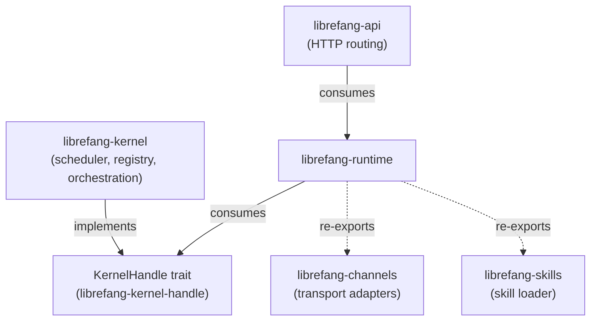
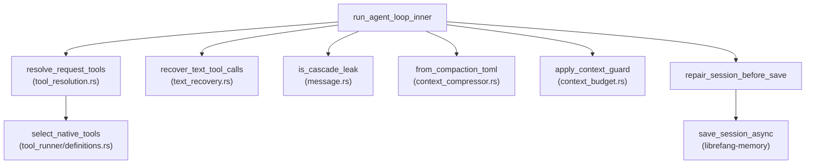

# crates — librefang-runtime

# librefang-runtime

Agent execution engine for LibreFang. Hosts the turn-by-turn agent loop, tool dispatch, context window management, audit trail, sandboxes, OAuth flows, and the A2A peer protocol. The kernel calls into this crate when an agent receives a message; the runtime never depends on the kernel directly.

## Architecture at a glance



The runtime sits between the kernel (which owns agent lifecycle, scheduling, and cron) and the API layer (which owns HTTP routing). Communication back to the kernel flows exclusively through the `KernelHandle` trait defined in the sibling `librefang-kernel-handle` crate. This breaks what would otherwise be a circular dependency.

## Module map

### Core execution

| Module | Role |
|---|---|
| `agent_loop/` | Turn-by-turn agent execution. ~10k LOC. Entry points: `run_agent_loop_inner`, `run_agent_loop_streaming`. |
| `tool_runner/` | Tool dispatch and execution path. ~9.7k LOC. New tool kinds go in their own sibling file, not in `mod.rs`. |
| `apply_patch` | Tool-level patch application. |

Both `agent_loop/` and `tool_runner/` are tracked for extraction under issue #3710. Do not grow them without coordination.

### Context management

| Module | Role |
|---|---|
| `compactor` | Token estimation and compaction logic. `estimate_token_count` is the entry point for budget calculations. |
| `context_budget` | Context window budget enforcement. `apply_context_guard` is called during streaming. |
| `context_compressor` | Compression of conversation history. Deserializes via `from_compaction_toml`. |
| `context_overflow` | Overflow handling when context exceeds limits. |
| `context_engine` | Per-agent context engine builder. Kernel calls `build_context_engine`. |
| `prompt_builder` | Prompt assembly. |

### Security and sandboxing

| Module | Role |
|---|---|
| `sandbox` | WASM-based sandboxing via `wasmtime`. |
| `subprocess_sandbox` | Process-level sandboxing. |
| `browser` | Browser sandbox (feature-gated). |
| `dangerous_command` | Command safety checking. |
| `command_lane` | Concurrency limiting via lane semaphores. `with_capacities` / `semaphore_for_lane`. |

Docker sandboxing (`docker_sandbox`) is re-exported from `librefang-runtime-sandbox-docker` under the `docker-sandbox` feature.

### OAuth and authentication

| Module | Role |
|---|---|
| `chatgpt_oauth` | ChatGPT OAuth flow. |
| `copilot_oauth` | Copilot OAuth flow. |
| `auth_cooldown` | Authentication rate-limiting. |

MCP OAuth state lives in `mcp_auth_states`. The OAuth provider trait `McpOAuthProvider` is implemented on the kernel side.

### Infrastructure

| Module | Role |
|---|---|
| `model_catalog` | `ModelCatalog` type — registry of 130+ models across 28 providers. |
| `catalog_sync` | Catalog synchronization. File operations: `remove_file`, `write`. |
| `registry_sync` | Registry synchronization. `seed_registry_fixture_for_tests` used in kernel tests. |
| `channel_registry` | Channel registry. |
| `checkpoint_manager` | Agent checkpoint persistence. |
| `mcp_migrate` | MCP migration file writes. |
| `mcp_migrate` | Shared write path used by kernel orchestration and skill workshop. |
| `artifact_store` | Artifact storage with GC. `run_startup_gc_once` → `gc_evict_older_than`. |
| `agent_context` | Context file loading. `load_context_md_async` with symlink rejection. |
| `hooks` | Hook system. `HookContext` / `DynamicSection`. |
| `session_repair` | Session repair. `find_safe_trim_point` called from `safe_trim_messages`. |

### A2A peer protocol

`a2a` implements the Agent-to-Agent protocol. Key components:

- **Discovery**: `discover` fetches agent cards with SSRF protection — redirects to cloud metadata are blocked, oversized bodies rejected.
- **Task store**: In-memory LRU with DB persistence fallback. `with_persistence` wraps `new`; `get` falls back to DB after eviction.
- **HTTP client**: `build_client_for_url` delegates to `proxied_client_builder` in `librefang-http`.
- **Task lifecycle**: `insert` checks `is_terminal` from `librefang-types::approval`.

### Re-exported subsystems

These modules are re-exported from sibling leaf crates under their historical paths, so downstream call sites are unaffected:

| Module path | Source crate | Feature |
|---|---|---|
| `audit` | `librefang-runtime-audit` | always |
| `mcp`, `mcp_oauth` | `librefang-runtime-mcp` | always |
| `docker_sandbox` | `librefang-runtime-sandbox-docker` | `docker-sandbox` |
| `media`, `media_understanding` | `librefang-runtime-media` | `media` |

## Feature gates

Default features:

```toml
default = ["media", "browser", "docker-sandbox", "seccomp-sandbox", "landlock-sandbox"]
```

| Feature | Effect when off |
|---|---|
| `media` | `media` / `media_understanding` modules return stubs. |
| `browser` | Browser sandbox disabled. |
| `docker-sandbox` | Docker sandbox disabled. |
| `landlock-sandbox` | Linux Landlock LSM backend off. |
| `seccomp-sandbox` | Linux seccomp backend off. |
| `ssh-backend` | Remote SSH tool execution (pulls `russh`). |
| `daytona-backend` | Daytona managed sandbox backend. |

Build with `--no-default-features` to omit whole subsystems for size or security-sensitive deployments.

## The KernelHandle pattern

The runtime must never import `librefang-kernel` — that would create a circular dependency. Instead, the kernel implements the `KernelHandle` trait (defined in `librefang-kernel-handle`), and the runtime consumes it:

```rust
// Correct: accept a KernelHandle
pub async fn run_agent_loop<H: KernelHandle>(handle: &H, ...) { ... }

// Wrong: never do this
use librefang_kernel::*;  // CIRCULAR DEPENDENCY
```

For mocking in tests, use `librefang-testing::MockKernelBuilder` rather than faking `KernelHandle` inline.

## Execution flow

The main non-streaming path through `agent_loop`:



Key points in the loop:

1. **Tool resolution** (`tool_resolution.rs`): `resolve_request_tools` filters available tools via `select_native_tools`, which calls `builtin_tool_definitions`. The kernel's `available_tools` calls through `resolve_tool_access` from `tool_policy.rs`.

2. **Text recovery**: `recover_text_tool_calls` handles models that emit tool calls as text rather than structured output.

3. **Cascade leak guard**: `is_cascade_leak` detects and aborts leaked tool-use stop reasons in the streaming path.

4. **Context guard**: `apply_context_guard` enforces budget before each turn.

5. **Session repair**: `repair_session_before_save` calls `find_safe_trim_point` (from `session_repair.rs`) to ensure the persisted message list is valid, then `set_messages` / `save_session_async` on the memory substrate.

6. **End-of-turn**: `finalize_successful_end_turn` (in `end_turn.rs`) handles proactive memory (`gated_proactive_memory_for_memorize` / `_for_retrieve`), stale tool result folding (`maybe_fold_stale_tool_results`), and constructs the assistant message.

## Cross-cutting invariants

### Deterministic prompt ordering (#3298)

Tool definitions, MCP server summaries, and capability lists must be sorted before stringifying. Use `BTreeMap` / `BTreeSet`, never `HashMap`. Non-deterministic ordering causes cache misses and test flakiness.

### Identity files

Identity files live at `{workspace}/.identity/`, not workspace root. `read_identity_file()` falls back to root for pre-migration workspaces. `migrate_identity_files()` runs on every spawn and calls `remove_file` from `catalog_sync.rs` to clean up legacy locations.

### USER_AGENT constant

Every outbound HTTP request must set the User-Agent header:

```rust
req.header("User-Agent", librefang_runtime::USER_AGENT)
```

The audit hook flags missing UAs.

## Async boundaries

### ErrorTranslator is `!Send`

`ErrorTranslator` (from `RequestLanguage`) is not `Send`. Any `.await` must happen **after** `drop(t)`, or you get a cryptic axum `Handler<_, _>` trait-bound error.

### No blocking I/O in async handlers

- No `std::fs` — use `tokio::fs`.
- No `std::sync::RwLock` — use `arc_swap` or `parking_lot`.
- No `tokio::block_on`.

These rules reference #3579.

### No panics on wire data

Never `unwrap()` or `panic!()` on values that come off the network. All deserialized input must be handled with `?` or explicit error variants.

## Model catalog

`ModelCatalog` holds 130+ models across 28 providers. The kernel wraps it in `arc_swap::ArcSwap` (#3384) for lock-free reads. Updates go through the kernel's `model_catalog_update` closure:

```rust
// In kernel code:
kernel.model_catalog_update(|cat| {
    cat.insert(...);
});
```

The `openrouter-models.snapshot.json` file in this crate is a fixture snapshot of the OpenRouter model list, used for catalog sync testing.

## Context engine and compaction

The compactor (`compactor.rs`) provides `estimate_token_count`, used by:
- Context budget enforcement (`context_budget.rs`)
- Session repair trim point selection
- Kernel cron keep-count calculations (`cron_compute_keep_count_*` tests)

The context engine (`context_engine.rs`) is built per-agent via `build_context_engine`, called from the kernel's `per_agent_context_engine` setup.

## Testing

This crate historically had zero integration tests (#3696). New runtime work should include at least one `#[tokio::test]` exercising the new path.

Run tests scoped to this crate:

```bash
cargo test -p librefang-runtime
```

Existing test coverage is concentrated in:
- `agent_loop/tests/integration.rs` — streaming/non-streaming loop, parallel dispatch, cascade leak guards, max-tokens handling.
- `a2a.rs` inline tests — task store eviction, persistence round-trips, discovery SSRF rejection.

Dev-dependencies include `wiremock` (wire-shape tests for the Daytona backend), `serial_test`, `proptest`, and `metrics-util`.

## Dependencies

Core: `librefang-types`, `librefang-http`, `librefang-kernel-handle`, `librefang-runtime-audit`, `librefang-runtime-mcp`, `librefang-llm-drivers`, `librefang-llm-driver`, `librefang-channels`, `librefang-memory`, `librefang-skills`, `tokio`.

Notable:
- `encoding_rs` — charset-aware decoding for fetched response bodies (Shift-JIS, GBK, EUC-JP, ISO-8859-1).
- `regex` (full, not `regex-lite`) — used by `pii_filter` for `RegexBuilder.size_limit` / `.dfa_size_limit` guards.
- `russh` 0.61 — SSH backend, locked to the first release patched for the russh advisories.
- `landlock` / `seccompiler` — Linux-only, platform-gated via `cfg(target_os = "linux")`.
- `wasmtime` — WASM sandbox host.

## Taboos

1. **No `librefang-kernel` import.** Use `KernelHandle`.
2. **No `librefang-api` import.** API consumes runtime, not vice versa.
3. **Don't grow `agent_loop/` or `tool_runner/`.** New tool kinds get their own sibling file in `tool_runner/`.
4. **No `unwrap()` / `panic!()` on wire data.**
5. **No inline `KernelHandle` mocking.** Use `librefang-testing::MockKernelBuilder`.
6. **No raw `cargo build`.** Use `cargo check --workspace --lib`. Real builds run in CI.