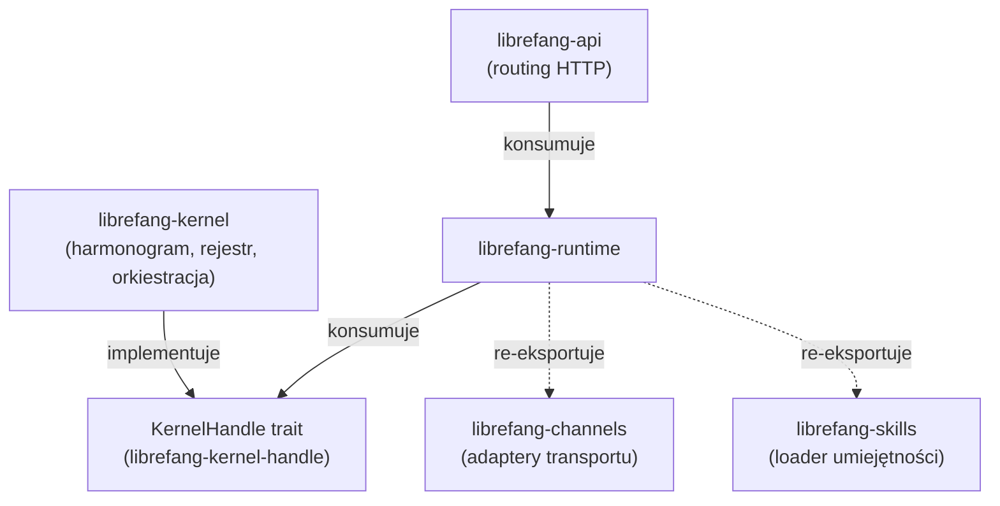
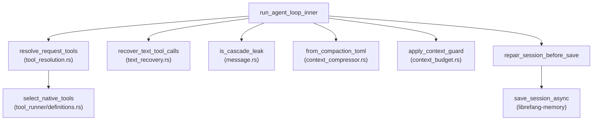

# crates — librefang-runtime

# librefang-runtime

Silnik wykonywania agentów dla LibreFang. Hostuje pętlę agenta krok po kroku, wysyłanie narzędzi, zarządzanie oknem kontekstu, ślad audytowy, piaskownice, przepływy OAuth oraz protokół równorzędny A2A. Kernel wywołuje ten crate, gdy agent otrzyma wiadomość; runtime nigdy nie zależy bezpośrednio od kernela.

## Architektura w pigułce



Runtime znajduje się pomiędzy kernelem (który zarządza cyklem życia agenta, harmonogramem i cronem) a warstwą API (która zarządza routingiem HTTP). Komunikacja z kernelem odbywa się wyłącznie przez trait `KernelHandle` zdefiniowany w siostrzanym cracie `librefang-kernel-handle`. To zrywa, co inaczej byłoby zależnością cykliczną.

## Mapa modułów

### Wykonywanie podstawowe

| Moduł | Rola |
|---|---|
| `agent_loop/` | Wykonywanie agenta krok po kroku. ~10k LOC. Punkty wejścia: `run_agent_loop_inner`, `run_agent_loop_streaming`. |
| `tool_runner/` | Wysyłanie i ścieżka wykonywania narzędzi. ~9,7k LOC. Nowe rodzaje narzędzi trafiają do własnego pliku obok, nie do `mod.rs`. |
| `apply_patch` | Aplikacja poprawek na poziomie narzędzi. |

Zarówno `agent_loop/`, jak i `tool_runner/` są monitorowane pod kątem ekstrakcji w ramach zgłoszenia #3710. Nie powiększaj ich bez koordynacji.

### Zarządzanie kontekstem

| Moduł | Rola |
|---|---|
| `compactor` | Szacowanie tokenów i logika kompakcji. `estimate_token_count` to punkt wejścia do obliczeń budżetu. |
| `context_budget` | Egzekwowanie budżetu okna kontekstu. `apply_context_guard` jest wywoływane podczas strumieniowania. |
| `context_compressor` | Kompresja historii konwersacji. Deserializuje przez `from_compaction_toml`. |
| `context_overflow` | Obsługa przepełnienia, gdy kontekst przekracza limity. |
| `context_engine` | Builder silnika kontekstu dla każdego agenta. Kernel wywołuje `build_context_engine`. |
| `prompt_builder` | Assembling promptów. |

### Zabezpieczenia i piaskownice

| Moduł | Rola |
|---|---|
| `sandbox` | Piaskownica oparta na WASM przez `wasmtime`. |
| `subprocess_sandbox` | Piaskownica na poziomie procesów. |
| `browser` | Piaskownica przeglądarki (zależna od funkcji). |
| `dangerous_command` | Sprawdzanie bezpieczeństwa poleceń. |
| `command_lane` | Ograniczanie współbieżności przez semafory lane. `with_capacities` / `semaphore_for_lane`. |

Piaskownica Docker (`docker_sandbox`) jest re-eksportowana z `librefang-runtime-sandbox-docker` pod funkcją `docker-sandbox`.

### OAuth i uwierzytelnianie

| Moduł | Rola |
|---|---|
| `chatgpt_oauth` | Przepływ ChatGPT OAuth. |
| `copilot_oauth` | Przepływ Copilot OAuth. |
| `auth_cooldown` | Ograniczanie częstotliwości uwierzytelniania. |

Stan MCP OAuth znajduje się w `mcp_auth_states`. Trait dostawcy OAuth `McpOAuthProvider` jest zaimplementowany po stronie kernela.

### Infrastruktura

| Moduł | Rola |
|---|---|
| `model_catalog` | Typ `ModelCatalog` — rejestr ponad 130 modeli od 28 dostawców. |
| `catalog_sync` | Synchronizacja katalogu. Operacje plikowe: `remove_file`, `write`. |
| `registry_sync` | Synchronizacja rejestru. `seed_registry_fixture_for_tests` używane w testach kernela. |
| `channel_registry` | Rejestr kanałów. |
| `checkpoint_manager` | Persystencja punktów kontrolnych agenta. |
| `mcp_migrate` | Zapisy plików migracji MCP. |
| `mcp_migrate` | Wspólna ścieżka zapisu używana przez orkiestrację kernela i warsztat umiejętności. |
| `artifact_store` | Przechowywanie artefaktów z GC. `run_startup_gc_once` → `gc_evict_older_than`. |
| `agent_context` | Wczytywanie plików kontekstu. `load_context_md_async` z odrzucaniem symlinków. |
| `hooks` | System hooków. `HookContext` / `DynamicSection`. |
| `session_repair` | Naprawa sesji. `find_safe_trim_point` wywoływane z `safe_trim_messages`. |

### Protokół równorzędny A2A

`a2a` implementuje protokół Agent-to-Agent. Kluczowe komponenty:

- **Odkrywanie**: `discover` pobiera karty agentów z ochroną SSRF — przekierowania do metadanych chmury są blokowane, zbyt duże treści odrzucane.
- **Task store**: LRU w pamięci z rezerwą persystencji w bazie danych. `with_persistence` opakowuje `new`; `get` przechodzi do bazy danych po ewikcji.
- **Klient HTTP**: `build_client_for_url` deleguje do `proxied_client_builder` w `librefang-http`.
- **Cykl życia zadań**: `insert` sprawdza `is_terminal` z `librefang-types::approval`.

### Re-eksportowane podsystemy

Te moduły są re-eksportowane z siostrzanych cratów liściowych pod ich historycznymi ścieżkami, aby punkt wywołań nie uległ zmianie:

| Ścieżka modułu | Crate źródłowy | Funkcja |
|---|---|---|
| `audit` | `librefang-runtime-audit` | zawsze |
| `mcp`, `mcp_oauth` | `librefang-runtime-mcp` | zawsze |
| `docker_sandbox` | `librefang-runtime-sandbox-docker` | `docker-sandbox` |
| `media`, `media_understanding` | `librefang-runtime-media` | `media` |

## Bramki funkcji

Domyślne funkcje:

```toml
default = ["media", "browser", "docker-sandbox", "seccomp-sandbox", "landlock-sandbox"]
```

| Funkcja | Efekt po wyłączeniu |
|---|---|
| `media` | Moduły `media` / `media_understanding` zwracają stuby. |
| `browser` | Piaskownica przeglądarki wyłączona. |
| `docker-sandbox` | Piaskownica Docker wyłączona. |
| `landlock-sandbox` | Backend Linux Landlock LSM wyłączony. |
| `seccomp-sandbox` | Backend Linux seccomp wyłączony. |
| `ssh-backend` | Zdalne wykonywanie narzędzi SSH (ciągnie `russh`). |
| `daytona-backend` | Backend piaskownicy zarządzanej Daytona. |

Buduj z `--no-default-features`, aby pominąć całe podsystemy dla wdrożeń wrażliwych na rozmiar lub bezpieczeństwo.

## Wzorzec KernelHandle

Runtime nie może nigdy importować `librefang-kernel` — to stworzyłoby zależność cykliczną. Zamiast tego kernel implementuje trait `KernelHandle` (zdefiniowany w `librefang-kernel-handle`), a runtime go konsumuje:

```rust
// Prawidłowe: przyjmij KernelHandle
pub async fn run_agent_loop<H: KernelHandle>(handle: &H, ...) { ... }

// Błędne: nigdy tego nie rób
use librefang_kernel::*;  // ZALEŻNOŚĆ CYKLICZNA
```

Do mockowania w testach używaj `librefang-testing::MockKernelBuilder` zamiast fałszowania `KernelHandle` inline.

## Przepływ wykonywania

Główna niestrumieniowa ścieżka przez `agent_loop`:



Kluczowe punkty w pętli:

1. **Rozwiązywanie narzędzi** (`tool_resolution.rs`): `resolve_request_tools` filtruje dostępne narzędzia przez `select_native_tools`, który wywołuje `builtin_tool_definitions`. `available_tools` kernela wywołuje przez `resolve_tool_access` z `tool_policy.rs`.

2. **Odzyskiwanie tekstu**: `recover_text_tool_calls` obsługuje modele emitujące wywołania narzędzi jako tekst, a nie jako ustrukturyzowane wyjście.

3. **Guard wycieku kaskady**: `is_cascade_leak` wykrywa i przerywa wyciekłe przyczyny zatrzymania użycia narzędzi w ścieżce strumieniowej.

4. **Guard kontekstu**: `apply_context_guard` egzekwuje budżet przed każdą turą.

5. **Naprawa sesji**: `repair_session_before_save` wywołuje `find_safe_trim_point` (z `session_repair.rs`), aby zapewnić, że lista zapisanych wiadomości jest prawidłowa, a następnie `set_messages` / `save_session_async` na substracie pamięci.

6. **Koniec tury**: `finalize_successful_end_turn` (w `end_turn.rs`) obsługuje proaktywną pamięć (`gated_proactive_memory_for_memorize` / `_for_retrieve`), zwijanie starych wyników narzędzi (`maybe_fold_stale_tool_results`) i konstruuje wiadomość asystenta.

## Invarianty przekrojowe

### Deterministyczne porządkowanie promptów (#3298)

Definicje narzędzi, podsumowania serwerów MCP i listy możliwości muszą być posortowane przed zamianą na tekst. Używaj `BTreeMap` / `BTreeSet`, nigdy `HashMap`. Niedeterministyczne porządkowanie powoduje pudła pamięci podręcznej i flaky testy.

### Pliki tożsamości

Pliki tożsamości znajdują się w `{workspace}/.identity/`, nie w katalogu głównym workspace'u. `read_identity_file()` przechodzi do katalogu głównego dla workspace'ów sprzed migracji. `migrate_identity_files()` uruchamia się przy każdym spawnowaniu i wywołuje `remove_file` z `catalog_sync.rs`, aby posprzątać legacy lokalizacje.

### Stała USER_AGENT

Każdy wychodzący żądanie HTTP musi ustawiać nagłówek User-Agent:

```rust
req.header("User-Agent", librefang_runtime::USER_AGENT)
```

Hook audytowy flaguje brakujące UA.

## Granice asynchroniczne

### ErrorTranslator jest `!Send`

`ErrorTranslator` (z `RequestLanguage`) nie jest `Send`. Każde `.await` musi nastąpić **po** `drop(t)`, inaczej otrzymasz niejasny błąd trait-bound axum `Handler<_, _>`.

### Żadnego blokującego I/O w handlerach asynchronicznych

- Żadnego `std::fs` — używaj `tokio::fs`.
- Żadnego `std::sync::RwLock` — używaj `arc_swap` lub `parking_lot`.
- Żadnego `tokio::block_on`.

Te zasady odnoszą się do #3579.

### Żadnych panik na danych z sieci

Nigdy `unwrap()` ani `panic!()` na wartościach pochodzących z sieci. Cały deserializowany wejście musi być obsługiwane przez `?` lub jawne warianty błędów.

## Katalog modeli

`ModelCatalog` przechowuje ponad 130 modeli od 28 dostawców. Kernel opakowuje go w `arc_swap::ArcSwap` (#3384) dla odczytów bez blokad. Aktualizacje przechodzą przez domknięcie `model_catalog_update` kernela:

```rust
// W kodzie kernela:
kernel.model_catalog_update(|cat| {
    cat.insert(...);
});
```

Plik `openrouter-models.snapshot.json` w tym cracie to migawka fixture listy modeli OpenRouter, używana do testowania synchronizacji katalogu.

## Silnik kontekstu i kompakcja

Kompaktor (`compactor.rs`) dostarcza `estimate_token_count`, używany przez:
- Egzekwowanie budżetu kontekstu (`context_budget.rs`)
- Wybór punktu przycięcia naprawy sesji
- Obliczenia cron keep-count w kernelu (testy `cron_compute_keep_count_*`)

Silnik kontekstu (`context_engine.rs`) jest budowany dla każdego agenta przez `build_context_engine`, wywoływany z setupu `per_agent_context_engine` kernela.

## Testowanie

Ten crate historycznie miał zero testów integracyjnych (#3696). Nowa praca w runtime powinna zawierać przynajmniej jeden `#[tokio::test]` testujący nową ścieżkę.

Uruchom testy ograniczone do tego crate'a:

```bash
cargo test -p librefang-runtime
```

Istniejące pokrycie testowe jest skoncentrowane w:
- `agent_loop/tests/integration.rs` — pętla strumieniowa/niestrumieniowa, wysyłanie równoległe, guardy wycieku kaskady, obsługa max-tokens.
- `a2a.rs` testy inline — ewikcja task store, round-tripy persystencji, odrzucanie SSRF odkrywania.

Dev-zależności obejmują `wiremock` (testy kształtu wire dla backendu Daytona), `serial_test`, `proptest` i `metrics-util`.

## Zależności

Rdzeń: `librefang-types`, `librefang-http`, `librefang-kernel-handle`, `librefang-runtime-audit`, `librefang-runtime-mcp`, `librefang-llm-drivers`, `librefang-llm-driver`, `librefang-channels`, `librefang-memory`, `librefang-skills`, `tokio`.

Wyróżniające się:
- `encoding_rs` — dekodowanie z uwzględnieniem zestawów znaków dla pobieranych treści odpowiedzi (Shift-JIS, GBK, EUC-JP, ISO-8859-1).
- `regex` (pełna, nie `regex-lite`) — używana przez `pii_filter` do strażników `RegexBuilder.size_limit` / `.dfa_size_limit`.
- `russh` 0.61 — backend SSH, zablokowana na pierwszym wydaniu poprawionym pod kątem doradców russh.
- `landlock` / `seccompiler` — tylko Linux, zależne od platformy przez `cfg(target_os = "linux")`.
- `wasmtime` — host piaskownicy WASM.

## Tabu

1. **Żadnego importu `librefang-kernel`.** Używaj `KernelHandle`.
2. **Żadnego importu `librefang-api`.** API konsumuje runtime, nie odwrotnie.
3. **Nie powiększaj `agent_loop/` ani `tool_runner/`.** Nowe rodzaje narzędzi trafiają do własnego pliku obok w `tool_runner/`.
4. **Żadnego `unwrap()` / `panic!()` na danych z sieci.**
5. **Żadnego inline mockowania `KernelHandle`.** Używaj `librefang-testing::MockKernelBuilder`.
6. **Żadnego surowego `cargo build`.** Używaj `cargo check --workspace --lib`. Prawdziwe buildy uruchamiają się w CI.
