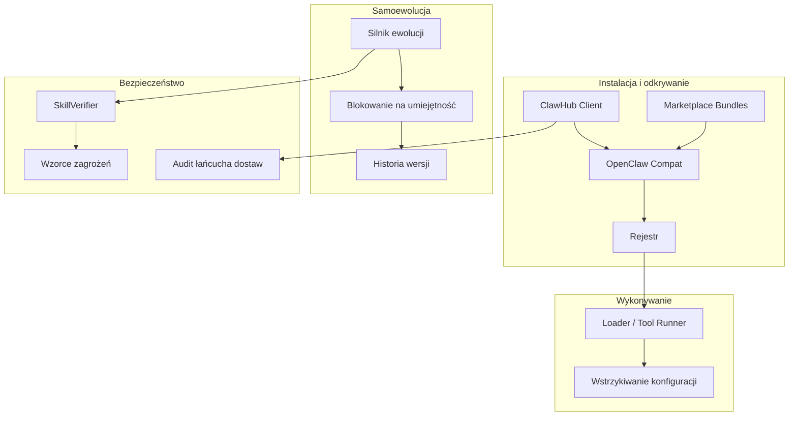
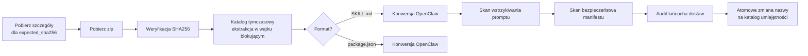

# crates — librefang-skills

# librefang-skills

System umiejętności dla LibreFang — rejestr, loader, klient marketplace, warstwa kompatybilności z OpenClaw oraz agentowo napędzana samoewolucja. Ten crate jest kręgosłupem sposobu, w jaki umiejętności są odkrywane, instalowane, wykonywane, mutowane i zabezpieczane.

## Przegląd architektury



## Układ crate'a

| Moduł | Odpowiedzialność |
|---|---|
| `clawhub` | Klient API marketplace ClawHub — wyszukiwanie, przeglądanie, pobieranie, instalacja z walidacją sumy kontrolnej |
| `marketplace` | Lokalna ekstrakcja paczek marketplace z zabezpieczeniem przed bombą dekompresyjną |
| `openclaw_compat` | Wykrywanie i konwersja formatów SKILL.md / package.json / OpenClaw skill na manifesty LibreFang |
| `loader` | Wykonywanie narzędzi umiejętności (shell, Python), walidacja wejścia/wyjścia względem schematów, wymuszanie polityki przekazywania zmiennych środowiskowych |
| `registry` | Śledzenie zainstalowanych umiejętności, zarządzanie stanem włączania/wyłączania, zamrażanie umiejętności |
| `evolution` | Agentowo napędzane tworzenie umiejętności, rozmyte łatki, historia wersji, wycofywanie, zarządzanie plikami pomocniczymi |
| `config_injection` | Zbieranie deklaracji `[[config_vars]]` z włączonych umiejętności i resolves ich do sekcji promptu systemowego |
| `verify` | `SkillVerifier` — skanowanie pod kątem wstrzykiwania promptu za pomocą wzorców zagrożeń Aho-Corasick, skany bezpieczeństwa manifestu |
| `supply_chain` | Skanowanie katalogów umiejętności w poszukiwaniu niebezpiecznych typów plików (`.pth` itd.) przed promocją |
| `http_client` | Udostępniane buildery reqwest z TLS rustls i opcjonalnym niebezpiecznym obejściem weryfikacji |

---

## Klient marketplace ClawHub (`clawhub`)

`ClawHubClient` zapewnia typowany dostęp do API ClawHub (`https://clawhub.ai/api/v1`). Wszystkie wywołania HTTP przechodzą przez `get_with_retry`, który obsługuje odpowiedzi z limitem zapytań (429) i błędami serwera (5xx) z wykładniczym wycofywaniem i obsługą nagłówka `Retry-After`.

### Metody API

| Metoda | Endpoint | Zwraca |
|---|---|---|
| `search(query, limit)` | `GET /search?q=...` | `ClawHubSearchResponse` (klucz główny: `results`) |
| `browse(sort, limit, cursor)` | `GET /skills?sort=...` | `ClawHubBrowseResponse` (klucz główny: `items`) |
| `get_skill(slug)` | `GET /skills/{slug}` | `ClawHubSkillDetail` z właścicielem, informacjami o wersji, `expected_sha256` |
| `get_file(slug, path)` | `GET /skills/{slug}/file?path=...` | Surowy tekst pliku |
| `install(slug, target_dir)` | `GET /download?slug=...` | `ClawHubInstallResult` |

### Strategia ponowień

Stałe sterujące zachowaniem ponowień:

- **MAX_RETRIES**: 5 prób (wliczając pierwszą)
- **BASE_DELAY_MS**: 1500 ms, podwajane przy każdej próbie
- **MAX_DELAY_MS**: limit 30 000 ms
- Jitter: 0–25% dodawane za pomocą nanosekund zegara systemowego w celu uniknięcia efektu stada

Nagłówek `Retry-After` jest respektowany (z limitem do `MAX_DELAY_MS`), gdy serwer go dostarcza.

### Potok instalacji



Kluczowe decyzje projektowe w ścieżce instalacji:

- **Katalog tymczasowy**: Treść jest ekstrahowana do `.staging-{slug}-{pid}-{seq}` i dopiero atomowo zmieniana na docelowy katalog umiejętności po przejściu wszystkich kontroli bezpieczeństwa. Częściowo pobrana lub odrzucona umiejętność nigdy nie trafia do aktywnego katalogu.
- **Blokująca ekstrakcja**: Dekompresja zip uruchamiana przez `spawn_blocking`, aby tokio worker nie był blokowany przez nieograniczony I/O.
- **Zabezpieczenie przed bombą dekompresyjną**: Liczba wpisów archiwum jest ograniczona do `marketplace::MAX_ENTRIES`, a nieskompresowany rozmiar każdego wpisu jest śledzony przez `write_zip_entry_capped`.
- **Walidacja sumy kontrolnej**: Gdy rejestr dostarcza `expected_sha256`, obliczona wartość musi się zgadzać *przed* utworzeniem jakichkolwiek katalogów. Niedopasowanie natychmiast zwraca `SkillError::SecurityBlocked`.
- **Audit łańcucha dostaw**: `supply_chain::scan()` uruchamiany jako ostatnia brama przed promocją — np. pliki `.pth` wyzwalają błąd `SecurityBlocked`.

`ClawHubInstallResult` zawiera wszystkie ostrzeżenia bezpieczeństwa, translacje nazw narzędzi (OpenClaw → LibreFang) oraz informację, czy umiejętność jest typu prompt-only.

### Konfiguracja TLS

Domyślnie klient używa rustls z natywnymi korzeniami CA. Ustawienie zmiennej środowiskowej `LIBREFANG_DANGEROUSLY_SKIP_TLS_VERIFICATION=true` (lub `1`) przełącza na niebezpieczny builder klienta — przeznaczony wyłącznie do testowania przeciwko serwerom z wygasłymi certyfikatami.

---

## Samoewolucja umiejętności (`evolution`)

Ten moduł pozwala agentom autonomicznie tworzyć, aktualizować i udoskonalać umiejętności na podstawie doświadczeń z wykonania. Wszystkie mutacje są:

- **Zablokowane**: Ekskluzywne blokady plików na umiejętność (`fs2` flock na Unix, LockFileEx na Windows) zapobiegają współbieżnemu uszkodzeniu.
- **Atomowe**: Wszystkie zapisy przechodzą przez schemat plik-tymczasowy-then-zmiana-nazwy.
- **Wersjonowane**: Każda mutacja rejestruje wpis wersji w `.evolution.json`.
- **Zabezpieczone**: Treść promptu i opisy przechodzą przez `SkillVerifier::scan_prompt_content`.

### Operacje podstawowe

| Funkcja | Cel |
|---|---|
| `create_skill` | Utworzenie nowej umiejętności PromptOnly od zera |
| `update_skill` | Pełny nadpis `prompt_context.md` |
| `patch_skill` | Rozmyte znajdowanie i zamiana w istniejącej treści |
| `delete_skill` | Usunięcie umiejętności wyewoluowanej przez agenta (tylko ze źródła `Local`/`Native`) |
| `uninstall_skill` | Inicjowane przez użytkownika usunięcie dowolnej umiejętności niezależnie od źródła |
| `rollback_skill` | Powrót do poprzedniej migawki wersji |
| `write_supporting_file` | Zapis do `references/`, `templates/`, `scripts/` lub `assets/` |
| `remove_supporting_file` | Usunięcie pliku pomocniczego i usunięcie pustych katalogów nadrzędnych |
| `record_skill_usage` | Inkrementacja licznika użycia po pomyślnym wywołaniu narzędzia |

### Umiejscowienie plików blokad

Pliki blokad znajdują się w `{skills_dir}/.evolution-locks/{skill_name}.lock` — *poza* katalogiem umiejętności. Pozwala to `delete_skill` i `uninstall_skill` utrzymać blokadę przez `remove_dir_all` na Windows, gdzie otwarte uchwyty plików wewnątrz katalogu blokowałyby usunięcie.

### Zapisy atomowe

`atomic_write` generuje unikalne nazwy plików tymczasowych używając pid, ID wątku, monotonicznego licznika `AtomicU64` i znacznika czasu w nanosekundach. Zapobiega to kolizjom nawet gdy wiele wątków celuje w tę samą docelową ścieżkę.

### Zarządzanie wersjami

- **`.evolution.json`**: Przechowuje `versions` (max 10 wpisów), `use_count`, `evolution_count` (łączna liczba zapisów wersji wliczając utworzenie) oraz `mutation_count` (zmiany po utworzeniu).
- **Migawki wycofywania**: Przechowywane w `.rollback/` z nazwami plików w precyzji nanosekundowej; stare migawki są przycinane do `MAX_VERSION_HISTORY`.
- **Inkrementacja wersji**: `bump_patch_version` używa crate'a `semver`, poprawnie obsługując tagi pre-release i metadane kompilacji.

### Strategie dopasowania rozmytego

`fuzzy_find_and_replace` próbuje sześciu strategii po kolei (ścisła → luźna) i raportuje, która się powiodła:

1. **Exact** — dosłowne dopasowanie podciągu
2. **LineTrimmed** — białe znaki przycięte per linia
3. **WhitespaceNormalized** — sekwencje białych znaków zwinięte do pojedynczej spacji
4. **IndentFlexible** — wiodące białe znaki usunięte ze wszystkich linii
5. **BlockAnchor** — dopasowanie pierwszej i ostatniej linii, środek ≥60% podobny
6. **WhitespaceStripped** — wszystkie białe znaki usunięte (odpowiednik awaryjny przyjazny dla CJK)

`MatchStrategy` jest zwracany w `EvolutionResult.match_strategy`, aby wywołujący mogli programowo rozróżniać strategie.

Gdy wszystkie strategie zawiodą, komunikat błędu zawiera najbardziej zbliżone pasujące linie (według podobieństwa nakładania znaków), aby agent mógł samodzielnie się poprawić.

### Ograniczenia plików pomocniczych

- Dozwolone podkatalogi: `references`, `templates`, `scripts`, `assets`
- Maksymalny rozmiar pliku: 1 MiB (`MAX_SUPPORTING_FILE_SIZE`)
- Przechodzenie ścieżek (`..`), ścieżki bezwzględne i ucieczki symlinków są blokowane
- Kanonizacja weryfikuje, że rozwiązana ścieżka pozostaje w katalogu umiejętności

---

## Wstrzykiwanie zmiennych konfiguracyjnych (`config_injection`)

Umiejętności deklarują zależności konfiguracyjne za pomocą `[[config_vars]]` w swoim `skill.toml`. Ten moduł zbiera, resolves i formatuje te deklaracje do wstrzykiwania w prompt systemowy.

### Konwencja przechowywania

Logiczny klucz `wiki.base_url` jest przechowywany w `~/.librefang/config.toml` pod adresem:

```toml
[skills.config.wiki]
base_url = "https://wiki.corp.example.com"
```

### Przepływ rozwiązywania

1. **`collect_config_vars(skills)`** — Zbiera deklaracje z włączonych umiejętności, deduplikując po kluczu (pierwszy wygrywa). Niekompletne wpisy (pusty klucz lub opis) są cicho pomijane.

2. **`resolve_config_vars(vars, config_toml)`** — Przechodzi kropkowaną ścieżkę `skills.config.<klucz-logiczny>` przez drzewo TOML. Fallback do zadeklarowanego `default`, gdy wartość konfiguracji jest nieobecna lub pusta. Zmienne bez wartości i domyślnej są pomijane.

3. **`format_config_section(resolved)`** — Produkuje:

```text
## Zmienne konfiguracyjne umiejętności
wiki.base_url = https://wiki.corp.example.com
db.host = localhost
```

Zwraca pusty ciąg, gdy brak rozdzielonych zmiennych, więc wywołujący mogą tanio pilnować przez `is_empty()`.

---

## Skanowanie bezpieczeństwa (`verify`)

Wszystkie operacje ewolucji i instalacje z marketplace przechodzą przez `SkillVerifier`. Skaner wstrzykiwania promptu (`scan_prompt_content`) używa prekompilowanych wzorców zagrożeń Aho-Corasick budowanych przez `build_threat_patterns`. Globalny `ScannerState` przechowuje skompilowane wzorce do ponownego użycia.

Ostrzeżenia niosą poziom `WarningSeverity`:
- **Critical** — blokuje operację całkowicie (`SkillError::SecurityBlocked`)
- **Warning** — zarejestrowane w wyniku, ale nie blokuje

Każdy punkt wejścia ewolucji (`create_skill`, `update_skill`, `patch_skill`, `rollback_skill`, `write_supporting_file`) wywołuje `validate_prompt_content` przed zapisem, który wymusza zarówno limity rozmiaru (160 000 znaków ≈ 55k tokenów), jak i skan wstrzykiwania.

---

## Punkty integracji

### Wywołujący z reszty bazy kodu

- **Tool runner** (`src/tool_runner/skill.rs`): Eksponuje operacje ewolucji jako narzędzia agenta — `create`, `update`, `patch`, `rollback`, `delete`, `write_file`, `remove_file`. Każde narzędzie wywołuje `load_installed_skill_from_disk`, aby pobrać świeżą migawkę umiejętności przed mutacją.
- **Tool dispatch** (`src/tool_runner/dispatch.rs`): Wywołuje `execute_skill_tool` z loadera i `record_skill_usage` po pomyślnym wykonaniu.
- **Skill workshop** (`src/skill_workshop/storage.rs`): Używa `create_skill` i `update_skill` do promowania zatwierdzonych kandydujących umiejętności.
- **Tło przeglądu umiejętności** (`src/kernel/tools_and_skills.rs`): Autonomiczne łatanie przez `fuzzy_find_and_replace` i `update_skill`.
- **Trasy HTTP** (`src/routes/skills/clawhub.rs`): ClawHub browse/search/detail używają `ClawHubClient::with_url` do obsługi regionalnych mirrorów.
- **Kontrolowana ewolucja jądra** (`src/kernel/tests.rs`): `update_skill` dla ścieżki kontrolowanej ewolucji z proponowanym śledzeniem wersji.
- **Strażnik wstrzykiwania** (`librefang-runtime/src/injection_guard.rs`): Wywołuje `scan_prompt_content` na wynikach wykonania narzędzia.
- **Kontrole rejestru** (`src/tool_runner/skill.rs`): `is_frozen` z rejestru warunkuje, czy operacje ewolucji są dozwolone na umiejętności.

### Zależności od innych crate'ów

- **librefang-types**: Typy możliwości (`glob_matches` dla polityki przekazywania zmiennych środowiskowych)
- **librefang-hands**: Dostawca TLS dla `http_client::client_builder`
- **librefang-runtime**: Podstawowe operacje I/O na plikach (używane przechodnio)
- **librefang-subprocess**: Uruchamianie procesów w testach współbieżności ewolucji
