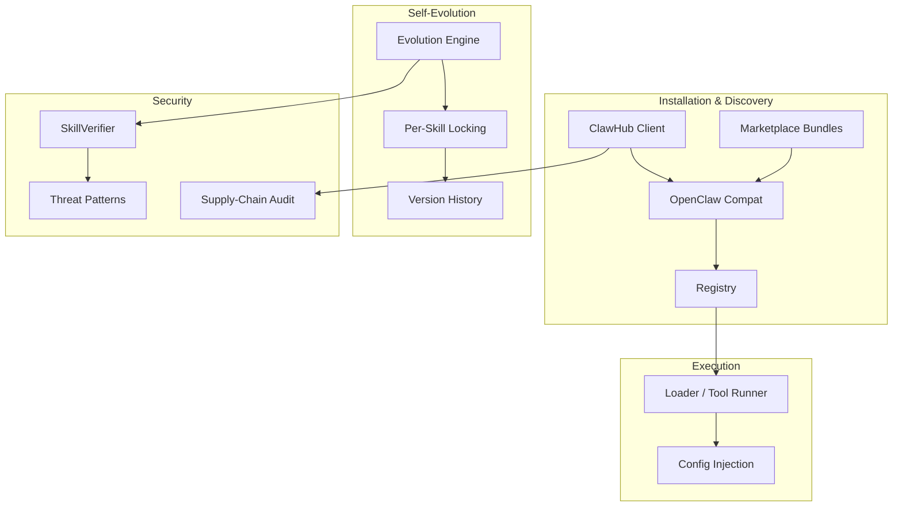
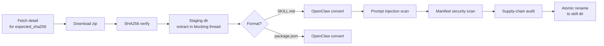

# crates — librefang-skills

# librefang-skills

Skill system for LibreFang — registry, loader, marketplace client, OpenClaw compatibility layer, and agent-driven self-evolution. This crate is the backbone of how skills are discovered, installed, executed, mutated, and secured.

## Architecture Overview



## Crate Layout

| Module | Responsibility |
|---|---|
| `clawhub` | ClawHub marketplace API client — search, browse, download, install with checksum validation |
| `marketplace` | Local marketplace bundle extraction with decompression-bomb guards |
| `openclaw_compat` | Detect and convert SKILL.md / package.json / OpenClaw skill formats to LibreFang manifests |
| `loader` | Execute skill tools (shell, Python), validate input/output against schemas, enforce env-var passthrough policy |
| `registry` | Track installed skills, manage enable/disable state, skill freezing |
| `evolution` | Agent-driven skill creation, fuzzy patching, version history, rollback, supporting-file management |
| `config_injection` | Collect `[[config_vars]]` declarations from enabled skills and resolve them into a system-prompt section |
| `verify` | `SkillVerifier` — prompt-injection scanning via Aho-Corasick threat patterns, manifest security scans |
| `supply_chain` | Scan skill directories for dangerous file types (`.pth`, etc.) before promotion |
| `http_client` | Shared reqwest builders with rustls TLS and optional dangerous verification bypass |

---

## ClawHub Marketplace Client (`clawhub`)

The `ClawHubClient` provides typed access to the ClawHub API (`https://clawhub.ai/api/v1`). All HTTP calls flow through `get_with_retry`, which handles rate-limit (429) and server-error (5xx) responses with exponential backoff and `Retry-After` header support.

### API Methods

| Method | Endpoint | Returns |
|---|---|---|
| `search(query, limit)` | `GET /search?q=...` | `ClawHubSearchResponse` (root key: `results`) |
| `browse(sort, limit, cursor)` | `GET /skills?sort=...` | `ClawHubBrowseResponse` (root key: `items`) |
| `get_skill(slug)` | `GET /skills/{slug}` | `ClawHubSkillDetail` with owner, version info, `expected_sha256` |
| `get_file(slug, path)` | `GET /skills/{slug}/file?path=...` | Raw file text |
| `install(slug, target_dir)` | `GET /download?slug=...` | `ClawHubInstallResult` |

### Retry Strategy

Constants governing retry behavior:

- **MAX_RETRIES**: 5 attempts (including the first)
- **BASE_DELAY_MS**: 1,500ms, doubled per attempt
- **MAX_DELAY_MS**: 30,000ms cap
- Jitter: 0–25% added via system-clock nanos to avoid thundering herd

The `Retry-After` header is respected (capped at `MAX_DELAY_MS`) when the server provides it.

### Installation Pipeline



Key design decisions in the install path:

- **Staging directory**: Content is extracted into `.staging-{slug}-{pid}-{seq}` and only atomically renamed to the final skill directory after all security checks pass. A partially downloaded or rejected skill never reaches the live skill directory.
- **Blocking extraction**: Zip decompression runs on `spawn_blocking` so the tokio worker is not stalled on unbounded I/O.
- **Decompression-bomb guards**: Archive entry count is capped at `marketplace::MAX_ENTRIES`, and per-entry uncompressed size is tracked via `write_zip_entry_capped`.
- **Checksum validation**: When the registry provides `expected_sha256`, the computed digest must match *before* any directories are created. A mismatch returns `SkillError::SecurityBlocked` immediately.
- **Supply-chain audit**: `supply_chain::scan()` runs as the final gate before promotion — e.g., `.pth` files trigger a `SecurityBlocked` error.

The `ClawHubInstallResult` includes all security warnings, tool name translations (OpenClaw → LibreFang), and whether the skill is prompt-only.

### TLS Configuration

By default, the client uses rustls with native CA roots. Setting the environment variable `LIBREFANG_DANGEROUSLY_SKIP_TLS_VERIFICATION=true` (or `1`) switches to the dangerous client builder — intended only for testing against servers with expired certificates.

---

## Skill Self-Evolution (`evolution`)

This module lets agents autonomously create, update, and refine skills based on execution experience. All mutations are:

- **Locked**: Per-skill exclusive file locks (`fs2` flock on Unix, LockFileEx on Windows) prevent concurrent corruption.
- **Atomic**: All writes go through temp-file-then-rename.
- **Versioned**: Every mutation records a version entry in `.evolution.json`.
- **Secured**: Prompt content and descriptions pass through `SkillVerifier::scan_prompt_content`.

### Core Operations

| Function | Purpose |
|---|---|
| `create_skill` | Create a new PromptOnly skill from scratch |
| `update_skill` | Full rewrite of `prompt_context.md` |
| `patch_skill` | Fuzzy find-and-replace within existing content |
| `delete_skill` | Remove agent-evolved skill (only `Local`/`Native` source) |
| `uninstall_skill` | User-initiated removal of any skill regardless of source |
| `rollback_skill` | Revert to a previous version snapshot |
| `write_supporting_file` | Write to `references/`, `templates/`, `scripts/`, or `assets/` |
| `remove_supporting_file` | Remove a supporting file and prune empty parent dirs |
| `record_skill_usage` | Increment use counter after successful tool invocation |

### Lock File Placement

Lock files live at `{skills_dir}/.evolution-locks/{skill_name}.lock` — *outside* the skill directory. This allows `delete_skill` and `uninstall_skill` to hold the lock across `remove_dir_all` on Windows, where open file handles inside a directory would block deletion.

### Atomic Writes

`atomic_write` generates unique temp filenames using pid, thread ID, a monotonic `AtomicU64` counter, and nanosecond timestamp. This prevents collisions even when multiple threads target the same final path.

### Version Management

- **`.evolution.json`**: Stores `versions` (max 10 entries), `use_count`, `evolution_count` (total version writes including create), and `mutation_count` (changes after create).
- **Rollback snapshots**: Stored in `.rollback/` with nanosecond-precision filenames; old snapshots are pruned to `MAX_VERSION_HISTORY`.
- **Version bumping**: `bump_patch_version` uses the `semver` crate, correctly handling pre-release tags and build metadata.

### Fuzzy Matching Strategies

`fuzzy_find_and_replace` tries six strategies in order (strict → loose) and reports which one succeeded:

1. **Exact** — literal substring match
2. **LineTrimmed** — per-line whitespace trimmed
3. **WhitespaceNormalized** — whitespace runs collapsed to single space
4. **IndentFlexible** — leading whitespace stripped from all lines
5. **BlockAnchor** — first+last line match, middle ≥60% similar
6. **WhitespaceStripped** — all whitespace removed (CJK-friendly fallback)

The `MatchStrategy` is returned in `EvolutionResult.match_strategy` so callers can distinguish strategies programmatically.

When all strategies fail, the error message includes the closest matching lines (by character-overlap similarity) so the agent can self-correct.

### Supporting File Constraints

- Allowed subdirectories: `references`, `templates`, `scripts`, `assets`
- Max file size: 1 MiB (`MAX_SUPPORTING_FILE_SIZE`)
- Path traversal (`..`), absolute paths, and symlink escapes are blocked
- Canonicalization verifies the resolved path stays within the skill directory

---

## Config Variable Injection (`config_injection`)

Skills declare configuration dependencies via `[[config_vars]]` in their `skill.toml`. This module collects, resolves, and formats those declarations for injection into the system prompt.

### Storage Convention

A logical key `wiki.base_url` is stored in `~/.librefang/config.toml` at:

```toml
[skills.config.wiki]
base_url = "https://wiki.corp.example.com"
```

### Resolution Flow

1. **`collect_config_vars(skills)`** — Gathers declarations from enabled skills, deduplicating by key (first wins). Incomplete entries (empty key or description) are silently skipped.

2. **`resolve_config_vars(vars, config_toml)`** — Walks the dotted path `skills.config.<logical-key>` through the TOML tree. Falls back to the declared `default` when the config value is absent or empty. Variables with neither value nor default are omitted.

3. **`format_config_section(resolved)`** — Produces:

```text
## Skill Config Variables
wiki.base_url = https://wiki.corp.example.com
db.host = localhost
```

Returns an empty string when there are no resolved vars, so callers can cheaply guard with `is_empty()`.

---

## Security Scanning (`verify`)

All evolution operations and marketplace installs route through `SkillVerifier`. The prompt-injection scanner (`scan_prompt_content`) uses pre-compiled Aho-Corasick threat patterns built by `build_threat_patterns`. A global `ScannerState` holds the compiled patterns for reuse.

Warnings carry a `WarningSeverity` level:
- **Critical** — blocks the operation entirely (`SkillError::SecurityBlocked`)
- **Warning** — recorded in the result but does not block

Every evolution entry point (`create_skill`, `update_skill`, `patch_skill`, `rollback_skill`, `write_supporting_file`) calls `validate_prompt_content` before writing, which enforces both size limits (160,000 chars ≈ 55k tokens) and the injection scan.

---

## Integration Points

### Callers from the Rest of the Codebase

- **Tool runner** (`src/tool_runner/skill.rs`): Exposes evolution operations as agent tools — `create`, `update`, `patch`, `rollback`, `delete`, `write_file`, `remove_file`. Each tool calls `load_installed_skill_from_disk` to get a fresh skill snapshot before mutating.
- **Tool dispatch** (`src/tool_runner/dispatch.rs`): Calls `execute_skill_tool` from the loader and `record_skill_usage` after successful execution.
- **Skill workshop** (`src/skill_workshop/storage.rs`): Uses `create_skill` and `update_skill` to promote approved candidate skills.
- **Background skill review** (`src/kernel/tools_and_skills.rs`): Autonomous patching via `fuzzy_find_and_replace` and `update_skill`.
- **HTTP routes** (`src/routes/skills/clawhub.rs`): ClawHub browse/search/detail use `ClawHubClient::with_url` to support regional mirrors.
- **Kernel controlled evolution** (`src/kernel/tests.rs`): `update_skill` for the controlled evolution path with proposed version tracking.
- **Injection guard** (`librefang-runtime/src/injection_guard.rs`): Calls `scan_prompt_content` on tool execution results.
- **Registry checks** (`src/tool_runner/skill.rs`): `is_frozen` from the registry gates whether evolution operations are permitted on a skill.

### Dependencies on Other Crates

- **librefang-types**: Capability types (`glob_matches` for env-var passthrough policy)
- **librefang-hands**: TLS provider for `http_client::client_builder`
- **librefang-runtime**: File I/O primitives (used transitively)
- **librefang-subprocess**: Process spawning in evolution concurrency tests