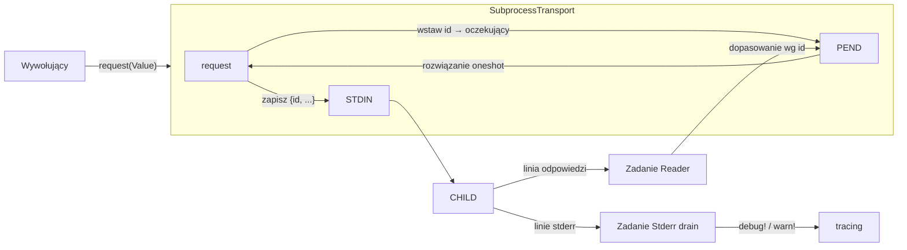

# crates — librefang-subprocess

# librefang-subprocess

Trwały transport podprocesowy JSON-over-stdio dla mostków typu sidecar w LibreFang. Zarządza cyklem życia długotrwałego procesu potomnego i realizuje protokół żądań/odpowiedzi w formacie JSON oddzielony znakami nowej linii, z dopasowywaniem identyfikatorów, ograniczonym odczytem i zapisem, przekierowaniem stderr oraz (opcjonalnie) automatycznym ponownym uruchamianiem po awariach.

Ten crate znajduje się na samym dole grafu zależności LibreFang — poniżej `librefang-channels` i `librefang-runtime` — i nie zależy od żadnego innego crate'u `librefang-*`.

---

## Przeznaczenie

Każdy mostek sidecar w LibreFang (silnik kontekstu, ekstraktor proaktywnej pamięci itp.) re-implementował tę samą infrastrukturę: uruchomienie procesu potomnego, odczyt odpowiedzi w tle, dopasowanie ich do oczekujących żądań, obsługa zakleszczeń bufora potoku, przekierowanie stderr i odzyskanie procesu potomnego. Ten crate konsoliduje te zagadnienia w dwóch warstwach:

- **`SubprocessTransport`** — jeden proces potomny, żądania/odpowiedzi z dopasowaniem identyfikatorów, martwy po zakończeniu procesu potomnego.
- **`SupervisedTransport`** — opakowuje `SubprocessTransport` z leniwym uruchamianiem i odzyskiwaniem po awariach.

---

## Protokół transmisji

Protokół jest celowo minimalny. Wywołujący dostarcza obiekt JSON; transport wstrzykuje `id` przed zapisem.

**Żądanie (daemon → proces potomny):**
```json
{"id": 3, "method": "summarize", "args": {...}}
```

**Odpowiedź (proces potomny → daemon):**
```json
{"id": 3, "ok": {"summary": "..."}}
```
lub
```json
{"id": 3, "error": "context window exceeded"}
```

Linie to UTF-8 zakończone `\n`. `id` to automatycznie przyrastający `u64` zaczynający się od 1; proces potomny musi odesłać go dosłownie bez zmian.

---

## Architektura



Dwa zadania w tle tokio są uruchamiane dla każdego `SubprocessTransport`:

1. **Zadanie Reader** — odczytuje linie oddzielone znakami nowej linii ze stdout procesu potomnego za pomocą `read_capped_line`, parsuje każdą jako JSON, wyodrębnia `id` i rozwiązuje pasującego oczekującego żądania przez jego kanał `oneshot`.
2. **Zadanie Stderr drain** — odczytuje stderr procesu potomnego linia po linii i przekazuje każdą linię do `tracing` na poziomie `debug` pod tagiem `subprocess_transport`.

Oba zadania kończą się przy EOF, błędzie odczytu lub linii przekraczającej limit. Gdy zadanie Reader się kończy, oznacza transport jako martwy i czyści wszystkich oczekujących żądań (opuszczając ich nadawców, co rozwiązuje wywołujących jako `TransportError::Dead`).

---

## Dwie warstwy

### SubprocessTransport

Surowy transport. Tworzony za pomocą `SubprocessTransport::spawn(TransportConfig)`. Kluczowe właściwości:

- **Współdzielony przez `Arc`** — blokada `stdin` serializuje zapisy, ale oczekujące żądania są dopasowywane współbieżnie, więc wielu wywołujących może wydawać żądania równolegle.
- **`kill_on_drop`** — uchwyt do procesu potomnego jest przechowywany wewnątrz transportu; opuszczenie go zabija i odzyskuje proces potomny.
- **`is_alive()`** — zwraca `false` po tym, jak zadanie Reader zaobserwuje EOF, błąd odczytu lub linię przekraczającą limit.

#### `request`

```rust
pub async fn request(&self, request: Value) -> Result<Value, TransportError>
```

Weryfikuje, czy żądanie jest obiektem JSON, wstrzykuje `id`, rejestruje oczekującego żądania `oneshot`, zapisuje linię i oczekuje na pasującą odpowiedź. Ten sam `request_timeout` ogranicza **zarówno** zapis, jak i oczekiwanie na odpowiedź.

### SupervisedTransport

Opakowuje `SubprocessTransport` dla wywołujących, którzy chcą odporności. Tworzony za pomocą `SupervisedTransport::new` (domyślny cooldown 5s) lub `with_cooldown`.

- **Leniwe uruchamianie** — nic nie jest uruchamiane do pierwszego `request`. Konstrukcja nigdy nie kończy się niepowodzeniem.
- **Ponowne uruchamianie po awarii** — jeśli wewnętrzny transport jest martwy, następne żądanie uruchamia nowy proces potomny.
- **Bramka cooldown** — `respawn_cooldown` (domyślnie 5s) ogranicza częstotliwość prób uruchamiania, aby stale uszkodzona komenda nie mogła wywołać burzy uruchomień. Żądania trafiające w oknie cooldown zwracają natychmiast `TransportError::Dead`.
- **Serializowane uruchamianie, współbieżne żądania** — `ensure_live` trzyma `tokio::Mutex` tylko dla sprawdzenia żywotności i uruchomienia; właściwe żądanie jest realizowane na sklonowanym `Arc<SubprocessTransport>` poza blokadą.

---

## Mechanizmy bezpieczeństwa

### Ograniczone linie odpowiedzi

Linie odpowiedzi są odczytywane przez `read_capped_line`, który ogranicza akumulację do `max_reply_line_bytes` (domyślnie 16 MiB). Wadliwy proces potomny, który strumieniuje bajty bez znaku nowej linii, nie może powiększać pamięci w sposób nieograniczony. Linia przekraczająca limit kończy działanie transportu — od wywołujących oczekuje się powrotu do ścieżki wewnątrzprocesowej.

### Zapisy ograniczone timeout'em

Sam zapis (nie tylko oczekiwanie na odpowiedź) jest opakowany w `tokio::time::timeout`. Proces potomny, który przestaje odczytywać swój stdin, zapycha bufor potoku systemu operacyjnego, a nieograniczony `write_all` blokowałby na zawsze, trzymając blokadę stdin. Po przekroczeniu timeout'u zapisu transport oznacza się jako martwy.

### Stderr drain z własnym limitem

Stderr jest opróżniany przez tę samą prymityw `read_capped_line` z limitem 64 KiB na linię. Linia stderr przekraczająca limit porzuca opróżnianie zamiast buforować w nieskończoność.

### Odzyskiwanie procesu potomnego

Proces potomny jest uruchamiany z `kill_on_drop(true)`, a uchwyt `Child` jest przechowywany wewnątrz transportu. Opuszczenie transportu zabija i odzyskuje proces.

---

## Model błędów

`TransportError` rozróżnia tryby awarii, aby wywołujący mogli zdecydować, jak się odzyskać (zazwyczaj: powrót do wbudowanej ścieżki).

| Wariant | Znaczenie | Podpowiedź odzyskania |
|---|---|---|
| `Dead` | Proces potomny zakończył się lub nigdy nie został uruchomiony; zadanie Reader wyczyściło oczekujących żądania | Ponów przez `SupervisedTransport` lub zastosuj powrót |
| `Timeout(Duration)` | Zapis lub oczekiwanie na odpowiedź przekroczyło `request_timeout` | Można ponowić; może wskazywać na wolny lub zablokowany proces potomny |
| `Remote(String)` | Proces potomny odpowiedział `{"error": "..."}` | Proces potomny żyje; wyświetl lub zaloguj błąd |
| `BadRequest` | Żądanie nie było obiektem JSON | Błąd wywołującego; napraw punkt wywołania |

Kluczowa różnica semantyczna: gdy zadanie Reader się wyłącza, ono **opuszcza** oczekujących nadawców zamiast wysyłać ciąg błędu. To rozwiązuje oczekujące żądania jako `Dead` (proces zmarł) zamiast `Remote` (proces potomny zwrócił błąd), utrzymując te przypadki czysto rozdzielonymi.

---

## Obserwowalność

- **`tracing`** — zdarzenia uruchomienia, zakończenia i odrzuconych odpowiedzi są logowane. Linie stderr są przekazywane na poziomie `debug` pod tagiem `subprocess_transport`.
- **`metrics`** — licznik `subprocess_transport_exited` (z tagiem `label`) zwiększa się przy każdym zakończeniu procesu potomnego, co ujawnia przejściowe awarie sidecar operatorom, którzy w przeciwnym razie widzieliby tylko ciche powroty wywołujących.

---

## Odniesienie do kluczowych typów

| Typ | Rola |
|---|---|
| `TransportConfig` | Komenda, argumenty, timeout, limit linii, etykieta |
| `SubprocessTransport` | Surowy transport jednego procesu potomnego |
| `SupervisedTransport` | Odporna otoka z leniwym uruchamianiem + cooldown |
| `TransportError` | Enum błędów dla wszystkich trybów awarii |
| `read_capped_line` | Ograniczony czytnik linii (wymaga `AsyncBufRead`) |
| `write_line_timeout` | Samodzielny zapisywacz stdin ograniczony timeout'em |
| `Line` | Enum wyniku z `read_capped_line` (`Data`, `Eof`, `TooLong`) |

---

## Narzędzia niskopoziomowe

### `read_capped_line`

```rust
pub async fn read_capped_line<R: tokio::io::AsyncBufRead + Unpin>(
    reader: &mut R,
    buf: &mut Vec<u8>,
    max: usize,
) -> std::io::Result<Line>
```

Odczytuje jedną linię zakończoną `\n` do należącego do wywołującego `buf`, ograniczając akumulację do `max` bajtów. Wiązanie `AsyncBufRead` jest celowe: wywołanie tego na niebuforowanym `AsyncRead` powodowałoby jeden wywołanie systemowe na bajt. Częściowa linia przy EOF jest zwracana jako `Line::Data` — nadrzędny `serde_json::from_str` odrzuci obcięty ładunek, więc nigdy nie jest to cicha korupcja danych.

### `write_line_timeout`

```rust
pub async fn write_line_timeout(
    stdin: &mut ChildStdin,
    line: &[u8],
    timeout: Duration,
) -> std::io::Result<()>
```

Samodzielny pomocnik dla wzorca zapisu ograniczonego timeout'em. `line` powinien już zawierać końcowe `\n`.

---

## Użycie

```rust
use librefang_subprocess::{SupervisedTransport, TransportConfig};
use serde_json::json;
use std::time::Duration;

let cfg = TransportConfig::new(
    "context-engine",
    vec!["--mode".into(), "json".into()],
    Duration::from_secs(30),
    "context_engine",
);

let transport = SupervisedTransport::new(cfg);

// Leniwe: proces potomny uruchamia się przy pierwszym żądaniu.
let reply = transport.request(json!({
    "method": "summarize",
    "context": "..."
})).await?;
```

Dla jednorazowego, nieodpornego połączenia użyj bezpośrednio `SubprocessTransport::spawn`.

---

## Punkty integracji

Konsumentami wewnątrz drzewa źródłowego są silnik kontekstu (`docs/architecture/sidecar-context-engine.md`) oraz ekstraktor proaktywnej pamięci. Crate jest wciągany transitywnie przez `librefang-channels` i `librefang-runtime`, które używają go (bezpośrednio lub przez `SupervisedTransport`) do komunikacji z procesami sidecar.

Przepływy wykonania docierające do tego crate'u obejmują uruchamianie agenta w tle (`start_background_agents`) oraz uruchamianie agenta (`spawn_agent_inner`), z których oba ostatecznie konstruują `SupervisedTransport` przez `with_cooldown` i, przy pierwszym użyciu, wyzwalają `SubprocessTransport::spawn` oraz jego zadania w tle reader/stderr.
