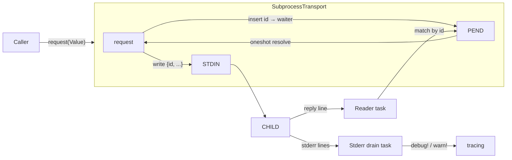

# crates — librefang-subprocess

# librefang-subprocess

Persistent JSON-over-stdio subprocess transport for LibreFang's sidecar bridges. Owns the lifecycle of a long-lived child process and implements a newline-delimited JSON request/reply protocol with id matching, bounded reads and writes, stderr forwarding, and (optionally) automatic re-spawning after crashes.

This crate sits at the bottom of LibreFang's dependency graph — below `librefang-channels` and `librefang-runtime` — and depends on no other `librefang-*` crate.

---

## Purpose

Every sidecar bridge in LibreFang (context engine, proactive-memory extractor, etc.) was re-implementing the same plumbing: spawn a child, read replies in the background, match them to waiters, handle pipe-buffer deadlocks, forward stderr, and reap the child. This crate consolidates those concerns into two layers:

- **`SubprocessTransport`** — one child, id-matched request/reply, dead once the child exits.
- **`SupervisedTransport`** — wraps `SubprocessTransport` with lazy spawn and crash-recovery.

---

## Wire Protocol

The protocol is deliberately minimal. The caller supplies a JSON object; the transport injects an `id` before writing.

**Request (daemon → child):**
```json
{"id": 3, "method": "summarize", "args": {...}}
```

**Reply (child → daemon):**
```json
{"id": 3, "ok": {"summary": "..."}}
```
or
```json
{"id": 3, "error": "context window exceeded"}
```

Lines are `\n`-terminated UTF-8. The `id` is an auto-incrementing `u64` starting at 1; the child must echo it back verbatim.

---

## Architecture



Two background tokio tasks are spawned per `SubprocessTransport`:

1. **Reader task** — reads newline-delimited lines from the child's stdout via `read_capped_line`, parses each as JSON, extracts the `id`, and resolves the matching pending waiter through its `oneshot` channel.
2. **Stderr drain task** — reads the child's stderr line-by-line and forwards each line to `tracing` at `debug` level under the `subprocess_transport` target.

Both tasks terminate on EOF, a read error, or an over-cap line. When the reader task ends, it marks the transport dead and clears all pending waiters (dropping their senders, which resolves callers as `TransportError::Dead`).

---

## Two Layers

### SubprocessTransport

The raw transport. Created via `SubprocessTransport::spawn(TransportConfig)`. Key properties:

- **Shared behind `Arc`** — the `stdin` lock serializes writes but pending waiters are matched concurrently, so multiple callers can issue requests in parallel.
- **`kill_on_drop`** — the child handle is retained inside the transport; dropping it kills and reaps the child.
- **`is_alive()`** — returns `false` after the reader task observes EOF, a read error, or an over-cap line.

#### `request`

```rust
pub async fn request(&self, request: Value) -> Result<Value, TransportError>
```

Validates the request is a JSON object, injects an `id`, registers a `oneshot` waiter, writes the line, and awaits the matching reply. The same `request_timeout` bounds **both** the write and the reply wait.

### SupervisedTransport

Wraps `SubprocessTransport` for callers that want resilience. Created via `SupervisedTransport::new` (5s default cooldown) or `with_cooldown`.

- **Lazy spawn** — nothing is spawned until the first `request`. Construction never fails.
- **Re-spawn on crash** — if the inner transport is dead, the next request spawns a fresh child.
- **Cooldown gate** — a `respawn_cooldown` (default 5s) rate-limits spawn attempts so a persistently-broken command can't spawn-storm. Requests landing inside the cooldown window return `TransportError::Dead` immediately.
- **Serialized spawn, concurrent requests** — `ensure_live` holds a `tokio::Mutex` only for the liveness check and spawn; the actual request runs on a cloned `Arc<SubprocessTransport>` outside the lock.

---

## Safety Mechanisms

### Bounded reply lines

Reply lines are read through `read_capped_line`, which caps accumulation at `max_reply_line_bytes` (default 16 MiB). A buggy child that streams bytes without a newline cannot grow memory without bound. An over-cap line terminates the transport — callers are expected to fall back to an in-process path.

### Timeout-bounded writes

The write itself (not just the reply wait) is wrapped in `tokio::time::timeout`. A child that stops reading its stdin fills the OS pipe buffer, and an unbounded `write_all` would block forever while holding the stdin lock. On write timeout, the transport marks itself dead.

### Stderr drain with its own cap

Stderr is drained through the same `read_capped_line` primitive with a 64 KiB per-line cap. An over-cap stderr line drops the drain rather than buffering indefinitely.

### Child reaping

The child is spawned with `kill_on_drop(true)`, and the `Child` handle is stored inside the transport. Dropping the transport kills and reaps the process.

---

## Error Model

`TransportError` distinguishes failure modes so callers can decide how to recover (typically: fall back to a built-in path).

| Variant | Meaning | Recovery hint |
|---|---|---|
| `Dead` | Child exited or never spawned; reader task cleared waiters | Retry via `SupervisedTransport`, or fall back |
| `Timeout(Duration)` | Write or reply wait exceeded `request_timeout` | Retryable; may indicate a slow or wedged child |
| `Remote(String)` | Child replied `{"error": "..."}` | Child is alive; surface or log the error |
| `BadRequest` | Request was not a JSON object | Caller bug; fix the call site |

A key semantic distinction: when the reader task shuts down, it **drops** pending senders rather than sending an error string. This resolves waiters as `Dead` (process died) rather than `Remote` (child returned an error), keeping those cases cleanly separable.

---

## Observability

- **`tracing`** — spawn, exit, and dropped-reply events are logged. Stderr lines are forwarded at `debug` level under target `subprocess_transport`.
- **`metrics`** — `subprocess_transport_exited` counter (tagged with `label`) increments on every child exit, making transient sidecar failures visible to operators who might otherwise only see callers falling back silently.

---

## Key Types Reference

| Type | Role |
|---|---|
| `TransportConfig` | Command, args, timeout, line cap, label |
| `SubprocessTransport` | Raw one-child transport |
| `SupervisedTransport` | Resilient wrapper with lazy spawn + cooldown |
| `TransportError` | Error enum for all failure modes |
| `read_capped_line` | Bounded line reader (requires `AsyncBufRead`) |
| `write_line_timeout` | Standalone timeout-bounded stdin writer |
| `Line` | Outcome enum from `read_capped_line` (`Data`, `Eof`, `TooLong`) |

---

## Low-Level Utilities

### `read_capped_line`

```rust
pub async fn read_capped_line<R: tokio::io::AsyncBufRead + Unpin>(
    reader: &mut R,
    buf: &mut Vec<u8>,
    max: usize,
) -> std::io::Result<Line>
```

Reads one `\n`-terminated line into the caller-owned `buf`, capping accumulation at `max` bytes. The `AsyncBufRead` bound is intentional: calling this on an unbuffered `AsyncRead` would issue one syscall per byte. A partial line at EOF is returned as `Line::Data` — downstream `serde_json::from_str` will reject the truncated payload, so this is never silent corruption.

### `write_line_timeout`

```rust
pub async fn write_line_timeout(
    stdin: &mut ChildStdin,
    line: &[u8],
    timeout: Duration,
) -> std::io::Result<()>
```

Standalone helper for the timeout-bounded write pattern. The `line` should already include any trailing `\n`.

---

## Usage

```rust
use librefang_subprocess::{SupervisedTransport, TransportConfig};
use serde_json::json;
use std::time::Duration;

let cfg = TransportConfig::new(
    "context-engine",
    vec!["--mode".into(), "json".into()],
    Duration::from_secs(30),
    "context_engine",
);

let transport = SupervisedTransport::new(cfg);

// Lazy: child spawns on first request.
let reply = transport.request(json!({
    "method": "summarize",
    "context": "..."
})).await?;
```

For a single-use, non-resilient connection, use `SubprocessTransport::spawn` directly.

---

## Integration Points

In-tree consumers include the context engine (`docs/architecture/sidecar-context-engine.md`) and the proactive-memory extractor. The crate is pulled in transitively by `librefang-channels` and `librefang-runtime`, which use it (directly or via `SupervisedTransport`) to talk to sidecar processes.

Execution flows that reach this crate include background agent startup (`start_background_agents`) and agent spawn (`spawn_agent_inner`), both of which ultimately construct a `SupervisedTransport` via `with_cooldown` and, on first use, trigger `SubprocessTransport::spawn` and its background reader/stderr tasks.