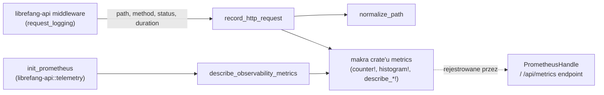

# crates — librefang-telemetry

# librefang-telemetry

Centralizowana instrumentacja metryk OpenTelemetry + Prometheus dla LibreFang Agent OS. Ten crate dostarcza cienki, ukierunkowany wrapper wokół makr rejestrujących z crate'u `metrics`, eksponując małe publiczne API, którego reszta kodu — przede wszystkim `librefang-api` — używa do rejestrowania telemetrii żądań HTTP i deklarowania opisów metryk dla eksportera Prometheus.

## Cel i zakres

Crate ma trzy odpowiedzialności:

1. **Normalizacja ścieżek** — zwijanie dynamicznych segmentów ścieżki (UUID-e, hasze hex) do `{id}` w celu zapobieżenia nieograniczonej kardynalności etykiet w Prometheusie.
2. **Rejestrowanie żądań HTTP** — emisja metryk licznikowych i histogramowych dla każdego żądania API.
3. **Rejestracja opisów metryk** — deklarowanie metadanych `# HELP` / `# TYPE` dla wszystkich metryk obserwowalności, aby eksporter Prometheus generował samodokumentujący wynik.

Crate jest celowo minimalistyczny. **Nie** instaluje rejestratora ani nie posiada `PrometheusHandle`. Instalacja rejestratora i renderowanie odbywają się w `crates/librefang-api/src/telemetry.rs`.

## Architektura



Crate `metrics` pełni rolę fasady. Zarówno `record_http_request`, jak i `describe_observability_metrics` delegują do jego makr, a dane przepływają przez dowolny rejestrator, który `init_prometheus` zainstalował globalnie.

## Struktura modułów

| Moduł | Zawartość |
|---|---|
| `config` | Re-eksportuje `TelemetryConfig` z `librefang-types::config` dla wygody importu. |
| `metrics` | Wszystkie publiczne funkcje telemetrii: normalizacja ścieżek, rejestrowanie żądań, opisy metryk. |

## Publiczne API

### `normalize_path(path: &str) -> String`

Normalizuje ścieżkę HTTP, zastępując segmenty dynamiczne ciągiem `{id}`. Jest to mechanizm kontrolujący kardynalność, który utrzymuje zbiór etykiet Prometheus w granicach.

Funkcja dzieli ścieżkę po `/` i przechodzi po segmentach od lewej do prawej. Dla każdego nie-strukturalnego segmentu (`api`, `v1`, `v2`, `a2a` są zachowywane bez zmian) sprawdza, czy *następujący* segment jest dynamicznym identyfikatorem. Jeśli tak, następujący segment jest zastępowany ciągiem `{id}`.

**Co jest zwijane:**
- Standardowe UUID-e (`xxxxxxxx-xxxx-xxxx-xxxx-xxxxxxxxxxxx`)
- Czyste ciągi hex o długości od 8 do 64 znaków (hasze SHA-256, krótkie identyfikatory hex)

**Co NIE jest zwijane:**
- Słowa z myślnikami, takie jak `well-known` lub `my-agent`
- Krótkie ciągi (`abc`)
- Parametry tras typu free-text (`my-fancy-alias`)

Ten ostatni punkt jest znanym ograniczeniem projektowym: `normalize_path` nie może wykryć parametrów free-text. Middleware musi normalizować względem **szablonu** dopasowanej trasy (np. `/api/models/aliases/{alias}`), a nie względem konkretnego URI, aby uniknąć nieograniczonej kardynalności etykiet. Funkcja jest operacją no-op na ścieżkach, które już zawierają symbole zastępcze `{...}`.

```rust
use librefang_telemetry::normalize_path;

// UUID zwinięty
assert_eq!(
    normalize_path("/api/agents/550e8400-e29b-41d4-a716-446655440000/message"),
    "/api/agents/{id}/message"
);

// Hash hex zwinięty
assert_eq!(
    normalize_path("/api/agents/deadbeef01234567/message"),
    "/api/agents/{id}/message"
);

// Słowo z myślnikami zachowane
assert_eq!(
    normalize_path("/api/my-agent/status"),
    "/api/my-agent/status"
);

// Istniejący szablon przechodzi bez zmian
assert_eq!(
    normalize_path("/api/memory/agents/{id}/kv/{key}"),
    "/api/memory/agents/{id}/kv/{key}"
);
```

### `record_http_request(path: &str, method: &str, status: u16, duration: Duration)`

Główny punkt wejścia dla telemetrii HTTP. Wywoływany przez middleware logowania żądań w `librefang-api` po zakończeniu każdego żądania. Funkcja:

1. Normalizuje ścieżkę za pomocą `normalize_path`.
2. Zwiększa licznik `librefang_http_requests_total` z etykietami `method`, `path` i `status`.
3. Zapisuje `duration` w histogramie `librefang_http_request_duration_seconds` z etykietami `method` i `path`.

Oba wywołania przechodzą przez makra `counter!` i `histogram!` z crate'u `metrics`, więc dane trafiają do dowolnego zainstalowanego globalnie rejestratora.

### `describe_observability_metrics()`

Rejestruje opisy `# HELP` i `# TYPE` dla wszystkich metryk obserwowalności. Wywoływane raz przez `init_prometheus` w `librefang-api::telemetry` po zainstalowaniu rejestratora. Funkcja jest idempotentna — rejestrator deduplikuje powtórzone rejestracje.

Obsługiwane metryki:

| Metryka | Typ | Etykiety | Przeznaczenie |
|---|---|---|---|
| `librefang_http_requests_total` | licznik | method, path, status | Łączna liczba żądań API |
| `librefang_http_request_duration_seconds` | histogram (sekundy) | method, path | Opóźnienie czasowe żądania |
| `librefang_queue_wait_seconds` | histogram (sekundy) | — | Czas oczekiwania na permit w pasie CommandQueue |
| `librefang_mcp_reconnect_total` | licznik | server id, outcome | Próby ponownego połączenia z serwerem MCP |
| `librefang_llm_provider_errors_total` | licznik | provider, status | Błędy odpowiedzi dostawcy LLM |
| `librefang_tool_call_total` | licznik | agent, tool, outcome | Wywołania narzędzi z pętli agenta |
| `librefang_cron_fires_total` | licznik | agent, outcome | Wyniki wykonania zadań cron |
| `librefang_cron_auto_disabled_total` | licznik | agent | Zadania automatycznie wyłączone po przekroczeniu progów awarii |
| `librefang_media_understanding_failures_total` | licznik | kind, provider, model | Awarie Vision/STT wg dostawcy/modelu |

### `get_http_metrics_summary() -> String`

Warstwa zgodności wstecznej (legacy shim). Wynik Prometheus jest teraz renderowany bezpośrednio z `PrometheusHandle` w obsłudze trasy `/api/metrics`. Ta funkcja zwraca ciąg komentarza wyjaśniający, gdzie znaleźć właściwy wynik. Nowy kod powinien używać `PrometheusHandle` bezpośrednio.

## Kontrola kardynalności: dlaczego normalizacja ścieżek ma znaczenie

Nieograniczona kardynalność etykiet to najczęstszy sposób cichego pogorszenia wydajności wdrożenia Prometheus. Jeśli każdy unikalny UUID lub hash w ścieżce staje się osobną wartością etykiety, magazyn metryk rośnie bez granic, a zapytania stają się wolne lub bezużyteczne.

`normalize_path` rozwiązuje ten problem dla identyfikatorów strukturalnych (UUID-e i hasze hex). Funkcja jest jednak celowo konserwatywna: nie próbuje wykrywać parametrów free-text. Pakiet testowy jawnie pilnuje tego zachowania — funkcja `normalize_path` wygeneruje różne etykiety dla `/api/models/aliases/alias-a` i `/api/models/aliases/alias-b`.

Prawidłowym wzorcem jest przekazywanie przez middleware **dopasowanego szablonu trasy** (np. `MatchedPath` z Axuma) do `record_http_request`, a nie konkretnego URI żądania. Gdy przekazany jest szablon taki jak `/api/models/aliases/{alias}`, `normalize_path` jest operacją no-op, a zbiór etykiet pozostaje ograniczony niezależnie od tego, ile różnych aliasów istnieje.

## Punkty integracji

- **`librefang-api::middleware::request_logging`** — wywołuje `record_http_request` po zakończeniu każdego żądania.
- **`librefang-api::telemetry::init_prometheus`** — instaluje globalny rejestrator, a następnie wywołuje `describe_observability_metrics` w celu rejestracji opisów metryk.
- **`librefang-types::config::TelemetryConfig`** — kanoniczna struktura konfiguracyjna, re-eksportowana z modułu `config` tego crate'u dla wygody.

## Zależności

| Zależność | Relacja |
|---|---|
| `metrics` | Crate fasady dostarczający makra `counter!`, `histogram!` i `describe_*!`. |
| `librefang-types` | Dostarcza `TelemetryConfig` i inne wspólne definicje typów. |

Żadne zewnętrzne biblioteki klienta HTTP lub Prometheus nie są bezpośrednio dołączane — te zagadnienia są obsługiwane przez `librefang-api`.
