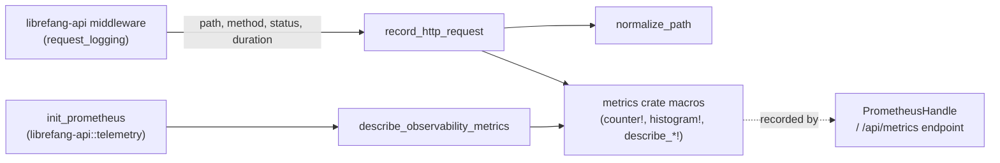

# crates — librefang-telemetry

# librefang-telemetry

Centralized OpenTelemetry + Prometheus metrics instrumentation for the LibreFang Agent OS. This crate provides a thin, focused wrapper around the `metrics` crate's recording macros, exposing a small public API that the rest of the codebase—primarily `librefang-api`—uses to record HTTP request telemetry and register metric descriptions for the Prometheus exporter.

## Purpose and Scope

The crate has three responsibilities:

1. **Path normalization** — collapse dynamic path segments (UUIDs, hex hashes) into `{id}` to prevent unbounded label cardinality in Prometheus.
2. **HTTP request recording** — emit counter and histogram metrics for every API request.
3. **Metric description registration** — declare `# HELP` / `# TYPE` metadata for all observability metrics so the Prometheus exporter produces self-documenting output.

The crate is intentionally minimal. It does **not** install a recorder or own the `PrometheusHandle`. Recorder installation and rendering live in `crates/librefang-api/src/telemetry.rs`.

## Architecture



The `metrics` crate acts as a facade. Both `record_http_request` and `describe_observability_metrics` delegate to its macros, and the data flows through whichever recorder `init_prometheus` has installed globally.

## Module Structure

| Module | Contents |
|---|---|
| `config` | Re-exports `TelemetryConfig` from `librefang-types::config` for import convenience. |
| `metrics` | All public telemetry functions: path normalization, request recording, metric descriptions. |

## Public API

### `normalize_path(path: &str) -> String`

Normalizes an HTTP path by replacing dynamic segments with `{id}`. This is the cardinality-control mechanism that keeps Prometheus label sets bounded.

The function splits the path on `/` and walks the segments left-to-right. For each non-structural segment (`api`, `v1`, `v2`, `a2a` are preserved as-is), it checks whether the *following* segment is a dynamic identifier. If so, that following segment is replaced with `{id}`.

**What gets collapsed:**
- Standard UUIDs (`xxxxxxxx-xxxx-xxxx-xxxx-xxxxxxxxxxxx`)
- Pure hex strings between 8 and 64 characters (SHA-256 hashes, short hex IDs)

**What is NOT collapsed:**
- Hyphenated words like `well-known` or `my-agent`
- Short strings (`abc`)
- Free-text route parameters (`my-fancy-alias`)

This last point is a known design constraint: `normalize_path` cannot detect free-text parameters. The middleware must normalize against the matched route **template** (e.g., `/api/models/aliases/{alias}`) rather than the concrete URI to avoid unbounded label cardinality. The function is a no-op on paths that already contain `{...}` placeholders.

```rust
use librefang_telemetry::normalize_path;

// UUID collapsed
assert_eq!(
    normalize_path("/api/agents/550e8400-e29b-41d4-a716-446655440000/message"),
    "/api/agents/{id}/message"
);

// Hex hash collapsed
assert_eq!(
    normalize_path("/api/agents/deadbeef01234567/message"),
    "/api/agents/{id}/message"
);

// Hyphenated word preserved
assert_eq!(
    normalize_path("/api/my-agent/status"),
    "/api/my-agent/status"
);

// Existing template passes through unchanged
assert_eq!(
    normalize_path("/api/memory/agents/{id}/kv/{key}"),
    "/api/memory/agents/{id}/kv/{key}"
);
```

### `record_http_request(path: &str, method: &str, status: u16, duration: Duration)`

Main entry point for HTTP telemetry. Called by the request-logging middleware in `librefang-api` after every request completes. It:

1. Normalizes the path via `normalize_path`.
2. Increments the `librefang_http_requests_total` counter with labels `method`, `path`, and `status`.
3. Records `duration` into the `librefang_http_request_duration_seconds` histogram with labels `method` and `path`.

Both calls go through the `metrics` crate's `counter!` and `histogram!` macros, so the data reaches whichever recorder is installed globally.

### `describe_observability_metrics()`

Registers `# HELP` and `# TYPE` descriptions for all observability metrics. Called once by `init_prometheus` in `librefang-api::telemetry` after the recorder is installed. The function is idempotent—the recorder dedupes repeated registrations.

Metrics covered:

| Metric | Type | Labels | Purpose |
|---|---|---|---|
| `librefang_http_requests_total` | counter | method, path, status | Total API requests |
| `librefang_http_request_duration_seconds` | histogram (seconds) | method, path | Request wall-clock latency |
| `librefang_queue_wait_seconds` | histogram (seconds) | — | CommandQueue lane permit wait time |
| `librefang_mcp_reconnect_total` | counter | server id, outcome | MCP server reconnect attempts |
| `librefang_llm_provider_errors_total` | counter | provider, status | LLM provider error responses |
| `librefang_tool_call_total` | counter | agent, tool, outcome | Tool invocations from agent loop |
| `librefang_cron_fires_total` | counter | agent, outcome | Cron job execution outcomes |
| `librefang_cron_auto_disabled_total` | counter | agent | Jobs auto-disabled after failure thresholds |
| `librefang_media_understanding_failures_total` | counter | kind, provider, model | Vision/STT failures by provider/model |

### `get_http_metrics_summary() -> String`

Legacy compatibility shim. The Prometheus output is now rendered directly from the `PrometheusHandle` in the `/api/metrics` route handler. This function returns a comment string explaining where to find the real output. New code should use the `PrometheusHandle` directly.

## Cardinality Control: Why Path Normalization Matters

Unbounded label cardinality is the most common way to silently degrade a Prometheus deployment. If every unique UUID or hash in a path becomes its own label value, the metrics store grows without limit and queries become slow or useless.

`normalize_path` addresses this for structured identifiers (UUIDs and hex hashes). However, it is deliberately conservative: it does not attempt to detect free-text parameters. The test suite explicitly guards this behavior—the `normalize_path` function will produce different labels for `/api/models/aliases/alias-a` and `/api/models/aliases/alias-b`.

The correct pattern is for the middleware to pass the **matched route template** (e.g., Axum's `MatchedPath`) to `record_http_request`, not the concrete request URI. When a template like `/api/models/aliases/{alias}` is passed, `normalize_path` is a no-op and the label set stays bounded regardless of how many distinct aliases exist.

## Integration Points

- **`librefang-api::middleware::request_logging`** — Calls `record_http_request` after every request completes.
- **`librefang-api::telemetry::init_prometheus`** — Installs the global recorder, then calls `describe_observability_metrics` to register metric descriptions.
- **`librefang-types::config::TelemetryConfig`** — The canonical configuration struct, re-exported from this crate's `config` module for convenience.

## Dependencies

| Dependency | Relationship |
|---|---|
| `metrics` | Facade crate providing `counter!`, `histogram!`, and `describe_*!` macros. |
| `librefang-types` | Provides `TelemetryConfig` and other shared type definitions. |

No external HTTP or Prometheus client libraries are pulled in directly—those concerns are handled by `librefang-api`.