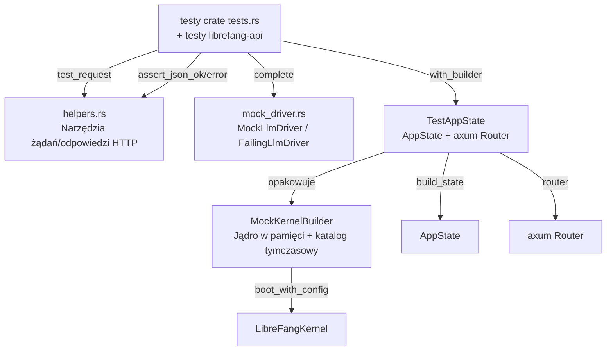

# crates — librefang-testing

# librefang-testing

Crate infrastruktury testowej dostarczający mock jądra, mock sterownika LLM oraz narzędzia HTTP do testów dla przestrzeni roboczej LibreFang. Umożliwia testom jednostkowym i integracyjnym weryfikację tras API, cyklu życia agenta oraz logiki zależnej od LLM bez uruchamiania pełnego demona i bez wykonywania rzeczywistych wywołań sieciowych.

## Architektura

Crate jest zorganizowany w cztery moduły komponujące się w warstwowy harness testowy:



Crate'y poboczne — przede wszystkim `librefang-api` — korzystają z `TestAppState::with_builder()` jako standardowej ścieżki uruchamiania testów, używając jej w dziesiątkach plików testów integracyjnych dla zestawów testowych RBAC, audytu, budżetu, webhooków, zatwierdzeń oraz puli poświadczeń.

## MockKernelBuilder

`MockKernelBuilder` konstruuje rzeczywistą instancję `LibreFangKernel`, używając tego samego punktu wejścia `boot_with_config` co start produkcyjny, ale z minimalną konfiguracją:

- **Stan w pamięci**: Używa pliku SQLite w katalogu tymczasowym zamiast `:memory:` (boot wymaga ścieżek plikowych). `TempDir` jest zwracany wywołującemu, który musi go przechowywać przez czas życia jądra.
- **Sieć wyłączona**: `network_enabled` jest ustawione na `false`, pomijając OFP, cron i synchronizację rejestru.
- **Układ katalogów**: Przed utworzeniem w temp-home tworzy `data/`, `skills/`, `workspaces/agents/` oraz `workspaces/hands/`, aby podsystemy jądra znalazły oczekiwane ścieżki.

### Przypinanie sekretów w skali procesu

Testy równoległe współdzielą proces, a `CredentialVault` jądra oraz HMAC stanu OAuth odczytują sekrety ze środowiska w momencie uruchamiania. Bez deterministycznych wartości współbieżne wywołania `init()` konkurują o ten sam zbiór kluczy, powodując błędy deszyfracji. `MockKernelBuilder` używa straży `Once` do przypięcia dwóch zmiennych środowiskowych przed uruchomieniem jakiegokolwiek jądra:

| Zmienna | Wartość | Przeznaczenie |
|---|---|---|
| `LIBREFANG_VAULT_KEY` | 32 bajty zerowe (base64) | Klucz główny dla `CredentialVault` |
| `LIBREFANG_STATE_SECRET` | 32 bajty zerowe (base64) | Sekret HMAC dla tokenów stanu OAuth |

Uruchamiają się dokładnie raz na proces. Argument poprawności polega na tym, że wszystkie ścieżki uruchamiania w testach przechodzą przez ten builder, więc żaden inny wątek nie może być w trakcie uruchamiania, gdy zmienna jest ustawiana po raz pierwszy.

### Wypełnianie katalogu

`LibreFangKernel::boot_with_config` wywołuje `sync_registry`, który pobiera katalog modeli z `github.com/librefang-registry`. Na runnerach CI jest to niestabilne — limity zapytań lub podziały sieciowe powodują puste lub częściowe katalogi, przez co testy odwołujące się do konkretnych ID modeli zawodzą z błędem 404.

`with_catalog_seed()` zastępuje katalog po uruchamianiu deterministycznym wywołaniem `ModelCatalog::from_entries`. Dostarczane `test_catalog_baseline()` zwraca minimalną parę obejmującą `openai` / `gpt-4o-mini`, do której odwołuje się zestaw testów integracyjnych `librefang-api`. Twórz niestandardowe ziarna, gdy testy wymagają innych kształtów dostawców/modeli.

### Wypełnianie fixture rejestru

`with_registry_fixture()` jest opcjonalne. Kopiuje przypiętą fixture rejestru z repozytorium (szablony agentów, ręce, dostawcy, katalog MCP) do tymczasowego home przed uruchomieniem. Większość testów chce pustego home; niektóre (np. restart/przywracanie) jawnie sprawdzają brak szablonów rejestru.

### API buildera

```rust
// Minimalne jądro
let (kernel, _tmp) = MockKernelBuilder::new().build();

// Z niestandardową konfiguracją i ziarnem katalogu
let (kernel, _tmp) = MockKernelBuilder::new()
    .with_config(|cfg| { cfg.language = "zh".into(); })
    .with_catalog_seed(test_catalog_baseline())
    .build();
```

Wiązanie `_tmp` jest istotne — jeśli `TempDir` zostanie usunięty, katalog zostanie skasowany, a wszystkie ścieżki plikowe jądra staną się nieprawidłowe.

## TestAppState

`TestAppState` opakowuje jądro wyprodukowane przez `MockKernelBuilder` w `AppState` (ten sam typ, który otrzymują procedury produkcyjne) i udostępnia router axum podłączony do standardowego drzewa tras `/api`.

### Konstrukcja

| Metoda | Przypadek użycia |
|---|---|
| `new()` | Domyślne jądro mock, bez autoryzacji |
| `with_builder(builder)` | Niestandardowy `MockKernelBuilder` (konfiguracja, katalog, fixture) |
| `from_kernel(kernel, tmp)` | Przedbudowane jądro; wywołujący zarządza `TempDir` |

### Router

`router()` zwraca router axum zagnieżdżony pod `/api`, obejmujący punkty końcowe systemu (health, status, version, metrics), CRUD agentów, profile, umiejętności, konfigurację, pamięć, budżet/użycie, narzędzia, modele/dostawców oraz sesje. Używaj go z `tower::ServiceExt::oneshot` do wysyłania pojedynczych żądań:

```rust
let app = TestAppState::new();
let router = app.router();
let resp = router.oneshot(test_request(Method::GET, "/api/health", None)).await?;
```

### Konfiguracja autoryzacji

`build_state` wypełnia aktywne uchwyty autoryzacji (`api_key_lock` i `master_key`) z pól `KernelConfig`, odzwierciedlając to, co `server::refresh_master_credential` robi podczas startu produkcyjnego. Zapobiega to rozszczepieniu, gdzie `auth_snapshot()` raportuje skonfigurowane, a middleware widzi nieskonfigurowanego demona.

Trzy metody buildera nadpisują stan autoryzacji dla konkretnych scenariuszy testowych:

- **`with_api_key(key)`** — Ustawia tekst jawny na obu uchwytach. Używaj, gdy test wymaga, aby middleware zaakceptował znany token.
- **`with_api_key_hash(hash)`** — Czyści tekst jawny na obu uchytach i ustawia tylko hash. Testuje postawę „tylko-hash", na którą operator przechodzi po przezroczystej aktualizacji. Należy również ustawić `cfg.api_key_hash` przez `MockKernelBuilder::with_config`, jeśli test weryfikuje ścieżki pochodzące z `auth_snapshot()` (straż wiązania startu, `configured_user_api_keys`, poświadczenia dashboardu).
- **`with_user_api_keys(keys)`** — Wstępnie wypełnia listę kluczy API per użytkownik.

### Konfiguracja na dysku

`with_config_path(path)` serializuje `KernelConfig` jądra do pliku TOML. Używane przez testy punktu końcowego przeładowania konfiguracji. Należy zauważyć, że wartości autoryzacji ustawione przez `with_api_key` / `with_user_api_keys` żyją w blokadach wykonawczych, a nie w strukturze konfiguracji, więc nie są zapisywane na dysku — należy je wpakować do `KernelConfig` przez `MockKernelBuilder::with_config`, jeśli test przeładowuje z pliku.

### Produkcyjne połączenia

`build_state` konstruuje pełne `AppState`, włączając:

- `IdempotencyStore` i `PasskeyStore` wspierane przez SQLite, podłączone do wspólnej puli połączeń jądra
- `PasskeyEngine` budowany tylko wtedy, gdy `passkey_enabled` jest prawdziwe w konfiguracji
- `MasterKeyState` zakorzeniony w tymczasowym home (nie w CWD procesu), aby wskazówki przezroczystej aktualizacji trafiały poprawnie
- Limitatory żądań, konfigurację zaufania IP klienta (nagłówki domyślnie wyłączone) oraz pamięć podręczną sterownika mediów

## MockLlmDriver

Konfigurowalny fałszywy dostawca LLM implementujący cechę `LlmDriver`. Zwraca gotowe odpowiedzi i rejestruje każde wywołanie w celu weryfikacji.

### Sekwencjonowanie odpowiedzi

Sterownik przechowuje listę ciągów odpowiedzi. `next_response()` zwraca je po kolei, a po wyczerpaniu zawija do ostatniego. Pozwala to skryptowi testowemu na wieloetapową konwersację bez wyczerpywania odpowiedzi.

```rust
let driver = MockLlmDriver::new(vec!["pierwszy".into(), "drugi".into()]);
// wywołanie 1 → "pierwszy", wywołanie 2 → "drugi", wywołanie 3+ → "drugi"
```

### Rejestracja wywołań

Każde wywołanie `complete()` dodaje `RecordedCall` zawierający `model`, `message_count`, `tool_count` oraz `system`. Weryfikuj je po fakcie:

```rust
assert_eq!(driver.call_count(), 2);
let calls = driver.recorded_calls();
assert_eq!(calls[0].model, "test-model");
```

### Konfiguracja

| Metoda | Domyślnie | Nadpisanie |
|---|---|---|
| `with_tokens(input, output)` | input=10, output=5 | Niestandardowe użycie tokenów w odpowiedziach |
| `with_stop_reason(reason)` | `EndTurn` | np. `MaxTokens`, `ToolUse` |

### Streaming

`stream()` deleguje do `complete()`, a następnie wysyła zdarzenie `TextDelta` połączone z `ContentComplete` przez podany kanał. Symuluje streaming bez rzeczywistego generowania.

### FailingLlmDriver

Oddzielny sterownik, który zawsze zwraca `LlmError::Api { status: 500, ... }`. Jego `is_configured()` zwraca `false`. Używaj go do testowania ścieżek obsługi błędów w pętlach agenta oraz logiki awaryjnej.

## Pomocnicy HTTP

Trzy funkcje w `helpers.rs` redukują boilerplate w testach tras:

- **`test_request(method, path, body)`** — Buduje `axum::http::Request<Body>`. Gdy `body` wynosi `Some`, ustawia `content-type: application/json`.
- **`assert_json_ok(response)`** — Sprawdza status 200, parsuje treść jako JSON, zwraca `serde_json::Value`. Paniki z surową treścią w przypadku błędu w celach diagnostycznych.
- **`assert_json_error(response, expected_status)`** — Ten sam wzorzec dla odpowiedzi błędów; sprawdza dokładny kod statusu.

## Konwencje dla autorów testów

1. **Przechowuj `TempDir`** — Albo utrzymuj `TestAppState` przy życiu przez czas trwania testu, albo użyj `into_parts()`, aby jawnie wyciągnąć `_tmp`. Usunięcie go w trakcie testu uszkadza ścieżki plikowe jądra.
2. **Wypełnij katalog** podczas weryfikacji ID modeli. `with_catalog_seed(test_catalog_baseline())` to standardowa linia bazowa.
3. **Używaj wielowątkowego środowiska uruchomieniowego tokio** do testów tras (`#[tokio::test(flavor = "multi_thread")]`). Jądro używa asynchroniczności wewnętrznie, a niektóre operacje wymagają wielowątkowego executora.
4. **Ustaw konfigurację i aktywne uchwyty** dla testów autoryzacji „tylko-hash". Ustawienie wyłącznie `with_api_key_hash` pozostawia `KernelConfig.api_key_hash` puste, powodując niezgodność `auth_snapshot()` z middleware'em — znane źródło fałszywie pozytywnych przebiegów testów.
5. **DELETE na nieistniejących agentach jest idempotentny** (zwraca 200 z `"status": "already-deleted"`). 404 jest zarezerwowany dla nieprawidłowych UUID. Testy twierdzące inaczej przeczą kontraktowi API.
