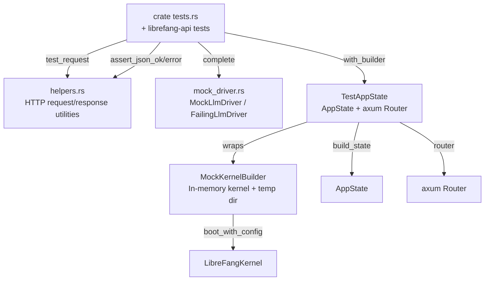

# crates — librefang-testing

# librefang-testing

Test infrastructure crate providing mock kernel, mock LLM driver, and HTTP test utilities for the LibreFang workspace. It enables unit and integration tests to exercise API routes, agent lifecycle, and LLM-dependent logic without starting a full daemon or making real network calls.

## Architecture

The crate is organized into four modules that compose into a layered test harness:



Downstream crates—primarily `librefang-api`—consume `TestAppState::with_builder()` as their standard test boot path, using it in dozens of integration test files for RBAC, audit, budget, webhook, approvals, and credential-pool test suites.

## MockKernelBuilder

`MockKernelBuilder` constructs a real `LibreFangKernel` instance using the same `boot_with_config` entry point as production startup, but with a minimal configuration:

- **In-memory state**: Uses a SQLite file under a temporary directory rather than `:memory:` (boot requires file paths). The `TempDir` is returned to the caller who must hold it for the kernel's lifetime.
- **Network disabled**: `network_enabled` is set to `false`, skipping OFP, cron, and registry sync.
- **Directory layout**: Pre-creates `data/`, `skills/`, `workspaces/agents/`, and `workspaces/hands/` in the temp home so kernel subsystems find their expected paths.

### Process-wide Secret Pinning

Parallel tests share a process, and the kernel's `CredentialVault` and OAuth state HMAC read secrets from the environment at boot time. Without deterministic values, concurrent `init()` calls race on the same keyring, causing decryption failures. `MockKernelBuilder` uses `Once` guards to pin two environment variables before any kernel boots:

| Variable | Value | Purpose |
|---|---|---|
| `LIBREFANG_VAULT_KEY` | 32 zero bytes (base64) | Master key for `CredentialVault` |
| `LIBREFANG_STATE_SECRET` | 32 zero bytes (base64) | HMAC secret for OAuth state tokens |

These run exactly once per process. The safety argument is that all boot paths in tests go through this builder, so no other thread can be mid-boot when the variable is first set.

### Catalog Seeding

`LibreFangKernel::boot_with_config` calls `sync_registry`, which fetches the model catalog from `github.com/librefang-registry`. On CI runners this is flaky—rate limits or network partitions produce empty or partial catalogs, causing tests that reference specific model IDs to fail with 404.

`with_catalog_seed()` replaces the post-boot catalog with a deterministic `ModelCatalog::from_entries` call. The provided `test_catalog_baseline()` returns a minimal pair covering `openai` / `gpt-4o-mini`, which is what the `librefang-api` integration suite references. Build custom seeds when tests need different provider/model shapes.

### Registry Fixture Seeding

`with_registry_fixture()` is opt-in. It copies the pinned in-repo registry fixture (agent templates, hands, providers, MCP catalog) into the temp home before boot. Most tests want an empty home; some (e.g., restart/restore) specifically assert on the absence of registry templates.

### Builder API

```rust
// Minimal kernel
let (kernel, _tmp) = MockKernelBuilder::new().build();

// With custom config and catalog seed
let (kernel, _tmp) = MockKernelBuilder::new()
    .with_config(|cfg| { cfg.language = "zh".into(); })
    .with_catalog_seed(test_catalog_baseline())
    .build();
```

The `_tmp` binding is load-bearing—if `TempDir` drops, the directory is deleted and all kernel file paths become invalid.

## TestAppState

`TestAppState` wraps a `MockKernelBuilder`-produced kernel into an `AppState` (the same type production handlers receive) and exposes an axum `Router` wired with the standard `/api` route tree.

### Construction

| Method | Use case |
|---|---|
| `new()` | Default mock kernel, no auth |
| `with_builder(builder)` | Custom `MockKernelBuilder` (config, catalog, fixture) |
| `from_kernel(kernel, tmp)` | Pre-built kernel; caller manages `TempDir` |

### Router

`router()` returns an axum `Router` nested under `/api` covering system endpoints (health, status, version, metrics), agents CRUD, profiles, skills, config, memory, budget/usage, tools, models/providers, and sessions. Use it with `tower::ServiceExt::oneshot` to send single requests:

```rust
let app = TestAppState::new();
let router = app.router();
let resp = router.oneshot(test_request(Method::GET, "/api/health", None)).await?;
```

### Auth Configuration

`build_state` seeds the live auth handles (`api_key_lock` and `master_key`) from `KernelConfig` fields, mirroring what `server::refresh_master_credential` does at production boot. This avoids a split where `auth_snapshot()` reports configured while the middleware sees an unconfigured daemon.

Three builder methods override auth state for specific test scenarios:

- **`with_api_key(key)`** — Sets plaintext on both handles. Use when a test needs the middleware to accept a known token.
- **`with_api_key_hash(hash)`** — Clears plaintext on both handles and sets only the hash. Tests the "hash-only" posture an operator lands in after transparent upgrade. Must also set `cfg.api_key_hash` via `MockKernelBuilder::with_config` if the test exercises `auth_snapshot()`-derived paths (boot bind guard, `configured_user_api_keys`, dashboard credentials).
- **`with_user_api_keys(keys)`** — Pre-populates the per-user API key list.

### Config-on-Disk

`with_config_path(path)` serializes the kernel's `KernelConfig` to a TOML file. Used by config-reload endpoint tests. Note that auth values set via `with_api_key` / `with_user_api_keys` live on runtime locks, not in the config struct, so they are not written to disk—bake those into `KernelConfig` via `MockKernelBuilder::with_config` if the test reloads from the file.

### Production Wiring

`build_state` constructs the full `AppState` including:

- SQLite-backed `IdempotencyStore` and `PasskeyStore` wired against the kernel's shared connection pool
- `PasskeyEngine` built only when `passkey_enabled` is true in config
- `MasterKeyState` rooted at the temp home (not process CWD) so transparent upgrade hints land correctly
- Rate limiters, client-IP trust config (headers off by default), and media driver cache

## MockLlmDriver

A configurable fake LLM provider implementing the `LlmDriver` trait. It returns canned responses and records every call for assertion.

### Response Sequencing

The driver holds a list of response strings. `next_response()` returns them in order, then wraps around to the last one when exhausted. This lets a test script a multi-turn conversation without running out of responses.

```rust
let driver = MockLlmDriver::new(vec!["first".into(), "second".into()]);
// call 1 → "first", call 2 → "second", call 3+ → "second"
```

### Call Recording

Each `complete()` call pushes a `RecordedCall` containing `model`, `message_count`, `tool_count`, and `system`. Assert on these after the fact:

```rust
assert_eq!(driver.call_count(), 2);
let calls = driver.recorded_calls();
assert_eq!(calls[0].model, "test-model");
```

### Customization

| Method | Default | Override |
|---|---|---|
| `with_tokens(input, output)` | input=10, output=5 | Custom token usage in responses |
| `with_stop_reason(reason)` | `EndTurn` | e.g., `MaxTokens`, `ToolUse` |

### Streaming

`stream()` delegates to `complete()`, then sends a `TextDelta` event followed by `ContentComplete` over the provided channel. This simulates streaming without real generation.

### FailingLlmDriver

A separate driver that always returns `LlmError::Api { status: 500, ... }`. Its `is_configured()` returns `false`. Use it to test error-handling paths in agent loops and fallback logic.

## HTTP Helpers

Three functions in `helpers.rs` reduce boilerplate in route tests:

- **`test_request(method, path, body)`** — Builds an `axum::http::Request<Body>`. When `body` is `Some`, sets `content-type: application/json`.
- **`assert_json_ok(response)`** — Asserts status 200, parses body as JSON, returns `serde_json::Value`. Panics with the raw body on failure for diagnostics.
- **`assert_json_error(response, expected_status)`** — Same pattern for error responses; asserts the exact status code.

## Conventions for Test Authors

1. **Hold the `TempDir`** — Either keep `TestAppState` alive for the test's duration, or use `into_parts()` to extract `_tmp` explicitly. Dropping it mid-test corrupts kernel file paths.
2. **Seed the catalog** when asserting on model IDs. `with_catalog_seed(test_catalog_baseline())` is the standard baseline.
3. **Use multi-thread tokio runtime** for route tests (`#[tokio::test(flavor = "multi_thread")]`). The kernel uses async internally and some operations require a multi-threaded executor.
4. **Set both config and live handles** for hash-only auth tests. Setting only `with_api_key_hash` leaves `KernelConfig.api_key_hash` empty, causing `auth_snapshot()` to disagree with the middleware—a known source of false-positive test passes.
5. **DELETE on nonexistent agents is idempotent** (returns 200 with `"status": "already-deleted"`). 404 is reserved for malformed UUIDs. Tests asserting otherwise contradict the API contract.