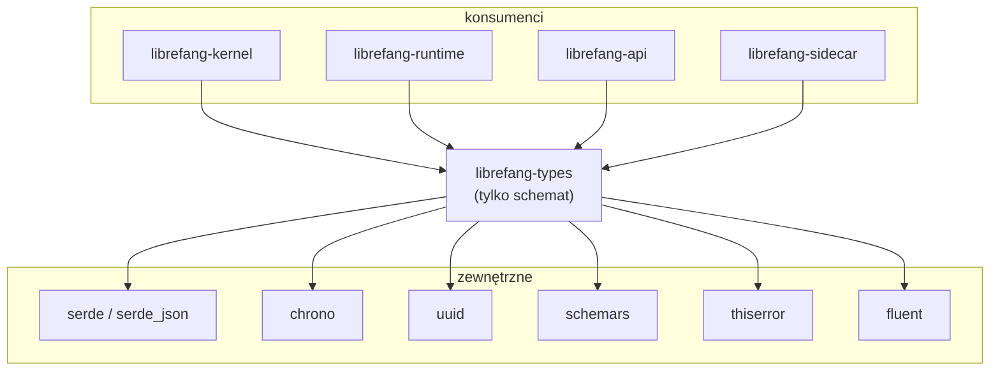

# crates — librefang-types

# librefang-types

Strukturalny szkielet schematów LibreFang Agent OS. Każda struktura danych współdzielona między skrzynkami znajduje się tutaj: tożsamość agenta, klucze sesji, konfiguracja, enumeracje błędów, możliwości, deskryptory pamięci, definicje narzędzi, typy harmonogramów i ładunki protokołu transmisyjnego. Skrzynka jest liściem w grafie zależności obszaru roboczego — nie importuje żadnej innej skrzynki `librefang-*`, a każda inna skrzynka importuje ją.

## Rola w architekturze

Skrzynka wymusza ścisłą granicę: **tylko typy, bez implementacji**. Jeśli ciało funkcji rośnie poza kilka linii logiki pomocniczej opartej na makrach derive, należy je przenieść do skrzynki konsumenta. Brak `tokio`, brak `reqwest`, brak asynchronicznego środowiska uruchomieniowego — wszystko to synchroniczne dane.

## Układ modułów

| Moduł | Dziedzina |
|---|---|
| `agent` | Tożsamość agenta (`AgentId`, `UserId`), klucze sesji (`SessionId`), manifesty, stan cyklu życia, profile narzędzi, przydziały zasobów |
| `approval` | Zasady zatwierdzania z udziałem człowieka, konfiguracja powiadomień |
| `capability` | Deklaracje możliwości w manifeście, dopasowywanie uprawnień oparte na globach |
| `comms` | Obwolutki komunikacji międzyagentowej i kanałowej |
| `config` | `KernelConfig` i wszystkie podrzędne struktury konfiguracyjne konsumowane przez jądro |
| `error` / `error_code` | Enumeracja `LibreFangError`, typizowane kody błędów |
| `event` | Ładunki szyny zdarzeń (cykl życia agenta, zdrowie, cron, wyzwalacze) |
| `goal` | Typy drzewa celów (hierarchiczne obiekty ze śledzeniem statusu) |
| `i18n` | Resolver lokalizacji oparty na Fluent, funkcje tłumaczenia `t()` / `t_args()` |
| `manifest_signing` | Weryfikacja podpisów Ed25519 manifestów, sprawdzenia integralności obwolutki |
| `media` | Deskryptory przesyłania plików / załączników |
| `memory` | Deskryptory magazynu pamięci, zasady dostępu, `UserMemoryAccess` |
| `message` | Typy wiadomości czatu, obwolutki wywołań/wyników narzędzi |
| `model_catalog` | Wpisy rejestru dostawców/modeli, flagi możliwości |
| `oauth` | Stan przepływu OAuth, deskryptory tokenów |
| `registry_schema` | Schematy manifestów rejestru wtyczek/umiejętności |
| `scheduler` | Harmonogramy cron, wyzwalacze, akcje przepływu pracy, cele dostarczenia |
| `serde_compat` | Pomocnicy Serde do migracji pól z zachowaniem kompatybilności wstecznej |
| `subagent` | Typy orkiestracji przekazywania międzyagentowego |
| `taint` | Śledzenie zanieczyszczenia danych w celu izolacji wyników MCP/narzędzi |
| `task` | Deskryptory zadań/zleceń dla asynchronicznej kolejki pracy |
| `tool` / `tool_class` | Definicje narzędzi, taksonomia klas narzędzi |

## Podstawowe typy tożsamości

### AgentId

`AgentId(pub Uuid)` identyfikuje instancję agenta. Dwie strategie konstruktora:

- **`AgentId::new()`** — losowy UUID v4. Używany, gdy tożsamość agenta jest ulotna lub zarządzana przez system zewnętrzny.
- **`AgentId::from_name(name)`** — deterministyczny UUID v5 wywodzący się ze stałej przestrzeni nazw i nazwy agenta. Ta sama nazwa zawsze daje ten sam identyfikator po restarcie demona, zachowując ciągłość sesji i dziennika audytu.

UUID przestrzeni nazw (`AgentId::NAMESPACE`) jest współdzielony przez trzy ścieżki wywodzenia, rozróżniane przez prefiksy ciągów:

- `from_name` → haszuje `"agent:{name}"`
- `from_hand_id` → haszuje sam `hand_id` (kompatybilność wsteczna z pre-prefiksowymi rękami)
- `from_hand_agent` → haszuje `"{hand_id}:{role}"` (legacy) lub `"{hand_id}:{role}:{instance_id}"` (multi-instancyjny)

### SessionId

`SessionId(pub Uuid)` identyfikuje sesję konwersacji. Metoda konstruktora określa semantykę izolacji sesji:

| Metoda | Zakres | Przypadek użycia |
|---|---|---|
| `SessionId::new()` | Losowy | Sesje ad-hoc / programistyczne |
| `SessionId::for_channel(agent, channel)` | Na agenta+kanał | Trwałe sesje kanałowe (Telegram, Discord itp.) |
| `SessionId::for_sender_scope(agent, channel, chat_id)` | Na agenta+kanał+cześć | Izolacja wieloczatowa w ramach jednego kanału |
| `SessionId::for_cron_run(agent, run_key)` | Na wyzwolenie cron | Izolowane wywołanie cron (`session_mode = "new"`) |
| `SessionId::for_trigger_fire(agent, trigger_id, fire_time)` | Na wyzwolenie wyzwalacza | Izolowane wywołanie ze zdarzenia |
| `SessionId::from_route_key(agent, channel, account, conversation)` | Na ustrukturyzowaną trasę | Routing wielodostępcowy z wymiarem konta |

Każda deterministyczna derivacja używa **osobnej przestrzeni nazw UUID v5** (`CHANNEL_SESSION_NAMESPACE`, `CRON_RUN_SESSION_NAMESPACE`, `TRIGGER_FIRE_SESSION_NAMESPACE`), aby zagwarantować brak kolizji międzywariantowych — identyfikator sesji crona nigdy nie będzie równy identyfikatorowi sesji kanałowej, nawet jeśli ciągi wejściowe przypadkowo się pokryją.

Formuła ciągu zakresu (`compose_sender_scope`) jest scentralizowana tutaj, ponieważ wieloracy konsumenci — resolver przychodzący jądra, komendy resetu mostu kanałowego i filtr zakresów pamięci środowiska uruchomieniowego — muszą zgadzać się co do sposobu mapowania `(kanał, chat_id)` na zakres sesji. Każda rozbieżność spowodowałaby wyciek danych między czatami.

### UserId

`UserId` podąża za tym samym wzorcem: `from_name` używa UUID v5 z `LIBREFANG_USER_NAMESPACE` (zamrożona stała). Zmiana nazwy użytkownika celowo produkuje nowy identyfikator — zmiana nazwy oznacza nową tożsamość, stara historia audytu pozostaje przypisana do starego identyfikatora.

## Manifest agenta i konfiguracja

`AgentManifest` jest centralnym typem konfiguracyjnym konsumowanym przez jądro w momencie uruchomienia. Składa się z:

- **`ModelConfig`** — dostawca, model, temperatura, prompt systemowy, opcjonalne nadpisanie `context_window` / `max_output_tokens`
- **`AutonomousConfig`** — zabezpieczenia 24/7: `max_iterations`, `max_restarts`, interwał/czas oczekiwania heartbeat, cron godzin ciszy, próg degradacji zablokowanego przestoju
- **`ResourceQuota`** — limity pamięci/CPU/wywołań narzędzi/tokenów/kosztów/sieci z funkcjami pomocniczymi rozpoznawania wartości efektywnych
- **`ToolProfile`** — nazwane presety (`Minimal`, `Coding`, `Research`, `Messaging`, `Automation`, `Full`, `Custom`) rozwijające się do list narzędzi i wywodzące `ManifestCapabilities`
- **`AgentMode`** — poziom uprawnień (`Observe`, `Assist`, `Full`) filtrujący dostępny zestaw narzędzi w czasie wykonywania
- **`ScheduleMode`** — `Reactive` (zdarzeniowy), `Periodic` (cron), `Proactive` (warunkowy) lub `Continuous` (pętla odpytywania)
- **`SessionMode`** — `Persistent` (ponowne użycie sesji agenta) lub `New` (nowa sesja przy każdym wywołaniu)

Wszystkie struktury konfiguracyjne implementują `Default` i używają `#[serde(default)]` na każdym polu dla kompatybilności wprzód ze starymi plikami TOML.

### Rozpoznawanie przydziałów zasobów

`ResourceQuota` dostarcza dwie funkcje pomocnicze rozpoznawania wywoływane przez skrzynki konsumentów w momencie egzekwowania:

- **`effective_token_limit()`** — zwraca `u64`; `None` i `Some(0)` oba zwijają się do `0` (brak limitu). Wywołujący pomijają egzekwowanie, gdy wynik to `0`.
- **`effective_burst_ratio(global_default)`** — rozpoznaje nadpisanie agenta → globalna wartość domyślna → zakodowany na sztywno `0.2`, ograniczone do `[0.01, 1.0]`. NaN/Inf wracają do `0.2`.

## KernelConfig i niezmiennik lustrzanej odbicie schematu

`KernelConfig` (w module `config`) jest główną strukturą konfiguracyjną ładowaną z TOML przy starcie. Implementuje `schemars::JsonSchema`, co generuje schemat JSON używany do walidacji i dokumentacji.

Testowa fixture pliku wzorcowego walidująca wygenerowany schemat znajduje się w **zestawie testów `librefang-api`** (`kernel_config_schema_matches_golden_fixture`), a nie w tej skrzynce. Tworzy to sprzężenie między-skrzynkowe wymuszane przez CI za pomocą reguły changed-lanes: PR dotykający tylko `librefang-types` automatycznie dołącza `librefang-api` do zestawu dotkniętych testów. Kanoniczne baseline'y TOML/OpenAPI są śledzone w `xtask/baselines/`.

**Gdy zmieniasz dowolne pole `KernelConfig`** — dodanie, zmiana nazwy, zmiana typu — musisz wygenerować ponownie fixture wzorcową w testach `librefang-api`. CI w przeciwnym razie zakończy się niepowodzeniem.

## Typy błędów

Skrzynka eksportuje `LibreFangError` i powiązane enumeracje błędów. Baza kodu migruje od `Result<_, String>` i `anyhow::Error` w granicach cech (ref. #3541 / #3711); nowe warianty błędów należą tutaj.

Przy dodawaniu wariantu:
1. Użyj `#[from]` na opakowanych typach wewnętrznych, aby zachować łańcuch `source()` (#3745).
2. Przypisz stabilny `ErrorCode`, aby warstwa API i klienci mogły przełączać się na niego bez parsowania ciągów.

`error_code.rs` dostarcza `ErrorCode` z metodą `as_str()` dla stabilnej reprezentacji ciągu.

## Internacjonalizacja (i18n)

Moduł `i18n` dostarcza:

- **`resolve_language()`** — rozpoznaje aktywną lokalizację z kontekstu żądania
- **`new()`** — konstruuje loader pakietów Fluent
- **`t(key)`** — tłumaczy klucz wiadomości bez argumentów
- **`t_args(key, args)`** — tłumaczy z interpolowanymi argumentami

Pliki tłumaczeń są w formacie Fluent `.ftl` w katalogu `locales/{lang}/errors.ftl`. Obsługiwane lokalizacje: `en`, `de`, `es`, `fr`, `ja`, `ko`, `uk`, `zh-CN`.

Lokalizacja angielska jest kanonicznym źródłem — zawiera pełny zestaw kluczy. Inne lokalizacje mogą być z tyłu; brakujące klucze wracają do angielskich. Klucz `api-error-generic` jest uniwersalnym zastępnikiem używanym przez 41+ obsługi HTTP 500 do interpolacji dosłownego ciągu błędu źródłowego. Musi zawsze istnieć w każdym pliku lokalizacji; bez niego `t_args("api-error-generic", …)` zwraca dosłowny klucz jako treść odpowiedzi.

## Podpisywanie manifestów

Moduł `manifest_signing` dostarcza typy podpisów Ed25519 i weryfikację integralności dla podpisanych manifestów agentów. Kluczowe funkcje obejmują:

- Konstruowanie kluczy podpisujących z surowych bajtów (`from_bytes`)
- Haszowanie zawartości manifestu (`hash_manifest`) z deterministycznym kodowaniem
- Weryfikację integralności obwolutki (`check_envelope_integrity`)

Umożliwia to dystrybucję agentów z wykrywaniem manipulacji: podpisany manifest niesie podpis Ed25519 nad swoją zawartością TOML, a jądro odrzuca każdy manifest, w którym podpis się nie zgadza.

## Konwencje i ograniczenia

### Kwartet derive

Każdy publiczny typ implementuje co najmniej: `Debug`, `Clone`, `Serialize`, `Deserialize`. Dodatkowe derive:

- `PartialEq`, `Eq`, `Hash` — tylko gdy kod podrzędny potrzebuje porównań lub kluczy HashMap
- `utoipa::ToSchema` — dla typów eksponowanych na powierzchni OpenAPI
- `schemars::JsonSchema` — dla typów konfiguracyjnych napędzanych przez wzorcową fixture kernel-config

### Dyscyplina Serde

- Każde pole konfiguracyjne otrzymuje `#[serde(default)]` dla kompatybilności wprzód ze starymi TOML.
- Pola, które nie powinny być serializowane gdy wynoszą `None`, używają `#[serde(default, skip_serializing_if = "Option::is_none")]`.
- Żadne pole nie jest nigdy cicho pomijane. Albo `#[serde(default)]` dostarcza wartość zastępczą, albo deserializacja kończy się niepowodzeniem w czasie kompilacji.
- Nieznane warianty serde błędzą ostro — `SessionMode` celowo nie ma łapki `#[serde(other)]`, aby literówka taka jak `"New"` (z wielkiej litery) zawiodła, a nie zmapowała się cicho na `Persistent`.

### Deterministyczna kolejność dla promptów LLM

Każde pole, które trafia do serializacji w prompcie LLM, musi używać `BTreeMap` / `BTreeSet`, nie `HashMap` / `HashSet` (ref. #3298). Kolejność iteracji hash map jest niedeterministyczna między przebiegami, co powoduje subtelną niestabilność promptów.

### Zarezerwowane przestrzenie nazw

- Nazwy agentów zaczynające się od `_operator:` są odrzucane przez `validate_agent_name()` — ten prefiks jest zarezerwowany dla syntetycznych nazw węzłów operatora silnika przepływu pracy (#4980).
- `SENDER_ACCOUNT_ID_METADATA_KEY` jest obciążającym stałą dla zabezpieczenia cross-accountowego wysyłania. Rozbieżność literowa między miejscem stemplowania a miejscem odczytu cicho wyłączy zabezpieczenie.

## Dodawanie nowego typu

1. **Wybierz moduł.** Jeśli typ jest używany tylko przez jedną skrzynkę, może należeć tam. Ta skrzynka jest tylko dla typów między-skrzynkowych.
2. **Zaimplementuj kwartet derive** (`Debug`, `Clone`, `Serialize`, `Deserialize`). Dodaj `PartialEq`/`Eq`/`Hash` tylko jeśli kod podrzędny tego potrzebuje.
3. **Dodaj schema derive**, jeśli dotyczy: `ToSchema` dla typów API, `JsonSchema` dla typów konfiguracyjnych.
4. **Użyj `BTreeMap`/`BTreeSet`**, jeśli typ będzie serializowany w prompcie LLM.
5. **Zaimplementuj `Default`**, jeśli typ pojawia się w strukturze konfiguracyjnej. Kompilacja cicho się psuje, jeśli brakuje implementacji `Default` tam, gdzie `#[serde(default)]` jest używane na kontenerze.

### Dodawanie pola konfiguracyjnego

1. Dodaj pole z `#[serde(default)]`.
2. Dodaj je do implementacji `Default` (w przeciwnym razie kompilacja się zepsuje).
3. Dodaj komentarz dokumentacyjny — `schemars` prezentuje go jako `description` pola w schemacie JSON.
4. Uruchom ponownie wzorcową fixture kernel-config w `librefang-api`.

## Publiczna powierzchnia API

- **`VERSION: &str`** — wersja obszaru roboczego, skompilowana z `CARGO_PKG_VERSION`.
- Wszystkie moduły wymienione w powyższej tabeli.
- Kluczowe stałe: `STABLE_PREFIX_MODE_METADATA_KEY`, `SENDER_ACCOUNT_ID_METADATA_KEY`, `LIBREFANG_USER_NAMESPACE`, `RESERVED_OPERATOR_AGENT_NAME_PREFIX`.
- Kluczowe funkcje: `validate_agent_name()`, `compose_sender_scope()`.
