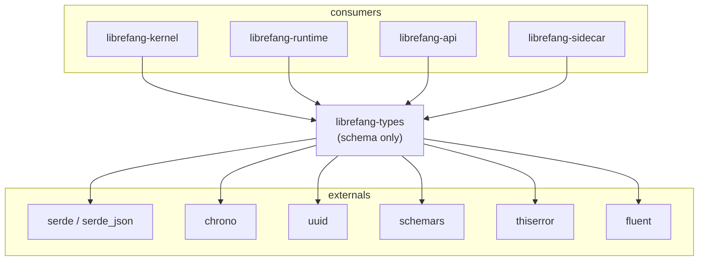

# crates — librefang-types

# librefang-types

The schema spine of the LibreFang Agent OS. Every cross-crate data structure lives here: agent identity, session keys, configuration, error enums, capabilities, memory descriptors, tool definitions, scheduling types, and wire-protocol payloads. The crate is a leaf in the workspace dependency graph — it imports no other `librefang-*` crate, and every other crate imports it.

## Role in the architecture

The crate enforces a strict boundary: **types only, no implementation**. If a function body grows beyond a few lines of derive-only helper logic, it belongs in a consumer crate. There is no `tokio`, no `reqwest`, no async runtime — everything is synchronous data.

## Module layout

| Module | Domain |
|---|---|
| `agent` | Agent identity (`AgentId`, `UserId`), session keys (`SessionId`), manifests, lifecycle state, tool profiles, resource quotas |
| `approval` | Human-in-the-loop approval policies, notification config |
| `capability` | Manifest capability declarations, glob-based permission matching |
| `comms` | Inter-agent and channel communication envelopes |
| `config` | `KernelConfig` and all sub-configuration structs consumed by the kernel |
| `error` / `error_code` | `LibreFangError` enum, typed error codes |
| `event` | Event bus payloads (agent lifecycle, health, cron, triggers) |
| `goal` | Goal tree types (hierarchical objectives with status tracking) |
| `i18n` | Fluent-based localization resolver, `t()` / `t_args()` translation functions |
| `manifest_signing` | Ed25519 manifest signature verification, envelope integrity checks |
| `media` | File upload / attachment descriptors |
| `memory` | Memory store descriptors, access policies, `UserMemoryAccess` |
| `message` | Chat message types, tool-call/result envelopes |
| `model_catalog` | Provider/model registry entries, capability flags |
| `oauth` | OAuth flow state, token descriptors |
| `registry_schema` | Plugin/skill registry manifest schemas |
| `scheduler` | Cron schedules, triggers, workflow actions, delivery targets |
| `serde_compat` | Serde helpers for backward-compatible field migrations |
| `subagent` | Multi-agent hand orchestration types |
| `taint` | Data taint tracking for MCP/tool output isolation |
| `task` | Task/job descriptors for the async work queue |
| `tool` / `tool_class` | Tool definitions, tool-class taxonomy |

## Core identity types

### AgentId

`AgentId(pub Uuid)` identifies an agent instance. Two construction strategies:

- **`AgentId::new()`** — random UUID v4. Used when the agent's identity is ephemeral or managed by an external system.
- **`AgentId::from_name(name)`** — deterministic UUID v5 derived from a fixed namespace constant and the agent name. Same name always produces the same ID across daemon restarts, preserving session and audit-log continuity.

The namespace UUID (`AgentId::NAMESPACE`) is shared across three derivation paths, disambiguated by string prefixes:

- `from_name` → hashes `"agent:{name}"`
- `from_hand_id` → hashes the bare `hand_id` (backward compat with pre-prefix hands)
- `from_hand_agent` → hashes `"{hand_id}:{role}"` (legacy) or `"{hand_id}:{role}:{instance_id}"` (multi-instance)

### SessionId

`SessionId(pub Uuid)` identifies a conversation session. The construction method determines session isolation semantics:

| Method | Scope | Use case |
|---|---|---|
| `SessionId::new()` | Random | Ad-hoc / programmatic sessions |
| `SessionId::for_channel(agent, channel)` | Per agent+channel | Persistent channel sessions (Telegram, Discord, etc.) |
| `SessionId::for_sender_scope(agent, channel, chat_id)` | Per agent+channel+chat | Multi-chat isolation within a single channel |
| `SessionId::for_cron_run(agent, run_key)` | Per cron fire | Isolated cron invocation (`session_mode = "new"`) |
| `SessionId::for_trigger_fire(agent, trigger_id, fire_time)` | Per trigger fire | Isolated event-trigger invocation |
| `SessionId::from_route_key(agent, channel, account, conversation)` | Per structured route | Multi-tenant routing with account dimension |

Each deterministic derivation uses a **distinct UUID v5 namespace** (`CHANNEL_SESSION_NAMESPACE`, `CRON_RUN_SESSION_NAMESPACE`, `TRIGGER_FIRE_SESSION_NAMESPACE`) to guarantee no cross-flavor collisions — a cron-fire session ID can never equal a channel session ID even if the input strings happen to coincide.

The scope-string formula (`compose_sender_scope`) is centralized here because multiple consumers — the kernel's inbound resolver, the channel-bridge reset commands, and the runtime's memory-scope filter — must agree on exactly how `(channel, chat_id)` maps to a session scope. Any divergence would cause cross-chat data leakage.

### UserId

`UserId` follows the same pattern: `from_name` uses UUID v5 with `LIBREFANG_USER_NAMESPACE` (a frozen constant). Renaming a user intentionally produces a new ID — rename means new identity, old audit history stays attached to the old ID.

## Agent manifest and configuration

`AgentManifest` is the central configuration type consumed by the kernel at spawn time. It composes:

- **`ModelConfig`** — provider, model, temperature, system prompt, optional `context_window` / `max_output_tokens` overrides
- **`AutonomousConfig`** — 24/7 guardrails: `max_iterations`, `max_restarts`, heartbeat interval/timeout, quiet hours cron, block-stall degrade threshold
- **`ResourceQuota`** — memory/CPU/tool-call/token/cost/network limits with effective-value resolution helpers
- **`ToolProfile`** — named presets (`Minimal`, `Coding`, `Research`, `Messaging`, `Automation`, `Full`, `Custom`) that expand to tool lists and derive `ManifestCapabilities`
- **`AgentMode`** — permission level (`Observe`, `Assist`, `Full`) that filters the available tool set at runtime
- **`ScheduleMode`** — `Reactive` (event-driven), `Periodic` (cron), `Proactive` (condition-based), or `Continuous` (polling loop)
- **`SessionMode`** — `Persistent` (reuse agent session) or `New` (fresh session per invocation)

All config structs implement `Default` and use `#[serde(default)]` on every field for forward compatibility with old TOML files.

### Resource quota resolution

`ResourceQuota` provides two resolution helpers that consumer crates call at enforcement time:

- **`effective_token_limit()`** — returns `u64`; `None` and `Some(0)` both collapse to `0` (unlimited). Callers skip enforcement when the result is `0`.
- **`effective_burst_ratio(global_default)`** — resolves agent override → global default → hardcoded `0.2`, clamped to `[0.01, 1.0]`. NaN/Inf fall back to `0.2`.

## KernelConfig and the schema-mirror invariant

`KernelConfig` (in the `config` module) is the root configuration struct loaded from TOML at boot. It derives `schemars::JsonSchema`, which generates a JSON Schema used for validation and documentation.

The golden-file fixture that validates the generated schema lives in **`librefang-api`'s test suite** (`kernel_config_schema_matches_golden_fixture`), not in this crate. This creates a cross-crate coupling that CI enforces via the changed-lanes rule: a PR touching only `librefang-types` automatically pulls `librefang-api` into the affected test set. The canonical TOML/OpenAPI baselines are tracked under `xtask/baselines/`.

**When you change any `KernelConfig` field** — addition, rename, type change — you must regenerate the golden fixture in `librefang-api`'s tests. CI will fail otherwise.

## Error types

The crate exports `LibreFangError` and related error enums. The codebase is migrating away from `Result<_, String>` and `anyhow::Error` in trait boundaries (refs #3541 / #3711); new error variants belong here.

When adding a variant:
1. Use `#[from]` on wrapped inner types to preserve the `source()` chain (#3745).
2. Assign a stable `ErrorCode` so the API layer and clients can switch on it without parsing strings.

`error_code.rs` provides `ErrorCode` with an `as_str()` method for stable string representation.

## Internationalization (i18n)

The `i18n` module provides:

- **`resolve_language()`** — resolves the active locale from request context
- **`new()`** — constructs a Fluent bundle loader
- **`t(key)`** — translates a message key with no arguments
- **`t_args(key, args)`** — translates with interpolated arguments

Translation files are Fluent `.ftl` format under `locales/{lang}/errors.ftl`. Supported locales: `en`, `de`, `es`, `fr`, `ja`, `ko`, `uk`, `zh-CN`.

The English locale is the canonical source — it contains the full key set. Other locales may lag behind; missing keys fall back to English. The key `api-error-generic` is a catch-all used by 41+ HTTP 500 handlers to interpolate the underlying error string verbatim. It must always exist in every locale file; without it, `t_args("api-error-generic", …)` returns the literal key as the response body.

## Manifest signing

The `manifest_signing` module provides Ed25519 signature types and integrity verification for signed agent manifests. Key functions include:

- Constructing signing keys from raw bytes (`from_bytes`)
- Hashing manifest content (`hash_manifest`) with deterministic encoding
- Verifying envelope integrity (`check_envelope_integrity`)

This enables tamper-evident agent distribution: a signed manifest carries an Ed25519 signature over its TOML content, and the kernel rejects any manifest where the signature doesn't match.

## Conventions and constraints

### Derive quartet

Every public type derives at minimum: `Debug`, `Clone`, `Serialize`, `Deserialize`. Additional derives:

- `PartialEq`, `Eq`, `Hash` — only when downstream code needs comparisons or HashMap keys
- `utoipa::ToSchema` — for types exposed on the OpenAPI surface
- `schemars::JsonSchema` — for configuration types driven by the kernel-config golden fixture

### Serde discipline

- Every config field gets `#[serde(default)]` for forward compatibility with old TOML.
- Fields that should not serialize when `None` use `#[serde(default, skip_serializing_if = "Option::is_none")]`.
- No field is ever silently dropped. Either `#[serde(default)]` provides a fallback, or deserialization fails at compile time.
- Unknown serde variants error hard — `SessionMode` intentionally has no `#[serde(other)]` fallback arm so a typo like `"New"` (capitalized) fails rather than silently mapping to `Persistent`.

### Deterministic ordering for LLM prompts

Any field that ends up serialized into an LLM prompt must use `BTreeMap` / `BTreeSet`, not `HashMap` / `HashSet` (refs #3298). Hash map iteration order is non-deterministic across runs, which causes subtle prompt instability.

### Reserved namespaces

- Agent names starting with `_operator:` are rejected by `validate_agent_name()` — this prefix is reserved for workflow engine synthetic operator-node names (#4980).
- `SENDER_ACCOUNT_ID_METADATA_KEY` is a load-bearing constant for the cross-account dispatch security guard. A typo divergence between the stamp site and the read site would silently disable the guard.

## Adding a new type

1. **Choose the module.** If the type is used by only one crate, it may belong there instead. This crate is for cross-crate types only.
2. **Derive the quartet** (`Debug`, `Clone`, `Serialize`, `Deserialize`). Add `PartialEq`/`Eq`/`Hash` only if downstream needs them.
3. **Add schema derives** if applicable: `ToSchema` for API types, `JsonSchema` for config types.
4. **Use `BTreeMap`/`BTreeSet`** if the type will be serialized into an LLM prompt.
5. **Implement `Default`** if the type appears in a config struct. The build silently breaks if a `Default` impl is missing where `#[serde(default)]` is used on a container.

### Adding a config field

1. Add the field with `#[serde(default)]`.
2. Add it to the `Default` impl (the build breaks otherwise).
3. Add a doc comment — `schemars` surfaces it as the field's `description` in the JSON Schema.
4. Re-run the kernel-config golden fixture in `librefang-api`.

## Public API surface

- **`VERSION: &str`** — workspace version, compiled from `CARGO_PKG_VERSION`.
- All modules listed in the table above.
- Key constants: `STABLE_PREFIX_MODE_METADATA_KEY`, `SENDER_ACCOUNT_ID_METADATA_KEY`, `LIBREFANG_USER_NAMESPACE`, `RESERVED_OPERATOR_AGENT_NAME_PREFIX`.
- Key functions: `validate_agent_name()`, `compose_sender_scope()`.