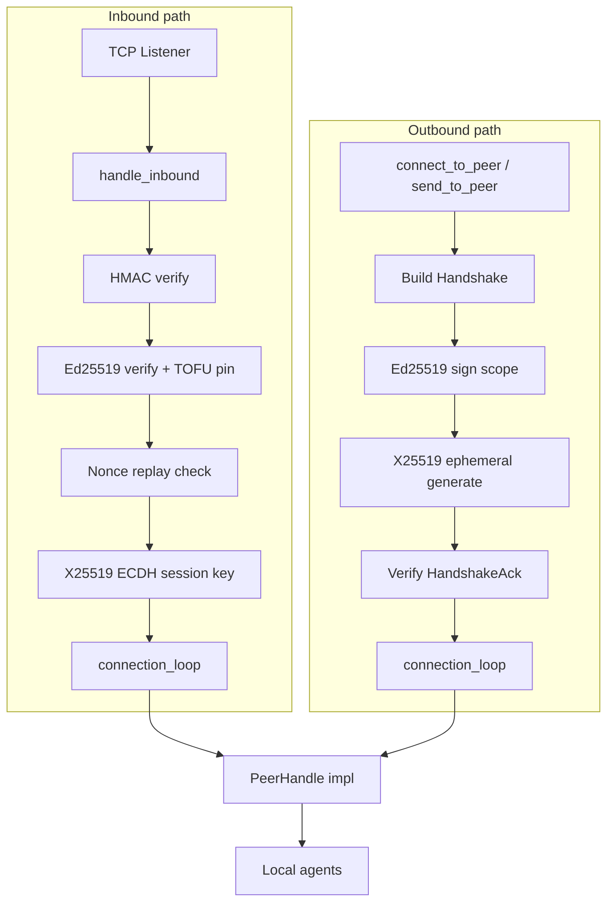

# crates — librefang-wire

# librefang-wire

The LibreFang Wire Protocol (OFP) crate — agent-to-agent TCP networking with layered authentication, replay protection, forward secrecy, and per-peer rate limiting. OFP enables kernels on different machines to discover each other's agents, route messages cross-host, and federate without exposing the control plane to passive observers or credential thieves.

## Architecture at a Glance



## Wire Format

Every OFP frame on the wire is:

```
[4-byte big-endian length][JSON body]
```

After a successful handshake, frames carry an appended HMAC:

```
[4-byte big-endian length][JSON body][64-char hex HMAC]
```

The HMAC covers the JSON body using the session key derived during the handshake. Pre-handshake frames (the initial Handshake and HandshakeAck) are not HMAC-appended — their integrity comes from the embedded `auth_hmac` and Ed25519 identity signature fields.

`encode_message` / `decode_message` / `decode_length` in `message.rs` handle framing. `write_message`, `read_message`, `write_message_authenticated`, and `read_message_authenticated` in `peer.rs` provide async stream I/O.

## Authentication Model

OFP uses three independent security layers, applied in sequence during every handshake:

### Layer 1 — Network Admission (HMAC-SHA256)

The coarse "do you have the cluster password" gate. The handshake carries an `auth_hmac` field computed as:

```
HMAC-SHA256(shared_secret, nonce | sender_node_id | recipient_node_id)
```

The recipient field binds the handshake to a specific target node (#3875), preventing a captured handshake from being replayed against a different federation peer that shares the same `shared_secret`. Bootstrap connections (where the dialer doesn't know the remote node ID in advance) use an empty recipient, which the receiver accepts as a second-tier binding — the remaining layers still authenticate the peer.

### Layer 2 — Per-Peer Identity (Ed25519 TOFU)

Each node persists an Ed25519 keypair in `<data_dir>/peer_keypair.json`. Every outbound handshake includes the sender's `public_key` and an `identity_signature` — an Ed25519 signature over the same auth-data string the HMAC covers (plus the ephemeral pubkey, when present). On first contact the recipient pins the public key to the sender's `node_id` (trust-on-first-use). Subsequent handshakes claiming the same `node_id` must present the same public key or are rejected.

This means a leaked `shared_secret` alone cannot impersonate a previously-pinned peer — the attacker also needs that node's private key file.

Pins persist across restarts in `<data_dir>/trusted_peers.json` via the `TrustedPeers` store.

### Layer 3 — Forward Secrecy (Ephemeral X25519)

Each handshake generates a fresh X25519 keypair (#4269). Both peers exchange the public halves inside the Handshake/HandshakeAck messages — covered by the Ed25519 identity signature so an active MITM cannot substitute a key they control. The per-message session key is then derived via:

```
session_key = HKDF-SHA256(
    salt   = client_nonce | server_nonce,
    ikm    = X25519(local_ephemeral_secret, remote_ephemeral_public),
    info   = "librefang-ofp/v1/session-key"
)
```

The ephemeral private keys are dropped when the handshake completes, so a future compromise of `shared_secret` or even of a node's static Ed25519 private key cannot decrypt or forge recorded past traffic.

When either peer omits `ephemeral_pubkey` (legacy compatibility), the session key falls back to `HMAC-SHA256(shared_secret, our_nonce || their_nonce)`.

## Key Components

### `message.rs` — Wire Protocol Types

Defines the envelope and all message variants:

| Enum | Tag Field | Examples |
|------|-----------|----------|
| `WireMessageKind` | `type` | `"request"`, `"response"`, `"notification"` |
| `WireRequest` | `method` | `"handshake"`, `"discover"`, `"agent_message"`, `"ping"` |
| `WireResponse` | `method` | `"handshake_ack"`, `"discover_result"`, `"agent_response"`, `"pong"`, `"error"` |
| `WireNotification` | `event` | `"agent_spawned"`, `"agent_terminated"`, `"shutting_down"` |

Every enum has an `Unknown` arm with `#[serde(other)]` so messages from peers running a newer protocol version decode successfully instead of breaking the TCP connection (#3544). `classify_unknown()` re-peeks the JSON body to surface the raw tag string for operator-visible logging — without it, unknown messages would be silently dropped.

`PROTOCOL_VERSION` is currently `1`.

### `keys.rs` — Ed25519 Identity

`Ed25519KeyPair` wraps a signing key and provides `sign()`, `verifying_key()`, and `fingerprint()` (SHA-256 of the base64 public key, hex-encoded — the value operators compare out-of-band).

`PeerKeyManager` handles persistence at `<data_dir>/peer_keypair.json`:

- `load_or_generate()` loads an existing identity or creates a fresh keypair + UUID `node_id`.
- On load, the public key is re-derived from the stored seed and cross-checked against the file — a tampered public key is rejected.
- Legacy files written without a `node_id` field are migrated automatically: a fresh UUID is minted and the file is rewritten.
- On Unix, the file is tightened to mode `0600` (best-effort).

`verify_signature()` is a standalone function for validating a base64 signature against a base64 public key, used by the handshake verification path.

### `kex.rs` — Ephemeral X25519 Key Exchange

`EphemeralKex` generates a one-shot X25519 keypair per handshake:

1. `EphemeralKex::generate()` — fresh keypair, public half returned as base64 for the wire.
2. `derive_session_key(remote_pubkey_b64, transcript)` — performs ECDH, rejects the all-zero shared secret (weak point from low-order keys), then HKDF-SHA256 to produce a hex session key.
3. The `EphemeralKex` value is consumed by `derive_session_key`, dropping the private key material (`StaticSecret` zeroizes on drop).

`handshake_transcript(client_nonce, server_nonce)` builds the HKDF salt. Nonces are concatenated in a fixed order (client first, server second) so both peers derive the same salt regardless of which side called.

`HKDF_INFO = b"librefang-ofp/v1/session-key"` — bumping this string is the protocol-versioning hook for session-key derivation changes.

### `peer.rs` — PeerNode and Connection Lifecycle

`PeerNode` is the main server/client. Construct via `start_with_identity()`:

```rust
let (node, _handle) = PeerNode::start_with_identity(
    config,
    registry,
    Arc::new(kernel_handle),
    Some(keypair),           // Ed25519 identity
    Some(data_dir.into()),   // trust store directory
).await?;
```

The accept loop spawns a task per inbound connection. Each connection runs through:

1. **Pre-handshake read** under a `HANDSHAKE_READ_TIMEOUT_SECS` (10s) deadline with frame length capped at `MAX_PREHANDSHAKE_MESSAGE_SIZE` (64 KiB) — prevents unauthenticated memory-exhaustion DoS.
2. **HMAC verification** of the incoming handshake (#3875).
3. **Ed25519 identity verification + TOFU pin** (#3873).
4. **Nonce replay check** — only after HMAC passes (#3880).
5. **X25519 ECDH** for session key derivation (#4269).
6. **Connection loop** — authenticated read/write dispatch for the lifetime of the TCP link.

Outbound connections (`connect_to_peer_with_id`, `send_to_peer`) mirror this sequence from the client side.

`PeerHandle` is the trait the kernel implements to service remote requests:

```rust
#[async_trait]
pub trait PeerHandle: Send + Sync + 'static {
    fn local_agents(&self) -> Vec<RemoteAgentInfo>;
    async fn handle_agent_message(&self, agent: &str, message: &str, sender: Option<&str>) -> Result<String, String>;
    fn discover_agents(&self, query: &str) -> Vec<RemoteAgentInfo>;
    fn uptime_secs(&self) -> u64;
}
```

### `NonceTracker` — Replay Protection

Time-windowed (5-minute) nonce dedup with an amortized GC sweep that only triggers at 80% capacity, avoiding an O(n) `retain()` on every insert. Hard-capped at 100,000 entries — at capacity it fails closed (rejects new nonces) rather than growing unbounded.

### `PeerRateLimiter` — Per-Peer Abuse Prevention (#3876)

Two independent limits:

- **Message rate**: max `AgentMessage` requests per peer per minute (default 60). Excess rejected with HTTP 429 before reaching the LLM.
- **Token budget**: optional cumulative LLM token cap per peer per hour. Checked retroactively after a completed LLM turn.

### `registry.rs` — Peer Registry

`PeerRegistry` tracks known remote peers (`PeerEntry`), their agents (`RemoteAgent`), and connection state (`PeerState::Connected` / `Disconnected`). Shared by clone across all connection tasks.

### `trusted_peers.rs` — Persistent TOFU Store

`TrustedPeers` persists pinned `(node_id, public_key)` pairs to `<data_dir>/trusted_peers.json`. Hydrated into the in-memory pin map at startup so mismatch-detection survives daemon restarts.

## Security Constants

| Constant | Value | Purpose |
|----------|-------|---------|
| `MAX_MESSAGE_SIZE` | 16 MiB | Post-handshake frame ceiling |
| `MAX_PREHANDSHAKE_MESSAGE_SIZE` | 64 KiB | Pre-auth frame ceiling (reduces allocation 256×) |
| `MAX_PEER_MESSAGE_BYTES` | 64 KiB | `AgentMessage` payload cap (protects receiver LLM budget) |
| `HANDSHAKE_READ_TIMEOUT_SECS` | 10s | Deadline for inbound handshake frame |
| `MAX_PIN_ENTRIES` | 100,000 | TOFU pin map hard cap |

## Confidentiality Boundary

OFP frames are **plaintext** on the wire. Authentication, integrity, and replay protection are provided by this crate; confidentiality must come from the deployment layer (WireGuard, Tailscale, SSH tunnel, or service-mesh mTLS). Do not add TLS termination inside this crate without re-evaluating the documented architecture decision.

## Integration Points

- **`src/kernel/background_lifecycle.rs`** calls `PeerNode::start_with_identity()` to boot the OFP node with the kernel's `PeerHandle` implementation.
- **`src/kernel/mod.rs`** implements `PeerHandle::local_agents()` and `discover_agents()`, returning `RemoteAgentInfo` structs.
- **`src/routes/network.rs`** reads `PeerRegistry` to surface peer lists via the API.
- **`librefang-types`** provides `truncate_str` used in nonce replay error messages.