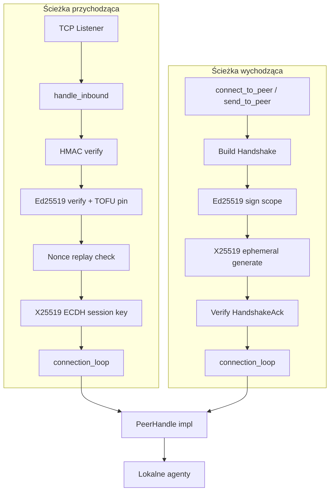

# crates — librefang-wire

# librefang-wire

Kratka LibreFang Wire Protocol (OFP) — sieciowanie TCP między agentami z warstwową autentykacją, ochroną przed powtórkami, forward secrecy i limitowaniem stawek dla każdego peera. OFP umożliwia jądrą na różnych maszynach odkrywanie agentów nawzajem, trasowanie wiadomości między hostami i federację bez eksponowania płaszczyzny sterowania pasywnym obserwatorom czy złodziejom poświadczeń.

## Architektura w pigułce



## Format ramki na warstwie sieciowej

Każda ramka OFP na kablu ma postać:

```
[4-bajtowa długość big-endian][ciało JSON]
```

Po udanym handshake ramki zawierają dopisany HMAC:

```
[4-bajtowa długość big-endian][ciało JSON][64-znakowy szesnastkowy HMAC]
```

HMAC obejmuje ciało JSON przy użyciu klucza sesyjnego wyliczonego podczas handshake. Ramki pre-handshake (inicjalny Handshake i HandshakeAck) nie mają dopisanego HMAC — ich integralność wynika z osadzonych pól `auth_hmac` i podpisu tożsamości Ed25519.

`encode_message` / `decode_message` / `decode_length` w `message.rs` obsługują ramerowanie. `write_message`, `read_message`, `write_message_authenticated` i `read_message_authenticated` w `peer.rs` zapewniają asynchroniczne operacje wejścia/wyjścia strumieniowego.

## Model autentykacji

OFP używa trzech niezależnych warstw bezpieczeństwa, stosowanych sekwencyjnie podczas każdego handshake:

### Warstwa 1 — Dopuszczenie do sieci (HMAC-SHA256)

Grube „czy znasz hasło klastra" zabezpieczenie. Handshake zawiera pole `auth_hmac` obliczane jako:

```
HMAC-SHA256(shared_secret, nonce | sender_node_id | recipient_node_id)
```

Pole odbiorcy wiąże handshake z konkretnym węzłem docelowym (#3875), zapobiegając użyciu przechwyconego handshake wobec innego peera federacyjnego współdzielącego to samo `shared_secret`. Połączenia bootstrap (gdzie dialer nie zna z góry identyfikatora zdalnego węzła) używają pustego odbiorcy, który odbiorca akceptuje jako wiązanie drugiego rzędu — pozostałe warstwa nadal autentykują peer.

### Warstwa 2 — Tożsamość per-peer (Ed25519 TOFU)

Każdy węzeł utrwala parę kluczy Ed25519 w `<data_dir>/peer_keypair.json`. Każdy wychodzący handshake zawiera `public_key` nadawcy oraz `identity_signature` — podpis Ed25519 nad tym samym ciągiem auth-data, który obejmuje HMAC (plus tymczasowy klucz publiczny, gdy jest obecny). Przy pierwszym kontakcie odbiorca przypina klucz publiczny do `node_id` nadawcy (trust-on-first-use). Kolejne handshake z tym samym `node_id` muszą przedstawić ten sam klucz publiczny, w przeciwnym razie są odrzucane.

Oznacza to, że sam wyciek `shared_secret` nie pozwala podszyć się pod uprzednio przypiętego peera — atakujący potrzebuje również pliku klucza prywatnego tego węzła.

Piny są utrwalane pomiędzy restartami w `<data_dir>/trusted_peers.json` poprzez magazyn `TrustedPeers`.

### Warstwa 3 — Forward Secrecy (Tymczasowy X25519)

Każdy handshake generuje nową parę kluczy X25519 (#4269). Oba peery wymieniają publiczne połowy w wiadomościach Handshake/HandshakeAck — objęte podpisem tożsamości Ed25519, więc aktywny MITM nie może podmienić klucza, którym steruje. Klucz sesyjny per-wiadomość jest następnie wyliczany poprzez:

```
session_key = HKDF-SHA256(
    salt   = client_nonce | server_nonce,
    ikm    = X25519(local_ephemeral_secret, remote_ephemeral_public),
    info   = "librefang-ofp/v1/session-key"
)
```

Tymczasowe klucze prywatne są usuwane po zakończeniu handshake, więc przyszły wyciek `shared_secret` lub nawet statycznego klucza prywatnego Ed25519 węzła nie pozwala odszyfrować ani sfałszować nagranych wcześniejszych transmisji.

Gdy dowolny peer pomija `ephemeral_pubkey` (kompatybilność wsteczna), klucz sesyjny powraca do `HMAC-SHA256(shared_secret, our_nonce || their_nonce)`.

## Kluczowe komponenty

### `message.rs` — Typy protokołu sieciowego

Definiuje kopertę i wszystkie warianty wiadomości:

| Enum | Pole tagu | Przykłady |
|------|-----------|-----------|
| `WireMessageKind` | `type` | `"request"`, `"response"`, `"notification"` |
| `WireRequest` | `method` | `"handshake"`, `"discover"`, `"agent_message"`, `"ping"` |
| `WireResponse` | `method` | `"handshake_ack"`, `"discover_result"`, `"agent_response"`, `"pong"`, `"error"` |
| `WireNotification` | `event` | `"agent_spawned"`, `"agent_terminated"`, `"shutting_down"` |

Każdy enum ma ramię `Unknown` z `#[serde(other)]` tak, że wiadomości od peerów z nowszą wersją protokołu dekodują się poprawnie zamiast zrywać połączenie TCP (#3544). `classify_unknown()` ponownie podejrzyje ciało JSON aby wydobyć surowy ciąg tagu do logowania widocznego dla operatora — bez tego nieznane wiadomości byłyby cicho pomijane.

`PROTOCOL_VERSION` wynosi obecnie `1`.

### `keys.rs` — Tożsamość Ed25519

`Ed25519KeyPair` opakowuje klucz podpisujący i udostępnia `sign()`, `verifying_key()` oraz `fingerprint()` (SHA-256 klucza publicznego w base64, zakodowany szesnastkowo — wartość którą operatorzy porównują poza pasmem).

`PeerKeyManager` obsługuje utrwalanie w `<data_dir>/peer_keypair.json`:

- `load_or_generate()` ładuje istniejącą tożsamość lub tworzy nową parę kluczy + UUID `node_id`.
- Przy ładowaniu klucz publiczny jest ponownie wyliczany z zapisanego seeda i sprawdzany względem pliku — naruszony klucz publiczny jest odrzucany.
- Pliki legatywne napisane bez pola `node_id` są migrowane automatycznie: tworzony jest nowy UUID i plik jest przepisywany.
- Na uniksach plik jest zacieśniany do trybu `0600` (best-effort).

`verify_signature()` to samodzielna funkcja do weryfikacji podpisu base64 względem klucza publicznego base64, używana przez ścieżkę weryfikacji handshake.

### `kex.rs` — Tymczasowa wymiana kluczy X25519

`EphemeralKex` generuje jednorazową parę kluczy X25519 na handshake:

1. `EphemeralKex::generate()` — nowa para kluczy, publiczna połowa zwracana jako base64 na warstwę sieciową.
2. `derive_session_key(remote_pubkey_b64, transcript)` — wykonuje ECDH, odrzuca współdzielony sekret zerowy (słaby punkt z kluczy niskiego rzędu), następnie HKDF-SHA256 aby wyprodukować szesnastkowy klucz sesyjny.
3. Wartość `EphemeralKex` jest konsumowana przez `derive_session_key`, usuwając materiał klucza prywatnego (`StaticSecret` zeruje się przy drop).

`handshake_transcript(client_nonce, server_nonce)` buduje sól HKDF. Nonce są konkatenowane w stałej kolejności (najpierw klient, potem serwer) tak, aby oba peery wyliczały tę samą sól niezależnie od strony wywołania.

`HKDF_INFO = b"librefang-ofp/v1/session-key"` — zmiana tego ciągu to punkt kontrolny wersjonowania protokołu dla zmian w wyprowadzaniu klucza sesyjnego.

### `peer.rs` — PeerNode i cykl życia połączenia

`PeerNode` to główny serwer/klient. Konstrukcja przez `start_with_identity()`:

```rust
let (node, _handle) = PeerNode::start_with_identity(
    config,
    registry,
    Arc::new(kernel_handle),
    Some(keypair),           // tożsamość Ed25519
    Some(data_dir.into()),   // katalog magazynu zaufania
).await?;
```

Pętla akceptacji tworzy zadanie dla każdego przychodzącego połączenia. Każde połączenie przechodzi przez:

1. **Odczyt pre-handshake** pod terminem `HANDSHAKE_READ_TIMEOUT_SECS` (10 s) z długością ramki ograniczoną do `MAX_PREHANDSHAKE_MESSAGE_SIZE` (64 KiB) — zapobiega nieautentykowanemu DoS przez wyczerpanie pamięci.
2. **Weryfikacja HMAC** przychodzącego handshake (#3875).
3. **Weryfikacja tożsamości Ed25519 + TOFU pin** (#3873).
4. **Sprawdzenie powtórki nonce** — dopiero po przejściu HMAC (#3880).
5. **X25519 ECDH** dla wyprowadzenia klucza sesyjnego (#4269).
6. **Pętla połączenia** — autentykowany odczyt/zapis przez cały czas trwania łącza TCP.

Połączenia wychodzące (`connect_to_peer_with_id`, `send_to_peer`) odzwierciedlają tę sekwencję ze strony klienta.

`PeerHandle` to trait implementowany przez jądro do obsługi zdalnych żądań:

```rust
#[async_trait]
pub trait PeerHandle: Send + Sync + 'static {
    fn local_agents(&self) -> Vec<RemoteAgentInfo>;
    async fn handle_agent_message(&self, agent: &str, message: &str, sender: Option<&str>) -> Result<String, String>;
    fn discover_agents(&self, query: &str) -> Vec<RemoteAgentInfo>;
    fn uptime_secs(&self) -> u64;
}
```

### `NonceTracker` — Ochrona przed powtórkami

Deduplikacja nonce w oknie czasowym (5 minut) z amortyzowanym przebiegiem GC, który uruchamia się dopiero przy 80% pojemności, unikając `retain()` w O(n) przy każdym wstawieniu. Twardo ograniczony do 100 000 wpisów — przy pełnej pojemności zawiesza się (odrzucuje nowe nonce) zamiast rosnąć nieograniczenie.

### `PeerRateLimiter` — Ochrona przed nadużyciami per-peer (#3876)

Dwa niezależne limity:

- **Stawka wiadomości**: maksimum żądań `AgentMessage` na peer na minutę (domyślnie 60). Nadmiar odrzucany z HTTP 429 zanim dotrze do LLM.
- **Budżet tokenów**: opcjonalny skumulowany limit tokenów LLM na peer na godzinę. Sprawdzany retrospektywnie po zakończonej tury LLM.

### `registry.rs` — Rejestr peerów

`PeerRegistry` śledzi znane zdalne peery (`PeerEntry`), ich agenty (`RemoteAgent`) oraz stan połączenia (`PeerState::Connected` / `Disconnected`). Współdzielony przez klonowanie między wszystkimi zadaniami połączeń.

### `trusted_peers.rs` — Utrwalony magazyn TOFU

`TrustedPeers` utrwala przypięte pary `(node_id, public_key)` w `<data_dir>/trusted_peers.json`. Hydratowane do w pamięci mapy pinów przy starcie tak, że wykrywanie niezgodności przetrwa restarty demona.

## Stałe bezpieczeństwa

| Stała | Wartość | Przeznaczenie |
|-------|---------|---------------|
| `MAX_MESSAGE_SIZE` | 16 MiB | Górny limit ramki post-handshake |
| `MAX_PREHANDSHAKE_MESSAGE_SIZE` | 64 KiB | Górny limit ramki pre-autentykacji (zmniejsza alokację 256×) |
| `MAX_PEER_MESSAGE_BYTES` | 64 KiB | Limit ładunku `AgentMessage` (chroni budżet LLM odbiorcy) |
| `HANDSHAKE_READ_TIMEOUT_SECS` | 10 s | Termin dla przychodzącej ramki handshake |
| `MAX_PIN_ENTRIES` | 100 000 | Twardy limit mapy pinów TOFU |

## Granica poufności

Ramki OFP są **czystym tekstem** na warstwie sieciowej. Autentykacja, integralność i ochrona przed powtórkami są zapewniane przez tę kratkę; poufność musi pochodzić z warstwy wdrożeniowej (WireGuard, Tailscale, tunel SSH lub mTLS service-mesh). Nie dodawaj terminacji TLS wewnątrz tej kratki bez ponownej oceny udokumentowanej decyzji architektonicznej.

## Punkty integracji

- **`src/kernel/background_lifecycle.rs`** wywołuje `PeerNode::start_with_identity()` aby uruchomić węzeł OFP z implementacją `PeerHandle` jądra.
- **`src/kernel/mod.rs`** implementuje `PeerHandle::local_agents()` i `discover_agents()`, zwracając struktury `RemoteAgentInfo`.
- **`src/routes/network.rs`** czyta `PeerRegistry` aby udostępnić listy peerów przez API.
- **`librefang-types`** udostępnia `truncate_str` używany w komunikatach błędów powtórki nonce.
