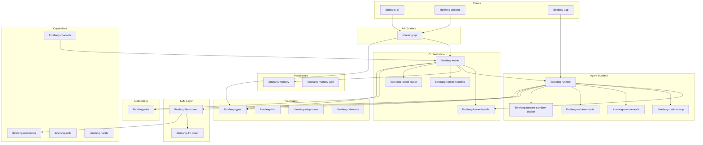

# crates

# crates

Przestrzeń robocza LibreFang Agent OS — modułowy monorepo w języku Rust implementujący samodzielnie hostowaną platformę agentów z obsługą wielu dostawców LLM, autonomicznym planowaniem zadań, integracją z platformami komunikacyjnymi oraz federacją peer-to-peer.

## Architektura warstwowa

## Fundamenty (Foundation Crates)

Trzy liściaste crate'y znajdują się na samym dole grafu zależności i są importowane przez praktycznie wszystko inne:

- [librefang-types](librefang-types.md) — wszystkie między-crate'owe struktury danych: tożsamość agenta, klucze sesji, konfiguracja, enumy błędów, deskryptory zdolności, resolucja i18n. Nie importuje żadnego innego crate'u `librefang-*`.
- [librefang-http](librefang-http.md) — ujednolicony kreator klienta `reqwest` z dołączonymi korzeniami certyfikatów Mozilla i propagacją proxy. Zapobiega panikom TLS w minimalnych środowiskach Docker/musl/Termux.
- [librefang-subprocess](librefang-subprocess.md) — transport JSON rozdzielany nowymi liniami przez stdio dla mostów sidecar. Używany przez kanały i sidecary runtime'u; nie zależy od żadnego innego crate'u w przestrzeni roboczej.

## Warstwa orkiestracji

Kernel jest centralnym orkiestratorem. Zarządza cyklami życia agentów, planowaniem, uprawnieniami i pętlą rozsyłania wiadomości.

- [librefang-kernel](librefang-kernel.md) — główny demon: rejestr agentów, planista, komunikacja międzyagentowa, wymuszanie uprawnień.
- [librefang-kernel-handle](librefang-kernel-handle.md) — 20 wyspecjalizowanych traitów ról (`Arc<dyn SomeRole>`), które definiują kontrakt między kernelem a runtime'em. Konkretny `LibreFangKernel` implementuje te traity; runtime konsumuje je bez bezpośredniej zależności od crate'u kernela.
- [librefang-kernel-metering](librefang-kernel-metering.md) — bramki budżetowe przed wywołaniem (globalne, per agent, per użytkownik, per dostawca) oraz zapis kosztów po wywołaniu w SQLite.
- [librefang-kernel-router](librefang-kernel-router.md) — routowanie oparte na ważonych słowach kluczowych i opcjonalnie na embeddach, wybierające najlepszy szablon lub „hand" dla przychodzącej wiadomości.

## Runtime agentów

Gdy kernel przekazuje wiadomość do agenta, przejmuje [librefang-runtime](librefang-runtime.md): uruchamia pętlę turową, zarządza oknami kontekstu, wysyła narzędzia i koordynuje piaskownice. Konsumuje kernel wyłącznie przez traity ról `KernelHandle` — brak zależności cyklicznej.

Wyspecjalizowane podsystemy runtime'u zostały wydzielone do własnych crate'ów podczas podziału „god-crate" (#3710):

- [librefang-runtime-mcp](librefang-runtime-mcp.md) — klient MCP łączący agentów z zewnętrznymi serwerami narzędzi przez stdio, SSE, strumieniowe HTTP lub legacy HTTP. Obejmuje skanowanie argumentów narzędzi pod kątem zanieczyszczeń.
- [librefang-runtime-audit](librefang-runtime-audit.md) — dziennik audytu w postaci łańcucha skrótów Merkle'a SHA-256 z opcjonalną persystencją w SQLite i zewnętrznymi plikami kotwicznymi zapewniającymi ochronę przed manipulacją między restartami.
- [librefang-runtime-media](librefang-runtime-media.md) — niezależny od dostawcy TTS, generowanie obrazów/wideo/muzyki, rozpoznawanie mowy na tekst i opisywanie obrazów za ujednoliconym trait'em z leniwie buforowanymi sterownikami.
- [librefang-runtime-sandbox-docker](librefang-runtime-sandbox-docker.md) — izolacja na poziomie systemu operacyjnego oparta na Dockerze, z walidacją sieci, zdolności i montowań.

## Warstwa LLM

- [librefang-llm-driver](librefang-llm-driver.md) — trait `LlmDriver`, typy żądań/odpowiedzi oraz in-memory rejestr wyczerpania. Brak SDK dostawców, brak `reqwest` — stabilny crate kontraktu.
- [librefang-llm-drivers](librefang-llm-drivers.md) — konkretne implementacje (Anthropic, OpenAI, Gemini, Groq, Ollama, Claude Code, Codex CLI, Copilot, …) z pulowaniem poświadczeń, łańcuchami awaryjnymi, ponownymi próbami z wycofywaniem i obsługą strumieni SSE.

## Persystencja

- [librefang-memory](librefang-memory.md) — główny substrat. Pojedyncza pula SQLite r2d2 wspierająca strukturalny stan klucz/wartość, semantyczne wyszukiwanie wektorowe, relacje grafu wiedzy, historię sesji, pamięć proaktywną oraz sklepy operacyjne (powiązania kanałów, przebiegi celów, przebiegi workflow, cache idempotencji, śledzenie użycia).
- [librefang-memory-wiki](librefang-memory-wiki.md) — trwały, edytowalny przez człowieka magazyn wiedzy w Markdown z proweniencją YAML frontmatter i detekcją edycji na podstawie skrótu zawartości. Domyślnie wyłączony; uzupełnia substrat pamięci o nawigowalność i ścieżki audytu.

## API i interfejsy klientów

Wszyscy klienci komunikują się z demonem przez pojedynczą powierzchnię HTTP/WebSocket:

- [librefang-api](librefang-api.md) — aplikacja axum eksponująca cykl życia agentów, sesje, kanały, zatwierdzenia, MCP, sieć peer-to-peer, budżety/pomiary, audyt i dołączoną aplikację React dashboard SPA przez JSON REST, SSE i WebSocket. Kernel uruchamia się w procesie.
- [librefang-cli](librefang-cli.md) — plik binarny `librefang`. Przekazuje żądania do uruchomionego demona przez HTTP lub uruchamia kernel w procesie dla poleceń jednorazowych. Obejmuje interaktywny interfejs terminalowy.
- [librefang-desktop](librefang-desktop.md) — powłoka Tauri 2.0. Tryb desktopowy osadza serwer API lokalnie z zasobnikiem systemowym i automatycznymi aktualizacjami; tryb mobilny to cienki klient webview łączący się ze zdalnym demonem.
- [librefang-acp](librefang-acp.md) — łączy runtime agenta z Agent Client Protocol, pozwalając edytorom (Zed, VS Code, JetBrains) natywnie osadzać agentów LibreFang z własnymi modułami zatwierdzania i strumieniowaniem promptów.

## Zdolności i rozszerzenia

- [librefang-extensions](librefang-extensions.md) — katalog serwerów MCP, sejf poświadczeń AES-256-GCM z integracją pęgli kluczy systemu, ładowanie `.env` oraz przepływy OAuth2 PKCE. Znajduje się nad kernelem, poniżej warstw API/CLI/desktop.
- [librefang-skills](librefang-skills.md) — rejestr umiejętności, loader, klient marketplace ClawHub, kompatybilność z OpenClaw oraz napędzana przez agentów samoewolucja z blokowaniem per umiejętność i weryfikacją łańcucha dostaw.
- [librefang-hands](librefang-hands.md) — wyselekcjonowane pakiety autonomicznych agentów uruchamianych zgodnie z harmonogramem lub zdarzeniami, a nie interaktywnie. Obejmują schemat TOML, klient marketplace'u i lokalny rejestr.
- [librefang-channels](librefang-channels.md) — warstwa mostowa łącząca adaptery sidecar w Pythonie (Telegram, Slack, Discord, …) z kernelem. Zarządza routowaniem, formatowaniem, limitami szybkości, sanityzacją, debouncingiem i logowaniem odzyskiwania po awarii.

## Sieć i federacja

- [librefang-wire](librefang-wire.md) — Protokół LibreFang Wire (OFP): sieciowanie TCP między agentami z autentykacją HMAC + Ed25519, doskonałość w przód X25519, ochroną przed powtórzeniem nonce i limitami szybkości per peer. Pozwala kernelom na różnych hostach wykrywać i routować do agentów nawzajem.

## Import / Eksport

- [librefang-import](librefang-import.md) — silnik migracji do importowania agentów, pamięci, sesji i umiejętności z OpenClaw (JSON5/YAML) oraz OpenFang. LangChain i AutoGPT są zakomentowane (stubby).
- [librefang-rl-export](librefang-rl-export.md) — powierzchnia eksportu dla trajektorii rolloutów RL o długim horyzoncie, dostarczająca nieprzezroczyste bajty ładunku do zewnętrznej usługi śledzenia RL.

## Infrastruktura

- [librefang-telemetry](librefang-telemetry.md) — metryki OpenTelemetry + Prometheus z normalizacją ścieżek zapobiegającą nieograniczonemu kardynalnościom etykiet.
- [librefang-testing](librefang-testing.md) — mock kernela, mock sterownika LLM oraz narzędzia testowe HTTP umożliwiające testy integracyjne bez pełnego demona lub wywołań sieciowych.

## Kluczowe przepływy między crate'ami

### Wiadomość przychodząca → odpowiedź agenta

Wiadomość przybywa przez jeden z trzech punktów wejścia — API (HTTP/WS z CLI/desktop), most kanałów (z sidecara platformy komunikacyjnej) lub protokół wire (z kernela peer'a). We wszystkich przypadkach ścieżka zbiega się w kernelu, który używa routera do wyboru agenta/ szablonu docelowego, sprawdza bramki pomiarów i przekazuje do runtime'u. Runtime wykonuje pętlę turową, wywołując sterowniki LLM do generowania, MCP do wywoływania narzędzi, pamięć do pobierania kontekstu i audyt do nagrywania. Odpowiedzi wracają przez oryginalny transport.

### Ewolucja umiejętności z skanowaniem bezpieczeństwa

Gdy agent proponuje mutację umiejętności (`evolve_update_skill` lub `evolve_rollback_skill`), trasa API wywołuje silnik ewolucji `librefang-skills`, który waliduje treść promptu i deleguje do weryfikatora łańcucha dostaw. Weryfikator buduje zbiory `ThreatPattern` i skanuje zmienioną umiejętność przed zatwierdzeniem zmiany z historią wersji i blokowaniem per umiejętność.

### Tworzenie agenta z i18n

Trasa API `spawn_agent` rozwiązuje manifest agenta, który wywołuje system i18n `librefang-types` (`resolve_language` → `t` / `t_args`) do lokalizacji konfiguracji agenta. Kernel rejestruje agenta, runtime przygotowuje kontekst wykonania, a pomiary zaczynają śledzenie od pierwszego wywołania LLM.

### Federacja między hostami

Gdy dwa demony LibreFang wykryją się nawzajem (przez skonfigurowane punkty końcowe peer'ów), protokół wire nawiązuje uwierzytelnioną, szyfrowaną sesję. Kernele wymieniają katalogi agentów i mogą następnie transparentnie routować wiadomości do agentów zdalnych — runtime wysyłającego kernela widzi agenta zdalnego tak samo jak lokalnego, a warstwa wire obsługuje transport, ochronę przed powtórzeniami i limity szybkości.
