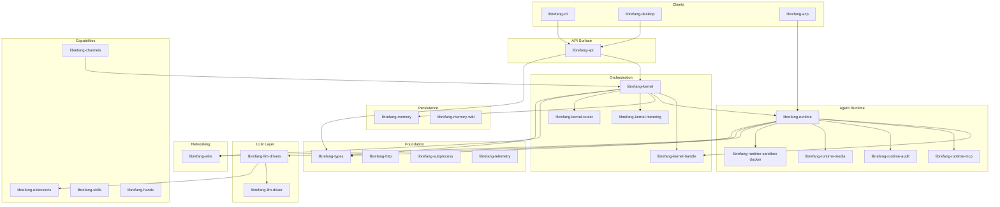

# crates

# crates

The LibreFang Agent OS workspace — a modular Rust monorepo implementing a self-hosted agent platform with multi-provider LLM support, autonomous task scheduling, messaging-platform integration, and peer-to-peer federation.

## Layered Architecture

## Foundation Crates

Three leaf crates sit at the bottom of the dependency graph and are imported by virtually everything else:

- [librefang-types](librefang-types.md) — every cross-crate data structure: agent identity, session keys, config, error enums, capability descriptors, i18n resolution. Imports no other `librefang-*` crate.
- [librefang-http](librefang-http.md) — unified `reqwest` client builder with bundled Mozilla CA roots and proxy propagation. Prevents TLS panics on minimal Docker/musl/Termux environments.
- [librefang-subprocess](librefang-subprocess.md) — newline-delimited JSON-over-stdio transport for sidecar bridges. Used by channels and runtime sidecars; depends on no other workspace crate.

## Orchestration Layer

The kernel is the central orchestrator. It owns agent lifecycles, scheduling, permissions, and the message fan-out loop.

- [librefang-kernel](librefang-kernel.md) — core daemon: agent registry, scheduler, inter-agent messaging, permission enforcement.
- [librefang-kernel-handle](librefang-kernel-handle.md) — 20 focused role traits (`Arc<dyn SomeRole>`) that define the kernel↔runtime contract. The concrete `LibreFangKernel` implements these; the runtime consumes them without a direct dependency on the kernel crate.
- [librefang-kernel-metering](librefang-kernel-metering.md) — pre-call budget gates (global, per-agent, per-user, per-provider) and post-call cost recording in SQLite.
- [librefang-kernel-router](librefang-kernel-router.md) — weighted keyword + optional embedding-based routing that selects the best template or hand for an inbound message.

## Agent Runtime

When the kernel dispatches a message to an agent, [librefang-runtime](librefang-runtime.md) takes over: it runs the turn-by-turn loop, manages context windows, dispatches tools, and coordinates sandboxes. It consumes the kernel exclusively through `KernelHandle` role traits — no circular dependency.

Specialized runtime subsystems were extracted into their own crates during the god-crate split (#3710):

- [librefang-runtime-mcp](librefang-runtime-mcp.md) — MCP client connecting agents to external tool servers over stdio, SSE, streamable HTTP, or legacy HTTP. Includes taint scanning of tool arguments.
- [librefang-runtime-audit](librefang-runtime-audit.md) — SHA-256 Merkle hash chain audit log with optional SQLite persistence and external anchor files for tamper-evidence across restarts.
- [librefang-runtime-media](librefang-runtime-media.md) — provider-agnostic TTS, image/video/music generation, speech-to-text, and image description behind a unified trait with lazy-cached drivers.
- [librefang-runtime-sandbox-docker](librefang-runtime-sandbox-docker.md) — Docker-based OS-level isolation for agent code execution with network, capability, and mount validation.

## LLM Layer

- [librefang-llm-driver](librefang-llm-driver.md) — the `LlmDriver` trait, request/response types, and in-memory exhaustion ledger. No provider SDKs, no `reqwest` — a stable contract crate.
- [librefang-llm-drivers](librefang-llm-drivers.md) — concrete implementations (Anthropic, OpenAI, Gemini, Groq, Ollama, Claude Code, Codex CLI, Copilot, …) with credential pooling, fallback chains, retry/backoff, and SSE stream handling.

## Persistence

- [librefang-memory](librefang-memory.md) — the primary substrate. A single r2d2 SQLite pool backing structured key/value state, semantic vector search, knowledge graph relations, session history, proactive memory, and operational stores (channel bindings, goal runs, workflow runs, idempotency cache, usage tracking).
- [librefang-memory-wiki](librefang-memory-wiki.md) — durable, human-editable Markdown knowledge vault with YAML frontmatter provenance and content-hash edit detection. Off by default; complements the memory substrate with navigability and audit trails.

## API & Client Surfaces

All clients communicate with the daemon through a single HTTP/WebSocket surface:

- [librefang-api](librefang-api.md) — axum application exposing agent lifecycle, sessions, channels, approvals, MCP, peer networking, budget/metering, audit, and a bundled React dashboard SPA over JSON REST, SSE, and WebSocket. The kernel runs in-process.
- [librefang-cli](librefang-cli.md) — the `librefang` binary. Forwards to a running daemon over HTTP, or boots an in-process kernel for single-shot commands. Includes an interactive terminal UI.
- [librefang-desktop](librefang-desktop.md) — Tauri 2.0 shell. Desktop mode embeds the API server locally with system tray and auto-update; mobile mode is a thin webview client to a remote daemon.
- [librefang-acp](librefang-acp.md) — bridges the agent runtime to the Agent Client Protocol, letting editors (Zed, VS Code, JetBrains) embed LibreFang agents natively with their own approval modals and prompt streaming.

## Capabilities & Extensions

- [librefang-extensions](librefang-extensions.md) — MCP server catalog, AES-256-GCM credential vault with OS keyring integration, `.env` loading, and OAuth2 PKCE flows. Sits above the kernel, below the API/CLI/desktop layers.
- [librefang-skills](librefang-skills.md) — skill registry, loader, ClawHub marketplace client, OpenClaw compatibility, and agent-driven self-evolution with per-skill locking and supply-chain verification.
- [librefang-hands](librefang-hands.md) — curated autonomous agent packages that run on schedules or events rather than interactively. Includes TOML schema, marketplace client, and local registry.
- [librefang-channels](librefang-channels.md) — bridge layer connecting Python sidecar adapters (Telegram, Slack, Discord, …) to the kernel. Owns routing, formatting, rate limiting, sanitization, debouncing, and crash-recovery journaling.

## Networking & Federation

- [librefang-wire](librefang-wire.md) — the LibreFang Wire Protocol (OFP): agent-to-agent TCP networking with HMAC + Ed25519 authentication, X25519 forward secrecy, nonce replay protection, and per-peer rate limiting. Enables kernels on different hosts to discover and route to each other's agents.

## Import / Export

- [librefang-import](librefang-import.md) — migration engine for importing agents, memory, sessions, and skills from OpenClaw (JSON5/YAML) and OpenFang. LangChain and AutoGPT are stubbed.
- [librefang-rl-export](librefang-rl-export.md) — egress surface for long-horizon RL rollout trajectories, delivering opaque payload bytes to an external RL-tracking service.

## Infrastructure

- [librefang-telemetry](librefang-telemetry.md) — OpenTelemetry + Prometheus metrics with path normalization to prevent unbounded label cardinality.
- [librefang-testing](librefang-testing.md) — mock kernel, mock LLM driver, and HTTP test utilities enabling integration tests without a full daemon or network calls.

## Key Cross-Crate Workflows

### Inbound message → agent response

A message arrives through one of three entry points — the API (HTTP/WS from CLI/desktop), the channels bridge (from a messaging platform sidecar), or the wire protocol (from a peer kernel). In all cases the path converges on the kernel, which uses the router to select a target agent/template, checks metering gates, and hands off to the runtime. The runtime executes the turn loop, calling LLM drivers for completions, MCP for tool invocation, memory for context retrieval, and audit for recording. Replies flow back out through the originating transport.

### Skill evolution with security scanning

When an agent proposes a skill mutation (`evolve_update_skill` or `evolve_rollback_skill`), the API route calls into `librefang-skills`'s evolution engine, which validates prompt content and delegates to the supply-chain verifier. The verifier builds `ThreatPattern` sets and scans the mutated skill against them before the change is committed with version history and per-skill locking.

### Agent spawn with i18n

The `spawn_agent` API route resolves the agent manifest, which invokes `librefang-types`'s i18n system (`resolve_language` → `t` / `t_args`) to localize agent configuration. The kernel then registers the agent, the runtime prepares its execution context, and metering begins tracking from the first LLM call.

### Cross-host federation

When two LibreFang daemons discover each other (via configured peer endpoints), the wire protocol establishes an authenticated, encrypted session. The kernels exchange agent directories and can then route messages to remote agents transparently — the sending kernel's runtime sees a remote agent the same way it sees a local one, with the wire layer handling transport, replay protection, and rate limiting.