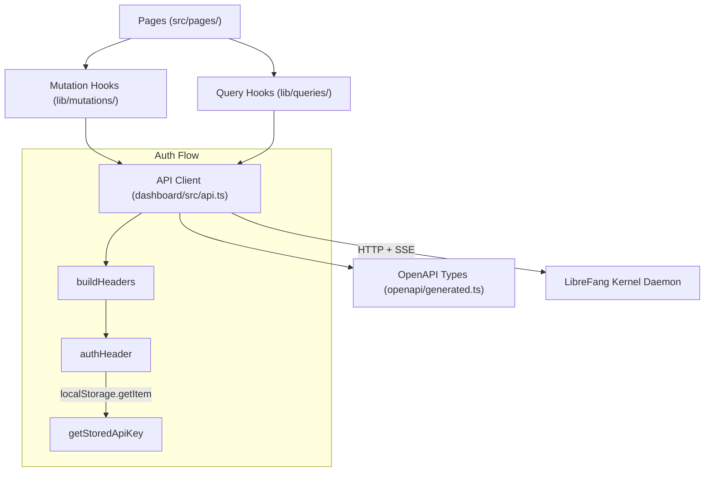
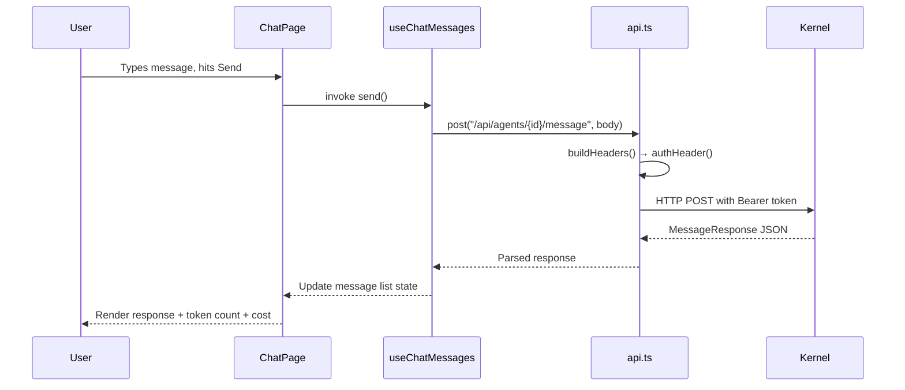

# Dashboard Application

# Dashboard Application

The dashboard is a React-based web frontend for the LibreFang agent platform. It provides a management UI for agents, sessions, skills, channels, workflows, memory, budgets, MCP servers, and all other kernel subsystems. The frontend communicates with the LibreFang kernel daemon through a RESTful API.

## Architecture Overview

## API Client (`dashboard/src/api.ts`)

The central HTTP client wraps `fetch` and handles authentication, error parsing, and response typing. Every data-fetching and mutation path in the dashboard flows through this module.

### Core HTTP Primitives

| Function | Purpose |
|----------|---------|
| `get(path)` | JSON GET request |
| `getText(path)` | Plain-text GET (used for metrics, raw file content) |
| `post(path, body)` | JSON POST request |
| `put(path, body)` | JSON PUT request |
| `patch(path, body)` | JSON PATCH request |
| `del(path)` | DELETE request |

All primitives call `buildHeaders()` to attach authentication, then call `parseError()` on non-2xx responses to produce structured error objects.

### Authentication

Authentication is API-key-based, stored in `localStorage`:

- **`authHeader()`** — reads the stored key via `getStoredApiKey()` (wraps `localStorage.getItem`) and returns `{ Authorization: "Bearer <key>" }`
- **`setApiKey(key)`** — persists the key to `localStorage` and updates the in-memory singleton
- **`clearApiKey()`** — removes the key from `localStorage`, used when a 401 is encountered
- **`dashboardLogin(provider)`** — initiates OAuth2 login flow with a specific provider
- **`verifyStoredAuth()`** — validates the stored key against `/api/auth/introspect`

When any request returns a 401, the client calls `clearApiKey()` and the router redirects to the login page. This flow is visible in the execution traces: for example, `ChatPage` → `useCreateAgentSession` → `createAgentSession` → `post` → `buildHeaders` → `authHeader` → `getItem` → … → on 401 → `clearApiKey`.

### Error Handling

`parseError(response)` consumes the response body and throws an `ApiError` (from `lib/http/errors.ts`) containing the status code and a human-readable message. All mutation and query hooks catch this error type for toast notifications and error boundaries.

## OpenAPI Type Definitions (`openapi/generated.ts`)

Auto-generated by `openapi-typescript` from the kernel's OpenAPI spec. **Do not edit manually** — regenerate after any backend route changes.

### Structure

The file exports three main namespaces:

- **`paths`** — maps every URL path to its HTTP methods, parameter shapes, and operation IDs
- **`components["schemas"]`** — request/response body types (`SpawnRequest`, `MessageRequest`, `BulkCreateRequest`, etc.)
- **`operations`** — per-operation type unions used for request/response typing

### Key Request Schemas

| Schema | Used By | Purpose |
|--------|---------|---------|
| `SpawnRequest` | `spawn_agent`, `bulk_create_agents` | Create an agent from TOML manifest or template name |
| `MessageRequest` | `send_message`, `send_message_stream` | Send a chat message with optional attachments, channel metadata, thinking overrides |
| `PatchAgentConfigRequest` | `patch_agent_config` | Hot-update agent name, prompt, model, temperature, web search mode |
| `BulkAgentIdsRequest` | `bulk_start_agents`, `bulk_stop_agents`, `bulk_delete_agents` | Operate on multiple agents by ID list |
| `CloneAgentRequest` | `clone_agent` | Clone an agent with optional skill/tool inclusion |
| `CallbackBody` | `auth_callback_post` | OAuth2 authorization code + state parameter |

### API Domain Map

The API surface covers these functional domains:

**Agents** (`/api/agents/*`)
- CRUD, clone, bulk operations, mode switching, model selection
- Messaging (synchronous and SSE streaming)
- Session management (list, create, switch, export/import, reset, reboot, compact)
- File workspace, skills, tools, MCP server assignments
- Memory export/import, traces, deliveries, upload attachments

**Agent-to-Agent (A2A)** (`/a2a/*`, `/api/a2a/*`)
- Internal agent card listing and task management
- External agent discovery, task dispatch, status polling

**Authentication** (`/api/auth/*`)
- Multi-provider OAuth2 login, callback handling, token introspection, user info

**Channels** (`/api/channels/*`)
- Listing 40+ channel adapters with status
- Per-channel configuration, testing, hot-reload
- WhatsApp/WeChat QR login flows

**Communications** (`/api/comms/*`)
- Inter-agent messaging, task queue, topology graph, event streaming (SSE)

**MCP Servers** (`/api/mcp/*`)
- Server CRUD, catalog browsing, health checks, reconnection, HTTP JSON-RPC bridge

**Memory** (`/api/memory/*`)
- Proactive memory CRUD, search, consolidation, deduplication, per-agent scoping, KV store, import/export, cleanup

**Budget & Usage** (`/api/budget/*`, `/api/usage/*`)
- Global and per-agent budget limits, cost ranking, usage stats by model, daily breakdowns

**Workflows** (`/api/workflows/*`)
- Workflow CRUD, execution, run history, save-as-template

**Scheduling** (`/api/cron/*`, `/api/schedules/*`)
- Cron job CRUD, enable/disable toggle, manual trigger, status

**Hands** (`/api/hands/*`)
- Hand marketplace browsing, activation (spawns agent), deactivation, pause/resume, settings, dependency management, browser state

**Skills & Extensions** (`/api/skills/*`, `/api/extensions/*`, `/api/clawhub/*`)
- Install/uninstall, ClawHub marketplace browse/search/install with security pipeline

**Configuration & System** (`/api/config/*`, `/api/health`, `/api/metrics`, etc.)
- Config get/set/reload/schema, health probes, Prometheus metrics, backup/restore, shutdown

## Query and Mutation Hooks

### Query Hooks (`lib/queries/`)

Each file exports React Query hooks that wrap the API client functions:

| Module | Example Hooks | API Functions Called |
|--------|---------------|---------------------|
| `workflows.ts` | `useWorkflow`, `useWorkflowTemplates` | `getWorkflow`, `listWorkflowTemplates` |
| `channels.ts` | `useCommsEvents` | `listCommsEvents` |
| `mcp.ts` | `useMcpHealth` | MCP health check → kernel supervisor |
| `hands.ts` | `useHandStats` | Hand stats → proactive memory subsystem |
| `terminal.ts` | `useTerminalHealth` | Terminal health → kernel supervisor |
| `memory.ts` | `useMemoryStats` | Memory stats → proactive memory subsystem |
| `sessions.ts` | Session streaming hooks | SSE event handling |

### Mutation Hooks (`lib/mutations/`)

Each file exports React Query mutation hooks:

| Module | Example Hooks |
|--------|---------------|
| `agents.ts` | `useCreateAgentSession` |
| `approvals.ts` | `useApproveApproval` |
| `schedules.ts` | `useDeleteSchedule` |
| `workflows.ts` | `useUpdateWorkflow` |
| `goals.ts` | `useUpdateGoal` |
| `providers.ts` | `useSetProviderKey` |

Mutations follow the same pattern: page component → mutation hook → API client function → `buildHeaders` → `authHeader` → `localStorage` lookup → HTTP request → `parseError` on failure.

## Page Components

Each page corresponds to a major dashboard view and consumes the query/mutation hooks:

| Page | Route | Key Interactions |
|------|-------|-----------------|
| `ChatPage` | Agent chat | Message sending (sync + SSE stream), session management, keyboard shortcuts |
| `TerminalPage` | Terminal emulator | WebSocket terminal sessions, window management |
| `CanvasPage` / `WorkflowsPage` | Workflow editor | Visual workflow building, execution, template management |
| `ModelsPage` | Model catalog | Browse providers, set default models, manage aliases/custom models |
| `ApprovalsPage` | Approval queue | Review, approve, reject pending requests |
| `GoalsPage` | Agent goals | CRUD goal tracking |
| `ConfigPage` | System config | View/edit config.toml values, reload |
| `WizardPage` | Initial setup | Provider key setup, first-run experience |
| `McpServersPage` | MCP management | Server CRUD, health monitoring |

## Real-Time Streaming

The dashboard uses Server-Sent Events (SSE) for real-time data in two contexts:

1. **Log streaming** (`/api/logs/stream`) — audit log tail with level/filter parameters, 15-second heartbeat
2. **Communication events** (`/api/comms/events/stream`) — inter-agent event stream, polled every 500ms
3. **Chat streaming** (`/api/agents/{id}/message/stream`) — token-by-token LLM response streaming

Query hooks for streams attach `addEventListener` / `removeEventListener` for message and error events, with cleanup in `useEffect` return functions. This is visible in the execution traces where pages like `ChatPage`, `ConfigPage`, `ModelsPage`, and `TerminalPage` all register and deregister event listeners.

## Data Flow Example: Sending a Chat Message

For streaming messages, the same flow uses `post()` to `/api/agents/{id}/message/stream` and processes SSE `data:` events incrementally.

## Adding a New API Integration

1. **Add or update the kernel route** — the OpenAPI spec is auto-generated from Rust handler annotations
2. **Regenerate types** — run `openapi-typescript` against the updated spec to update `generated.ts`
3. **Add an API client function** in `dashboard/src/api.ts` using the appropriate primitive (`get`, `post`, `put`, `patch`, `del`)
4. **Create query/mutation hooks** in the appropriate `lib/queries/` or `lib/mutations/` file
5. **Consume the hook** from the target page or component

## Testing Patterns

- **API client tests** (`api.test.ts`) verify `setApiKey`, `getAgentTools`, `patchHandAgentRuntimeConfig`, `getMetricsText`, `verifyStoredAuth`, and `getItem`/`get` interactions
- **Mutation tests** (`workflows.test.tsx`, `schedules.test.tsx`) use `createQueryClientWrapper` from `lib/test/query-client.tsx` to provide a React Query context
- **Component tests** (`DeliveryTargetsEditor.test.tsx`) test builder functions like `buildTarget`
- **Utility tests** (`chat.test.ts`, `chatPicker.test.ts`, `csvParser.test.ts`) cover pure functions independently