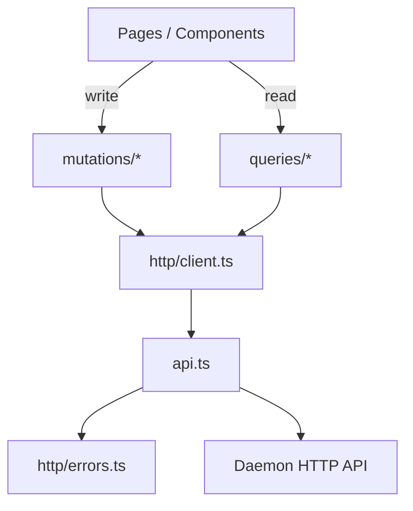

# Dashboard Data Layer

# Dashboard Data Layer

The data layer mediates between the React UI and the Librefang daemon API. It covers HTTP transport, TanStack Query cache management, agent manifest TOML round-tripping, chat message normalization, and a collection of shared utilities.

## Architecture



All data flows through a single import boundary (`http/client.ts`). Pages never import `api.ts` directly — the whitelist facade ensures every consumed symbol is intentional and that renames in `api.ts` surface as compile errors in the facade rather than silently propagating to hooks.

---

## HTTP Layer

### Client Facade — `http/client.ts`

An explicit re-export layer. It does three things:

1. **Re-exports query functions** (`listAgents`, `getAgentDetail`, `listModels`, etc.) — every read operation the UI needs.
2. **Re-exports mutation functions** (`spawnAgent`, `deleteSession`, `installSkill`, etc.) — every write operation.
3. **Re-exports types** (`UserItem`, `PromptExperiment`, `ProviderBudgetRow`, etc.) — shared shapes consumed by hooks and pages.

The file uses named exports only (no `export *`) so the surface is auditable. Removing a symbol from `api.ts` breaks here first, not in downstream hooks.

### Error Handling — `http/errors.ts`

`ApiError` is the structured error thrown by `api.ts`'s `parseError` helper. It captures:

| Field | Source |
|-------|--------|
| `status` | HTTP status code |
| `code` | Error code string from the response body |
| `message` | Human-readable message |

`ApiError.fromResponse(response)` parses the response body, trying four envelope shapes in priority order:

1. Nested: `{ error: { code, message, request_id } }`
2. Flat detail: `{ detail: "..." }`
3. Flat message: `{ message: "..." }`
4. Flat error: `{ error: "..." }`

The `toastErr` helper in `errors.ts` unwraps unknown thrown values into display strings, walking the `cause` chain up to 5 levels deep to find the most specific message.

---

## Query and Mutation Layer

### Query Key Factories — `queries/keys.ts`

Each domain has a factory object producing stable, hierarchical query keys:

```ts
agentKeys.all          → ["agents"]
agentKeys.lists()      → ["agents", "list"]
agentKeys.detail(id)   → ["agents", "detail", id]
agentKeys.sessions(id) → ["agents", "sessions", id]
```

These keys drive both cache lookups in query hooks and targeted invalidation in mutation `onSuccess` callbacks.

### Mutation Patterns — `mutations/*`

Mutations follow a consistent structure:

1. **Import the API function** from `http/client.ts`.
2. **Wrap with `useMutation`**, passing the API function as `mutationFn`.
3. **Invalidate affected queries** in `onSuccess` using the key factories.

Two invalidation strategies are used:

**Broad invalidation** — most mutations invalidate a whole subtree:

```ts
onSuccess: (_data, variables) => {
  qc.invalidateQueries({ queryKey: agentKeys.lists() });
  qc.invalidateQueries({ queryKey: agentKeys.detail(variables.agentId) });
}
```

**Optimistic cache patch** — mutations whose API returns the updated entity patch the cache directly, then invalidate as a safety net:

```ts
onSuccess: (data, variables) => {
  qc.setQueryData<PromptExperiment[]>(
    agentKeys.experiments(variables.agentId),
    (prev) => prev?.map((e) => (e.id === data.id ? data : e)),
  );
  qc.invalidateQueries({ queryKey: agentKeys.experiments(variables.agentId) });
}
```

This eliminates the stale-read window between the mutation completing and the refetch landing.

### Agent Mutations — `mutations/agents.ts`

The largest mutation file. Notable hooks:

| Hook | Endpoint | Scope |
|------|----------|-------|
| `usePatchAgent` | `PATCH /agents/{id}` | Manifest-level fields (name, description, system_prompt, mcp_servers) |
| `usePatchAgentConfig` | `PATCH /agents/{id}/config` | Model-tuning for standalone agents |
| `usePatchHandAgentRuntimeConfig` | `PATCH /agents/{id}/hand-runtime-config` | Per-role overrides inside a hand group |
| `useClearHandAgentRuntimeConfig` | `DELETE /agents/{id}/hand-runtime-config` | Restores HAND.toml defaults |

`usePatchAgentConfig` and `usePatchHandAgentRuntimeConfig` accept the same `AgentConfigPatch` type (model, provider, temperature, max_tokens). Hand overrides additionally support `api_key_env` and `base_url` as tri-state fields (absent = unchanged, empty = clear, non-empty = set).

Hand-agent mutations invalidate `handKeys.details()` in addition to agent keys, because the hand-detail view surfaces per-role runtime state.

### Query Options — `queries/options.ts`

Several query hooks (agents, skills, MCP, models) route through a `withOverrides` helper that merges caller-provided `UseQueryOptions` with defaults. This allows pages to customize `enabled`, `staleTime`, or `select` without re-implementing the query function.

---

## Agent Manifest — TOML Round-Tripping

### Core Module — `agentManifest.ts`

Manages bi-directional conversion between TOML text and a structured form state, with a critical property: **unknown fields survive the round-trip**.

#### Data Model

```ts
interface ManifestFormState { /* ~60 fields covering the form UI */ }
interface ManifestExtras {
  topLevel: TomlTable;   // unknown top-level keys
  model: TomlTable;      // unknown keys under [model]
  resources: TomlTable;  // unknown keys under [resources]
  capabilities: TomlTable; // unknown keys under [capabilities]
}
```

The form covers fields the visual editor exposes. Anything the form doesn't understand (tools tables, metadata, profile sections, provider-specific flattened fields) is captured in `extras` and re-emitted unchanged during serialization.

#### Parse Flow — `parseManifestToml`

1. Parse TOML with `smol-toml`.
2. Populate `ManifestFormState` using type-coercing helpers (`asString`, `asNumberString`, `asBoolean`, `asStringArray`, `asEnum`).
3. For each section (`[model]`, `[resources]`, `[capabilities]`), strip known keys — everything remaining goes into the corresponding `extras` bucket.
4. Handle special cases:
   - `exec_policy` aliases (`none`→`deny`, `restricted`→`allowlist`, etc.) are normalized at parse time.
   - `response_format` with an unknown `type` falls back to `{ mode: "text" }` and the raw table is preserved in `topLevel` extras.
   - `[[fallback_models]]` entries capture provider-specific flattened extras (e.g., Qwen's `enable_memory`) per-item.

Returns `ParseResult | ParseError` — the latter carries `line`/`column` from `smol-toml`'s `TomlError`.

#### Serialize Flow — `serializeManifestForm`

1. Emit top-level scalars, omitting defaults (e.g., `priority: "Normal"` is not emitted).
2. Emit section blocks (`[model]`, `[resources]`, `[capabilities]`).
3. Emit conditional sections (`[thinking]`, `[autonomous]`, `[routing]`) only when enabled.
4. Emit array-of-tables (`[[fallback_models]]`, `[[context_injection]]`).
5. Re-emit deferred extras — sub-tables discovered inside section extras are emitted as proper top-level `[section.subtable]` headers to avoid scoping violations.
6. Emit top-level table extras last (TOML scoping requirement).

Key safety measure: `renderExtraScalars` refuses multi-line output. A stray `[name]` header embedded inside a section block would re-anchor TOML scoping and corrupt the output.

#### Numeric Handling

All numeric form fields are stored as raw strings. `parseInteger` rejects negatives and values beyond `MAX_SAFE_INTEGER` (the kernel uses unsigned Rust types). `parseFloatish` rejects negatives for cost/quota fields. Empty strings are omitted rather than defaulted to zero — this preserves kernel defaults when the user leaves a field blank.

#### Validation — `validateManifestForm`

Returns an array of field names that are required but empty (`name`, `model.provider`, `model.model`). Empty array = submittable.

### Markdown Renderer — `agentManifestMarkdown.ts`

Converts `ManifestFormState` + `ManifestExtras` into human-readable Markdown for documentation, code review, or sharing. Structure mirrors the form layout:

- **Header** — name, version, description, author, tags, enabled status
- **Model** — provider, model, temperature, system prompt
- **Resources** — table of configured limits
- **Capabilities** — bullet list of granted permissions
- **Advanced sections** — schedule, fallback models, thinking, autonomous, routing, context injection, response format (only emitted when non-default)
- **Lifecycle & Overrides** — fields that differ from kernel defaults
- **Advanced configuration appendix** — anything preserved from extras

### UIDs

`generateUid()` produces monotonically increasing string IDs for dynamic form rows (fallback models, context injection entries). These are client-only identifiers that never reach TOML.

---

## Chat Data Flow

### Message Normalization — `chat.ts`

| Function | Purpose |
|----------|---------|
| `normalizeRole` | Maps kernel role strings (`"User"`, `"Assistant"`, `"System"`) to lowercase |
| `asText` | Serializes unknown values to strings, handling circular references |
| `formatMeta` | Formats token counts, iterations, and cost into a compact display string |
| `normalizeToolOutput` | Extracts tool name, result text, and error status from tool-result events |
| `extractAssistantHistoryParts` | Splits persisted `ContentBlock[]` into visible text and thinking strings |

`extractAssistantHistoryParts` handles the reload path: when a chat is reloaded from the server, assistant messages arrive as `ContentBlock[]` arrays rather than the flat strings used during live streaming. The function joins multiple `text` blocks and multiple `thinking` blocks with `\n\n` (paragraph break for markdown), matching the live-streaming accumulation model. `tool_use` and `tool_result` blocks are skipped — the chat UI reads those from the separate `msg.tools` field.

### Chat Picker — `chatPicker.ts`

Partitions agents into standalone agents and hand-groups for the chat sidebar:

1. Filter hand instances to "usable" ones (Active status, has agent mappings, has `hand_id`/`hand_name`).
2. Build a membership lookup: agent_id → hand metadata + role + isCoordinator.
3. Group agents by `hand_id`, sort within groups (coordinator first, then alphabetical by role), sort groups by `hand_name`.
4. `is_hand` agents whose hand instance is inactive or missing are dropped entirely.

Handles the loading state gracefully: when `handInstances` is `undefined` (query unresolved), all agents appear as standalone to prevent URL-pinned hand agents from disappearing during bootstrap.

### Session Cache — `chatSessionCache.ts`

An in-memory LRU cache for chat session message history. Limits:

- **50 entries** maximum
- **30 minute TTL** per entry
- Evicts expired entries first, then oldest insertion-order entries down to 80% capacity on overflow

Keyed by `agentId:sessionId`. Agent-scoped bulk clear (`clearChatSessionCacheForAgent`) is used by `useResetAgentSession`.

---

## Utility Modules

### `bundleMode.ts`

Patches `window.fetch` and `window.WebSocket` for the mobile Tauri shell. In release builds, the dashboard loads from `tauri://localhost` but API requests must go to the daemon. The shell encodes the daemon URL in `#api=<encoded>`, which this module extracts, persists to localStorage, and uses to rewrite same-origin paths.

`PatchedWS` extends the real `WebSocket` constructor so `instanceof` checks and static constants (`OPEN`, `CONNECTING`, etc.) work correctly.

**Critical timing**: `setupBundleMode()` must run before `createRoot().render()` in `main.tsx`. Any module that eagerly fetches during evaluation would bypass the patches.

### `canvas.ts`

Single pure function: `removeNodeAndCascadeEdges`. Removes a workflow node and all edges referencing it. Mirrors xyflow's built-in Backspace deletion for the context-menu delete path.

### `clipboard.ts`

`copyToClipboard` — prefers `navigator.clipboard.writeText` (secure contexts), falls back to `document.execCommand("copy")` with a detached textarea for LAN-IP HTTP deployments.

### `csvParser.ts`

RFC-4180 compliant CSV tokenizer for user bulk import. Handles:
- UTF-8 BOM stripping
- Quoted fields with embedded commas, newlines, and escaped quotes (`""`)
- CRLF, LF, and CR line endings

`parseUsersCsv` is the semantic layer: validates `name`/`role` columns, collects extra columns as `channel_bindings`, and reports per-row errors while still returning parseable rows.

### `datetime.ts`

Formatting helpers: `formatDateTime`, `formatDate`, `formatTime` (locale-aware), `formatRelativeTime` ("3m ago", "2h ago"), `formatUptime` ("1d 2h").

### `format.ts`

Number formatters: `formatCompact` (1.2K, 3.4M), `formatCost` (USD with 2 or 4 decimal places), `formatBytes` (KB, MB, GB).

### `hiddenModels.ts`

Manages model visibility. `modelKey(m)` produces `"provider:id"`, `filterVisible` excludes hidden keys. Used by the model settings page to let users hide unwanted models.

### `drawerStore.ts`

Zustand store for the global push-drawer slot. One drawer open at a time; opening a new one replaces the current. The `<PushDrawer>` host in `App.tsx` is a flex sibling that pushes main content rather than overlaying.

### `hooks/useMathPlugins.ts`

Lazy-loads `remark-math` + `rehype-katex` + KaTeX CSS only when content contains math delimiters (`$...$`, `$$...$$`, `\(...\)`, `\[...\]`). The resolved plugin pair is cached globally so subsequent consumers don't re-trigger dynamic imports.

---

## Adding a New Query or Mutation

### New Query

1. Add the API function to `api.ts`.
2. Add a named re-export in `http/client.ts` under the "Query functions" section.
3. If it returns a new type, add a type re-export in `http/client.ts` under "Type re-exports".
4. Add a key factory entry in `queries/keys.ts`.
5. Create the query hook in the appropriate `queries/*.ts` file, routing through `withOverrides` if callers need customization.

### New Mutation

1. Add the API function to `api.ts`.
2. Add a named re-export in `http/client.ts` under the "Mutation functions" section.
3. Create the mutation hook in the appropriate `mutations/*.ts` file.
4. In `onSuccess`, invalidate every query key that might be affected. Use `qc.removeQueries` when the mutation deletes an entity (e.g., `useDeleteAgent` removes the detail cache). If the API returns the updated entity, patch the cache with `setQueryData` before invalidating.

### TOML Form Fields

1. Add the field to `ManifestFormState` in `agentManifest.ts`.
2. Add the key to the appropriate `FORM_*_KEYS` set.
3. Set a default in `emptyManifestForm`.
4. Add parse logic in `parseManifestToml`.
5. Add emit logic in `serializeManifestForm`.
6. Add rendering in `agentManifestMarkdown.ts` if the field should appear in the Markdown preview.