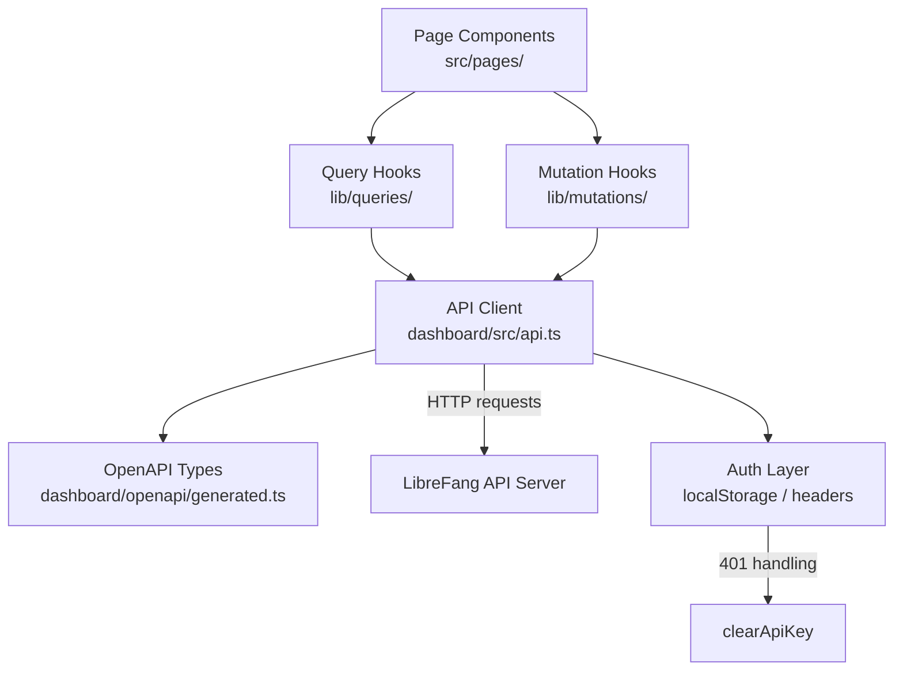

# Dashboard Frontend

# Dashboard Frontend

The dashboard is a React-based single-page application that provides the web interface for managing LibreFang agents, channels, skills, workflows, and all runtime configuration. It communicates with the LibreFang API server through a typed API client layer and React Query-based data fetching hooks.

## Architecture Overview



## Key Layers

### 1. Auto-Generated OpenAPI Types (`dashboard/openapi/generated.ts`)

This file is machine-generated by `openapi-typescript` and must **never** be edited directly. It contains:

- **`paths`** — A discriminated union mapping every API route to its HTTP methods, parameter shapes, and response types. Each path entry lists which methods are available (`get`, `post`, `put`, `delete`, `patch`, etc.) with `never` for unsupported methods.
- **`operations`** — Named operation IDs matching the backend route handlers (e.g., `spawn_agent`, `list_agents`, `send_message_stream`).
- **`components["schemas"]`** — Request and response body types such as `SpawnRequest`, `MessageRequest`, `MessageResponse`, `PatchAgentConfigRequest`, `BulkAgentIdsRequest`, and `AttachmentRef`.

To regenerate after backend API changes:
```bash
npx openapi-typescript http://localhost:3000/api/openapi.json -o dashboard/openapi/generated.ts
```

### 2. API Client (`dashboard/src/api.ts`)

The central HTTP client module. All backend communication flows through here.

#### Core Request Helpers

Four low-level functions handle all HTTP verbs:

| Function | Method | Use |
|----------|--------|-----|
| `get<T>(path)` | GET | Fetching resources |
| `getText(path)` | GET | Fetching raw text (e.g., TOML manifests) |
| `post<T>(path, body?)` | POST | Creating resources, triggering actions |
| `put<T>(path, body?)` | PUT | Replacing/setting resources |
| `del<T>(path)` | DELETE | Removing resources |

Each helper:
1. Calls `buildHeaders()` to attach authentication
2. Serializes the body as JSON (for `post`/`put`)
3. Checks the response status
4. Parses errors via `parseError()`

#### Authentication

The API key is stored in `localStorage` and managed through:

- **`getStoredApiKey()`** — Reads from `localStorage.getItem`
- **`setApiKey(key)`** — Writes to `localStorage.setItem`
- **`clearApiKey()`** — Removes the stored key
- **`authHeader()`** — Retrieves the key for request headers
- **`buildHeaders()`** — Constructs the full `Headers` object including the `Authorization` header
- **`verifyStoredAuth()`** — Validates the stored key against the server; calls `clearApiKey()` on failure

When any request returns a 401, `parseError()` triggers `clearApiKey()` to force re-authentication.

#### Error Handling

`parseError(response)` interprets non-2xx responses and constructs an `ApiError` (from `lib/http/errors.ts`). This error type is what all mutation and query consumers receive.

### 3. Query Hooks (`lib/queries/`)

React Query wrappers that provide cached, auto-refreshing data to page components. Each file corresponds to a domain:

| File | Key Hooks | Primary API Calls |
|------|-----------|-------------------|
| `agents.ts` | `useAgentDetail`, `useAgentSessions`, `useExperimentMetrics` | `getAgentDetail`, `listAgentSessions` |
| `analytics.ts` | `useUsageSummary` | `listUsageByAgent` |
| `hands.ts` | `useHandSession`, `useHandStats`, `useActiveHands` | `getHandSession`, `getHandStats`, `listActiveHands` |
| `mcp.ts` | `useMcpHealth` | `getMcpServer`, MCP health endpoint |
| `memory.ts` | `useMemoryStats` | Memory stats endpoint |
| `runtime.ts` | `auditRecentQueryOptions` | `auditRecent` |
| `overview.ts` | `versionInfoQueryOptions` | Version endpoint |
| `schedules.ts` | Schedule query options | Schedule list endpoints |

Query hooks are consumed directly by page components and compositional UI elements. They use React Query's `queryOptions` pattern for configuration.

### 4. Mutation Hooks (`lib/mutations/`)

Wrappers around React Query mutations for write operations. Notable modules:

| File | Key Mutations |
|------|---------------|
| `agents.ts` | `useCreatePromptVersion`, agent CRUD |
| `channels.ts` | `useTestChannel` |
| `config.ts` | `useSetConfigValue` |
| `runtime.ts` | `useCreateBackup`, `useCleanupSessions` |
| `schedules.ts` | `useCreateSchedule`, `useDeleteSchedule`, `useRunSchedule` |
| `workflows.ts` | `useRunWorkflow` |

Each mutation calls the corresponding `api.ts` function and invalidates relevant query caches on success.

## Typical Execution Flow

Using the "test channel" feature as an example of the full request lifecycle:

```
ChannelsPage component
  → useTestChannel mutation hook (lib/mutations/channels.ts)
    → testChannel() (dashboard/src/api.ts)
      → post('/api/channels/{name}/test', body)
        → buildHeaders()
          → authHeader()
            → getStoredApiKey() → localStorage.getItem
        → fetch() with JSON body
        → parseError() on failure
          → ApiError (lib/http/errors.ts)
          → clearApiKey() on 401
```

## Page Components

Pages live in `src/pages/` and consume query/mutation hooks. Key pages include:

- **ChatPage** / **CanvasPageInner** — Agent chat interface; reads auth state from `localStorage`
- **AgentsPage** — Agent list, spawning, prompt management (`PromptsExperimentsModal`)
- **ChannelsPage** — Channel configuration and connectivity testing
- **WorkflowsPage** — Workflow creation, execution, and template management
- **McpServersPage** — MCP server status and configuration
- **TerminalPage** — Interactive terminal connected to agent sessions

## Routing

`dashboard/src/router.tsx` sets up the SPA router using lazy-loaded page components via `lazyWithReload`, which supports hot module replacement during development. Route guards check for a stored API key via `localStorage.getItem`.

## Internationalization

`src/lib/i18n.ts` initializes the i18n subsystem, integrating with the CLI's i18n module for shared translation resources.

## Utility Libraries

- **`src/lib/chat.ts`** — `normalizeRole()` and `asText()` for normalizing chat message formats
- **`src/lib/chatPicker.ts`** — `groupedPicker()` for agent/chat selection UI

## Development Guidelines

- **Never edit `generated.ts`** — Regenerate it from the backend OpenAPI spec
- **All API calls go through `api.ts`** — Pages and components should never call `fetch` directly
- **Add new endpoints as functions in `api.ts`** first, then wrap in query/mutation hooks
- **Use the operation IDs from `generated.ts`** as reference for what endpoints exist and their expected shapes
- **Handle auth failures gracefully** — `parseError` auto-clears stale keys; UI components should detect the cleared state and show the login prompt