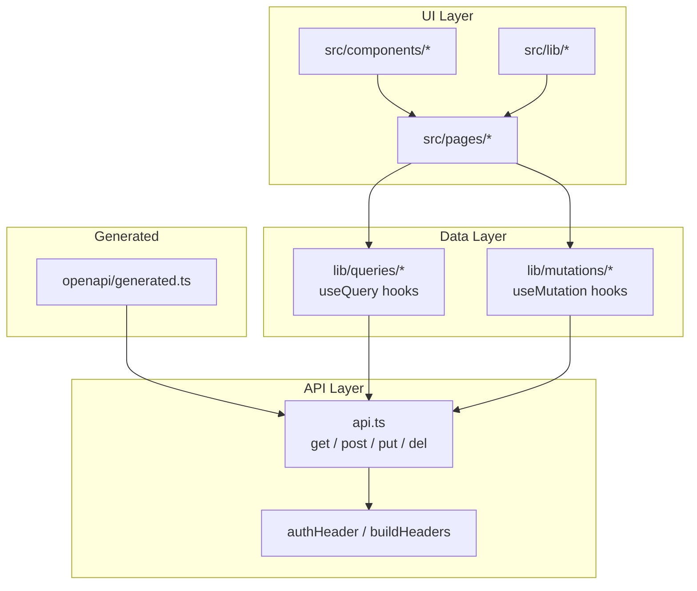

# Dashboard Frontend

# Dashboard Frontend

## Overview

The dashboard frontend is a React single-page application that provides a web-based management console for the LibreFang agent platform. It consumes the kernel's REST API to manage agents, sessions, skills, channels, memory, schedules, workflows, and more. The stack uses React Query for server state management and auto-generated TypeScript types from the OpenAPI schema for type-safe API communication.

## Architecture



## API Client (`dashboard/src/api.ts`)

The core HTTP client wraps `fetch` with consistent authentication, error handling, and JSON parsing. Every backend call flows through one of four primitives:

| Function | Method | Purpose |
|----------|--------|---------|
| `get` | GET | Fetch JSON from a path |
| `getText` | GET | Fetch raw text (e.g., TOML manifests) |
| `post` | POST | Create or action-oriented requests |
| `put` | PUT | Update resources |
| `del` | DELETE | Remove resources |

### Authentication

All requests pass through `buildHeaders` → `authHeader` → `getItem` (localStorage). The stored API key is attached as an `Authorization` header. On any 401 response, `parseError` calls `clearApiKey` to force re-authentication.

The `verifyStoredAuth` function validates an existing key by calling the server and clears it if invalid — used on app startup to detect expired sessions.

### Error Handling

`parseError` normalizes API errors into a consistent structure. When a 401 is detected, it automatically clears the stored credentials, which triggers the router's auth guard to redirect to the login flow.

### Key API Functions

The file exports dozens of domain-specific functions. A representative sample:

- **Agents**: `getAgentDetail`, `listAgentSessions`, `cloneAgent`, `suspendAgent`, `getExperimentMetrics`
- **Hands**: `listActiveHands`, `deactivateHand`, `uninstallHand`, `getHandStats`, `getHandSession`, `getHandManifestToml`
- **Skills/ClawHub**: `clawhubCnSearch`, `skillhubSearch`, `skillhubGetSkill`
- **Runtime**: `getHealthDetail`, `getQueueStatus`, `testChannel`, `reloadChannels`, `pollVideo`, `deleteTaskFromQueue`
- **Usage**: `listUsageByAgent`
- **Schedules**: `runSchedule`, `setSessionLabel`

Each function composes the appropriate HTTP primitive with a path and optional body:

```typescript
// Pattern: function → primitive
export const cloneAgent = (id: string, body: CloneAgentRequest) =>
  post(`/api/agents/${id}/clone`, body);
```

## Query Hooks (`lib/queries/`)

React Query hooks wrap API functions to provide caching, refetching, and loading states. They follow a consistent naming pattern: `use` prefix + domain noun.

### Domain Modules

| Module | Key Hooks | Purpose |
|--------|-----------|---------|
| `agents.ts` | `useAgentDetail`, `useAgentSessions`, `useExperimentMetrics` | Agent CRUD and session listing |
| `hands.ts` | `useActiveHands`, `useHandStats`, `useHandSession` | Hand marketplace and instances |
| `skills.ts` | `useClawHubSearch`, `useSupportingFile` | Skill discovery and file loading |
| `memory.ts` | `useMemoryStats` | Proactive memory statistics |
| `mcp.ts` | `useMcpHealth` | MCP server health checks |
| `terminal.ts` | `useTerminalHealth` | Terminal connectivity status |

Query hooks call through to the API layer, which in turn hits the kernel endpoints. For example:

```
useAgentSessions → listAgentSessions → get(`/api/agents/${id}/sessions`)
```

## Mutation Hooks (`lib/mutations/`)

Mutations handle data modification and map 1:1 to POST/PUT/DELETE API calls. Each hook uses `useMutation` with appropriate cache invalidation on success.

| Module | Key Hooks | API Operation |
|--------|-----------|---------------|
| `agents.ts` | `useCreatePromptVersion` | Create prompt versions for experiments |
| `approvals.ts` | `useApproveApproval` | Approve pending requests |
| `goals.ts` | `useUpdateGoal` | Update goal definitions |
| `providers.ts` | `useSetProviderKey` | Set provider API keys |
| `schedules.ts` | `useCreateSchedule`, `useDeleteSchedule`, `useRunSchedule` | Schedule CRUD and manual trigger |
| `workflows.ts` | `useUpdateWorkflow` | Workflow definition updates |
| `runtime.ts` | `useCreateBackup`, `useCleanupSessions` | System maintenance |
| `config.ts` | `useSetConfigValue` | Hot-reload config changes |
| `hands.ts` | `useSendHandMessage` | Send messages through hand instances |

## Auto-Generated OpenAPI Types (`openapi/generated.ts`)

**Do not edit this file directly.** It is generated by `openapi-typescript` from the kernel's OpenAPI schema.

The file exports:

- **`paths`** — Maps every API route to its HTTP methods, parameters, request bodies, and response types
- **`components["schemas"]`** — Request/response shapes like `MessageRequest`, `SpawnRequest`, `PatchAgentConfigRequest`, `BulkAgentIdsRequest`, etc.

These types ensure the API client and all consumers are compile-time verified against the actual backend contract.

### Key Schema Types

- **`SpawnRequest`** — Spawning agents from TOML manifests or templates, with optional signed manifests
- **`MessageRequest`** — Sending messages with support for attachments, ephemeral mode, group chat context, thinking controls, and channel metadata
- **`MessageResponse`** — Response with token counts, cost, decision traces, and memory recall info
- **`PatchAgentConfigRequest`** — Hot-updating agent identity (name, emoji, color, model, temperature, system prompt, web search augmentation)
- **`CloneAgentRequest`** — Cloning with optional skill/tool inclusion
- **`BulkAgentIdsRequest` / `BulkCreateRequest`** — Bulk operations across multiple agents

## Page Components (`src/pages/`)

Each page composes query and mutation hooks with UI to form a complete feature:

| Page | Hooks Used | Function |
|------|-----------|----------|
| `ChatPage` | `useChatMessages`, WebSocket | Real-time agent conversation |
| `AgentsPage` | `useCreatePromptVersion` (via `PromptsExperimentsModal`) | Agent management and prompt experimentation |
| `ApprovalsPage` | `useApproveApproval` | Review and act on approval requests |
| `GoalsPage` | `useUpdateGoal` | Goal CRUD |
| `WizardPage` | `useSetProviderKey` | First-run provider setup |
| `CanvasPage` | `useUpdateWorkflow` | Visual workflow editor |
| `WorkflowsPage` | Workflow queries, `navigateToCanvas` | Workflow listing and navigation |
| `TerminalPage` | Terminal hooks, localStorage | Interactive terminal sessions |
| `McpServersPage` | `useMcpHealth` (via `AuthBadge`) | MCP server management |

## Routing (`dashboard/src/router.tsx`)

The router handles authentication guards and automatic reload detection:

- **`tryAutoReload`** — Checks `shouldAutoReload` (localStorage flag) and triggers a full page reload when needed (e.g., after a version update)
- Auth-protected routes redirect unauthenticated users to the login flow
- The router uses `localStorage.setItem`/`getItem` (referenced via test mocks) for persistence

## Shared Libraries (`src/lib/`)

- **`chat.ts`** — `normalizeRole`, `asText` utilities for normalizing chat message roles and extracting plain text from structured messages
- **`chatPicker.ts`** — `groupedPicker` for organizing agents/models into grouped selections
- **`i18n.ts`** — Internationalization initialization

## Common Execution Flows

### Canvas Page → Workflow Save

```
CanvasPageInner → useUpdateWorkflow → updateWorkflow → put → buildHeaders → authHeader → getItem
                                                                                           ↓
                                                                             parseError → clearApiKey (on 401)
```

### Wizard Page → Provider Key Setup

```
WizardPage → useSetProviderKey → setProviderKey → post → buildHeaders → authHeader → getItem
                                                                                      ↓
                                                                        parseError → clearApiKey (on 401)
```

### Approval Action

```
ApprovalsPage → useApproveApproval → approveApproval → post → buildHeaders → authHeader → getItem
                                                                                           ↓
                                                                             parseError → clearApiKey (on 401)
```

All mutation flows follow the same pattern: page component → mutation hook → API function → HTTP primitive → auth headers. Errors propagate back through React Query's `onError` callbacks.

## Contributing

### Adding a New API Endpoint

1. **Do not edit `openapi/generated.ts`**. Regenerate it from the kernel's OpenAPI schema.
2. Add a function in `dashboard/src/api.ts` using the appropriate primitive (`get`, `post`, `put`, `del`).
3. Create a query hook in `lib/queries/` or a mutation hook in `lib/mutations/`.
4. Consume the hook from the relevant page component.

### Running Tests

The test files (`dashboard/src/api.test.ts`, `src/lib/chat.test.ts`, `src/lib/chatPicker.test.ts`, `lib/mutations/*.test.tsx`) mock `localStorage` and `fetch` to verify API functions, hook behavior, and utility logic in isolation.