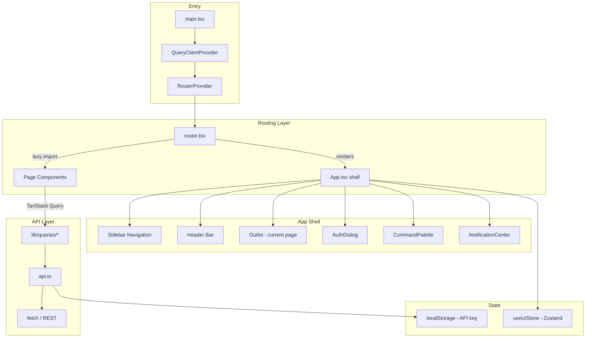

# Dashboard Frontend

# Dashboard Frontend

The dashboard is a single-page React application that provides the web management interface for the LibreFang agent infrastructure. It covers agent configuration, chat, workflow editing, skill management, monitoring, security settings, and all administrative operations.

## Architecture Overview

## Entry Point — `main.tsx`

Boots the React tree with three providers:

- **`QueryClientProvider`** — configures TanStack Query with `retry: 1`, `staleTime: 30s`, and `refetchOnWindowFocus: false`. These defaults are intentionally conservative to avoid hammering the backend.
- **`RouterProvider`** — mounts the TanStack Router instance exported from `router.tsx`.
- **`ToastContainer`** — global toast notification surface rendered at the root level.
- **i18n** is initialized as a side-effect import from `./lib/i18n`.

## Routing — `router.tsx`

All routes live under the base path `/dashboard`. The root route (`/`) redirects to `/overview`.

### Lazy Loading

Every page component is loaded via `lazyWithReload()`, which wraps React's `lazy()` with automatic chunk-error recovery:

1. A dynamic import failure (stale chunk hash after deployment or HMR) is detected by matching against `CHUNK_ERROR_RE`.
2. A React dispatcher-null error (transient HMR state) is detected by `REACT_DISPATCHER_RE`.
3. If either matches and no reload has occurred in the last 10 seconds (tracked in `sessionStorage.__chunk_reload`), the page auto-reloads once.
4. If a reload is already in flight, the import returns a never-resolving promise to prevent the error boundary from flashing.

This eliminates the "white screen after deploy" problem without requiring service workers.

### Error Boundary

`ChunkErrorBoundary` is registered as `defaultErrorComponent` on the router. It renders a diagnostic UI with Reload / Force Reload / Show Stack controls. For chunk or dispatcher errors, it also attempts `tryAutoReload()` on mount.

### Route Definitions

There are 35+ routes. Each is a flat child of the root route—there is no nested route tree beyond the `/config/*` sub-routes. Key routes include:

| Path | Page | Notes |
|---|---|---|
| `/overview` | `OverviewPage` | Dashboard landing |
| `/chat` | `ChatPage` | Accepts `?agentId=` search param |
| `/canvas` | `CanvasPage` | Accepts `?t=` and `?wf=` for workflow editing |
| `/agents` | `AgentsPage` | Agent management |
| `/workflows` | `WorkflowsPage` | Workflow list |
| `/terminal` | `TerminalPage` | Full-height route (no scrolling wrapper) |
| `/config/*` | `ConfigPage` | Sub-routes: general, memory, tools, channels, security, network, infra |
| `/settings` | `SettingsPage` | Application settings |

The `FULL_HEIGHT_ROUTES` set in `App.tsx` controls whether a page receives `flex-1 overflow-hidden` (terminal-style) or `overflow-y-auto` with padding.

## Application Shell — `App.tsx`

`App` is the root route component. It renders the persistent UI chrome (sidebar, header) and an `<Outlet />` for the current page.

### Authentication Flow

The app supports three auth modes, determined at startup by `checkDashboardAuthMode()`:

- **`"none"`** — No authentication required. Dashboard loads immediately.
- **`"api_key"`** — API key stored in `localStorage("librefang-api-key")`.
- **`"credentials"`** — Username/password login with optional TOTP second factor.
- **`"hybrid"`** — User chooses between credentials and API key tabs.

On mount, `App` calls `setOnUnauthorized()` to register a global 401 handler. Any API response with status 401 triggers `clearApiKey()` and re-shows the `AuthDialog`.

`AuthDialog` handles:
- API key submission via `verifyStoredAuth()`
- Credential login via `dashboardLogin()` with TOTP step-up
- Error display with i18n-translated messages

`ChangePasswordModal` allows credential-mode users to update their username and/or password. On success it calls `clearApiKey()` and reloads.

### Sidebar Navigation

Navigation items are organized into six groups (core, configure, config, automate, observe, advanced). The sidebar supports two layout modes controlled by `useUIStore.navLayout`:

- **Default layout** — Groups are labeled sections, all items visible.
- **`"collapsible"` layout** — Each group header is collapsible via `toggleNavGroup()`.

The sidebar collapses to a 24px icon-only strip on desktop via `isSidebarCollapsed`. On mobile it slides in as an overlay controlled by `isMobileMenuOpen`.

The `/terminal` route is conditionally shown based on `terminalEnabled`, which is fetched from `getStatus()` at startup (fail-open to `true`).

### Header

Contains mobile menu toggle, notification center, language toggle (en/zh), theme toggle (dark/light), and a user dropdown with links to settings, change password, and logout.

### Keyboard Shortcuts

`useKeyboardShortcuts` is invoked at the shell level. `⌘K` opens the command palette. The shortcuts help overlay is toggled via `setShowShortcuts`.

### Theme

Theme is stored in `useUIStore.theme`. A `useEffect` toggles the `dark` class on `<html>`, which drives Tailwind's `dark:` variant selectors.

## API Client — `api.ts`

A fully typed REST client covering every backend endpoint the dashboard uses.

### HTTP Primitives

Four private functions handle all requests:

| Function | Method | Timeout |
|---|---|---|
| `get<T>` | GET | Browser default |
| `post<T>` | POST | 60s (5min for long-running ops) |
| `put<T>` | PUT | Browser default |
| `patch<T>` | PATCH | Browser default |
| `del<T>` | DELETE | Browser default |

All go through `buildHeaders()`, which merges caller-provided headers with auth headers from `authHeader()` (reads `localStorage("librefang-api-key")` and `Accept-Language`).

### Error Handling

`parseError()` converts non-OK responses into `ApiError` instances. For 401 responses specifically:
1. `_unauthorizedFired` gate prevents loops.
2. `clearApiKey()` removes the stored token.
3. `_onUnauthorized()` callback triggers `App`'s re-authentication flow.

### Timeout Strategy

- `DEFAULT_POST_TIMEOUT_MS = 60_000` — standard mutations.
- `LONG_RUNNING_TIMEOUT_MS = 300_000` — agent messages, workflow runs, skill installs, skill hub operations.
- Timeouts use `AbortController` and throw a human-readable message on expiry.

### API Domains

The client exports functions organized by domain:

- **Agents** — CRUD, session management, messaging (`sendAgentMessage`), cloning, tool configuration.
- **Providers** — Listing, key management, URL configuration, default selection.
- **Models** — Listing with filters, custom model management, per-model overrides.
- **Channels** — Listing, configuration, testing, QR flows for WeChat/WhatsApp.
- **Skills** — CRUD, evolution (update/patch/rollback), file management, registry install.
- **Skill Hubs** — ClawHub (global + CN mirror), SkillHub, FangHub browse/search/install.
- **Workflows** — CRUD, run, dry-run, template management, run history.
- **Schedules & Triggers** — Full CRUD for cron schedules and event triggers.
- **Memory** — List, search, stats, add, update, delete, cleanup, decay.
- **Approvals** — List, approve/reject, batch resolve, TOTP setup/confirm/revoke, audit trail.
- **Hands** — List definitions, activate/deactivate, settings, stats, messaging.
- **Monitoring** — Health, status, version, queue status, audit trail, usage analytics, budget.
- **Config** — Full config read, schema discovery, per-path set, reload, backup/restore, TOML export.
- **Media** — Image generation, TTS, transcription, video submit/poll, music generation.
- **Comms** — Topology, events, inter-agent messaging, task posting.
- **Auth** — Login, logout, password change, auth mode check, credential verification.

### WebSocket Support

`buildAuthenticatedWebSocketUrl()` constructs a WebSocket URL with the API token as a query parameter, used by terminal and chat features.

### Type Exports

`api.ts` is the canonical source for all response/request TypeScript interfaces used across the dashboard (e.g., `AgentItem`, `ProviderItem`, `WorkflowStep`, `MemoryItem`, etc.). Page components and query hooks import types directly from this module.

## State Management

UI state lives in a Zustand store (`useUIStore` in `lib/store`):

- `theme` / `toggleTheme`
- `language` / `setLanguage`
- `isSidebarCollapsed` / `toggleSidebar`
- `isMobileMenuOpen` / `setMobileMenuOpen`
- `navLayout` — `"default"` or `"collapsible"`
- `collapsedNavGroups` — record of group key → collapsed state
- `terminalEnabled` / `setTerminalEnabled`

Server state is managed by TanStack Query through query/mutation hooks in `lib/queries/*` and `lib/mutations/*`, which call into `api.ts` functions.

## Adding a New Page

1. Create `src/pages/MyPage.tsx` exporting the component.
2. Add a `lazyWithReload()` entry in `router.tsx`.
3. Define a route with `createRoute({ getParentRoute: () => rootRoute, path: "/my-page", component: ... })`.
4. Add it to the `routeTree` array.
5. Optionally add a navigation entry to the appropriate `navGroups` item in `App.tsx`.
6. Add API functions to `api.ts` if new endpoints are needed, then create corresponding query/mutation hooks in `lib/queries/` and `lib/mutations/`.