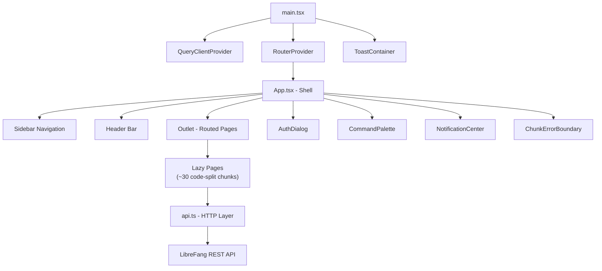
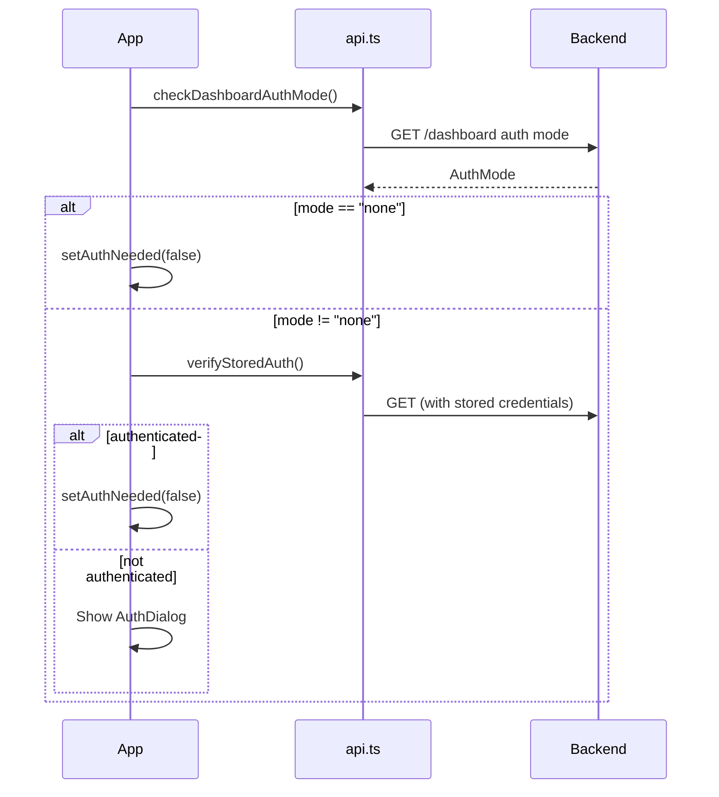

# Dashboard Frontend

# Dashboard Frontend

The dashboard is a single-page React application that provides the management UI for LibreFang. It covers agent lifecycle, configuration, monitoring, chat, workflows, analytics, and infrastructure control through a sidebar-driven layout served at `/dashboard`.

## Architecture Overview



## Entry Point — `main.tsx`

Bootstraps the React tree with three providers:

- **`QueryClientProvider`** — TanStack Query for all server-state fetching. The `QueryClient` is configured with conservative defaults: one retry, 30-second stale time, no background refetch, no refetch on window focus.
- **`RouterProvider`** — The TanStack Router instance from `router.tsx`.
- **`ToastContainer`** — Global toast notification surface, rendered as a sibling to the router so it floats above all page content.

Internationalization is initialized as a side-effect import (`./lib/i18n`).

## Router — `router.tsx`

Uses TanStack Router with `basepath: "/dashboard"` and intent-based preloading (`defaultPreload: "intent"` — routes begin loading when the user hovers a nav link).

### Route Tree

All pages are loaded via `lazyWithReload()`, which wraps React's `lazy()` with automatic recovery for stale chunks. The root route renders `App`, and the index route redirects `/` → `/overview`.

| Path | Page Component | Notes |
|------|---------------|-------|
| `/overview` | `OverviewPage` | Dashboard home |
| `/chat` | `ChatPage` | Accepts `?agentId=` search param |
| `/canvas` | `CanvasPage` | Accepts `?t=` and `?wf=` search params |
| `/agents` | `AgentsPage` | |
| `/approvals` | `ApprovalsPage` | |
| `/hands` | `HandsPage` | |
| `/providers` | `ProvidersPage` | |
| `/models` | `ModelsPage` | |
| `/media` | `MediaPage` | |
| `/channels` | `ChannelsPage` | |
| `/skills` | `SkillsPage` | |
| `/plugins` | `PluginsPage` | |
| `/mcp-servers` | `McpServersPage` | |
| `/workflows` | `WorkflowsPage` | |
| `/scheduler` | `SchedulerPage` | |
| `/goals` | `GoalsPage` | |
| `/analytics` | `AnalyticsPage` | |
| `/memory` | `MemoryPage` | |
| `/logs` | `LogsPage` | |
| `/runtime` | `RuntimePage` | |
| `/comms` | `CommsPage` | |
| `/terminal` | `TerminalPage` | Conditionally shown in nav |
| `/network` | `NetworkPage` | |
| `/a2a` | `A2APage` | |
| `/telemetry` | `TelemetryPage` | |
| `/sessions` | `SessionsPage` | |
| `/settings` | `SettingsPage` | |
| `/wizard` | `WizardPage` | |
| `/config/general` | `ConfigPage` | `category="general"` |
| `/config/memory` | `ConfigPage` | `category="memory"` |
| `/config/tools` | `ConfigPage` | `category="tools"` |
| `/config/channels` | `ConfigPage` | `category="channels"` |
| `/config/security` | `ConfigPage` | `category="security"` |
| `/config/network` | `ConfigPage` | `category="network"` |
| `/config/infra` | `ConfigPage` | `category="infra"` |

### Chunk Error Recovery

When the dashboard is rebuilt (dev HMR, version upgrade), old chunk hashes become invalid. The router handles this at two levels:

1. **`lazyWithReload`** — Wraps each `lazy()` import. On chunk failure, calls `tryAutoReload()` which sets a `sessionStorage` cooldown key and calls `window.location.reload()` once per 10 seconds.

2. **`ChunkErrorBoundary`** — The router's `defaultErrorComponent`. Catches render-time errors from stale React dispatcher state (a Vite HMR artifact). Shows a diagnostic UI with **Reload**, **Force Reload** (clears the cooldown), and optional stack trace.

Two regex patterns detect recoverable errors:
- `CHUNK_ERROR_RE` — matches "dynamically imported module", "Loading chunk … failed"
- `REACT_DISPATCHER_RE` — matches "reading 'useState'", "reading 'useContext'", etc.

## Application Shell — `App.tsx`

The root component manages layout, authentication, navigation, and global UI concerns.

### Authentication Flow



**Auth modes** (`AuthMode` type from `api.ts`):

| Mode | Behavior |
|------|----------|
| `"none"` | No authentication required |
| `"api_key"` | API key input only |
| `"credentials"` | Username + password (with optional TOTP) |
| `"hybrid"` | User chooses between API key and credentials tabs |

**`AuthDialog`** handles:
- API key submission — stores key via `setApiKey()`, validates with `verifyStoredAuth()`
- Credential submission — calls `dashboardLogin(username, password)`
- TOTP 2FA — when `dashboardLogin` returns `requires_totp: true`, shows a 6-digit code input, then calls `dashboardLogin(username, password, totpCode)`

A global 401 handler is registered via `setOnUnauthorized()`. Any API call that returns 401 triggers re-authentication by re-checking the auth mode and showing the dialog.

**`ChangePasswordModal`** provides self-service credential updates:
- Change username (minimum 2 characters)
- Change password (minimum 8 characters, confirmation required)
- Both require current password verification
- Calls `changePassword()`, then clears credentials and reloads on success

### Sidebar Navigation

The sidebar is organized into six navigation groups, each defined in the `navGroups` memo:

| Group | Items |
|-------|-------|
| **Core** | Overview, Chat, Agents, Approvals, Hands |
| **Configure** | Providers, Models, Media, Channels, Skills, Plugins, MCP Servers |
| **Config** | General, Memory, Tools, Channels, Security, Network, Infra, Settings |
| **Automate** | Workflows, Scheduler, Goals |
| **Observe** | Analytics, Memory, Logs, Runtime |
| **Advanced** | Comms, Terminal (conditional), Network, A2A, Telemetry |

The Terminal nav item only appears when `terminalEnabled` is `true`, which is fetched from `getStatus()` on mount.

**Nav layouts** (controlled by `useUIStore.navLayout`):
- **Grouped** — all groups visible with labels
- **Collapsible** — groups can be collapsed/expanded via `toggleNavGroup()`

**Sidebar states**:
- Desktop: expanded (280px) or collapsed (24px icons-only), toggled by `toggleSidebar()`
- Mobile: slides in from left as an overlay, controlled by `isMobileMenuOpen`

### Header Bar

The top header contains:
- Mobile menu button (hidden on `lg:` breakpoint)
- **NotificationCenter** — notification bell component
- Language toggle (English ↔ Chinese)
- Theme toggle (light ↔ dark)
- User menu dropdown with Settings, Change Password, and Logout

### UI Store

Global UI state lives in `useUIStore` (Zustand). Key fields consumed in `App`:

| Field | Purpose |
|-------|---------|
| `theme` | `"light"` or `"dark"`, toggles the `.dark` class on `<html>` |
| `language` | `"en"` or `"zh"` |
| `isSidebarCollapsed` | Desktop sidebar collapse state |
| `isMobileMenuOpen` | Mobile overlay sidebar state |
| `navLayout` | `"grouped"` or `"collapsible"` |
| `collapsedNavGroups` | Record of group keys to collapsed state |
| `terminalEnabled` | Whether the terminal feature is available |

## API Layer

All backend communication goes through `api.ts`, which provides:

- **`get()` / `post()` / `put()` / `patch()` / `del()`** — Generic HTTP methods that call `buildHeaders()` for auth injection and `parseError()` for error normalization
- **`buildHeaders()`** → `authHeader()` → reads stored credentials from `localStorage`
- **`setOnUnauthorized(callback)`** — Registers a global callback invoked on 401 responses, used by `App` to trigger re-authentication
- **Auth functions**: `checkDashboardAuthMode`, `verifyStoredAuth`, `dashboardLogin`, `dashboardLogout`, `setApiKey`, `clearApiKey`, `getDashboardUsername`, `changePassword`
- **Domain functions**: `listAgents`, `listProviders`, `listChannels`, `createWorkflow`, `runWorkflow`, `clawhubSearch`, `clawhubInstall`, etc.

The generated OpenAPI types in `openapi/generated.ts` provide full type coverage for all API endpoints and response shapes. These types are auto-generated and should not be edited directly.

## Design System — `index.css`

### Theming

Colors are defined as CSS custom properties with light/dark variants:

- **Semantic colors**: `--brand-color`, `--success-color`, `--warning-color`, `--error-color`, `--accent-color`
- **Layout colors**: `--bg-main`, `--bg-surface`, `--bg-surface-hover`, `--border-color`, `--text-muted`

These are mapped to Tailwind utilities via `@theme` declarations: `--color-brand`, `--color-surface`, `--color-text-dim`, etc. Dark mode uses `@custom-variant dark (&:where(.dark, .dark *))` so the `.dark` class on `<html>` activates all `dark:` utilities.

### Custom Breakpoints

| Name | Width | Purpose |
|------|------|---------|
| `3xl` | 1920px | QHD — 5-column card grids |
| `4xl` | 2560px | UHD/4K — 6-column card grids |

### Animation System

Spring-physics curves modeled after Apple's motion design:

| Variable | Curve | Use |
|----------|-------|-----|
| `--apple-spring` | `cubic-bezier(0.22, 1, 0.36, 1)` | Page transitions, sidebar |
| `--apple-ease` | `cubic-bezier(0.25, 0.1, 0.25, 1)` | Chat messages |
| `--apple-bounce` | `cubic-bezier(0.34, 1.56, 0.64, 1)` | Modals |

Applied classes:
- `.animate-fade-in-up` — 600ms spring entrance with blur-to-sharp
- `.animate-fade-in-scale` — 500ms bounce scale for modals
- `.animate-message-in` — 220ms light rise for chat bubbles
- `.stagger-children` — Cascading entrance for child elements (40ms offset per child, disabled on mobile)
- `.card-glow` — Hover depth effect with brand-tinted shadow
- `.animate-progress` — Progress bar fill animation

All animations respect `prefers-reduced-motion: reduce` by disabling transforms, opacity transitions, and filters.

## Adding a New Page

1. Create the page component in `src/pages/MyPage.tsx` and export it as a named export.
2. In `router.tsx`, add a `lazyWithReload` import:
   ```tsx
   const MyPage = lazyWithReload(() => import("./pages/MyPage").then(m => ({ default: m.MyPage })));
   ```
3. Create a route:
   ```tsx
   const myRoute = createRoute({
     getParentRoute: () => rootRoute,
     path: "/my-page",
     component: () => <L><MyPage /></L>
   });
   ```
4. Add `myRoute` to the `routeTree` array.
5. Optionally add a nav entry in the appropriate `navGroups` group in `App.tsx`.