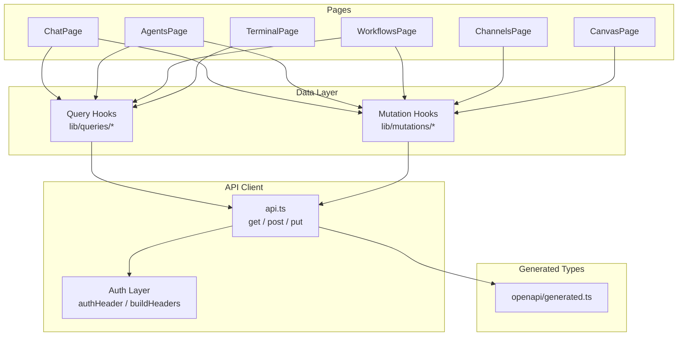

# Dashboard Frontend

# Dashboard Frontend

## Overview

The dashboard is a React-based single-page application that provides a web UI for managing and interacting with LibreFang agents. It communicates with the kernel's HTTP API through a centralized API client layer and uses React Query for server-state management.

The frontend is organized around three concerns: **API types** (auto-generated from the OpenAPI spec), **data fetching/mutation hooks** (React Query wrappers), and **page components** (route-level UI).

## Architecture

## Key Files and Directories

### `dashboard/openapi/generated.ts`

Auto-generated by `openapi-typescript`. Contains TypeScript interfaces for every API path, operation, request body, and response shape. **Do not edit manually** — regenerate from the running API's OpenAPI spec.

The file exports:
- `paths` — maps every URL to its HTTP methods and operation IDs
- `components["schemas"]` — request/response types like `SpawnRequest`, `MessageRequest`, `MessageResponse`, `PatchAgentConfigRequest`, etc.

### `dashboard/src/api.ts`

The core HTTP client. All backend communication flows through here.

**HTTP primitives:**
- `get<T>(path, params?)` — GET with optional query parameters
- `post<T>(path, body?)` — POST with optional JSON body
- `put<T>(path, body?)` — PUT with optional JSON body

These primitives call `buildHeaders()` → `authHeader()` to attach the stored API key as an `Authorization` header. On any response, they call `parseError()` to normalize error objects.

**Authentication:**
- `getStoredApiKey()` — reads from `localStorage`
- `setApiKey(key)` / `clearApiKey()` — manage the stored key
- `hasApiKey()` — checks presence
- `verifyStoredAuth()` — validates the key against the server
- `dashboardLogout()` — clears the key locally

**Domain functions** are thin wrappers around the primitives. Examples:
- `listAgents()`, `spawnAgent(req)`, `killAgent(id)` — agent CRUD
- `sendMessage(id, req)` — send a chat message
- `listMcpServers()`, `startMcpAuth(...)` — MCP management
- `getHandSettings(id)`, `pauseHand(id)` — hand instance control
- `configureChannel(name, config)`, `testChannel(name, body)` — channel setup
- `listAuditRecent()`, `queryApprovalAudit(id)` — audit/approval queries

### `dashboard/src/router.tsx`

Route definitions. Contains `tryAutoReload()` which checks for an existing auth key on app load and redirects to the login page if absent.

### `dashboard/src/App.tsx`

Root component. The `handleApiKeySubmit` handler validates a user-provided key via `verifyStoredAuth()` before granting dashboard access.

## Data Layer

### Query Hooks — `lib/queries/`

React Query hooks that wrap `api.ts` functions. Each hook manages its own cache key, stale time, and refetch behavior.

| Module | Key Hooks | Purpose |
|---|---|---|
| `models.ts` | `listModels` | Available LLM models |
| `mcp.ts` | `getMcpAuthStatus`, `useMcpHealth` | MCP server status and OAuth flow |
| `hands.ts` | `getHandDetail`, `getHandSettings`, `useHandStats`, `useHandSession` | Hand instances and their runtime state |
| `terminal.ts` | `useTerminalHealth` | Terminal service liveness |
| `memory.ts` | Memory stats and queries | Proactive memory system |
| `runtime.ts` | `auditRecentQueryOptions`, `useCronJobs` | Audit log, cron jobs |
| `workflows.ts` | `useWorkflowRunDetail` | Workflow execution state |
| `telemetry.ts` | `telemetryQueryOptions` | Prometheus metrics |
| `overview.ts` | `versionInfoQueryOptions` | Build/version info |
| `sessions.ts` | `useSessionDetails` | Agent session data |
| `skills.ts` | `useSkillHubSkill` | ClawHub skill details |

### Mutation Hooks — `lib/mutations/`

React Query mutations for state-changing operations.

| Module | Key Hooks | Purpose |
|---|---|---|
| `agents.ts` | `useCreatePromptVersion` | Agent configuration changes |
| `approvals.ts` | `useApproveApproval` | Approve/reject pending requests |
| `channels.ts` | `useTestChannel` | Test channel connectivity |
| `workflows.ts` | `useUpdateWorkflow` | Save workflow edits |
| `goals.ts` | `useUpdateGoal` | Update agent goals |

## Page Components

Pages live in `src/pages/`. Each page composes query/mutation hooks with UI components.

| Page | Route Area | Responsibilities |
|---|---|---|
| `ChatPage.tsx` | Agent chat | Uses `useChatMessages` for history, `useWebSocket` for SSE streaming, file uploads via `/api/agents/{id}/upload` |
| `AgentsPage.tsx` | Agent list/detail | Agent CRUD, bulk operations, prompt experiments modal |
| `WorkflowsPage.tsx` | Workflow editor | Uses `isRunState()`, `isWorkflowStepArray()`, `formatDate()` from local utilities |
| `CanvasPage.tsx` | Visual workflow canvas | Reads/saves drafts via `localStorage` with `readCanvasDraft()` |
| `ChannelsPage.tsx` | Channel config | QR login flows for WhatsApp/WeChat, connectivity testing |
| `TerminalPage.tsx` | Terminal emulator | Manages xterm.js lifecycle (open/close/dispose), sends commands |
| `McpServersPage.tsx` | MCP management | Displays `AuthBadge` component, server health |
| `ApprovalsPage.tsx` | Approval queue | List, approve, reject pending agent actions |
| `GoalsPage.tsx` | Goal management | CRUD for agent goals |
| `WizardPage.tsx` | Setup wizard | Initial provider/key configuration |

## Utilities

### `src/lib/chat.ts`
- `normalizeRole(role)` — normalizes message role strings
- `asText(content)` — extracts plain text from message content

### `src/lib/chatPicker.ts`
- `groupedPicker(items)` — groups items for the chat picker UI

### `src/lib/datetime.ts`
- `formatDate(date)` — consistent date formatting across pages

### `src/lib/i18n.ts`
- `init()` — initializes internationalization (bridges to the Rust-side `librefang-cli` i18n module)

## Execution Flow: API Request with Auth

All mutations follow the same pattern through the stack. For example, when `CanvasPage` saves a workflow:

1. `CanvasPageInner` calls `useUpdateWorkflow` mutation
2. Mutation invokes `updateWorkflow()` in `api.ts`
3. `updateWorkflow()` calls `put()` with the workflow data
4. `put()` calls `buildHeaders()` → `authHeader()` → reads key from `localStorage`
5. Request is sent to `PUT /api/workflows/{id}`
6. On error, `parseError()` normalizes the error
7. If the error indicates invalid auth, `clearApiKey()` is called, redirecting to login

This same flow applies to every page: `ChannelsPage` → `useTestChannel`, `AgentsPage` → `useCreatePromptVersion`, `ApprovalsPage` → `useApproveApproval`, etc.

## Generated Type Reference

The `components["schemas"]` in `generated.ts` defines the shapes used by both the API client and the page components. Key types:

- **`SpawnRequest`** — create an agent from a TOML manifest or template name
- **`MessageRequest`** — send a chat message with optional attachments, channel metadata, group context, and thinking/reasoning controls
- **`MessageResponse`** — includes response text, token counts, cost, decision traces, and memories used/saved
- **`PatchAgentConfigRequest`** — hot-update agent name, model, temperature, system prompt, and identity fields
- **`BulkAgentIdsRequest`** / **`BulkCreateRequest`** — batch agent operations
- **`CloneAgentRequest`** — clone with optional skill/tool copying
- **`CallbackBody`** — OAuth2 authorization code callback

## Adding a New API Endpoint

1. **Regenerate types** — run `openapi-typescript` against the running API to update `generated.ts`
2. **Add a domain function** in `api.ts` — wrap `get`, `post`, or `put` with the new path and types
3. **Create a query or mutation hook** in `lib/queries/` or `lib/mutations/` — use the new domain function
4. **Consume the hook** in the relevant page component