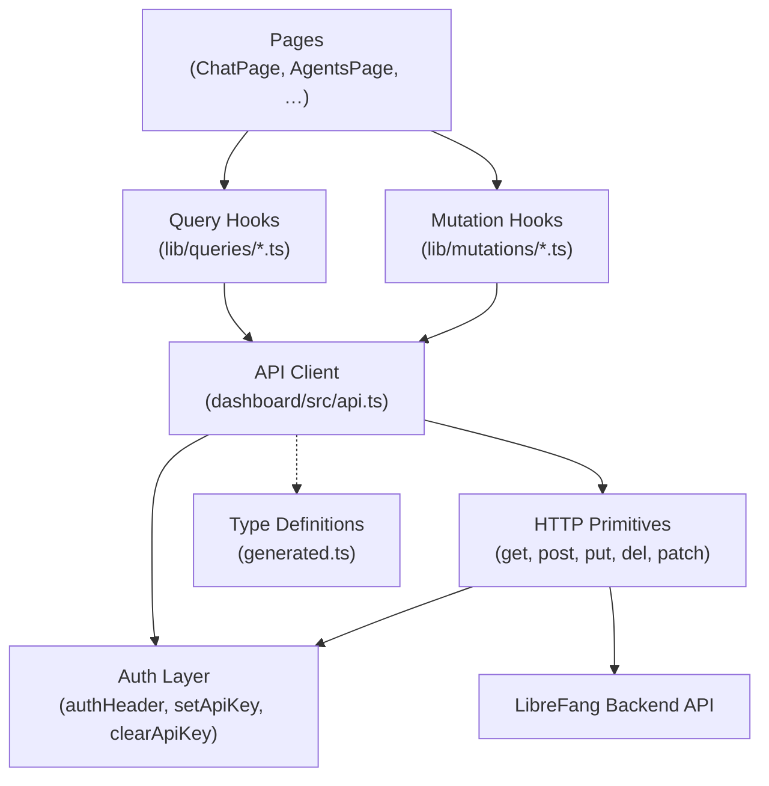
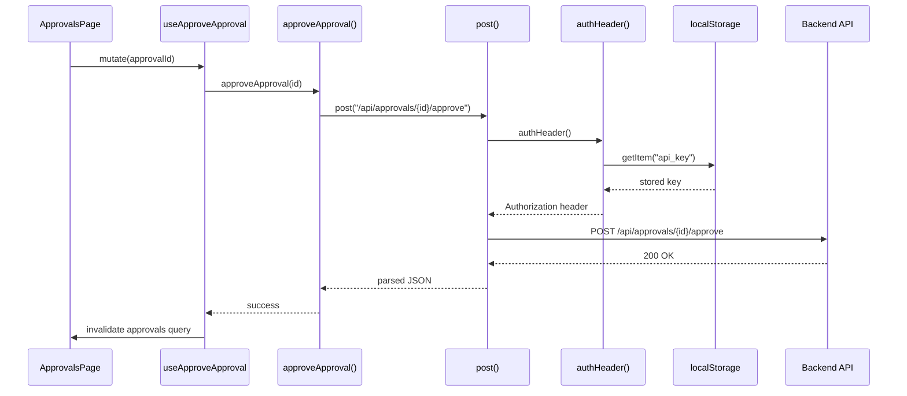

# Dashboard Frontend

# Dashboard Frontend

## Overview

The Dashboard Frontend is a single-page application that provides a browser-based management interface for the LibreFang platform. It covers agent lifecycle management, real-time chat, workflow editing, channel configuration, memory inspection, MCP server management, and administrative functions. The frontend communicates exclusively with the LibreFang backend API over HTTP and Server-Sent Events (SSE).

## Architecture



The application follows a strict layered pattern: **Pages** consume **React Query hooks** (queries for reads, mutations for writes), which call into the **API client**, which delegates to generic HTTP primitives with shared authentication headers.

## Key Files and Directories

### `dashboard/openapi/generated.ts`

Auto-generated by `openapi-typescript` from the backend's OpenAPI spec. Exports the `paths` and `components` TypeScript types that describe every API endpoint, request body, and response shape. **Do not edit manually** — regenerate with the build tooling whenever the backend spec changes.

The `paths` object is keyed by route pattern (e.g. `"/api/agents/{id}/message"`) and maps each HTTP method to an operation ID. The `components.schemas` object contains shared request/response types like `SpawnRequest`, `MessageRequest`, `MessageResponse`, `PatchAgentConfigRequest`, and `BulkAgentIdsRequest`.

### `dashboard/src/api.ts`

The central API client module. It exports named functions for every backend operation, grouped by domain. Each function calls one of the internal HTTP primitives and returns a typed response.

#### HTTP Primitives

Six internal functions handle all network communication:

| Function | Purpose |
|----------|---------|
| `get(path)` | GET request, parses JSON response |
| `getText(path)` | GET request, returns raw text (used for metrics, file content) |
| `post(path, body)` | POST with JSON body |
| `put(path, body)` | PUT with JSON body |
| `patch(path, body)` | PATCH with JSON body |
| `del(path)` | DELETE request |

All primitives call `buildHeaders()` to attach authentication. Error responses are routed through `parseError()`, which wraps them in `ApiError` (from `lib/http/errors.ts`) with the status code and response body.

#### Authentication Flow

```
authHeader() → getStoredApiKey() → localStorage.getItem("api_key")
                                    localStorage.getItem("auth_token")
```

- `setApiKey(key)` — persists credentials and configures the header globally
- `clearApiKey()` — removes stored credentials
- `verifyStoredAuth()` — validates existing credentials against the backend
- `dashboardLogin(credentials)` — authenticates and stores the resulting key

The API key or token is attached as an `Authorization: Bearer ...` header on every request.

#### Error Handling

`parseError(response)` reads the response body, extracts an error message, and throws `ApiError`. This class carries `status` and `body` so callers can inspect the HTTP status code and structured error details.

### `lib/queries/` — Data Fetching Hooks

React Query-based hooks for read operations. Each file corresponds to a domain:

| File | Covers |
|------|--------|
| `workflows.ts` | Workflow templates, listing, and canvas data |
| `channels.ts` | Channel adapters, comms events |
| `mcp.ts` | MCP server health and status |
| `hands.ts` | Hand definitions, instances, stats |
| `memory.ts` | Proactive memory stats and listing |
| `terminal.ts` | Terminal health checks |
| `sessions-stream.ts` | SSE-based session streaming |

These hooks handle caching, refetching, and stale- data management through React Query's `useQuery` and `useInfiniteQuery`.

### `lib/mutations/` — Write Operation Hooks

React Query mutation hooks for create/update/delete operations:

| File | Example Hooks |
|------|---------------|
| `agents.ts` | `useCreateAgentSession`, `useSpawnAgent`, `useKillAgent` |
| `approvals.ts` | `useApproveApproval`, `useRejectApproval` |
| `workflows.ts` | `useCreateWorkflow`, `useUpdateWorkflow`, `useRunWorkflow` |
| `goals.ts` | `useCreateGoal`, `useUpdateGoal` |
| `users.ts` | `useCreateUser` |

Mutations call API client functions and typically invalidate related queries on success to keep the UI consistent.

### `src/pages/` — Page Components

Full-page views mounted by the router. Each page component orchestrates queries, mutations, and UI components:

| Page | Purpose |
|------|---------|
| `ChatPage` | Agent chat interface with SSE streaming |
| `AgentsPage` | Agent listing, spawning, bulk operations |
| `WorkflowsPage` | Workflow list and navigation to canvas |
| `CanvasPage` | Visual workflow editor |
| `ApprovalsPage` | Pending approval queue |
| `GoalsPage` | Goal management |
| `UsersPage` | User administration |
| `ConfigPage` | Kernel configuration editor |
| `McpServersPage` | MCP server management |
| `TerminalPage` | Interactive terminal sessions |

### `src/lib/` — Shared Utilities

| Module | Purpose |
|--------|---------|
| `chat.ts` | Chat message normalization (`normalizeRole`, `asText`) |
| `chatPicker.ts` | Agent/session picker grouping logic (`groupedPicker`) |
| `csvParser.ts` | CSV user import parsing (`parseUsersCsv`) |
| `i18n.ts` | Internationalization setup |
| `drawerStore.ts` | Zustand store for drawer/sidebar state |

## Data Flow: Typical Page Interaction

This example traces a user approving a request on the ApprovalsPage through the full stack:



## API Domain Coverage

The API client exposes functions organized across these domains:

- **Agents** — CRUD, spawning, cloning, mode changes, messaging (sync and SSE streaming), session management, file/workspace management, memory import/export, tool and skill assignments, decision traces
- **Approvals** — listing, approving, rejecting pending human-in-the-loop requests
- **A2A (Agent-to-Agent)** — internal agent listing, external agent discovery, task send/cancel/status
- **Auth** — OAuth2 login/callback, provider listing, token introspection, user info
- **Budget** — global and per-agent spend tracking and limits
- **Channels** — adapter listing, configuration, testing, WeChat/WhatsApp QR flows, hot-reload
- **ClawHub / SkillHub** — browsing, searching, skill detail, installation with security pipeline
- **Comms** — inter-agent messaging, task queueing, topology graph, event streaming
- **Config** — read/write/reload kernel config, schema introspection
- **Cron / Schedules** — job CRUD, enable/disable, manual trigger
- **Extensions** — install/uninstall catalog entries
- **Hands** — definition listing, activation/deactivation, dependency management, settings, browser state, pausing/resuming
- **Health** — liveness probe and detailed diagnostics
- **Memory (Proactive)** — semantic search, CRUD, consolidation, deduplication, per-agent stats, versioned history, import/export
- **MCP Servers** — CRUD, health, catalog, reconnect
- **Models** — listing, custom models, aliases, per-agent overrides
- **Providers** — listing with probe status, key management, URL config, testing, default selection
- **Sessions** — listing, cleanup, labeling, import/export, switching
- **Workflows** — CRUD, execution, run history, save-as-template

## Real-Time Streaming

The frontend uses Server-Sent Events for live data in several areas:

1. **Chat streaming** (`/api/agents/{id}/message/stream`) — token-by-token response delivery
2. **Log streaming** (`/api/logs/stream`) — real-time audit log entries with level/text filtering, 15-second heartbeats, and backfill on connect
3. **Comms events** (`/api/comms/events/stream`) — inter-agent communication events polled every 500ms
4. **Session streaming** (`lib/queries/sessions-stream.ts`) — session lifecycle events with `addEventListener`/`removeEventListener` cleanup patterns

All SSE consumers follow the same lifecycle: connect on mount, process events via callbacks, clean up listeners on unmount.

## Authentication and Authorization

The auth system supports multiple providers (listed via `/api/auth/providers`). Login redirects to an external identity provider (OAuth2). The callback exchanges an authorization code for credentials, which are stored in localStorage as either `api_key` or `auth_token`.

`tryAutoReload` in the router checks for stored credentials on app load and attempts silent re-authentication. When credentials expire or are invalid, the error path calls `clearApiKey()` and redirects to login.

For providers like GitHub Copilot, a device-flow OAuth is available: `copilot_oauth_start` initiates the flow, returning a user code and verification URI, and `copilot_oauth_poll` checks for completion.

## Contributing

### Adding a New API Call

1. Add or update the endpoint in the backend OpenAPI spec
2. Regenerate `generated.ts` using the openapi-typescript tooling
3. Add a named export function in `dashboard/src/api.ts` that calls the appropriate HTTP primitive
4. Create a query hook in `lib/queries/` (for reads) or a mutation hook in `lib/mutations/` (for writes)
5. Consume the hook from the relevant page component

### Adding a New Page

1. Create the component in `src/pages/`
2. Add the route in `dashboard/src/router.tsx`
3. Wire up queries and mutations from the hooks layer
4. Follow the established cleanup pattern for any SSE connections (add listener on effect, remove on cleanup)

### Testing Patterns

- API client tests (`dashboard/src/api.test.ts`) mock `localStorage.getItem`/`setItem` and verify header construction, error parsing, and credential management
- Query hook tests mock the API client functions and verify React Query behavior
- Page component tests mock mutation hooks and verify user interaction flows