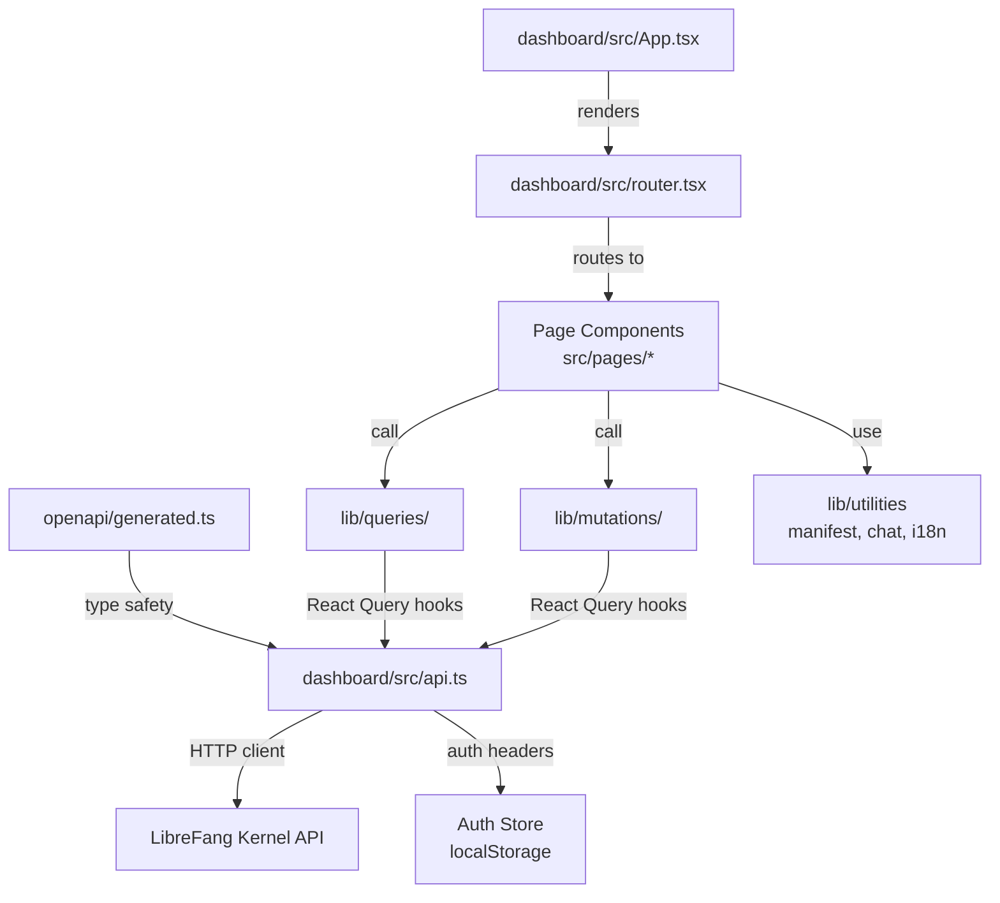

# Dashboard Frontend

# Dashboard Frontend

## Overview

The Dashboard Frontend is a React-based single-page application that provides a management UI for the LibreFang agent platform. It communicates with the LibreFang kernel daemon via a RESTful HTTP API and real-time streaming endpoints (SSE/WebSocket). The codebase is split across two directory roots: `dashboard/src/` (core API layer, app shell, routing) and `src/` (page components, feature libraries, and shared utilities).

## Architecture



## Key Layers

### Auto-Generated API Types — `openapi/generated.ts`

This file is **machine-generated** by `openapi-typescript` from the kernel's OpenAPI spec. **Never edit it directly** — regenerate it when the backend API changes.

It exports three primary namespaces:

| Export | Purpose |
|--------|---------|
| `paths` | Maps every API route to its HTTP methods, parameters, and operation IDs |
| `operations` | Referenced by `paths` — contains request/response shapes per operation |
| `components["schemas"]` | Shared DTOs like `SpawnRequest`, `MessageRequest`, `BulkActionResult`, etc. |

The types are used implicitly by the hand-written API client in `dashboard/src/api.ts` to ensure compile-time correctness when calling endpoints.

### API Client — `dashboard/src/api.ts`

The central HTTP client layer. Key responsibilities:

- **HTTP methods**: Exports `get()`, `post()`, `put()`, `patch()`, `del()` helpers that build authenticated requests against the kernel's base URL.
- **Authentication**: `buildHeaders()` → `authHeader()` reads the stored credential from localStorage via `getItem()`. Supports multiple auth modes:
  - API key (`setApiKey()` / `clearApiKey()`)
  - Dashboard credentials (`dashboardLogin()` / `dashboardLogout()`)
  - OAuth2 token verification (`verifyStoredAuth()`)
- **Error handling**: `parseError()` normalizes HTTP errors into `ApiError` instances (from `lib/http/errors.ts`), which propagates to React Query's error channels.
- **Streaming**: Separate functions handle SSE endpoints (logs, comms events) and the chat WebSocket connection.

Public surface includes typed functions for every kernel endpoint, for example:
- `getStatus()`, `getVersionInfo()` — system info
- `runWorkflow()`, `updateWorkflow()` — workflow management
- `testChannel()`, `configureChannel()` — channel setup
- `createPromptVersion()`, `createAgentSession()` — agent operations

### Data Fetching — React Query Hooks

Located in two directories:

**Queries** (`lib/queries/`): Read-only data fetchers that wrap `api.ts` functions in `useQuery` hooks.

| Module | Purpose |
|--------|---------|
| `lib/queries/providers.ts` | `useProviders()` — provider list with auth status |
| `lib/queries/workflows.ts` | `useWorkflows()`, `useWorkflowTemplates()`, `useWorkflowRuns()`, `useWorkflowRunDetail()` |
| `lib/queries/schedules.ts` | Schedule/triggers data |

**Mutations** (`lib/mutations/`): Write operations wrapped in `useMutation` hooks.

| Module | Purpose |
|--------|---------|
| `lib/mutations/overview.ts` | `useQuickInit()` — first-run wizard setup |
| `lib/mutations/providers.ts` | `useSetProviderKey()`, `useSetDefaultProvider()` |
| `lib/mutations/workflows.ts` | `useRunWorkflow()`, `useDryRunWorkflow()`, `useUpdateWorkflow()`, `useInstantiateTemplate()` |
| `lib/mutations/agents.ts` | `useCreatePromptVersion()`, `useCreateAgentSession()` |
| `lib/mutations/schedules.ts` | `useCreateSchedule()` |
| `lib/mutations/channels.ts` | `useTestChannel()` |

Every mutation follows the same pattern: call an `api.ts` function → React Query manages loading/error/cache state → the page component reads the mutation state.

### Page Components — `src/pages/`

Each page is a self-contained React component that composes query hooks, mutation hooks, and local UI state.

| Page | File | Key Features |
|------|------|--------------|
| **WizardPage** | `src/pages/WizardPage.tsx` | First-run setup: detects providers (`useProviders`), sets API key (`useSetProviderKey`), sets default provider (`useSetDefaultProvider`), runs quick init (`useQuickInit`) |
| **AgentsPage** | `src/pages/AgentsPage.tsx` | Agent list, prompt version management (`PromptsExperimentsModal`), session creation |
| **ChatPage** | `src/pages/ChatPage.tsx` | Real-time chat with agents. Uses `useChatMessages` which manages both HTTP (`sendViaHttp`) and WebSocket (`useWebSocket`) transport, message IDs via `makeMessageId` |
| **WorkflowsPage** | `src/pages/WorkflowsPage.tsx` | Workflow CRUD, template instantiation, dry-run, execution, shortcut creation (`useCreateShortcut`) |
| **CanvasPage** | `src/pages/CanvasPage.tsx` | Visual workflow editor, uses `truncateId` for display |
| **ChannelsPage** | `src/pages/ChannelsPage.tsx` | Channel adapter configuration, `ChannelCard` with `getChannelIcon`, test connectivity |
| **ProvidersPage** | `src/pages/ProvidersPage.tsx` | Provider management, test connectivity (`handleTest` → `getActionResultError`), shortcut creation |
| **ModelsPage** | `src/pages/ModelsPage.tsx` | Model catalog, add form (`handleAdd` → `resetForm`), mobile cards use `modelKey` from `lib/hiddenModels.ts` |
| **MediaPage** | `src/pages/MediaPage.tsx` | Media provider browsing via `providersWithCapability` |
| **McpServersPage** | `src/pages/McpServersPage.tsx` | MCP server management, `AuthBadge` via `serverIdentityOf`, `ServerCard` via `getTransportDetail`, field updates via `updateField`, tool toggling via `toggleTools` |
| **SkillsPage** | `src/pages/SkillsPage.tsx` | Skill marketplace, rate-limit error detection (`isRateLimitError`) |
| **SchedulerPage** | `src/pages/SchedulerPage.tsx` | Cron job and trigger management, `openEditTrigger` |
| **LogsPage** | `src/pages/LogsPage.tsx` | Real-time log viewer, time formatting via `formatTime` from `lib/datetime.ts` |
| **ApprovalsPage** | `src/pages/ApprovalsPage.tsx` | Approval queue, `statusBadge` rendering, decision handling (`handleDecision` → `executeDecision`) |

### App Shell — `dashboard/src/App.tsx`

Entry point that orchestrates:

1. **Auth bootstrap** — `checkAuth()` calls `checkDashboardAuthMode()` then `verifyStoredAuth()` to restore sessions.
2. **Auth mode detection** — Determines whether the kernel uses API key, dashboard credentials, or OAuth.
3. **Login flows** — `handleApiKeySubmit` (API key), `handleCredentialsSubmit` (username/password via `dashboardLogin`), `handleSubmit` (password change via `changePassword` + `clearApiKey`), `ChangePasswordModal` (username display via `getDashboardUsername`).
4. **Logout** — Calls `dashboardLogout()`.
5. **Unauthorized hook** — `setOnUnauthorized()` registers a callback that triggers re-authentication when a 401 is received.
6. **Version polling** — `getVersionInfo()` and `getStatus()` on mount.

### Router — `dashboard/src/router.tsx`

Maps URL paths to page components. Includes `tryAutoReload` which checks localStorage for a stored auth token and attempts silent re-authentication on page load.

### Shared Libraries — `src/lib/`

Utility modules used across pages:

| Module | Purpose |
|--------|---------|
| `src/lib/agentManifest.ts` | TOML serialization for agent manifests. `serializeManifestForm()` orchestrates `splitTopLevelExtras`, `writeStringScalar` (with `escapeTomlString`), `writeNumberScalar`, `jsonValueToInlineToml` (recursive), `parseScheduleField` (via `asString`). |
| `src/lib/agentManifestMarkdown.ts` | Markdown generation from manifest data. `generateManifestMarkdown()` uses `pushList` helper. |
| `src/lib/chat.ts` | Chat message normalization — `normalizeRole`, `asText`, `formatMeta`, `normalizeToolOutput`. |
| `src/lib/chatPicker.ts` | Chat target selection via `groupedPicker`. |
| `src/lib/triggerPattern.ts` | Trigger pattern formatting via `formatTriggerPattern`. |
| `src/lib/datetime.ts` | Time formatting helpers like `formatTime`. |
| `src/lib/string.ts` | String utilities like `truncateId`. |
| `src/lib/hiddenModels.ts` | Model key resolution via `modelKey`. |
| `src/lib/useCreateShortcut.ts` | Shared hook for creating dashboard shortcuts, used by `WorkflowsPage` and `ProvidersPage`. |
| `src/lib/i18n.ts` | Internationalization bootstrap, calls `init()` from the Rust CLI i18n module. |

### Component Library — `src/components/`

Reusable UI components. Notable:

| Component | Purpose |
|-----------|---------|
| `AgentManifestForm` | Dynamic form for editing agent TOML manifests. The call graph shows it receives `update`/`commit` callbacks that align with the kernel's content hashing (`sha256_hex`, `compute_entry_hash`, etc.) and usage tracking pipelines. |

## Request Lifecycle

A typical write operation follows this path:

```
Page component (event handler)
  → Mutation hook (lib/mutations/*.ts)
    → API function (dashboard/src/api.ts)
      → HTTP method helper (post/put/patch/del)
        → buildHeaders() → authHeader() → getItem() [reads stored token]
        → fetch() to kernel
        → parseError() on failure → ApiError
      → React Query cache invalidation
    → Page re-renders with new data
```

A typical read operation:

```
Page component (mount / route change)
  → Query hook (lib/queries/*.ts)
    → API function (dashboard/src/api.ts)
      → get() → buildHeaders() → fetch()
    → React Query caches response
  → Page renders from cache
```

## Authentication Flow

The dashboard supports three authentication modes, detected at startup by `checkDashboardAuthMode()`:

1. **API Key** — User enters a key in the wizard. Stored via `setApiKey()`, sent as `Authorization: Bearer <key>`.
2. **Dashboard Credentials** — Username/password login via `dashboardLogin()`. Session managed with tokens.
3. **OAuth2** — Redirect-based flow. The kernel handles the OAuth callback (`/api/auth/callback`), and the dashboard stores the resulting token.

All modes converge on `authHeader()` which reads the stored credential and attaches it to every outbound request. When a request returns 401, the `setOnUnauthorized()` callback triggers re-authentication.

## Real-Time Streaming

The dashboard uses two streaming mechanisms:

- **SSE (Server-Sent Events)** — Used for log streaming (`/api/logs/stream`), inter-agent comms events (`/api/comms/events/stream`), and chat streaming (`/api/agents/{id}/message/stream`). The kernel sends heartbeat pings every 15 seconds.
- **WebSocket** — Used by `ChatPage`'s `useChatMessages` hook via `useWebSocket` for bidirectional agent chat with lower latency than SSE.

## Agent Manifest Handling

Agent configuration uses TOML manifests. The frontend provides full serialization/deserialization:

1. **Parsing** — Manifest TOML is parsed into form state.
2. **Editing** — `AgentManifestForm` provides a dynamic UI for all manifest fields including system prompt, model, provider, temperature, max_tokens, tools, skills, and custom extras.
3. **Serialization** — `serializeManifestForm()` converts form state back to valid TOML, handling string escaping (`escapeTomlString`), nested objects (`splitTopLevelExtras`), number formatting (`writeNumberScalar`), inline JSON values (`jsonValueToInlineToml`), and schedule fields (`parseScheduleField`).
4. **Submission** — The serialized TOML is sent to `POST /api/agents` (spawn) or `PATCH /api/agents/{id}/config` (hot-update).

## Development Guidelines

### Adding a New Page

1. Create the component in `src/pages/NewPage.tsx`.
2. Add query hooks in `lib/queries/` if the page reads data.
3. Add mutation hooks in `lib/mutations/` if the page writes data.
4. Ensure the API functions exist in `dashboard/src/api.ts` with proper types from `openapi/generated.ts`.
5. Register the route in `dashboard/src/router.tsx`.

### Adding a New API Endpoint

1. Add/update the endpoint in the kernel's OpenAPI spec.
2. Regenerate `openapi/generated.ts` by running the openapi-typescript generator.
3. Add a typed function in `dashboard/src/api.ts` that calls the appropriate HTTP method helper.
4. Create a query or mutation hook wrapping the new function.
5. Use the hook in the target page component.

### Working with Generated Types

The `paths` interface in `openapi/generated.ts` is the single source of truth for all API routes and their shapes. When consuming API responses in TypeScript, prefer using the operation types (e.g., `operations["list_agents"]["responses"]["200"]["content"]["application/json"]`) rather than defining separate interface duplicates.