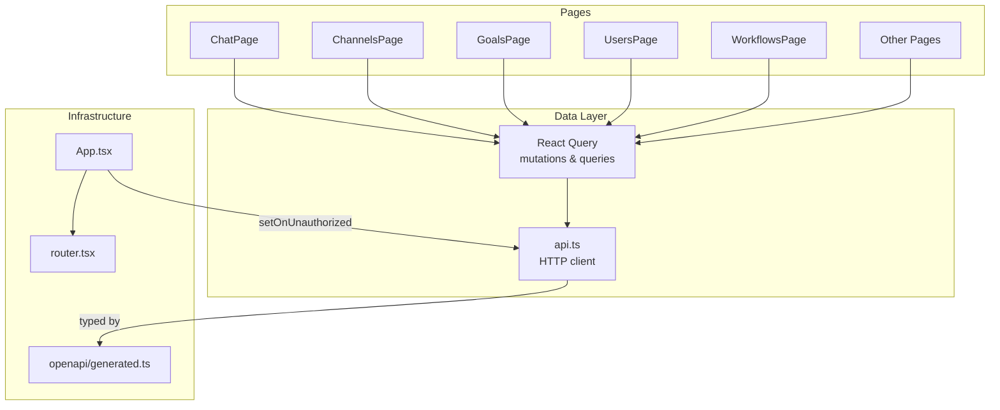
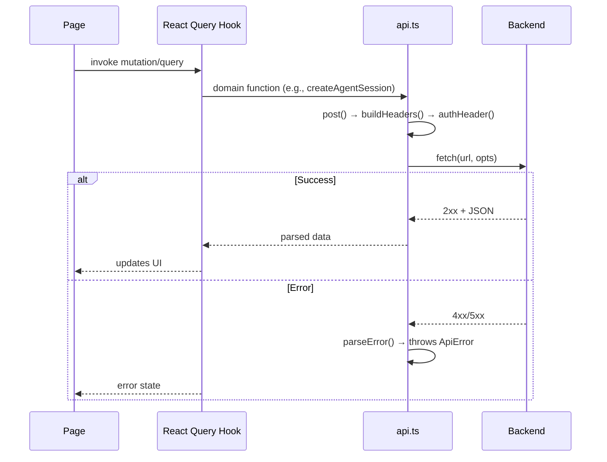

# Dashboard Frontend

# Dashboard Frontend

The dashboard is a React single-page application that provides the primary operator interface for LibreFang. It covers agent lifecycle management, real-time chat, session inspection, budget monitoring, channel configuration, audit trails, and every other kernel capability exposed through the HTTP API.

## Architecture Overview



## Key Files

| Path | Purpose |
|------|---------|
| `dashboard/src/main.tsx` | Entry point, mounts React and initializes Vite config |
| `dashboard/src/App.tsx` | Root component; wires `setOnUnauthorized` into the API client so 401 responses trigger redirect to login |
| `dashboard/src/router.tsx` | Route definitions and `tryAutoReload` for session recovery |
| `dashboard/src/api.ts` | Central HTTP client; every backend call flows through here |
| `dashboard/src/api.test.ts` | Unit tests covering auth, headers, WebSocket construction, and domain calls |
| `dashboard/openapi/generated.ts` | Auto-generated TypeScript types from the OpenAPI schema — **do not edit directly** |

## API Client (`dashboard/src/api.ts`)

### Authentication Flow

All authenticated requests pass through `buildHeaders` → `authHeader` → `getStoredApiKey`. The API key is persisted in browser storage. When a 401 is received, the `onUnauthorized` callback (set by `App.tsx`) clears the stored key and redirects to the login page.

```typescript
// Conceptual call chain for any authenticated request:
someApiFunction("agent-uuid")
  → post(url, body)          // or get/put/delete
    → buildHeaders()
      → authHeader()
        → getStoredApiKey()  // reads from storage
    → fetch(url, { headers, ... })
    → parseError(response)   // throws ApiError on non-2xx
```

**Key functions:**

- **`getStoredApiKey()`** — Reads the API key from storage (browser or Tauri).
- **`authHeader()`** — Returns the `Authorization: Bearer <key>` header object, or an empty object if no key is stored.
- **`buildHeaders(extra?)`** — Merges auth headers with any additional headers (e.g., `Content-Type`).
- **`get(url)`, `post(url, body?)`, `put(url, body?)`** — Thin wrappers around `fetch` that inject auth and parse JSON responses.
- **`getText(url)`** — Same as `get` but returns raw text (used for Prometheus metrics via `getMetricsText`).
- **`parseError(response)`** — Converts non-2xx responses into `ApiError` instances with structured detail.
- **`clearApiKey()`** — Removes the stored key, effectively logging out.
- **`buildAuthenticatedWebSocket(path)`** — Constructs a `ws://` or `wss://` URL with the API key as a query parameter for SSE/WebSocket endpoints that cannot set HTTP headers.
- **`setOnUnauthorized(callback)`** — Registers the 401 handler called by `App.tsx`.

### Domain API Functions

The file exports dozens of typed functions mapping 1:1 to backend endpoints. Here are the major groups:

| Group | Functions | Backend Prefix |
|-------|-----------|---------------|
| **Agents** | `loadDashboardSnapshot`, `getAgentStats`, `spawnAgent`, `killAgent`, `patchAgentConfig`, `cloneAgent`, `sendAgentMessage`, `stopAgent`, `setAgentMode` | `/api/agents` |
| **Sessions** | `loadAgentSession`, `createAgentSession`, `switchAgentSession`, `getSessionDetails`, `exportSession`, `importSession`, `stopSession` | `/api/agents/{id}/sessions` |
| **Tools** | `listTools`, `getAgentTools`, `updateAgentTools` | `/api/tools`, `/api/agents/{id}/tools` |
| **Channels** | `testChannel`, `configureChannel`, `listChannels` | `/api/channels` |
| **Budget** | `getBudgetStatus`, `getAgentBudget` | `/api/budget` |
| **MCP** | `getMcpHealth`, `listMcpServers` | `/api/mcp` |
| **Memory** | `exportAgentMemory`, `importAgentMemory` | `/api/memory`, `/api/agents/{id}/memory` |
| **Skills** | `listSkills`, `installSkill`, `uninstallSkill`, `clawhubCnGetSkill` | `/api/skills`, `/api/clawhub` |
| **Auth** | `verifyStoredAuth`, `setApiKey` | `/api/auth` |
| **Hand Agents** | `patchHandAgentRuntimeConfig`, `clearHandAgentRuntimeConfig` | `/api/agents/{id}/hand-runtime-config` |
| **Audit** | `verifyAuditChain` | `/api/audit` |
| **Auto-Dream** | `getAutoDreamStatus` | `/api/auto-dream` |
| **A2A** | `getA2ATaskStatus` | `/api/a2a` |

## Data Layer Pattern

Pages never call `api.ts` functions directly. Instead they use React Query hooks defined in `lib/queries/` and `lib/mutations/`. This provides caching, refetch intervals, optimistic updates, and error handling.

### Query Hooks (`lib/queries/`)

- **`lib/queries/sessions.ts`** — `useSessionStream` subscribes to SSE events via `attachSession_stream` using `addEventListener` on the EventSource.
- **`lib/queries/mcp.ts`** — `useMcpHealth` polls MCP server health.
- **`lib/queries/hands.ts`** — `useHandSession` loads hand-agent session data.
- **`lib/queries/terminal.ts`** — `useTerminalHealth` checks the terminal subsystem health endpoint.

### Mutation Hooks (`lib/mutations/`)

Each mutation wraps an `api.ts` function and invalidates related query caches on success:

- **`useUpdateGoal`** → `updateGoal` (calls `put`)
- **`useTestChannel`** → `testChannel` (calls `post`)
- **`useCreateUser`** → `createUser` (calls `post`)
- **`useRunWorkflow`** → `runWorkflow` (calls `post`)
- **`useCreateAgentSession`** → `createAgentSession` (calls `post`)
- **`useSendHandMessage`** → sends to hand session

## Request Lifecycle (Typical Flow)



## OpenAPI Types (`openapi/generated.ts`)

This file is **auto-generated by openapi-typescript** and should never be hand-edited. It exports two main type namespaces:

- **`paths`** — Maps every URL path to its HTTP methods, parameters, and operation IDs (e.g., `operations["spawn_agent"]`).
- **`operations`** — Indexed by operation ID; each entry defines `requestBody` and `response` types.

To regenerate after API changes:

```bash
npx openapi-typescript http://localhost:3000/openapi.json -o dashboard/openapi/generated.ts
```

### API Domain Coverage

The generated types span these backend domains:

- **Agent CRUD + lifecycle** — spawn, kill, clone, patch config/identity, mode changes, bulk operations
- **Agent sessions** — create, list, switch, export/import, stream SSE, compaction, reboot, reset
- **Agent workspace** — files CRUD, memory KV CRUD, tool allowlist/blocklist, MCP server assignment, skill assignment
- **A2A protocol** — agent discovery, task send/status/cancel (both internal and external agents)
- **Messaging** — send message (sync), send message stream (SSE), upload file attachments
- **Channels** — 40 channel adapters, configure/test/remove, WeChat/WhatsApp QR login flows
- **Budget** — global budget, per-agent budget, per-user budget, cost rankings
- **Memory** — proactive memory list/search/stats, KV store, consolidation, import/export
- **MCP servers** — catalog browsing, CRUD, reconnect, health, taint rules
- **Audit** — query, recent, export, chain verification
- **Auth** — multi-provider OAuth, PKCE callback, introspection, userinfo, TOTP
- **Cron & schedules** — CRUD, enable/disable toggle, manual trigger
- **Hands** — marketplace, install/activate/deactivate, pause/resume, runtime config, dependency management
- **Triggers** — event trigger CRUD with pattern matching and cooldown
- **Skills** — list, install/uninstall, ClawHub browse/search/install with security pipeline
- **Models & providers** — model catalog, aliases, custom models, provider CRUD, key management, connectivity testing
- **Backups** — create, list, delete, restore
- **Users** — CRUD, API key rotation, bulk import
- **Usage & metrics** — per-agent stats, daily breakdown, by-model grouping, Prometheus text format
- **Webhooks** — agent trigger, wake/event injection

## Error Handling

Errors are unified through `ApiError` (from `lib/http/errors.ts`). The `parseError` function in `api.ts` normalizes backend error responses into this type. Pages receive errors through React Query's `error` field and typically render them via toast notifications or inline error boundaries.

## WebSocket / SSE Connections

Several features use real-time streaming:

- **Chat SSE** — `POST /api/agents/{id}/message/stream` returns server-sent events for token-by-token responses.
- **Session stream** — `GET /api/agents/{id}/sessions/{session_id}/stream` allows multiple clients to subscribe to an in-flight agent turn. Late attachers receive events from subscription time forward.
- **Log stream** — `GET /api/logs/stream` streams audit log entries with optional level/filter params. Heartbeat every 15 seconds.
- **Comms events** — `GET /api/comms/events/stream` polls every 500ms for inter-agent communication events.

All SSE connections are built through `buildAuthenticatedWebSocket` or direct `EventSource` construction with the auth token passed as a query parameter (since `EventSource` cannot set HTTP headers).

## Contributing Guidelines

1. **Never edit `openapi/generated.ts`** — regenerate from the live OpenAPI schema.
2. **Add new API calls to `api.ts`** — keep all `fetch` logic centralized; pages use React Query hooks.
3. **Create matching query/mutation hooks** — place them in `lib/queries/` or `lib/mutations/` with proper cache invalidation.
4. **Follow the naming convention** — query hooks start with `use*`, API functions match the operation ID where practical.
5. **Test the API layer** — `api.test.ts` covers auth flows, header construction, and domain function signatures; extend it when adding new endpoints.