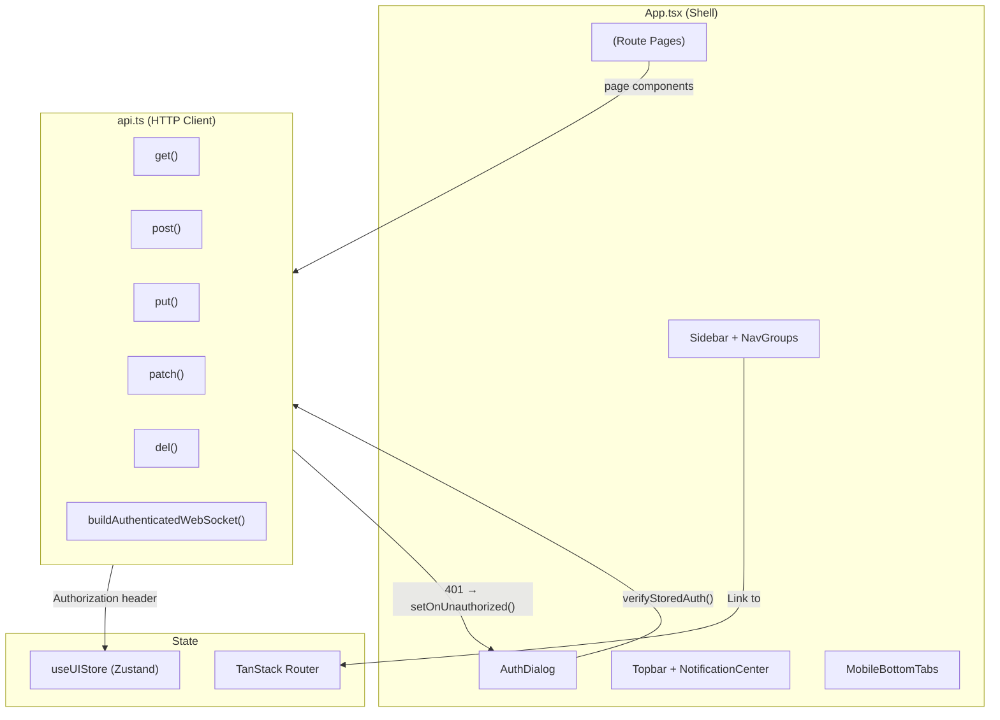

# Dashboard Frontend

# Dashboard Frontend

The LibreFang dashboard is a single-page React application that provides the operator control plane for the daemon. It covers agent management, real-time chat, workflow editing, provider/channel configuration, media generation, audit trails, and diagnostics — all through a single authenticated shell.

## Architecture Overview

## Authentication

The dashboard supports four authentication modes negotiated with the daemon at startup:

| Mode | Description |
|------|-------------|
| `none` | No auth required — dashboard renders immediately |
| `api_key` | Single API key input, stored in session/localStorage |
| `credentials` | Username + password, optional TOTP second factor |
| `hybrid` | User chooses between credentials and API key tabs |

### Startup Flow

1. `App` calls `checkDashboardAuthMode()` to learn the daemon's auth mode
2. If mode is `none`, the shell renders directly
3. Otherwise, `verifyStoredAuth()` checks for a previously stored token
4. If no valid token exists, `AuthDialog` renders as a fullscreen modal
5. On successful login, the token is persisted and the shell mounts

### Token Storage

Tokens are stored via `setApiKey(key)` which writes to **sessionStorage** (preferred, tab-scoped) with a **localStorage** fallback for backward compatibility. The function `getStoredApiKey()` checks both locations.

### Global 401 Handler

Any API response with status 401 triggers `_onUnauthorized`, which:
- Clears the stored token
- Re-probes `checkDashboardAuthMode()`
- Re-renders the `AuthDialog`

This is wired in `App`'s `useEffect` via `setOnUnauthorized()`. The shell deliberately **does not mount** `<Outlet/>` until auth is confirmed, preventing authenticated endpoints like `useDashboardSnapshot` and `useApprovalCount` from polling with invalid credentials and spamming 401s.

### No-Auth Routes

Routes in `NO_AUTH_ROUTES` (currently `/connect`) bypass the auth gate entirely. This prevents deadlocks on first-run pairing where no credentials exist yet.

### Credential Change

`ChangePasswordModal` allows authenticated users to update their username and/or password. It:
- Fetches the current username via `getDashboardUsername()`
- Validates password length (≥8), confirmation match, and username length (≥2)
- Calls `changePassword()` with current password verification
- On success, clears the API key and reloads the page after 1.5s

## API Client (`api.ts`)

The API layer provides a fully typed HTTP client for all daemon endpoints.

### HTTP Helpers

Five generic functions handle all requests:

| Function | Default Timeout | Notes |
|----------|----------------|-------|
| `get<T>` | 30s | JSON parse |
| `post<T>` | 60s | Supports external `AbortSignal` for cancellation |
| `put<T>` | 30s | — |
| `patch<T>` | 30s | — |
| `del<T>` | 30s | Returns `{}` on 204 No Content |

All helpers:
- Merge `Authorization: Bearer <token>` and `Accept-Language` headers via `buildHeaders()`
- Use `AbortSignal.timeout()` for deadlines
- Route through `parseError()` which fires the global 401 handler on unauthorized responses

### WebSocket Auth

`buildAuthenticatedWebSocket(path)` returns `{ url, protocols }` for use with `new WebSocket()`. The bearer token is sent as a `bearer.<token>` sub-protocol in `Sec-WebSocket-Protocol` rather than a query parameter, keeping it out of server logs and browser history.

### Timeout Constants

| Constant | Value | Usage |
|----------|-------|-------|
| `DEFAULT_TIMEOUT_MS` | 30s | Reads, light writes |
| `DEFAULT_POST_TIMEOUT_MS` | 60s | Standard mutations |
| `LONG_RUNNING_TIMEOUT_MS` | 300s | Agent messages, file uploads, media generation |

### Key Domain Types

The API module defines TypeScript interfaces for every daemon response shape. Notable patterns:

- **Discriminated unions** for `ContentBlock` — tagged on `type: "text" | "thinking" | "tool_use" | "tool_result" | "image" | "image_file"`. Unknown server variants are handled at runtime without breaking narrowing.
- **`PaginatedResponse<T>`** — the standard envelope with `items`, `total`, `offset`, `limit`.
- **`CronDeliveryTarget`** — tagged union on `type: "channel" | "webhook" | "local_file" | "email"`.
- **Tri-state string fields** — `api_key_env` and `base_url` in hand runtime config use absent/empty/value to mean leave-as-is/clear/set.
- **`EvolutionResult`** — skill mutation responses include `match_strategy` and `match_count` for patch operations.

### File Uploads

`uploadAgentFile(agentId, file)` sends raw bytes with `Content-Type` set to the file's MIME type and `X-Filename` carrying the sanitized original name (non-ASCII bytes replaced with `_` per RFC 7230).

## Navigation Shell

### Sidebar

The sidebar (`<aside>`) is a 232px collapsible panel (64px when collapsed) containing:

1. **Brand block** — sky-gradient logo mark, "librefang" wordmark, version + hostname
2. **Search trigger** — opens the command palette (⌘K)
3. **Nav groups** — four sections of `<Link>` items:

| Group | Key | Routes |
|-------|-----|--------|
| Primary | `primary` | overview, agents, chat, sessions, skills, workflows, scheduler, approvals |
| Runtime | `runtime` | mcp-servers, channels, providers, models, memory, network, a2a, hands, plugins, goals |
| Observability | `observability` | analytics, telemetry, audit, logs, terminal (conditional), comms, media |
| Admin | `admin` | runtime, config, users, settings |

When `navLayout` is `"collapsible"`, labeled groups (Runtime, Observability, Admin) can be collapsed via `toggleNavGroup`. The primary group always renders uncollapsed.

The `/terminal` route appears only when `terminalEnabled` is true (fetched from `getStatus()` with fail-open).

### Active State

Active nav items receive `NAV_ACTIVE_CLASS`: brand-tinted background, brand-colored text, and a 2px left-edge glow bar using `before:` pseudo-elements. Tailwind v4 requires explicit `before:content-['']` for pseudo-element rendering.

### User Menu

`SidebarUserBlock` renders the user avatar row at the sidebar footer. Clicking it opens `UserMenuPanel` — a floating dropdown providing:

- Theme toggle (light/dark)
- Language switch (English / 简体中文)
- Links to Settings, Shortcuts help, Change credentials
- Sign out button (hidden when `authMode === "none"`)

The same `UserMenuPanel` is also accessible from the topbar avatar button, using `position: fixed` to escape the `overflow-hidden` ancestor.

### Topbar

A compact 48px header with:
- Mobile hamburger menu + brand block (hidden on desktop)
- Desktop breadcrumb: `prod → <currentPageLabel>`
- Search button
- `NotificationCenter` icon
- Terminal quick-link button (when enabled)
- User avatar dropdown

### Mobile Navigation

On screens below `lg` breakpoint:
- The sidebar becomes a fixed off-canvas drawer (slides from left)
- `MobileBottomTabs` renders 5 tabs: Overview, Agents, Chat, Approvals, and a "More" button that opens the sidebar drawer
- Safe area inset padding is applied for notched devices

### Full-Height Routes

Routes in `FULL_HEIGHT_ROUTES` (`/terminal`) render with `flex-1 overflow-hidden` instead of the standard `overflow-y-auto` scrollable layout, allowing terminal emulators to fill the viewport.

## Page Transitions

Route changes animate via Framer Motion's `AnimatePresence` with `mode="wait"`. Full-height and standard pages use different animation keys (`full:<path>` vs `std:<path>`) to prevent layout jumps during transitions.

## Global UI Components

| Component | Purpose |
|-----------|---------|
| `CommandPalette` | Modal search (⌘K) — route navigation, actions |
| `ShortcutsHelp` | Keyboard shortcuts reference modal |
| `PushDrawer` | Side drawer for contextual panels |
| `NotificationCenter` | Real-time notification bell + dropdown |
| `OfflineBanner` | Shown when the daemon is unreachable |
| `OfflineBanner` | Daemon reachability warning |

## State Management

`useUIStore` (Zustand) manages all client-side UI state:

- `theme` / `toggleTheme` — dark/light mode, synced to `<html class="dark">`
- `language` / `setLanguage` — persisted to localStorage for i18next
- `isSidebarCollapsed` / `toggleSidebar` — sidebar width
- `navLayout` — `"collapsible"` vs flat nav sections
- `collapsedNavGroups` — per-group collapse state
- `isMobileMenuOpen` / `setMobileMenuOpen` — mobile drawer
- `terminalEnabled` / `setTerminalEnabled` — feature flag from daemon status

## Internationalization

All user-facing strings use `useTranslation()` with keys namespaced under `nav.`, `auth.`, `settings.`, and `common.`. Supported languages are English (`en`) and Simplified Chinese (`zh`). The current language is sent to the daemon via the `Accept-Language` header on every request.

## Adding a New Page

1. Define the route in `src/router.tsx` (TanStack Router)
2. Add the route string to the `DashboardRoute` type union in `App.tsx`
3. Add a `NavItem` entry to the appropriate `navGroups` section
4. Create the page component and wire any API calls through the typed `api.ts` functions

When adding nav items, respect the 30px row height and 13px font conventions. Collapsed sidebar items should center their icon and hide text labels.