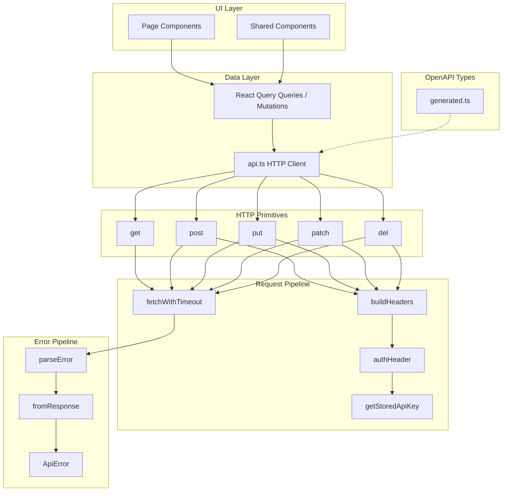

# Dashboard Frontend

# Dashboard Frontend

The Dashboard Frontend is a React-based SPA (with optional Tauri desktop/mobile bundling) that provides a web UI for operating, monitoring, and configuring the LibreFang agent kernel. It communicates exclusively through a typed HTTP client layer that wraps the kernel's REST API.

## Architecture Overview


```mermaid
graph TD
    subgraph "UI Layer"
        Pages[Page Components]
        SharedComp[Shared Components]
    end

    subgraph "Data Layer"
        RQ[React Query Queries / Mutations]
        APIClient[api.ts HTTP Client]
    end

    subgraph "HTTP Primitives"
        GET[get]
        POST[post]
        PUT[put]
        PATCH[patch]
        DEL[del]
    end

    subgraph "Request Pipeline"
        FWT[fetchWithTimeout]
        BH[buildHeaders]
        AH[authHeader]
        GSAK[getStoredApiKey]
    end

    subgraph "Error Pipeline"
        PE[parseError]
        FR[fromResponse]
        AE[ApiError]
    end

    subgraph "OpenAPI Types"
        GEN[generated.ts]
    end

    Pages --> RQ
    SharedComp --> RQ
    RQ --> APIClient
    APIClient --> GET & POST & PUT & PATCH & DEL
    GET & POST & PUT & PATCH & DEL --> FWT
    POST & PUT & PATCH & DEL --> BH
    BH --> AH --> GSAK
    FWT --> PE --> FR --> AE
    GEN -.-> APIClient
```

## HTTP Client (`dashboard/src/api.ts`)

Every backend call goes through this module. It exports five primitives and dozens of domain-specific wrapper functions.

### Request Primitives

| Function | Method | Auth | Key Details |
|----------|--------|------|-------------|
| `get(path, params?)` | GET | Optional | Returns parsed JSON |
| `post(path, body?)` | POST | Yes (via `buildHeaders`) | Supports idempotency keys |
| `put(path, body?)` | PUT | Yes | Used for full replacements |
| `patch(path, body?)` | PATCH | Yes | Partial updates |
| `del(path, opts?)` | DELETE | Yes | Supports confirm flags |

### Request Pipeline

1. **`buildHeaders`** — Constructs `Content-Type: application/json` and injects the auth token.
2. **`authHeader`** — Reads the stored API key via `getStoredApiKey` and sets `Authorization: Bearer <token>`.
3. **`getStoredApiKey`** — Retrieves the persisted session token (browser localStorage or Tauri secure storage depending on platform).
4. **`fetchWithTimeout`** — Wraps the native `fetch` with a configurable timeout to prevent hung connections on unreliable networks.

### Error Pipeline

All non-2xx responses are caught and processed identically:

```
fetch response → parseError → fromResponse → ApiError
```

`ApiError` (from `lib/http/errors.ts`) carries the HTTP status, a human-readable message, and the raw response body. React Query mutations and queries catch this and surface it in the UI via toast notifications and error boundaries.

## Authentication Flow

The dashboard supports two auth modes, detected at startup via `GET /api/auth/dashboard-check`:

- **Dashboard credentials** — Username/password validated with Argon2id. `POST /api/auth/dashboard-login` returns a session token stored in a `librefang_session` cookie and/or `Authorization` header.
- **OAuth2 providers** — Redirect-based flow. `GET /api/auth/providers` lists available providers; `GET /api/auth/login/{provider}` initiates the redirect. `GET /api/auth/callback` handles the code exchange.

The `verifyStoredAuth` function (tested in `api.test.ts`) validates an existing token on page load against `POST /api/auth/introspect` (RFC 7662), which returns `{ active: true/false }`.

### Tauri Platform Integration

When running inside a Tauri shell (`isTauri()` check from `src/lib/tauri.ts`):

- **`isMobileTauri()`** — Further distinguishes mobile from desktop Tauri.
- **`getCredentials()`** — Reads credentials from native secure storage instead of `localStorage`.
- **`clearCredentials()`** — Calls `invoke('clear_credentials')` to wipe native storage on logout.
- **`invoke`** — Generic bridge to Tauri Rust commands for platform-specific operations.

## React Query Data Layer (`lib/queries/` and `lib/mutations/`)

The UI never calls `api.ts` directly. Instead, it uses React Query hooks that encapsulate caching, refetching, and optimistic updates.

**Query hooks** (`lib/queries/`) wrap read operations. Example flow:

```
queryFn (lib/queries/skills.ts)
  → getSkillDetail (dashboard/src/api.ts)
  → get (dashboard/src/api.ts)
  → parseError (dashboard/src/api.ts) on failure
```

**Mutation hooks** (`lib/mutations/`) wrap write operations. Example flow:

```
mutationFn (lib/mutations/agents.ts)
  → stopAgent (dashboard/src/api.ts)
  → post (dashboard/src/api.ts)
  → buildHeaders → authHeader → getStoredApiKey
```

```
mutationFn (lib/mutations/skills.ts)
  → installSkill (dashboard/src/api.ts)
  → post (dashboard/src/api.ts)
  → buildHeaders → authHeader → getStoredApiKey
```

Mutations invalidate related query caches on success so the UI refreshes automatically.

## OpenAPI Type Definitions (`dashboard/openapi/generated.ts`)

**This file is auto-generated by `openapi-typescript` and must never be edited directly.** It exports a single `paths` interface mapping every API route to its request/response types. The generated types are used throughout the codebase for compile-time safety — if the kernel adds or changes an endpoint, regenerating this file surfaces type errors in every caller.

## API Domain Map

The kernel exposes roughly 200 endpoints. The dashboard organizes them into functional groups:

| Domain | Prefix | Key Operations | Representative Functions |
|--------|--------|----------------|--------------------------|
| **Agents** | `/api/agents` | CRUD, mode, model, sessions, tools, skills, files, memory, metrics, traces | `listAgentEvents`, `setAgentSkills`, `resetAgentSession`, `uploadAgentFile` |
| **A2A** | `/a2a/*`, `/api/a2a/*` | Agent cards, task send/get/cancel, external agents | `sendA2ATask` |
| **Auth** | `/api/auth/*` | Login, logout, refresh, providers, introspect | `verifyStoredAuth` |
| **Audit** | `/api/audit/*`, `/api/logs/stream` | Query, export, verify, real-time SSE stream | — |
| **Budget** | `/api/budget/*` | Global/per-agent/per-user limits and spend | — |
| **Channels** | `/api/channels/*` | List, configure sidecars, QR login, reload | `getChannelQr` |
| **ClawHub** | `/api/clawhub/*` | Browse, search, install skills | `installSkill`, `uninstallSkill` |
| **Comms** | `/api/comms/*` | Agent-to-agent messaging, topology, SSE events | `getCommsTopology`, `listCommsEvents` |
| **Config** | `/api/config/*` | Get, reload, schema, set individual values | — |
| **Cron** | `/api/cron/jobs/*` | CRUD, enable/disable toggle | — |
| **Hands** | `/api/hands/*` | Marketplace, activate/deactivate, settings, deps | `listHands`, `activateHand`, `getHandSettings` |
| **Health** | `/api/health` | Liveness (public), detail (authed) | `getHealth` |
| **MCP** | `/api/mcp/*` | Servers, catalog, health, reconnect, taint rules | — |
| **Memory** | `/api/memory/*` | Proactive memory CRUD, search, consolidate, import/export | — |
| **Models** | `/api/models/*` | Catalog, aliases, custom models, overrides | `listModels`, `addCustomModel`, `updateModelOverrides` |
| **Providers** | `/api/providers/*` | List, detail, credential pools, Copilot OAuth | `listCredentialPools` |
| **Backup** | `/api/backup`, `/api/backups/*` | Create, list, restore, delete | `listBackups`, `restoreBackup` |

## Key Implementation Patterns

### Idempotency Keys

Several write endpoints (`POST /api/agents`, `POST /api/hands/{id}/activate`, `POST /api/a2a/send`) accept an `Idempotency-Key` header. When set, duplicate requests with the same key and body replay the cached response. A different body under the same key returns `409 Conflict`. The dashboard sets these keys automatically for user-facing actions that could be double-clicked.

### Confirm-Required Destructive Operations

Destructive endpoints (`DELETE /api/agents/{id}`, `POST /api/agents/identities/{name}/reset`) require `confirm=true` in the query string or JSON body. Without it, the server returns `409 Conflict` with a data-loss warning. The dashboard surfaces this as a confirmation dialog before retrying with the flag.

### Idempotent Deletes

`DELETE /api/agents/{id}` and `DELETE /api/cron/jobs/{id}` return `200 OK` with `{"status": "already-deleted"}` when the target is already gone. Only malformed UUIDs produce `404`. This eliminates phantom errors from network retries and double-clicks.

### Server-Sent Events (SSE)

Real-time data uses SSE connections:

- **`GET /api/logs/stream`** — Audit log stream with 15-second heartbeats. Sends up to 200 entries as backfill, then uses a cursor (`since_seq`) for incremental updates. Supports `level` and `filter` query parameters.
- **`GET /api/comms/events/stream`** — Inter-agent communication events, polling every 500ms.
- **`GET /api/agents/{id}/message/stream`** — Streaming agent responses (POST-initiated SSE).
- **`GET /api/agents/{id}/sessions/{session_id}/stream`** — Attach to an in-flight session's events. Late joiners receive events from subscription time forward; partial turns are not replayed.

### File Uploads

`POST /api/agents/{id}/upload` accepts raw body bytes with `Content-Type` and `X-Filename` headers. The dashboard's `uploadAgentFile` function in `api.ts` constructs these headers via `buildHeaders` (bypassing the default JSON content type).

### Session Management

Agents support multiple named sessions with full lifecycle management:

| Operation | Endpoint | Dashboard Function |
|-----------|----------|--------------------|
| List sessions | `GET /api/agents/{id}/sessions` | — |
| Create session | `POST /api/agents/{id}/sessions` | — |
| Switch session | `POST /api/agents/{id}/sessions/{sid}/switch` | — |
| Stop in-flight turn | `POST /api/agents/{id}/sessions/{sid}/stop` | — |
| Export (hibernation) | `GET /api/agents/{id}/sessions/{sid}/export` | — |
| Import | `POST /api/agents/{id}/sessions/import` | — |
| Compact (summarize) | `POST /api/agents/{id}/session/compact` | — |
| Reset (with summary) | `POST /api/agents/{id}/session/reset` | `resetAgentSession` |
| Reboot (hard clear) | `POST /api/agents/{id}/session/reboot` | — |

### Audio Transcription

`transcribeAudio` in `api.ts` handles audio file upload for speech-to-text. It follows a distinct path through `parseError` rather than the standard JSON pipeline, reflecting the multipart form-data nature of the request.

## Shared UI Utilities

Several shared modules support the dashboard's component layer:

- **`ResponsiveTable`** (`components/ui/ResponsiveTable.tsx`) — Adapts table layout for mobile. Uses `safeCellValue` to sanitize cell content before rendering.
- **`Sparkline`** (`components/ui/Sparkline.tsx`) — Mini chart for KPI tiles (agent stats, budget usage).
- **`MultiSelectCmdk`** (`components/ui/MultiSelectCmdk.tsx`) — Command-palette-style multi-select for assigning skills, tools, and MCP servers to agents.
- **`useListNav`** (`src/lib/useListNav.ts`) — Keyboard-navigable list hook; `getItemProps` returns ARIA attributes for accessibility.

## Build and Code Generation

The `generated.ts` file is regenerated by running `openapi-typescript` against the kernel's OpenAPI spec. After any kernel API change:

1. Regenerate `dashboard/openapi/generated.ts`.
2. Fix any type errors in `dashboard/src/api.ts` wrapper functions.
3. Fix any downstream errors in React Query hooks and page components.

The type surface is large (200+ endpoints) but the pattern is uniform — each endpoint maps to a typed wrapper function in `api.ts`, consumed through a React Query hook, rendered by a page or component.

## Adding a New API Integration

To wire up a new kernel endpoint:

1. **Regenerate types** — Run the OpenAPI codegen to update `generated.ts`.
2. **Add a wrapper function** in `dashboard/src/api.ts` using the appropriate primitive (`get`, `post`, `put`, `patch`, `del`). Return typed data from the generated types.
3. **Create a query or mutation hook** in `lib/queries/` or `lib/mutations/` wrapping the new function. Include cache invalidation keys for mutations.
4. **Consume in a component** — Call the hook from a page or shared component. Error states are handled automatically by React Query and the `ApiError` pipeline.