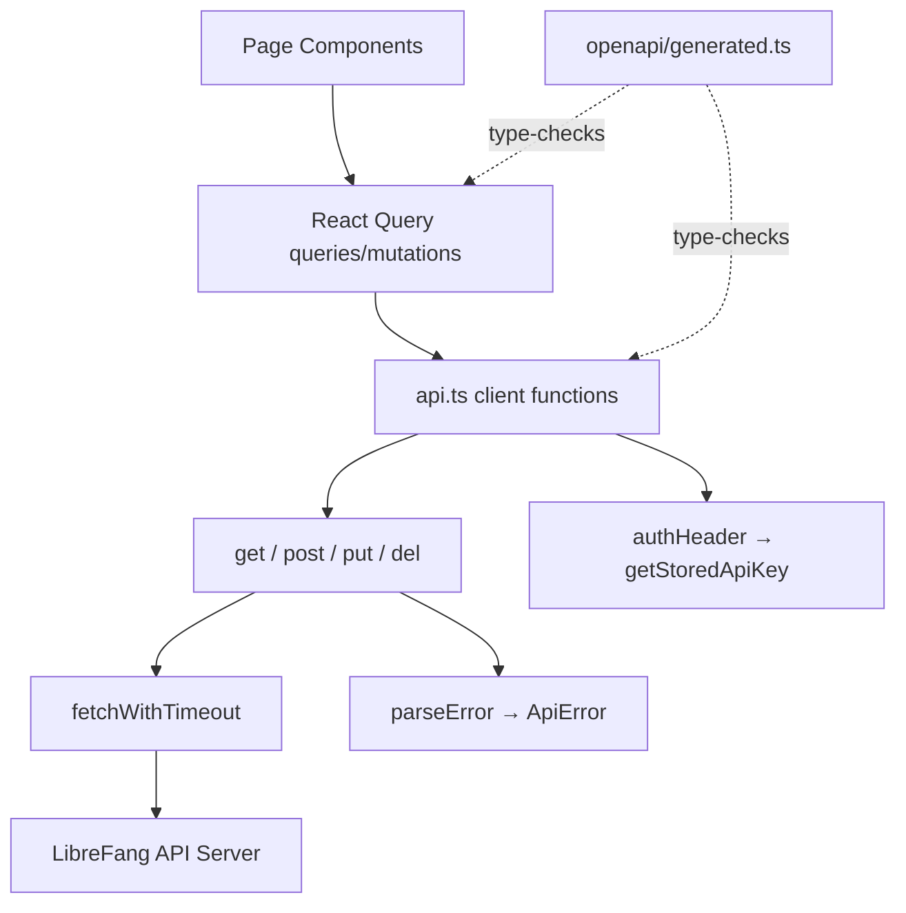

# Dashboard Frontend

# Dashboard Frontend

The dashboard frontend is a React-based single-page application that provides the operator UI for managing LibreFang agents, sessions, channels, budgets, and all kernel subsystems. It communicates with the LibreFang API server through a typed HTTP client layer and auto-generated OpenAPI type definitions.

## Architecture


```mermaid
graph TD
    P[Page Components] --> Q[React Query queries/mutations]
    Q --> A[api.ts client functions]
    A --> H[get / post / put / del]
    H --> F[fetchWithTimeout]
    F --> B[LibreFang API Server]
    A --> AUTH[authHeader → getStoredApiKey]
    H --> E[parseError → ApiError]
    O[openapi/generated.ts] -.->|type-checks| A
    O -.->|type-checks| Q
```

The data flow is strictly unidirectional: page components invoke React Query hooks, which call API client functions, which use core HTTP helpers that hit the backend. The OpenAPI generated types provide compile-time safety across the entire chain.

## Key Components

### OpenAPI Generated Types (`dashboard/openapi/generated.ts`)

**Do not edit this file directly** — it is auto-generated by `openapi-typescript` from the backend's OpenAPI spec. It exports:

- **`paths`** — a mapped type where each key is an API route (e.g. `"/api/agents/{id}/session"`) and the value describes available HTTP methods, their parameters, request bodies, and response shapes.
- **`operations`** — operation IDs mapped to full request/response types (e.g. `operations["spawn_agent"]`, `operations["list_agents"]`).

These types ensure the API client and React Query layers are statically checked against the actual backend contract.

### API Client (`dashboard/src/api.ts`)

The central HTTP client module. It exports dozens of domain-specific functions — one per backend endpoint — plus the low-level primitives they share.

#### Core HTTP helpers

| Function | Purpose |
|---|---|
| `fetchWithTimeout(url, init?, timeout?)` | Wraps `fetch` with a configurable timeout (default 30s). Used directly for streaming and binary endpoints. |
| `get(path, params?)` | GET request. Appends query params, calls `fetchWithTimeout`, parses JSON. |
| `getText(path)` | GET request returning raw text (used for config TOML, Prometheus metrics). |
| `post(path, body?)` | POST with JSON body. |
| `put(path, body?)` | PUT with JSON body. |
| `del(path)` | DELETE request (named `del` to avoid the JS reserved word). |

Every core helper calls `parseError` on non-OK responses, which delegates to `fromResponse` in `lib/http/errors.ts` to produce an `ApiError`.

#### Authentication

All mutating requests and most reads require auth. The chain is:

1. `buildHeaders()` calls `authHeader()`
2. `authHeader()` calls `getStoredApiKey()` to retrieve the stored session token
3. The token is injected as `Authorization: Bearer <token>` (or as `X-API-Key` for webhook endpoints)

Session tokens come from the `POST /api/auth/dashboard-login` flow or the `librefang_session` cookie set during OAuth callback.

#### Error handling

```typescript
// lib/http/errors.ts
class ApiError extends Error {
  status: number;    // HTTP status code
  body: unknown;     // Parsed response body
}
```

The `parseError` function in `api.ts` catches non-2xx responses, calls `fromResponse` to build an `ApiError`, and throws it. React Query hooks catch these and surface them in the UI.

### React Query Layer

The API client functions are wrapped in React Query hooks for caching, refetching, and optimistic updates:

- **Queries** (`lib/queries/`): e.g., query functions that call `getAgentTools`, `getSkillDetail`, `listMcpTaintRules`. These handle background refetching, stale-while-revalidate, and pagination.
- **Mutations** (`lib/mutations/`): e.g., `mutationFn` wrappers that call `stopAgent`, `updateAgentTools`, `patchHandAgentRuntimeConfig`. These invalidate related queries on success.

### Utility Libraries (`src/lib/`)

Shared logic extracted from page components:

| Module | Purpose |
|---|---|
| `agentManifest.ts` | Serializes manifest form state to TOML; `renderSchedule` formats cron/interval fields |
| `sessionSelector.ts` | `pickLatestSessionId`, `deriveDropdownActiveSessionId`, `shouldAutoPinResolvedSession` — session auto-selection heuristics |
| `csvParser.ts` | Parses CSV content (used in import flows) |
| `triggerPattern.ts` | `formatTriggerPattern` for proactive agent trigger display |
| `workflowOutputImages.ts` | `extractImageRefs` for rendering image references in workflow output |
| `useListNav.ts` | React hook for keyboard-navigable list views |
| `safeUrl.ts` | Sanitizes URLs to prevent XSS in rendered output |

## API Endpoint Categories

The generated types and client functions cover these domains:

- **Agents** — CRUD, spawn/kill/suspend/resume, clone, bulk operations, mode changes, tool/skill/MCP allowlists
- **Sessions** — create, switch, list, export/import for hibernation, stream SSE, compact/reboot/reset, trajectory export
- **Memory** — KV store, proactive memory CRUD, search, consolidation, import/export, per-agent scoping
- **Channels** — list configured adapters, sidecar configuration, QR login flow, hot-reload
- **Budget** — global and per-agent limits, cost ranking, per-user spend tracking
- **MCP** — server CRUD, catalog, health, reconnect, taint rules
- **Cron** — job CRUD, enable/disable toggle, status
- **Audit** — recent entries, filtered query, chain verification, export, real-time SSE stream
- **Auth** — dashboard login/logout, OAuth provider flow, TOTP, token refresh, introspection
- **Hands** — marketplace listing, activate/deactivate, pause/resume, browser state, dependency management
- **A2A** — agent-to-agent task send/cancel/status, external agent discovery
- **Providers** — list with reachability probes, credential pool inspection, GitHub Copilot OAuth flow
- **Models** — catalog listing, custom model CRUD, alias management
- **Skills** — ClawHub browse/search/install, FangHub marketplace
- **Extensions** — install/uninstall catalog entries
- **Webhooks** — agent turn execution, wake/event injection

## Common Patterns

### Idempotency

Several mutating endpoints (`spawn_agent`, `activate_hand`, `a2a_send_external`) support `Idempotency-Key`. When set, a duplicate request with the same key and body replays the cached response. A different body under the same key returns `409 Conflict`.

### Confirmation gates

Destructive operations like `kill_agent` and `reset_agent_identity` require `confirm=true` (query param or JSON body field). Without it, the server returns `409 Conflict` with a data-loss warning. The API client functions pass this automatically when the UI confirms.

### SSE streaming

Two streaming patterns are used:

1. **Message streaming** (`POST /api/agents/{id}/message/stream`) — returns SSE events for a single agent turn.
2. **Session stream attach** (`GET /api/agents/{id}/sessions/{session_id}/stream`) — subscribes to events from an in-flight turn. Late attachers receive events from their subscription point forward.
3. **Audit log stream** (`GET /api/logs/stream`) — polls the audit log with cursor-based backfill (up to 200 entries initially, then cursor-driven).
4. **Comms events stream** (`GET /api/comms/events/stream`) — polls inter-agent communication events every 500ms.

### Pagination

Most list endpoints use the canonical envelope:

```typescript
{ items: T[], total: number, offset: number, limit: number }
```

The frontend's `useListNav` hook handles keyboard navigation and offset management for paginated views.

## Adding a New Endpoint

1. **Define the backend route** — the OpenAPI spec is updated automatically.
2. **Regenerate types** — run `openapi-typescript` against the updated spec to refresh `dashboard/openapi/generated.ts`.
3. **Add a client function** in `dashboard/src/api.ts` using the appropriate core helper (`get`, `post`, `put`, or `del`). Import the operation type from `generated.ts` for the request/response shapes.
4. **Create a React Query hook** in `lib/queries/` (for reads) or `lib/mutations/` (for writes). Use the operation type to type the hook's return value.
5. **Consume in a page component** — call the hook and render the result.

## Testing

The API client is tested in `dashboard/src/api.test.ts`, which exercises:

- `buildAuthenticatedWebSocket` — WebSocket connection with auth headers
- `getAgentTools` / `updateAgentTools` — round-trip tool allowlist read/write
- `patchHandAgentRuntimeConfig` — hand agent config mutation
- `getMetricsText` — raw Prometheus text parsing
- `verifyStoredAuth` — session token retrieval

Utility libraries have co-located test files following the `*.test.ts` convention (e.g., `sessionSelector.test.ts`, `triggerPattern.test.ts`, `workflowOutputImages.test.ts`).