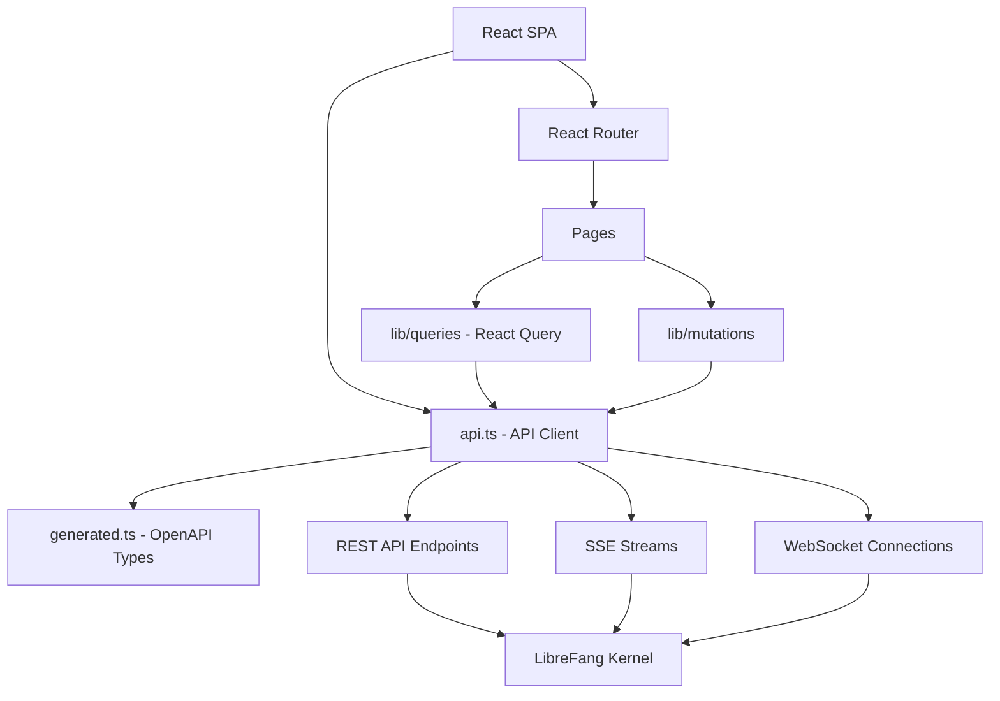

# Dashboard UI

# Dashboard UI Module

The dashboard is a React-based single-page application that provides a web interface for managing and monitoring the LibreFang agent platform. It communicates with the LibreFang kernel through a REST API and Server-Sent Events (SSE) for real-time updates.

## Architecture Overview



## Key Files

| File | Purpose |
|---|---|
| `openapi/generated.ts` | Auto-generated TypeScript types from the OpenAPI schema. **Do not edit directly** — regenerated via `openapi-typescript`. |
| `dashboard/src/api.ts` | Hand-written API client layer. All HTTP calls, authentication header construction, error parsing, and WebSocket setup live here. |
| `dashboard/src/main.tsx` | Application entry point. Mounts the React tree and the `ToastContainer`. |
| `dashboard/src/App.tsx` | Root component. Handles auth checks (`checkAuth`), terminal feature detection (`setTerminalEnabled`), and renders `SidebarUserBlock` with `UserMenuPanel`. |
| `dashboard/src/router.tsx` | Route definitions mapping paths to page components (e.g., `UserPolicyPage`, `PluginsPage`). |

## Auto-Generated API Types (`generated.ts`)

This file is produced by `openapi-typescript` and exports TypeScript interfaces describing every endpoint the kernel exposes. It is the single source of truth for request/response shapes.

### Structure

The file exports these top-level namespaces:

- **`paths`** — Maps every URL pattern to its HTTP methods and associated operation IDs. Each path entry specifies which methods are available and points into the `operations` interface.
- **`operations`** — Maps operation IDs (e.g., `"list_agents"`, `"spawn_agent"`) to their request parameters, request body, and response types.
- **`components`** — Shared schemas referenced by operations (request/response bodies, enums, etc.).

### Adding a New Endpoint

When a new route is added to the kernel's OpenAPI spec:

1. Regenerate the types: `npx openapi-typescript <spec-url> -o dashboard/openapi/generated.ts`
2. The new path and operation types will appear automatically.
3. Add a corresponding caller function in `api.ts`.

## API Client Layer (`api.ts`)

All backend communication flows through `api.ts`. It provides HTTP primitives and domain-specific functions layered on top.

### HTTP Primitives

Four core functions handle all requests:

| Function | Method | Auth |
|---|---|---|
| `get<T>(path, params?)` | GET | Automatic via `buildHeaders` |
| `post<T>(path, body?, params?)` | POST | Automatic |
| `put<T>(path, body?, params?)` | PUT | Automatic |
| `del<T>(path, params?)` | DELETE | Automatic |

Each primitive calls `buildHeaders` → `authHeader` → `getStoredApiKey` to attach the current API key. Responses are typed via generics. Errors are caught and normalized through `parseError` → `fromResponse` → `ApiError`.

### Authentication Flow

```
Request → buildHeaders() → authHeader() → getStoredApiKey()
                                              ↓
                                     localStorage / cookie
                                              ↓
                                     Authorization: Bearer <key>
```

- **`getStoredApiKey()`** — Retrieves the persisted API key from browser storage.
- **`authHeader()`** — Formats the key into an `Authorization: Bearer` header.
- **`buildHeaders()`** — Assembles the full headers object including auth and content type.
- **`verifyStoredAuth()`** — Validates that the stored credentials are still valid (used at app startup and in tests).

For WebSocket connections, `buildAuthenticatedWebSocket` constructs a WS URL with the token attached as a query parameter since browsers cannot set custom headers on WebSocket handshakes.

### Error Handling

```
HTTP Error Response
    ↓
parseError(response)
    ↓
fromResponse(response)   [from lib/http/errors.ts]
    ↓
ApiError { status, message, detail }
```

Every API function wraps the HTTP primitive in a try/catch that converts the raw response into a typed `ApiError`. This ensures the UI can display meaningful error messages and React Query can track error states.

### Domain-Specific API Functions

The file exports ~100+ functions organized by domain. Here are the major groups:

#### Agent Management
- `getAgentDetail(id)` → GET `/api/agents/{id}`
- `sendAgentMessage(id, body)` → POST `/api/agents/{id}/message`
- `stopAgent(id)` → POST `/api/agents/{id}/stop`
- `uploadAgentFile(id, file)` → POST `/api/agents/{id}/upload` (uses `parseError` directly for upload-specific error handling)

#### Hand Agents
- `patchHandAgentRuntimeConfig(id, patch)` — Calls `serializeHandAgentRuntimeConfigPatch` to transform the UI form state before sending.
- `sendHandMessage(id, body)` → POST to the hand agent's messaging endpoint.

#### A2A (Agent-to-Agent)
- `sendA2ATask(body)` → POST `/a2a/tasks/send`

#### Memory
- `updateMemory(id, content)` → PUT `/api/memory/items/{id}`

#### MCP Servers
- `addMcpServer(config)` → POST `/api/mcp/servers`
- `reloadMcp()` → POST `/api/mcp/reload`

#### Usage & Metrics
- `getUsageSummary()` → GET `/api/usage/summary`
- `getUsageByModelPerformance()` → GET `/api/usage/by-model`
- `getMetricsText()` → GET `/api/metrics` (returns raw Prometheus text via `getText` instead of JSON-parsed `get`)

#### Other Domains
- `listTools()` — Tool definitions
- `listGoals()` — Goal tracking
- `getNetworkStatus()` — OFP network status
- `createSchedule(body)` — Scheduled jobs
- `createPairingRequest()` — Device pairing
- `listTerminalWindows()` — Terminal feature (uses `buildHeaders` directly for special headers)
- `deleteBackup(filename)` — Backup management
- `modifyAndRetryApproval(id, body)` — Approval workflow
- `transcribeAudio(blob)` — Audio transcription (uses `buildHeaders` for multipart)
- `submitVideo(body)` — Video submission
- `saveWorkflowAsTemplate(body)` — Workflow templates
- `setDefaultProvider(name)` — Provider configuration

### Utility Functions

- **`deref(ref)`** — Resolves JSON `$ref` pointers within API responses by calling `resolveRef`.
- **`serializeHandAgentRuntimeConfigPatch(patch)`** — Transforms the dashboard's hand agent configuration form into the kernel's expected wire format.

## Real-Time Streams

The dashboard consumes three types of real-time data:

### Server-Sent Events (SSE)

| Stream | Endpoint | Purpose |
|---|---|---|
| Audit log | `GET /api/logs/stream` | Live audit entries with backfill on connect. Heartbeat every 15s. Filters via `level`, `filter`, `token` query params. |
| Agent messages | `POST /api/agents/{id}/message/stream` | Streaming LLM responses token-by-token. |
| Session attach | `GET /api/agents/{id}/sessions/{session_id}/stream` | Subscribe to an in-flight session's events. Late attachers receive events from subscribe time (no replay). |
| Comms events | `GET /api/comms/events/stream` | Inter-agent communication events. Polls audit log every 500ms. |

### WebSocket

- `buildAuthenticatedWebSocket(path)` — Constructs an authenticated WS connection for terminal and other interactive features.

## React Query Integration

The `lib/queries/` and `lib/mutations/` directories wrap `api.ts` functions for React Query:

```
lib/queries/skills.ts  →  getSkillDetail()  →  get()  →  buildHeaders()  →  authHeader()  →  getStoredApiKey()
lib/mutations/skills.ts →  installSkill()   →  post() →  buildHeaders()  →  authHeader()  →  getStoredApiKey()
lib/mutations/agents.ts →  stopAgent()      →  post() →  buildHeaders()  →  authHeader()  →  getStoredApiKey()
```

Query functions feed data into React Query caches. Mutation functions trigger state changes and invalidate related queries on success. Both go through the same authenticated pipeline in `api.ts`.

## Pages

The router maps URLs to page components. Key pages visible in the call graph:

| Page | File | API Functions Used |
|---|---|---|
| **MemoryPage** | `src/pages/MemoryPage.tsx` | Memory CRUD, search, consolidation |
| **AuditPage** | `src/pages/AuditPage.tsx` | Audit log stream, query, export, verify |
| **A2APage** | `src/pages/A2APage.tsx` | `sendA2ATask`, agent discovery |
| **TerminalPage** | `src/pages/TerminalPage.tsx` | `listTerminalWindows`, WebSocket |
| **UserPolicyPage** | `dashboard/src/router.tsx` | User management |
| **PluginsPage** | `dashboard/src/router.tsx` | Extensions/MCP management |

## Shared Libraries

Pages depend on shared utilities in `src/lib/`:

- **`useListNav`** — Keyboard-navigable list component hook
- **`chat.ts` / `extractAssistantHistoryParts`** — Chat message parsing
- **`agentManifest.ts` / `emptyManifestExtras`** — Agent manifest formatting
- **`sessionSelector.ts` / `pickLatestSessionId`** — Session selection logic
- **`csvParser.ts` / `parseCsvText`** — CSV parsing for audit exports

## Testing

Tests live alongside the source:

- `dashboard/src/api.test.ts` — Tests `verifyStoredAuth`, `updateAgentTools`, `getAgentTools`, `patchHandAgentRuntimeConfig`, `buildAuthenticatedWebSocket`, `getMetricsText`
- `src/pages/MemoryPage.test.tsx` — Component tests for MemoryPage
- `src/lib/*.test.ts` — Unit tests for shared utilities

When writing API tests, mock at the `fetch` level rather than importing `api.ts` internals. The test file demonstrates this pattern: it calls exported functions and asserts on the resulting HTTP requests.

## API Endpoint Reference by Domain

The `generated.ts` `paths` interface documents ~120 endpoints. Grouped by prefix:

| Prefix | Count | Purpose |
|---|---|---|
| `/api/agents` | ~30 | CRUD, sessions, memory, files, tools, skills, mode, stats, traces |
| `/api/a2a` | 5 | External agent discovery and task delegation |
| `/a2a` | 4 | Standard A2A protocol endpoints |
| `/api/sessions` | 6 | Session listing, cleanup, labels |
| `/api/memory` | 15 | Proactive memory CRUD, search, consolidation, import/export |
| `/api/budget` | 5 | Global and per-agent/user budget tracking |
| `/api/usage` | 4 | Token usage, daily breakdowns, model-level stats |
| `/api/mcp` | 8 | MCP server management, catalog, health, taint rules |
| `/api/channels` | 7 | Channel adapter configuration, QR login flows |
| `/api/auth` | 6 | OAuth2 login/callback, providers, userinfo, introspect |
| `/api/skills` | 4 | Skill installation, creation, uninstall |
| `/api/hands` | 12 | Hand marketplace, activation, pause/resume, browser state |
| `/api/triggers` | 4 | Event trigger CRUD |
| `/api/schedules` / `/api/cron` | 8 | Scheduled and cron job management |
| `/api/budget` | 5 | Cost tracking and limits |
| `/api/comms` | 4 | Inter-agent messaging, topology, events |
| `/api/backup` / `/api/restore` | 4 | State backup and restoration |
| `/api/providers` | 8 | LLM provider management, key/URL config, testing |
| `/api/models` | 6 | Model catalog, aliases, custom models |
| `/api/audit` | 4 | Audit log query, export, chain verification |
| `/api/approvals` | 4 | Approval request workflow |
| `/api/config` | 4 | Config read/reload/set/schema |
| `/api/users` | 5 | User management, key rotation |
| `/api/health` | 2 | Liveness probe and detailed diagnostics |
| `/api/logs/stream` | 1 | SSE audit log stream |
| `/api/metrics` | 1 | Prometheus-format metrics |
| `/api/tools` | 3 | Tool listing and direct invocation |
| `/api/extensions` | 4 | Extension catalog and install/uninstall |
| `/api/catalog` | 2 | Remote model catalog sync |
| `/api/clawhub` | 4 | ClawHub skill marketplace browse/search/install |
| `/api/network` | 1 | OFP network status |
| `/api/peers` | 2 | OFP peer discovery |
| `/api/pairing` | 5 | Device pairing and notifications |
| `/api/queue` | 1 | Command queue status |
| `/api/security` | 1 | Security feature status |
| `/api/templates` | 2 | Agent template listing |
| `/api/hooks` | 2 | Webhook triggers (agent turn, wake event) |
| `/api/migrate` | 3 | Framework migration |
| `/api/marketplace` | 1 | FangHub marketplace search |
| `/api/profiles` | 2 | Tool profiles |
| `/api/commands` | 2 | Chat command registry |
| `/api/bindings` | 2 | Agent bindings |
| `/api/auto-dream` | 4 | Auto-dream scheduling |
| `/api/shutdown` | 1 | Graceful shutdown |
| `/api/init` | 1 | Quick provider detection and init |

## Regenerating OpenAPI Types

```bash
# From the project root, point openapi-typescript at the running kernel's spec
npx openapi-typescript http://localhost:3000/openapi.json -o librefang-api/dashboard/openapi/generated.ts
```

The file header explicitly states: *"This file was auto-generated by openapi-typescript. Do not make direct changes to the file."* Any manual edits will be overwritten on the next regeneration.