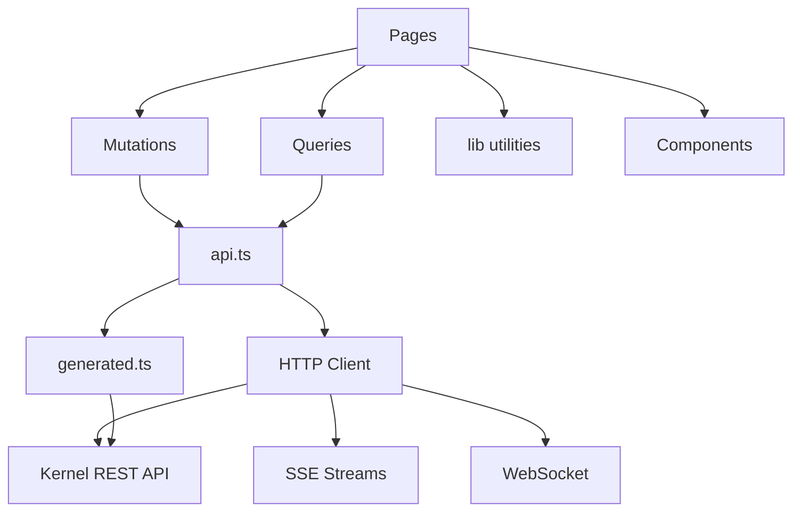
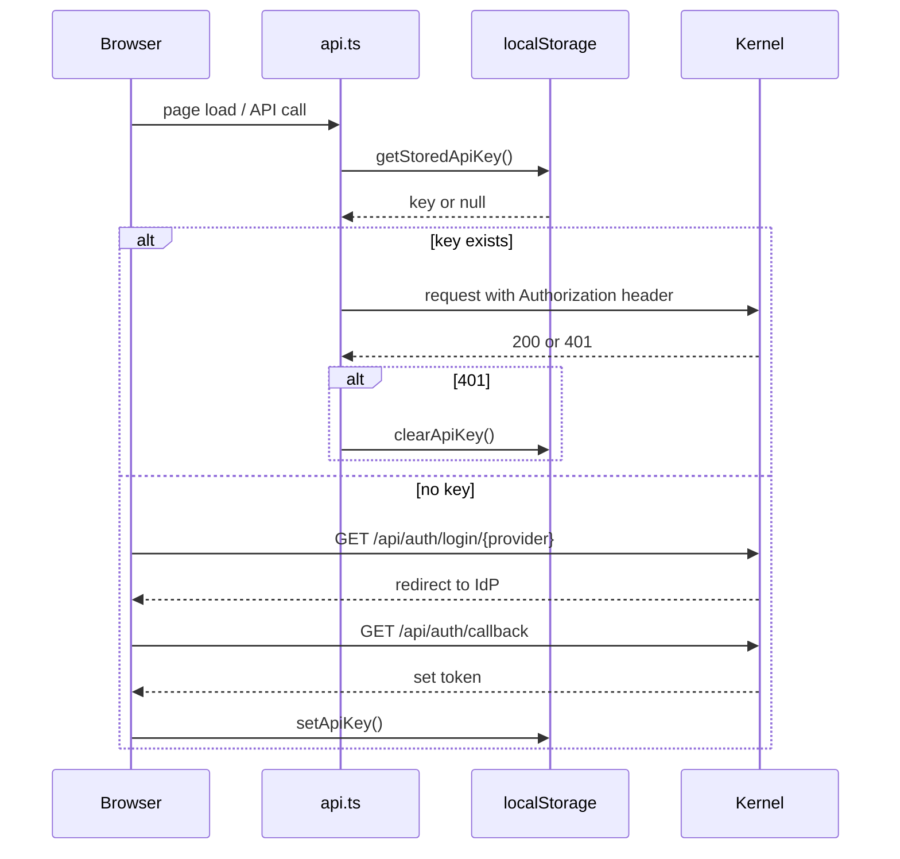

# Dashboard UI

# Dashboard UI Module

## Overview

The Dashboard is a React-based single-page application that provides the operator interface for LibreFang. It communicates with the kernel's HTTP API to manage agents, sessions, channels, schedules, hands, skills, models, users, budgets, and more. The frontend is built with Vite, uses TanStack Query for server state management, and targets both browser and Tauri desktop environments.

## Architecture



## Key Layers

### API Client (`dashboard/src/api.ts`)

The central HTTP client. Every backend call flows through here. It exposes four primitives — `get`, `post`, `put`, `del` — plus a `getText` variant for endpoints returning non-JSON (e.g., TOML manifests). All primitives call `buildHeaders` which invokes `authHeader` to read the stored API key from `localStorage`.

```typescript
// Authentication header resolution
buildHeaders() → authHeader() → getStoredApiKey() → localStorage.getItem()
```

**Error handling.** Every response passes through `parseError`, which wraps non-2xx responses into an `ApiError` (from `lib/http/errors.ts`). On 401 responses, `clearApiKey` is called to flush stale credentials.

**WebSocket support.** `buildAuthenticatedWebSocket` constructs a `ws://` or `wss://` URL with the API key as a query parameter for EventSource/WebSocket clients that cannot set HTTP headers.

Notable top-level API functions include:

| Function | Endpoint | Purpose |
|----------|----------|---------|
| `listAgentSessions` | `GET /api/agents/{id}/sessions` | Paginated session list for an agent |
| `getHandStats` | `GET /api/hands/instances/{id}/stats` | Dashboard stats for a hand instance |
| `listActiveHands` | `GET /api/hands/active` | Active hand instances |
| `getMcpServer` | `GET /api/mcp/servers/{name}` | Single MCP server config + status |
| `reloadChannels` | `POST /api/channels/reload` | Hot-reload channel config from disk |
| `runSchedule` | `POST /api/schedules/{id}/run` | Manually trigger a cron job |
| `setSessionLabel` | `PUT /api/sessions/{id}/label` | Name a session |
| `listUsageByAgent` | `GET /api/usage` | Per-agent usage statistics |
| `suspendAgent` | `PUT /api/agents/{id}/mode` | Change agent operational mode |
| `getHandManifestToml` | `GET /api/hands/{hand_id}` (text) | Raw TOML manifest for a hand |
| `getMcpAuthStatus` | `GET /api/mcp/health` | MCP server connectivity snapshot |
| `setAutoDreamEnabled` | `PUT /api/auto-dream/agents/{id}/enabled` | Toggle auto-dream for an agent |
| `deleteTerminalWindow` | `DELETE /api/...` | Terminal session cleanup |
| `clawhubSearch` | `GET /api/clawhub/search` | Vector search on ClawHub marketplace |
| `skillhubBrowse` | `GET /api/clawhub/browse` | Browse ClawHub skills by sort order |
| `getMetricsText` | `GET /api/metrics` | Prometheus text-format metrics |
| `verifyStoredAuth` | `POST /api/auth/introspect` | Validate stored token, return claims |
| `patchHandAgentRuntimeConfig` | `PATCH /api/agents/{id}/hand-runtime-config` | Runtime-only config override for hand agents |

### OpenAPI Types (`dashboard/openapi/generated.ts`)

Auto-generated by `openapi-typescript`. Do **not** edit manually. Re-generate by running the types generator against the kernel's OpenAPI spec.

The `paths` interface maps every route to its HTTP methods and corresponding `operations` type. Each operation carries fully-typed request parameters, query strings, request bodies, and response shapes. Pages and mutations import these types for compile-time safety.

Key route groups:

- **`/api/agents/**`** — Agent CRUD, sessions, messages, streaming, files, memory, tools, skills, MCP servers, stats, traces
- **`/api/sessions/**`** — Cross-agent session listing, labels, cleanup, export/import
- **`/api/channels/**`** — Channel adapters, configuration, QR login flows (WeChat/WhatsApp), testing
- **`/api/hands/**`** — Hand definitions, activation, deactivation, pause/resume, browser state, settings
- **`/api/mcp/**`** — MCP server management, catalog, health, taint rules
- **`/api/budget/**`** — Global and per-agent/user budget tracking
- **`/api/clawhub/**`** — ClawHub marketplace browse, search, install
- **`/api/memory/**`** — Proactive memory CRUD, consolidation, KV store, search
- **`/api/cron/jobs/**`** and **`/api/schedules/**`** — Scheduled job management
- **`/api/comms/**`** — Inter-agent messaging, topology, event streams
- **`/api/audit/**`** — Audit log query, export, chain verification
- **`/api/auth/**`** — OAuth2 login/callback/providers/userinfo

### Query Layer (`lib/queries/`)

React Query hooks that wrap API functions for automatic caching, refetching, and loading states.

| Module | Key Hook | API Function Called |
|--------|----------|-------------------|
| `agents.ts` | agent list/detail/stats | `listAgentSessions`, `getAgentStats` |
| `hands.ts` | hand list/stats | `listActiveHands`, `getHandStats` |
| `skills.ts` | skill listing | `getSupportingFile` |
| `sessions.ts` | session listing/streaming | SSE-based session stream |
| `memory.ts` | memory stats | `GET /api/memory/stats` |
| `terminal.ts` | terminal health | `useTerminalHealth` |
| `analytics.ts` | usage summary | `GET /api/usage/summary` |

The session streaming hook (`lib/queries/sessions.ts`) uses SSE to receive real-time session events. Tests in `sessions-stream.test.tsx` mock `EventSource` and verify event emission via `emitOpen`.

### Mutation Layer (`lib/mutations/`)

TanStack Query mutations for state-changing operations. Each mutation hook wraps an API function and typically invalidates related query caches on success.

| Module | Key Mutation | Used By |
|--------|-------------|---------|
| `workflows.ts` | `useRunWorkflow`, `useUpdateWorkflow` | CanvasPage |
| `hands.ts` | `useActivateHand` | HandsPage |
| `providers.ts` | `useSetProviderKey` | WizardPage |
| `channels.ts` | `useTestChannel` | ChannelsPage |
| `schedules.ts` | `useDeleteTrigger`, `useSetScheduleDeliveryTargets` | SchedulerPage |
| `autoDream.ts` | `useTriggerAutoDream` | SettingsPage |

### Pages (`src/pages/`)

| Page | Route | Responsibility |
|------|-------|---------------|
| `OverviewPage` | `/` | System status, quick-init, KPI tiles |
| `AgentsPage` | `/agents` | Agent list, spawn, bulk operations, per-agent stats |
| `SessionsPage` | `/sessions` | Session list, labels, delete, cleanup |
| `SkillsPage` | `/skills` | Installed skills, ClawHub browse/search, install/uninstall |
| `HandsPage` | `/hands` | Hand marketplace, activate/deactivate, pause/resume |
| `ChannelsPage` | `/channels` | Channel adapters, config, test, QR login |
| `SchedulerPage` | `/schedules` | Cron jobs, schedules, manual trigger |
| `CanvasPage` | `/canvas` | Visual workflow editor |
| `TerminalPage` | `/terminal` | Interactive terminal with health check |
| `WizardPage` | `/wizard` | First-run setup, provider key configuration |
| `ModelsPage` | `/models` | Model catalog, custom models, aliases |
| `UsersPage` | `/users` | User CRUD, API key rotation |
| `SettingsPage` | `/settings` | Auto-dream, security, budget config |

### Library Utilities (`src/lib/`)

**State management.** `store.ts` uses Zustand. `createClientId` generates a unique per-tab ID using `Date.now()`.

**Agent manifest serialization.** `agentManifest.ts` handles the TOML ↔ form state round-trip:
- `serializeManifestForm` — Converts form state to TOML, calling `stringifyExtras` and `parseFloatish`
- `jsonValueToInlineToml` — Converts JSON values to TOML inline syntax via `tomlBareKeyOrQuoted`
- `parseResponseFormatField` — Parses `response_format` config, detecting TOML tables with `isTomlTable`

**Chat utilities.** `chat.ts`:
- `normalizeToolOutput` — Timestamps tool outputs using `Date.now()`
- `extractAssistantHistoryParts` — Extracts structured parts from assistant message history
- `formatMeta` — Formats metadata for display

**Keyboard and focus.**
- `useKeyboardShortcuts` — Global shortcut handler, dispatches custom events
- `useFocusTrap` — Modal focus trap, manages `tabindex` and focus cycling
- `useListNav` — Arrow-key navigation for lists
- `useCreateShortcut` — Registers/unregisters keyboard shortcuts

**Voice and TTS.**
- `useVoiceInput` — Browser microphone capture
- `useTtsManager` — Text-to-speech playback control (play, pause)

**Other utilities:**
- `clipboard.ts` — `copyToClipboard` using `document.execCommand` fallback
- `datetime.ts` — `formatRelativeTime`, `formatDate`
- `i18n.ts` — Internationalization setup
- `errors.ts` — `toastErr` for consistent error toast display
- `csvParser.ts` — CSV text parsing (tested in `csvParser.test.ts`)
- `sessionSelector.ts` — `pickLatestSessionId` for default session resolution
- `tauri.ts` — `getCredentials` for Tauri desktop credential storage
- `bundleMode.ts` — `setupBundleMode` with `isApiPath` guard for bundled deployments

## Authentication Flow



The `WizardPage` uses `useSetProviderKey` which calls `setProviderKey` in the API layer. For OAuth-based providers (e.g., GitHub Copilot), `copilot_oauth_start` initiates a device flow and `copilot_oauth_poll` checks completion status.

## Real-Time Streaming

The dashboard supports three streaming mechanisms:

1. **SSE message streaming** — `POST /api/agents/{id}/message/stream` returns an SSE stream of agent response chunks
2. **SSE session attach** — `GET /api/agents/{id}/sessions/{session_id}/stream` allows any client to subscribe to in-flight turn events
3. **SSE audit log** — `GET /api/logs/stream` streams new audit entries with 15-second heartbeat pings
4. **SSE comms events** — `GET /api/comms/events/stream` polls every 500ms for inter-agent events

## Data Flow Patterns

**Page → Mutation → API → Error path:**

```
Page component
  → useMutation hook (lib/mutations/*)
    → API function (api.ts)
      → HTTP primitive (get/post/put/del)
        → buildHeaders → authHeader → localStorage
        → fetch()
        → parseError on non-2xx
          → ApiError (lib/http/errors.ts)
          → clearApiKey on 401
```

**Query invalidation on mutation success:**

Mutations call `queryClient.invalidateQueries()` with the appropriate query key to trigger refetches. For example, `useActivateHand` invalidates both the active hands list and the hand definition list after successfully activating a hand.

## Running Tests

The test suite covers:
- `dashboard/src/api.test.ts` — API client unit tests (auth, tool CRUD, WebSocket construction, metrics, hand runtime config)
- `lib/mutations/workflows.test.tsx` — Mutation hook tests
- `lib/mutations/schedules.test.tsx` — Schedule mutation tests
- `lib/queries/sessions-stream.test.tsx` — SSE stream mocking
- `src/lib/chat.test.ts` — Chat utility tests
- `src/lib/csvParser.test.ts` — CSV parsing tests
- `src/lib/useListNav.test.ts` — List navigation tests
- `src/lib/sessionSelector.test.ts` — Session selection logic
- `src/pages/OverviewPage.test.tsx` — Overview page rendering
- `src/pages/ModelsPage.test.tsx` — Models page interactions

## Build and Entry Point

`dashboard/src/main.tsx` is the Vite entry point. The Vite config (`librefang-api/dashboard/vite.config.ts`) is referenced by the `main.tsx` `on` handler for HMR. The generated OpenAPI types in `dashboard/openapi/generated.ts` are regenerated separately and should not be hand-edited.