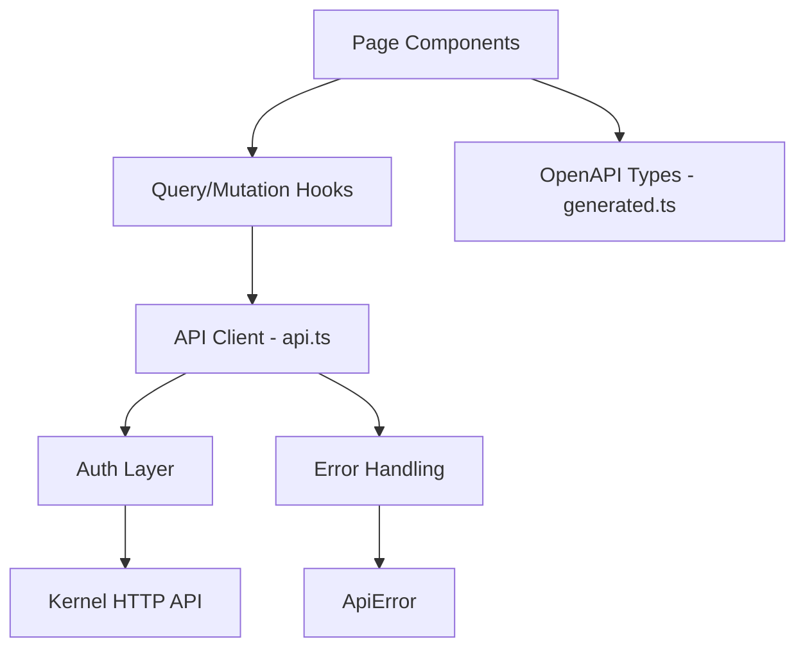

# Dashboard UI

# Dashboard UI

The dashboard is a React-based single-page application that provides a web interface for managing and monitoring LibreFang agents, providers, channels, sessions, and all runtime subsystems. It communicates with the kernel's HTTP API through a typed client layer generated from the OpenAPI spec.

## Architecture

```mermaid
graph TD
    A[Page Components] --> B[Query/Mutation Hooks]
    B --> C[API Client - api.ts]
    C --> D[Auth Layer]
    D --> E[Kernel HTTP API]
    C --> F[Error Handling]
    F --> G[ApiError]
    A --> H[OpenAPI Types - generated.ts]
```

The module is organized into four layers:

1. **OpenAPI types** (`openapi/generated.ts`) — auto-generated TypeScript interfaces describing every endpoint, request body, and response shape
2. **API client** (`dashboard/src/api.ts`) — thin wrapper providing `get`, `post`, `patch`, `put`, `del` functions with automatic auth header injection and error parsing
3. **Query/mutation hooks** (`lib/queries/`, `lib/mutations/`) — React Query wrappers that connect page components to the API client
4. **Page components** (`src/pages/`) — React components that render the UI and consume query/mutation hooks

## OpenAPI Type Layer

`librefang-api/dashboard/openapi/generated.ts` is generated by `openapi-typescript` and must not be hand-edited. It exports:

- **`paths`** — maps every API route to its HTTP methods, parameter shapes, and operation IDs
- **`operations`** — keyed by operation ID (e.g. `list_agents`, `spawn_agent`), each containing typed `requestBody` and `response` discriminants

Every page and API function references these types for compile-time safety. When the kernel adds or changes an endpoint, regenerating this file propagates type errors to any broken consumers.

### Key Path Groups

| Prefix | Concern |
|---|---|
| `/api/agents` | Agent lifecycle (CRUD, messaging, sessions, memory, files, tools) |
| `/api/a2a` | Agent-to-agent external task dispatch |
| `/api/auth` | Authentication (OAuth2, dashboard login, session management) |
| `/api/budget` | Cost tracking, per-agent and per-user budget limits |
| `/api/channels` | Channel adapter management and sidecar configuration |
| `/api/comms` | Inter-agent messaging, topology, and event streaming |
| `/api/config` | Kernel configuration read/write/reload |
| `/api/cron` | Scheduled job management |
| `/api/hands` | Hand definitions, activation, and instance control |
| `/api/mcp` | MCP server CRUD, catalog, health, and taint rules |
| `/api/memory` | Proactive memory CRUD, search, import/export |
| `/api/providers` | LLM provider status, credential pools, and model selection |

## API Client

The API client (`dashboard/src/api.ts`) provides the HTTP primitives that all data fetching goes through:

### Core Functions

- **`get(path, params?)`** / **`post(path, body?)`** / **`patch(path, body?)`** / **`put(path, body?)`** / **`del(path)`** — typed wrappers around `fetch`
- **`buildHeaders()`** — constructs request headers by calling `authHeader()`
- **`authHeader()`** — calls `getStoredApiKey()` to retrieve the session token and returns an `Authorization: Bearer ...` header
- **`getStoredApiKey()`** — reads the persisted API key from browser storage
- **`parseError(response)`** — converts non-OK HTTP responses into `ApiError` instances via `fromResponse()`
- **`buildAuthenticatedWebSocket(path)`** — constructs a WebSocket URL with the auth token for SSE/streaming endpoints

### Authenticated Request Flow

Every API call follows this sequence:

1. `buildHeaders()` calls `authHeader()` → `getStoredApiKey()` to attach the bearer token
2. The fetch is made against the kernel's HTTP port
3. If the response is not OK, `parseError()` constructs an `ApiError` with status, body, and message
4. The error propagates to the React Query error boundary

### Error Handling

`lib/http/errors.ts` exports `ApiError`, which is the canonical error type for all API failures. It is constructed via `ApiError.fromResponse(response)`, capturing:

- HTTP status code
- Response body (parsed if JSON, raw otherwise)
- A human-readable message extracted from the body

Pages use `getErrorMessage()` and `getActionResultError()` helpers (e.g. in `ProvidersPage`) to extract displayable error strings from caught `ApiError` instances or action results.

## Data Fetching Pattern

Pages use React Query for all server state:

- **Query hooks** (`lib/queries/*.ts`) wrap `get` calls — e.g. `getSkillDetail` is called inside a `queryFn` in `lib/queries/skills.ts`
- **Mutation hooks** (`lib/mutations/*.ts`) wrap `post`/`patch`/`put`/`del` calls — e.g. `installSkill` is called inside a `mutationFn` in `lib/mutations/skills.ts`

Both follow the same auth chain: `queryFn` → API function → `get`/`post` → `buildHeaders` → `authHeader` → `getStoredApiKey`.

## Page Components

Pages live in `src/pages/` and are the top-level route targets. Each page encapsulates its own query hooks, local state, toast notifications, and sub-components.

### Agent Management

- **AgentsPage** (not shown in traces but implied by `/api/agents` coverage) — agent list, detail, spawn, kill, suspend/resume
- **SessionsPage** — lists and manages agent sessions; `handleDelete` calls `addToast` on completion
- **RuntimePage** — shows in-flight agent loops via `/api/agents/{id}/runtime`
- **TerminalPage** — SSH terminal emulator; uses `clampTermSize` to constrain terminal dimensions

### Provider and Model Management

- **ProvidersPage** — lists providers with auth status; contains `ProviderCard` and `CredentialPoolCard` sub-components
  - `CredentialPoolCard` renders `CredentialKeyRow` for each key in a provider's pool
  - `getProviderIcon` maps provider names to icons
  - `saveKey` and `testKey` call the API, with `getErrorMessage`/`getActionResultError` for error display
  - `handlePick` selects a provider as default
- **ModelsPage** — model catalog, custom models, and aliases

### MCP and Extensions

- **McpServersPage** — MCP server configuration with live connection status
  - `connectedCount` and `connectedMap` use `serverIdentityOf` to determine connection state
  - `ArgsEditor` sub-component for editing server arguments
  - `handleStartAuth` and `onError` use `errorMessage` for user-facing errors
- **PluginsPage** — extension catalog with install/uninstall; `handleRegistryInstall` manages the install flow, `onSuccess` fires `addToast`

### Scheduling and Automation

- **SchedulerPage** — cron job CRUD; `handleEditTrigger` shows toasts on success
- **HandsPage** — hand definitions and active instances
  - `HandsPage` renders `HandDetailPanel` and `HandCard` (which embeds `HandMetricsInline`)
  - `handleCreate` calls `resetForm` after successful hand creation
  - Hands support activation with idempotency keys

### Memory System

- **MemoryPage** (`pages/Memory/index.tsx`) — proactive memory management
  - `HealthTab` renders memory health diagnostics using `DefRow` for key-value display
  - `onError` handlers call `addToast` for user feedback

### Configuration and Security

- **ConfigPage** — kernel configuration editor
  - `fieldLabelFallback` provides display names for config fields
  - `resolveFieldRender` calls `unwrapNullable` to handle optional config values
- **PermissionSimulatorPage** — tool permission testing UI
  - `ChannelBindingsCard` and `ToolPolicyCard` sub-components with shared `SectionHeader`
- **UserBudgetPage** / **UserPolicyPage** / **UsersPage** — user management and budget controls

### Media and Skills

- **MediaPage** — speech/media settings; `SpeechPanel` uses `ProviderSelect` for TTS provider choice
- **SkillsPage** — skill browsing and ClawHub integration
  - `fanghubItems` uses `filterByCategory` to organize the marketplace listing
  - `SkillDetailModal` contains `EvolveUpdatePane` and `EvolveUploadPane` for skill version management
  - `hubHealth` uses `flag` to render connectivity status

### Infrastructure Pages

- **OverviewPage** — system overview dashboard
- **LogsPage** — real-time log streaming via `/api/logs/stream`
- **SettingsPage** — daemon settings (includes TOTP setup, tested in `SettingsPage.totp.test.tsx`)
- **MobilePairingPage** — device pairing flow; `pairingRequest` creates QR codes, `pairingComplete` finalizes
- **A2APage** — external agent-to-agent task dispatch; `handleSendTask` calls `sendA2ATask` which flows through `post` → `buildHeaders` → `authHeader` → `getStoredApiKey`
- **GoalsPage** / **TasksPage** / **WorkflowsPage** — higher-level automation constructs

## SSE and Streaming Endpoints

Several endpoints use Server-Sent Events or WebSocket connections:

| Endpoint | Method | Purpose |
|---|---|---|
| `/api/logs/stream` | SSE | Real-time audit log with backfill |
| `/api/comms/events/stream` | SSE | Inter-agent communication events (500ms polling) |
| `/api/agents/{id}/message/stream` | SSE | Streaming agent responses |
| `/api/agents/{id}/sessions/{session_id}/stream` | SSE | Attach to in-flight session events |

The `/api/logs/stream` endpoint is worth noting for its cursor-based design: the first poll sends up to 200 entries as backfill, then subsequent polls use `since_seq` so rapid bursts are not truncated.

## Idempotency Keys

Several mutating endpoints honor `Idempotency-Key` headers (issue #3637):

- `POST /api/agents` (spawn)
- `POST /api/hands/{hand_id}/activate`
- `POST /api/a2a/send`

When set, a duplicate request with the same key and identical body replays the cached response. A different body under the same key returns `409 Conflict`. This protects against network retries and dashboard double-clicks.

## Testing Conventions

Each page has a corresponding test file (e.g. `ProvidersPage.test.tsx`) that calls a `renderPage` helper to mount the component with mocked API responses. Tests verify rendering, user interactions, and error states without hitting the real kernel.

The API client itself is tested in `dashboard/src/api.test.ts`, which validates `buildAuthenticatedWebSocket` and other utility functions.