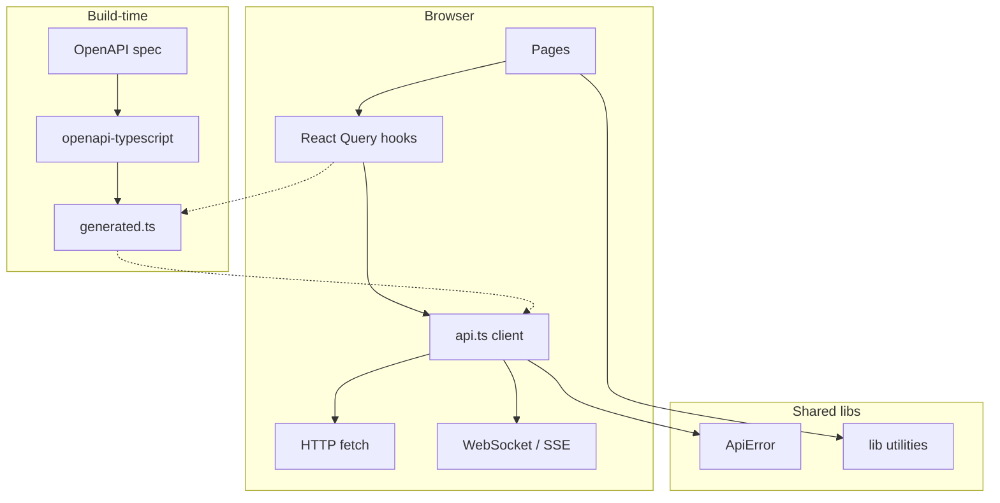

# Dashboard UI

# Dashboard UI

The LibreFang Dashboard is a single-page React application that provides a browser-based management console for the LibreFang agent runtime. It communicates with the kernel's HTTP API through a typed API client layer backed by OpenAPI-generated TypeScript types.

## Architecture


```mermaid
graph TD
    subgraph "Browser"
        P[Pages] --> Q[React Query hooks]
        Q --> A[api.ts client]
        A --> H[HTTP fetch]
        A --> WS[WebSocket / SSE]
    end
    subgraph "Build-time"
        OAS[OpenAPI spec] --> GEN[openapi-typescript]
        GEN --> TYPES[generated.ts]
    end
    subgraph "Shared libs"
        A --> ERR[ApiError]
        P --> LIB[lib utilities]
    end
    TYPES -.-> A
    Q -.-> TYPES
```

## Key Layers

### OpenAPI Type Definitions (`openapi/generated.ts`)

Auto-generated by `openapi-typescript` from the server's OpenAPI schema. Exports the `paths` and `operations` interfaces that type every API route, request body, and response shape. **Do not edit this file directly** — regenerate from the schema when the backend contract changes.

The generated types cover all REST endpoints under `/api/*`, `/a2a/*`, and `/hooks/*`, organized by path with per-method operation IDs (e.g., `operations["spawn_agent"]`, `operations["list_agents"]`).

### API Client (`src/api.ts`)

The central HTTP client module. All backend communication flows through here.

**Primitive functions:**

| Function | Purpose |
|---|---|
| `get<T>(path)` | GET with JSON parsing |
| `post<T>(path, body)` | POST with JSON body |
| `put<T>(path, body)` | PUT with JSON body |
| `del<T>(path)` | DELETE |
| `patch<T>(path, body)` | PATCH with JSON body |
| `getText(path)` | GET returning raw string (e.g., TOML config) |
| `fetchWithTimeout(url, opts)` | Low-level fetch with configurable timeout |

**Authentication flow:**

All primitives call `buildHeaders()` → `authHeader()` → `getStoredApiKey()` to attach the stored session token to every request. The key is obtained during login and persisted in the browser.

**Error handling:**

Every primitive wraps the response in `parseError()`, which delegates to `fromResponse()` in `lib/http/errors.ts` to produce structured `ApiError` objects. Callers never see raw HTTP errors — they always get `ApiError` with status, message, and body details.

**WebSocket/SSE:**

`buildAuthenticatedWebSocket(path)` constructs a WebSocket URL with the auth token for streaming endpoints like session events and log tails.

**Representative domain functions:**

The module exports dozens of named functions that map 1:1 to backend endpoints:

- **Agents**: `getAgentDetail`, `deleteAgent`, `createAgentSession`, `clearHistory`
- **A2A**: `sendA2ATask`, `listExternalAgents`
- **Skills/ClawHub**: `getSkillDetail`, `installSkill`, `uninstallPlugin`, `clawhubCnBrowse`, `fanghubListSkills`
- **Providers**: `deleteProviderKey`, `setConfigValue`
- **Memory**: agent KV get/set/delete, memory consolidation
- **Approvals**: `fetchApprovalCount`, `resolveApproval`, `rejectApproval`
- **Audio**: `transcribeAudio`
- **Config**: `getRawConfigToml`, `setConfigValue`
- **Cron**: `updateSchedule`
- **Auth**: `totpStatus`, `totpConfirm`

### Data Fetching (`lib/queries/`, `lib/mutations/`)

React Query hooks that wrap the API client functions. Two execution flows illustrate the pattern:

**Read path (query):**
```
queryFn → apiClientFunction → get() → parseError() → ApiError
```

**Write path (mutation):**
```
mutationFn → apiClientFunction → post() → parseError() → ApiError
```

Both flows also pass through `buildHeaders()` → `authHeader()` → `getStoredApiKey()` for authentication.

## Pages

Each page is a top-level route component mounted by `App.tsx`:

| Page | Route | Purpose |
|---|---|---|
| `OverviewPage` | `/` | System-wide KPI tiles, relative timestamps |
| `AgentsPage` | `/agents` | Agent CRUD, manifest editing, session management |
| `ChatPage` | `/chat` | Live chat with agent, SSE streaming, tool output |
| `SessionsPage` | `/sessions` | Session list, history browsing |
| `AuditPage` | `/audit` | Filtered audit log with export |
| `LogsPage` | `/logs` | Real-time log streaming |
| `ProvidersPage` | `/providers` | Provider cards, credential details |
| `SkillsPage` | `/skills` | ClawHub marketplace, install/uninstall |
| `A2APage` | `/a2a` | Agent-to-agent task management |
| `CommsPage` | `/comms` | Inter-agent communication topology |
| `NetworkPage` | `/network` | OFP network status |
| `WorkflowsPage` | `/workflows` | Workflow list and scheduling |
| `UsersPage` | `/users` | User management, CSV import |

## Library Utilities (`src/lib/`)

Shared helpers consumed across pages and components:

### `datetime.ts`

Formatting functions used pervasively:
- `formatRelativeTime` — "3 minutes ago" style timestamps (OverviewPage, AgentsPage, AuditPage, SessionsPage)
- `formatTime` / `formatDateTime` — absolute timestamps (LogsPage, ProvidersPage, A2APage, NetworkPage, Memory)
- `formatDate` — date-only format (WorkflowsPage, SkillsPage, PendingSkillsSection)

### `agentManifest.ts`

Agent manifest (TOML) parsing and validation:
- `parseManifestToml` — deserializes TOML into form state (used when switching create mode)
- `serializeManifestForm` — serializes form state back to TOML
- `validateManifestForm` — form validation before submission
- `generateUid` — generates unique identifiers for new agents

### `agentManifestMarkdown.ts`

- `generateManifestMarkdown` — converts form state to Markdown for display/export

### `chatPicker.ts`

- `groupedPicker` — organizes agents/sessions into groups for the chat target picker

### `chatSessionCache.ts`

- `deleteCachedChatMessages` — clears local message cache; called on history clear and unmount

### `chat.ts`

- `normalizeToolOutput` — normalizes tool execution output for display in chat bubbles

### `clipboard.ts`

- `copyToClipboard` — cross-browser clipboard API wrapper

### `csvParser.ts`

- `parseUsersCsv` — parses CSV files for bulk user import on UsersPage

### `bundleMode.ts`

- `setupBundleMode` — initializes the dashboard when running as a bundled Tauri desktop app (called from `main.tsx`)

## Components

### `AgentManifestForm`

The agent creation/editing form. Manages fields like name, description, system prompt, model, skills, tools, and MCP servers. Calls `updateAutonomous()` internally to toggle autonomous mode. Uses `generateUid()` for new agent IDs.

### Memory Components (`Memory/components/`)

- `AgentKvRows` — tabular KV memory editor with `formatDateTime` timestamps
- `MemoryRecordCard` — card view for a proactive memory record

### `PendingSkillsSection`

- `CandidateRow` — individual skill candidate with `formatDate` for timestamps

## Error Handling Contract

All API errors flow through a single pipeline:

1. `fetch` returns a non-OK response
2. `parseError()` in `api.ts` catches it
3. Delegates to `fromResponse()` in `lib/http/errors.ts`
4. Produces an `ApiError` instance with structured fields

Pages and mutations handle `ApiError` uniformly — typically displaying the error message in a toast or inline alert. The `ApiError` class carries the HTTP status code, human-readable message, and the raw response body for debugging.

## Contributing Guidelines

**Adding a new API call:**
1. Ensure the endpoint exists in `openapi/generated.ts` (regenerate if needed)
2. Add a typed wrapper function in `api.ts` using the appropriate primitive (`get`, `post`, `put`, `del`, `patch`)
3. Create a React Query hook in `lib/queries/` or `lib/mutations/`
4. Consume the hook from the target page component

**Adding a new page:**
1. Create the component in `src/pages/`
2. Import utility functions from `src/lib/` (datetime, clipboard, etc.) rather than reimplementing
3. Use the shared `ApiError` handling — don't catch raw fetch errors
4. Register the route in `App.tsx`

**Modifying the OpenAPI types:**
1. Update the backend OpenAPI spec
2. Run `openapi-typescript` to regenerate `generated.ts`
3. Fix any type errors in dependent code