# Dashboard

# Dashboard Module

The Dashboard is a React-based web interface for managing LibreFang infrastructure. It provides a comprehensive UI for configuring providers, spawning agents, designing workflows, managing channels, viewing analytics, and administering the entire system.

---

## Overview

The Dashboard is a single-page application (SPA) served by the same `librefang-api` binary that provides the REST API. It communicates exclusively through that API—no backend rendering, no separate frontend build pipeline beyond bundling.

**Technology stack:**

- **React 18** with TypeScript
- **TanStack Router** — hash-based routing (`#/` paths)
- **TanStack Query** — server state, caching, background refetch
- **Zustand** — client-side UI state (theme, sidebar, language)
- **Lucide React** — icon library
- **react-i18next** — internationalization (English / Chinese)

Pages are lazy-loaded via `React.lazy()` and code-split into separate chunks. The entry point is `main.tsx`, which bootstraps the React tree, installs the QueryClient, and mounts the RouterProvider.

---

## Application Shell (`App.tsx`)

`App` is the root component rendered by the router. It owns the sidebar, header, auth dialog, and global overlays.

### Layout Structure

```
┌─────────────────────────────────────────────────────────────┐
│  Sidebar (220px / 280px)  │  Header (14-16 units tall)    │
│  ───────────────────────  │  ────────────────────────────  │
│  Logo + collapse button    │  Mobile menu button           │
│  Search button (⌘K)         │  Notification bell            │
│  ───────────────────────  │  Language toggle               │
│  Nav groups (collapsible)  │  Theme toggle                  │
│    Core                    │  User menu                     │
│    Configure               │─────────────────────────────────│
│    Automate                │  Main content area             │
│    Observe                 │  (Outlet renders the page)    │
│    Advanced                │                                │
│  ───────────────────────  │                                │
│  Status card               │                                │
│  (daemon online badge)     │                                │
└─────────────────────────────────────────────────────────────┘
```

### Authentication Flow

On startup, `App` checks `checkDashboardAuthMode()` to determine what auth scheme the daemon expects:

| `AuthMode` | Behavior |
|---|---|
| `"none"` | No auth required; render immediately |
| `"credentials"` | Show username/password form |
| `"api_key"` | Show API key form |
| `"hybrid"` | Show tabbed form (credentials or API key) |

`setOnUnauthorized` registers a global 401 handler: any failed API response triggers the login dialog. This means agents, pages, and components never need to handle auth directly—`parseError` in `api.ts` handles it centrally.

`verifyStoredAuth()` probes `/api/security` with the stored bearer token, retrying up to 3 times with 1-second delays. On 401 it clears the token and fires the global handler.

### State Management

All UI state lives in `useUIStore` (Zustand):

```typescript
// Theme
theme: "light" | "dark" → toggles `dark` class on `<html>`

// Sidebar
isSidebarCollapsed: boolean  // persists across reloads
isMobileMenuOpen: boolean

// Navigation layout
navLayout: "collapsible" | "grouped"
collapsedNavGroups: Record<string, boolean>

// Locale
language: "en" | "zh"
```

### Keyboard Shortcuts

`useKeyboardShortcuts` listens globally. Currently it opens the shortcuts help overlay on `?`.

---

## API Client (`api.ts`)

All network requests go through this module. It wraps `fetch` with consistent auth headers, timeout handling, and error parsing.

### Core HTTP Helpers

| Function | Method | Timeout | Use |
|---|---|---|---|
| `get<T>(path)` | GET | — | Reads |
| `post<T>(path, body, timeout?)` | POST | 60 s default | Writes, 300 s for LLM calls |
| `put<T>(path, body)` | PUT | — | Updates |
| `patch<T>(path, body)` | PATCH | — | Partial updates |
| `del<T>(path)` | DELETE | — | Deletes |

### Auth Header Injection

Every outbound request passes through `buildHeaders`, which merges:

1. Caller-supplied headers
2. `Accept-Language` from `localStorage` or `navigator.language`
3. `Authorization: Bearer <token>` if `localStorage["librefang-api-key"]` is set

### Error Handling

`parseError` extracts the human-readable `detail` or `error` field from JSON error bodies. On 401, it clears the API key and invokes the global unauthorized handler (guarded by `_unauthorizedFired` to prevent infinite loops).

### WebSocket URLs

`buildAuthenticatedWebSocketUrl(path)` constructs a `ws://` or `wss://` URL with `?token=` appended. Used by chat and terminal pages for real-time streams.

### API Surface

The module exposes ~150 named exports organized by domain:

**Agents** — `listAgents`, `getAgentDetail`, `patchAgentConfig`, `spawnAgent`, `stopAgent`, `deleteAgent`, `cloneAgent`, `resetAgentSession`, `clearAgentHistory`, `loadAgentSession`, `sendAgentMessage`, `suspendAgent`, `resumeAgent`, session management (`listAgentSessions`, `switchAgentSession`, `createAgentSession`)

**Providers / Models** — `listProviders`, `testProvider`, `setProviderKey`, `setProviderUrl`, `setDefaultProvider`, `listModels`, `addCustomModel`, `removeCustomModel`

**Channels** — `listChannels`, `testChannel`, `configureChannel`, `reloadChannels`, WeChat/WhatsApp QR flows

**Skills** — `listSkills`, `installSkill`, `uninstallSkill`, ClawHub (`clawhubBrowse`, `clawhubSearch`, `clawhubGetSkill`, `clawhubInstall`), Skillhub, FangHub registry

**Workflows** — `listWorkflows`, `createWorkflow`, `getWorkflow`, `updateWorkflow`, `deleteWorkflow`, `runWorkflow`, `dryRunWorkflow`, `listWorkflowRuns`, `getWorkflowRunDetail`, `listWorkflowTemplates`, `instantiateTemplate`

**Scheduling** — `listSchedules`, `createSchedule`, `updateSchedule`, `deleteSchedule`, `runSchedule`, triggers and cron jobs

**Memory** — `listMemories`, `searchMemories`, `addMemoryFromText`, `updateMemory`, `deleteMemory`, `getMemoryStats`, `cleanupMemories`, `decayMemories`, memory config

**Analytics / Usage** — `getUsageSummary`, `listUsageByAgent`, `listUsageByModel`, `getUsageByModelPerformance`, `getUsageDaily`, budget management

**Approvals** — `listApprovals`, `listPendingApprovals`, `approveApproval`, `rejectApproval`, `resolveApproval`, `batchResolveApprovals`, TOTP setup/status/revoke, approval audit trail

**Hands** — `listHands`, `listActiveHands`, `getHandDetail`, `activateHand`, `pauseHand`, `resumeHand`, `deactivateHand`, `uninstallHand`, hand settings, hand session messaging

**Plugins** — `listPlugins`, `getPlugin`, `installPlugin`, `uninstallPlugin`, `scaffoldPlugin`, `installPluginDeps`, registry listing

**Media** — `listMediaProviders`, `generateImage`, `synthesizeSpeech`, `submitVideo` / `pollVideo`, `generateMusic`

**MCP Servers** — `listMcpServers`, `addMcpServer`, `updateMcpServer`, `deleteMcpServer`

**Goals** — `listGoals`, `createGoal`, `updateGoal`, `deleteGoal`, goal templates

**System** — `loadDashboardSnapshot`, `getVersionInfo`, `getHealthDetail`, `getQueueStatus`, `shutdownServer`, `reloadConfig`, `getSecurityStatus`, `getFullConfig`, backups, task queue, sessions, audit log, metrics

---

## Routing (`router.tsx`)

TanStack Router with hash history. The root route renders `App`; child routes render lazy-loaded page components inside `<Outlet />`.

### Route Map

| Path | Page Component |
|---|---|
| `/` | Redirects → `/overview` |
| `/overview` | OverviewPage |
| `/canvas` | CanvasPage |
| `/agents` | AgentsPage |
| `/sessions` | SessionsPage |
| `/chat?agentId=` | ChatPage |
| `/providers` | ProvidersPage |
| `/models` | ModelsPage |
| `/channels` | ChannelsPage |
| `/skills` | SkillsPage |
| `/plugins` | PluginsPage |
| `/mcp-servers` | McpServersPage |
| `/media` | MediaPage |
| `/workflows` | WorkflowsPage |
| `/scheduler` | SchedulerPage |
| `/goals` | GoalsPage |
| `/analytics` | AnalyticsPage |
| `/memory` | MemoryPage |
| `/logs` | LogsPage |
| `/runtime` | RuntimePage |
| `/comms` | CommsPage |
| `/hands` | HandsPage |
| `/approvals` | ApprovalsPage |
| `/network` | NetworkPage |
| `/a2a` | A2APage |
| `/telemetry` | TelemetryPage |
| `/terminal` | TerminalPage |
| `/wizard` | WizardPage |
| `/settings` | SettingsPage |

Search params are validated on canvas (`t=`, `wf=`) and chat (`agentId=`).

---

## Navigation Structure

The sidebar organizes 30 routes into 5 groups:

```mermaid
graph TD
    subgraph Core
        O[Overview] --> CH[Chat]
        CH --> A[Agents]
        A --> AP[Approvals]
        AP --> H[Hands]
    end

    subgraph Configure
        P[Providers] --> M[Models]
        M --> MG[Media]
        MG --> CN[Channels]
        CN --> SK[Skills]
        SK --> PL[Plugins]
        PL --> MCP[MCP Servers]
    end

    subgraph Automate
        WF[Workflows] --> SCH[Scheduler]
        SCH --> G[Goals]
    end

    subgraph Observe
        AN[Analytics] --> MEM[Memory]
        MEM --> L[Logs]
        L --> RT[Runtime]
    end

    subgraph Advanced
        CM[Comms] --> TR[Terminal]
        TR --> NW[Network]
        NW --> A2A[A2A]
        A2A --> T[Telemetry]
    end
```



---

## Authentication Architecture

```mermaid
sequenceDiagram
    participant Browser
    participant App
    participant api
    participant Daemon

    Browser->>App: Mount App
    App->>api: checkDashboardAuthMode()
    api->>Daemon: GET /api/auth/dashboard-check
    Daemon-->>api: AuthMode ("hybrid")

    alt No stored token
        App->>App: Show AuthDialog
        User submits credentials
        App->>api: dashboardLogin(username, password)
        api->>Daemon: POST /api/auth/dashboard-login
        Daemon-->>api: { ok: true, token: "..." }
        api->>api: setApiKey(token)
        api->>api: verifyStoredAuth()
        api->>Daemon: GET /api/security (Bearer token)
        Daemon-->>api: 200 OK
        App->>App: Hide AuthDialog, render Outlet
    else Token present
        App->>api: verifyStoredAuth()
        api->>Daemon: GET /api/security (Bearer token)
        alt Token valid
            Daemon-->>api: 200 OK
            App->>App: Render immediately
        else Token invalid (401)
            api->>api: clearApiKey()
            api->>App: invoke _onUnauthorized()
            App->>App: Show AuthDialog
        end
    end

    loop Any later request
        api->>Daemon: Any API call
        alt 401 response
            Daemon-->>api: 401
            api->>api: clearApiKey()
            api->>App: invoke _onUnauthorized()
            App->>App: Show AuthDialog
        end
    end
```

---

## Key Components

### `AuthDialog`

Modal presented when authentication is required. Adapts its form fields based on `AuthMode`. On hybrid mode, tabs let the user switch between credentials and API key submission.

### `ChangePasswordModal`

Sub-dialog accessible from the user menu. Validates that the new password is at least 8 characters and that confirmation matches. On success, clears the API key and reloads the page to force re-authentication.

### `NotificationCenter`

Bell icon in the header. Polls `fetchApprovalCount()` every 5 seconds when open. Clicking opens a dropdown listing pending approval requests with inline approve/reject buttons.

### `CommandPalette`

Opened via ⌘K. Provides fuzzy search across routes and recent items. Powered by `useCommandPalette` hook from `./components/ui/CommandPalette`.

### `ShortcutsHelp`

Overlay showing available keyboard shortcuts. Triggered by `?` or the help menu item.

### `NodeEditor`

Used inside the Canvas page to edit properties of workflow canvas nodes. Renders label and type fields; type is read-only.

---

## Integration with Backend

The Dashboard is a pure client. It never imports backend Rust code directly. Instead, all data flows through the REST API defined in the `librefang-api` crate.

**Entry point relationship:** The same binary that serves the API also serves `index.html` from `dashboard/dist/`. During development, Vite proxies `/api/*` to the running dev server.

**WebSocket integration:** Real-time features (chat streaming, terminal I/O) use `buildAuthenticatedWebSocketUrl` to establish `ws://` connections with the bearer token as a query param.

**Service Worker:** `public/sw.js` enables offline caching of static assets.

---

## Testing

`api.test.ts` validates:

- Bearer token appended to WebSocket URLs
- Stale auth (401) clears `localStorage["librefang-api-key"]` and returns `false`
- Protected helpers send `Authorization: Bearer` headers
- `patchAgentConfig` serializes `temperature` and `max_tokens` correctly