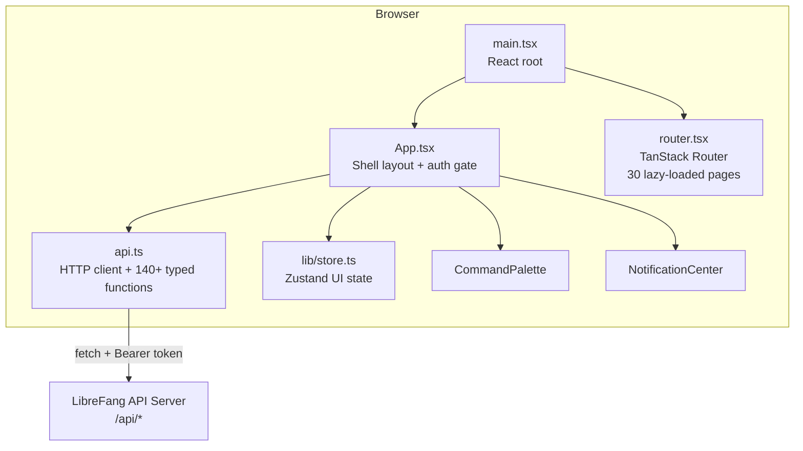

# Dashboard

# Dashboard Module

The Dashboard is a React single-page application providing the web management interface for LibreFang. It lives in `crates/librefang-api/dashboard/` and is served by the same HTTP server that exposes the REST API.

## Architecture Overview



## Entry Point — `main.tsx`

Bootstraps the application with three providers:

- **`QueryClientProvider`** — TanStack Query with a 30-second stale time and single retry. All data-fetching hooks (`useQuery` / `useMutation`) in pages inherit these defaults.
- **`RouterProvider`** — Receives the router tree built in `router.tsx`.
- **`ToastContainer`** — Global toast notifications rendered at the root level.

Internationalization is initialized as a side-effect import (`./lib/i18n`).

## App Shell — `App.tsx`

The root component renders the full-page layout: sidebar, top header, and an `<Outlet />` for the current route.

### Authentication Gate

On mount, `App` runs an auth check flow:

1. Calls `checkDashboardAuthMode()` to determine the server's configured mode.
2. If the mode is `"none"`, skips authentication entirely.
3. Otherwise calls `verifyStoredAuth()` which probes `GET /api/security` with the stored Bearer token (up to 3 retries with 1-second backoff).
4. If verification fails, renders `AuthDialog` as a full-screen modal.

A **global 401 handler** is registered via `setOnUnauthorized()`. Any API response with status 401 fires this callback once, clears the stored token, and re-displays the login dialog. The `_unauthorizedFired` guard prevents infinite loops when multiple simultaneous requests all fail.

### `AuthDialog`

Supports three authentication modes defined by the `AuthMode` type:

| Mode | Behavior |
|------|----------|
| `"api_key"` | Single password field; token stored directly via `setApiKey()` |
| `"credentials"` | Username + password form; optionally followed by a TOTP 6-digit code if the server returns `requires_totp: true` |
| `"hybrid"` | Tabbed UI allowing either method |

On successful auth, the user is redirected to `#/overview`.

### `ChangePasswordModal`

Allows the logged-in user to update their username and/or password. The form:
- Pre-loads the current username via `getDashboardUsername()`.
- Validates password match, minimum length (8 chars), and minimum username length (2 chars).
- Requires the current password to verify identity before submitting changes via `changePassword()`.
- On success, clears the stored token and reloads the page to force re-authentication.

### Sidebar Navigation

Navigation items are organized into six groups defined in `navGroups` (memoized on `t` and `terminalEnabled`):

- **Core** — Overview, Chat, Agents, Approvals, Hands
- **Configure** — Providers, Models, Media, Channels, Skills, Plugins, MCP Servers
- **Config** — General, Memory, Tools, Channels, Security, Network, Infra, Settings
- **Automate** — Workflows, Scheduler, Goals
- **Observe** — Analytics, Memory, Logs, Runtime
- **Advanced** — Comms, Terminal (conditional on `terminalEnabled`), Network, A2A, Telemetry

The sidebar supports two layout modes controlled by `navLayout` from the UI store:
- **Default** — Groups are always expanded with visible section headers.
- **Collapsible** — Group headers toggle with a chevron; state tracked in `collapsedNavGroups`.

On large screens, the sidebar collapses to a 96px icon-only strip via `toggleSidebar()`. On mobile, it slides in as an overlay with a backdrop.

The sidebar footer displays daemon health status, app version, and hostname.

### Header Bar

Contains:
- Mobile hamburger menu toggle (hidden on `lg:` breakpoint and above).
- `NotificationCenter` — real-time notification bell.
- Language toggle button — switches between English and Chinese.
- Theme toggle — switches between `dark` and `light` by adding/removing the `dark` class on `<html>`.
- User menu dropdown — links to Settings, Change Password modal, and Logout (only shown when `authMode !== "none"`).

### Command Palette and Keyboard Shortcuts

- `Cmd+K` / `Ctrl+K` opens the `CommandPalette`.
- The `useKeyboardShortcuts` hook registers global shortcuts and triggers `ShortcutsHelp` via `onShowHelp`.

### UI Store Dependencies

`App` reads and writes these `useUIStore` selectors:

| Selector | Purpose |
|----------|---------|
| `theme` / `toggleTheme` | Dark/light mode |
| `language` / `setLanguage` | i18n locale |
| `isMobileMenuOpen` / `setMobileMenuOpen` | Mobile sidebar overlay |
| `isSidebarCollapsed` / `toggleSidebar` | Desktop sidebar width |
| `navLayout` | Sidebar group display mode |
| `collapsedNavGroups` / `toggleNavGroup` | Per-group collapse state |
| `terminalEnabled` / `setTerminalEnabled` | Whether to show the Terminal nav item |

## API Client — `api.ts`

A fully-typed HTTP client layer with ~140 functions covering every REST endpoint the LibreFang server exposes.

### HTTP Primitives

Four generic helpers handle all requests:

```
get<T>(path)      → GET with JSON response
post<T>(path, body, timeout?)  → POST with JSON body, 60s default timeout
put<T>(path, body)  → PUT
patch<T>(path, body) → PATCH
del<T>(path)      → DELETE
getText(path)     → GET returning plain text
```

All primitives call `buildHeaders()` which merges caller-provided headers with auth headers from `authHeader()`. The auth header reads the Bearer token from `localStorage("librefang-api-key")` and the user's language preference from `localStorage("i18nextLng")`.

Timeout behavior: `post()` uses `AbortController` with a configurable timeout. Two constants define standard timeouts:
- `DEFAULT_POST_TIMEOUT_MS = 60_000` (60 seconds)
- `LONG_RUNNING_TIMEOUT_MS = 300_000` (5 minutes, used for agent messages, workflow runs, skill/plugin installs)

### Error Handling

`parseError()` is called on every non-OK response:
1. If status is 401 and a global handler is registered, it fires once (guarded by `_unauthorizedFired`), clears the API key, and invokes the callback set by `App`.
2. Attempts to parse the response body as JSON, preferring the `detail` field over `error` for the error message.
3. Falls back to HTTP status text.

### Authentication Functions

| Function | Endpoint | Notes |
|----------|----------|-------|
| `checkDashboardAuthMode()` | `GET /api/auth/dashboard-check` | Returns the `AuthMode` |
| `getDashboardUsername()` | `GET /api/auth/dashboard-check` | Extracts `username` from same endpoint |
| `dashboardLogin(username, password, totpCode?)` | `POST /api/auth/dashboard-login` | Stores returned token via `setApiKey()` |
| `verifyStoredAuth()` | `GET /api/security` | Retries 3× on network error; clears token on 401 |
| `changePassword(currentPw, newPw?, newUsername?)` | `POST /api/auth/change-password` | All fields optional except current password |

Token management:
- `setApiKey(key)` — writes to `localStorage("librefang-api-key")`, resets the 401 guard.
- `clearApiKey()` — removes from localStorage.
- `hasApiKey()` — checks presence and non-empty length.

WebSocket authentication uses `buildAuthenticatedWebSocketUrl(path)` which constructs a `ws://` or `wss://` URL and appends `?token=...` from the stored key.

### Type Definitions

The file exports ~80 TypeScript interfaces modeling every API response shape. Key categories:

- **Agents** — `AgentItem`, `AgentDetail`, `AgentSessionMessage`, `AgentMessageResponse`
- **Providers & Models** — `ProviderItem`, `ModelItem`
- **Channels** — `ChannelItem`, `ChannelField`
- **Skills** — `SkillItem`, `ClawHubSkillDetail`, `FangHubSkill`
- **Workflows** — `WorkflowItem`, `WorkflowStep`, `WorkflowRunDetail`, `DryRunResult`
- **Memory** — `MemoryItem`, `MemoryStatsResponse`
- **Hands** — `HandDefinitionItem`, `HandInstanceItem`, `HandSettingStatus`
- **Approvals** — `ApprovalItem`, `ApprovalAuditEntry`
- **Configuration** — `ConfigSectionSchema`, `RegistrySchema`
- **Plugins** — `PluginItem`, `RegistryEntry`
- **MCP Servers** — `McpServerConfigured`, `McpServerConnected`, `IntegrationTemplate`

### API Function Naming Convention

Functions follow a predictable pattern:

| Prefix | HTTP Method | Example |
|--------|------------|---------|
| `list*` | GET (collection) | `listAgents()`, `listMemories()` |
| `get*` | GET (single) | `getAgentDetail()`, `getWorkflow()` |
| `create*` / `spawn*` | POST | `createSchedule()`, `spawnAgent()` |
| `send*` / `post*` | POST (action) | `sendAgentMessage()`, `postQuickInit()` |
| `update*` / `set*` | PUT/PATCH | `updateSchedule()`, `setConfigValue()` |
| `delete*` / `remove*` | DELETE | `deleteAgent()`, `removeCustomModel()` |
| `test*` | POST (probe) | `testProvider()`, `testChannel()` |
| `install*` / `uninstall*` | POST | `installSkill()`, `uninstallPlugin()` |

## Router — `router.tsx`

Uses TanStack Router with a flat route structure under a single root route. Every page is **lazy-loaded** via `React.lazy()` with a `Suspense` wrapper (`<L>`) that renders `null` as fallback — page transition animations mask the brief loading gap.

The root route's component is `App`, which provides the persistent shell layout. Each child route renders into the `<Outlet />` in the main content area.

Route `/` redirects to `/overview`. The `/canvas` route validates search params (`t` for timestamp, `wf` for workflow ID).

### Page Components (30 routes)

All pages live in `src/pages/` and are loaded on demand:

| Route | Page | Domain |
|-------|------|--------|
| `/overview` | OverviewPage | System dashboard |
| `/chat` | ChatPage | Agent conversation |
| `/agents` | AgentsPage | Agent management |
| `/approvals` | ApprovalsPage | Approval queue |
| `/hands` | HandsPage | Hand definitions & instances |
| `/providers` | ProvidersPage | LLM provider config |
| `/models` | ModelsPage | Model catalog |
| `/media` | MediaPage | Image/video/music generation |
| `/channels` | ChannelsPage | Channel configuration |
| `/skills` | SkillsPage | Skill management |
| `/plugins` | PluginsPage | Plugin management |
| `/mcp-servers` | McpServersPage | MCP server management |
| `/workflows` | WorkflowsPage | Workflow builder |
| `/scheduler` | SchedulerPage | Cron schedule management |
| `/goals` | GoalsPage | Goal tracking |
| `/analytics` | AnalyticsPage | Usage analytics |
| `/memory` | MemoryPage | Memory browser |
| `/logs` | LogsPage | Log viewer |
| `/runtime` | RuntimePage | Runtime diagnostics |
| `/comms` | CommsPage | Inter-agent communications |
| `/terminal` | TerminalPage | Web terminal (conditional) |
| `/network` | NetworkPage | P2P network status |
| `/a2a` | A2APage | Agent-to-Agent protocol |
| `/telemetry` | TelemetryPage | Telemetry data |
| `/config/*` | ConfigPage | Configuration editor |
| `/settings` | SettingsPage | Dashboard settings |
| `/canvas` | CanvasPage | Visual workflow editor |
| `/wizard` | WizardPage | Setup wizard |

## Testing — `api.test.ts`

Unit tests using Vitest that mock `fetch`, `localStorage`, `navigator`, and `window.location`. Tests cover:

- **`buildAuthenticatedWebSocketUrl`** — Verifies the token is appended as a query parameter.
- **`verifyStoredAuth`** — Confirms that a 401 response clears the stale token and returns `false`.
- **Bearer token propagation** — Asserts that `listTools()` and `getMetricsText()` include the `Authorization: Bearer` header in their requests.
- **`patchAgentConfig`** — Validates that the request body includes `temperature` and `max_tokens` fields and that the URL path encodes the agent ID correctly.

The test file includes a `LocalStorageMock` implementation since the dashboard runs in Node during testing.

## Key Patterns for Contributors

### Adding a New API Endpoint

1. Define the response interface in `api.ts`.
2. Add the function using the appropriate primitive (`get`, `post`, `put`, `patch`, `del`).
3. Specify the timeout if it's long-running (use `LONG_RUNNING_TIMEOUT_MS`).

### Adding a New Page

1. Create `src/pages/NewPage.tsx` with a named export.
2. Add a lazy import in `router.tsx`.
3. Add a route definition with `createRoute`.
4. Add a nav item to the appropriate group in `App.tsx`'s `navGroups` array.
5. Add the i18n key to the translation files.

### Authentication Flow

Any page can rely on the global 401 handler — if a request fails with 401, the login dialog reappears automatically. Pages don't need to handle auth errors individually. The guard resets when a new token is stored via `setApiKey()`, so re-authentication works after token expiry.