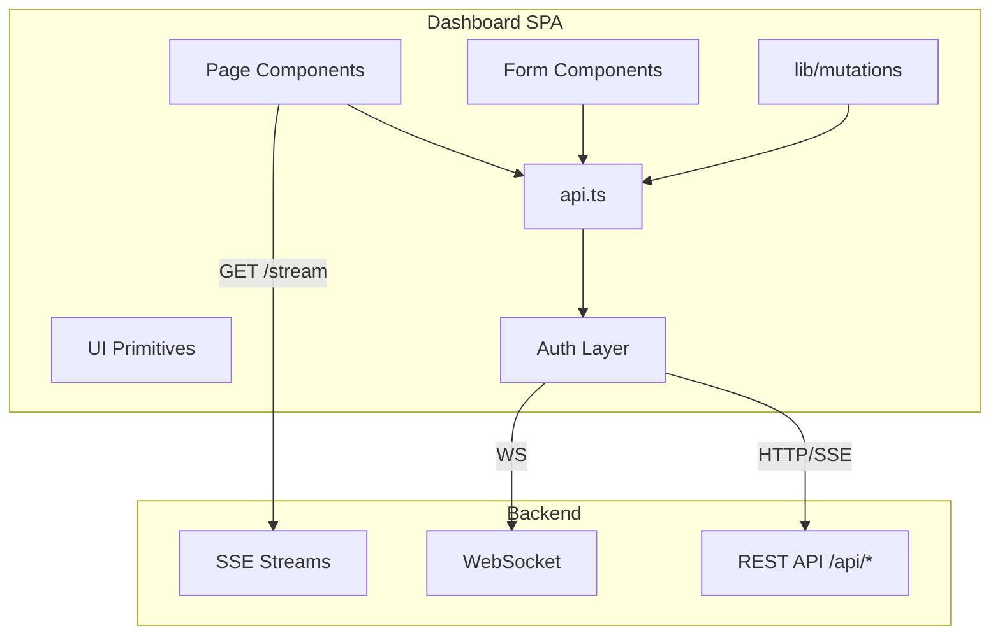

# Dashboard

# Dashboard Module

The Dashboard is a React-based single-page application that provides the operator interface for LibreFang. It communicates with the kernel's REST API (`/api/*`) and exposes real-time streams via SSE and WebSocket connections.

## Architecture Overview


```mermaid
graph TD
    subgraph "Dashboard SPA"
        Pages[Page Components]
        Forms[Form Components]
        UI[UI Primitives]
        API[api.ts]
        Mutations[lib/mutations]
        Auth[Auth Layer]
    end

    subgraph "Backend"
        REST[REST API /api/*]
        SSE[SSE Streams]
        WS[WebSocket]
    end

    Pages --> API
    Forms --> API
    Mutations --> API
    API --> Auth
    Auth -->|HTTP/SSE| REST
    Auth -->|WS| WS
    Pages -->|GET /stream| SSE
```

## Generated API Types — `openapi/generated.ts`

This file is **auto-generated** by `openapi-typescript` from the kernel's OpenAPI schema. **Do not edit it directly** — regenerate via the build script after any backend route change.

It exports a single `paths` interface keyed by route patterns. Each entry describes the available HTTP methods and links to an `operations` type that specifies request/response shapes. To use these types in API client code:

```typescript
import type { paths } from "./openapi/generated";

// Type a specific operation's response
type AgentsResponse = paths["/api/agents"]["get"]["responses"]["200"]["content"]["application/json"];
```

### API Coverage

The generated schema covers these domain areas:

| Prefix | Purpose |
|---|---|
| `/api/agents` | Agent CRUD, sessions, messaging, memory, files, tools, skills, metrics |
| `/api/a2a` | Agent-to-agent discovery and task delegation |
| `/api/approvals` | Human-in-the-loop approval queue |
| `/api/audit` | Tamper-evident audit log |
| `/api/auth` | Login, OAuth2 callbacks, session management |
| `/api/backup` | Kernel state backup/restore |
| `/api/bindings` | Agent binding configuration |
| `/api/budget` | Global, per-agent, and per-user cost controls |
| `/api/catalog` | Model catalog sync |
| `/api/channels` | Channel adapters (Telegram, Slack, etc.) |
| `/api/clawhub` | Skill marketplace browse/search/install |
| `/api/comms` | Inter-agent messaging and topology |
| `/api/config` | Kernel config read/reload/set |
| `/api/cron` | Scheduled job management |
| `/api/extensions` | MCP server extension lifecycle |
| `/api/hands` | Hand agent marketplace and lifecycle |
| `/api/health` | Liveness and diagnostics |
| `/api/hooks` | Webhook triggers |
| `/api/mcp` | MCP server CRUD, health, taint rules |
| `/api/memory` | Proactive memory management |
| `/api/metrics` | Prometheus-format metrics |
| `/api/models` | Model catalog, aliases, custom models |
| `/api/network` | OFP network status |
| `/api/pairing` | Mobile device pairing |
| `/api/peers` | OFP peer discovery |
| `/api/providers` | LLM provider management |
| `/api/sessions` | Session listing |
| `/api/skills` | Skill management |
| `/api/tasks` | Background task tracking |
| `/api/users` | User management |

## API Client — `src/api.ts`

The centralized HTTP client that all page components and mutations use to communicate with the kernel.

### Authentication Chain

Every outbound request flows through the same auth pipeline:

```
mutationFn → stopAgent() → post() → buildHeaders() → authHeader() → getStoredApiKey()
```

1. **`getStoredApiKey()`** — retrieves the stored session token from browser storage
2. **`authHeader()`** — formats the `Authorization: Bearer <token>` header
3. **`buildHeaders()`** — assembles the full headers object (content-type, auth, idempotency keys)
4. **`post()` / `get()` / etc.** — perform the fetch call with proper error parsing

### Error Handling

On non-2xx responses, the client parses the error through:

```
parseError() → ApiError.fromResponse() → clearApiKey() (on 401)
```

`ApiError` (from `lib/http/errors.ts`) is the standard error type surfaced to components. On authentication failures, `clearApiKey()` wipes the stored credentials and typically triggers a redirect to the login page.

### Key API Functions

| Function | Endpoint | Purpose |
|---|---|---|
| `stopAgent(id)` | `POST /api/agents/{id}/stop` | Cancel an in-flight LLM run |
| `patchAgentConfig(id, ...)` | `PATCH /api/agents/{id}/config` | Hot-update name, description, system prompt |
| `patchHandAgentRuntimeConfig(id, ...)` | `PATCH /api/agents/{id}/hand-runtime-config` | Runtime override for hand agents |
| `getAgentTools(id)` | `GET /api/agents/{id}/tools` | Fetch tool allowlist/blocklist |
| `updateAgentTools(id, ...)` | `PUT /api/agents/{id}/tools` | Replace tool allowlist/blocklist |
| `resetAgentSession(id)` | `POST /api/agents/{id}/session/reset` | Reset conversation state |
| `listTools()` | `GET /api/tools` | Enumerate all available tools |
| `setApiKey(...)` | (config write) | Persist provider API key |
| `verifyStoredAuth()` | `POST /api/auth/introspect` | Validate stored session token |
| `getMetricsText()` | `GET /api/metrics` | Fetch Prometheus-format metrics |
| `buildAuthenticatedWebSocket(path)` | (WS upgrade) | Create an auth'd WebSocket connection |

## Mutation Layer — `lib/mutations/`

Mutations wrap API calls for React Query's `useMutation`. Each mutation function calls through the api.ts client, which triggers the auth chain automatically. The standard pattern:

```typescript
// lib/mutations/agents.ts
export const useStopAgent = () =>
  useMutation({
    mutationFn: (id: string) => stopAgent(id),
    onSuccess: () => queryClient.invalidateQueries({ queryKey: ["agents"] }),
  });
```

All mutations share the same execution flow: `mutationFn` → API function → `post()` → `buildHeaders()` → `authHeader()` → `getStoredApiKey()`. On failure, the path is `post()` → `parseError()` → `ApiError.fromResponse()`, with `clearApiKey()` triggered on 401 responses.

## Page Components — `src/pages/`

Each page corresponds to a top-level route in the dashboard. Pages follow a consistent pattern:

1. Fetch data via React Query
2. Render UI with page-specific components
3. Handle mutations with toast notifications

### Agent & Chat Pages

- **`ChatPage`** — Real-time agent conversation. Supports both HTTP and SSE streaming message delivery. The `handleMessage` flow resets a fallback timer, attempts `sendViaHttp`, and applies incremental patches via `applyResponsePatch`.
- **`SessionsPage`** — Session list with delete capability (`handleDelete` → `addToast`).
- **`RuntimePage`** — Live view of in-flight agent loops.

### Agent Configuration Pages

- **`SkillsPage`** — Skill browsing with ClawHub integration. `fangHubItems` filters by category via `filterByCategory`. `SkillDetailModal` contains `EvolveUpdatePane` and `EvolveUploadPane` sub-components. `hubHealth` checks status via `flag`.
- **`ModelsPage`** — Model catalog, aliases, and custom model management.
- **`ProvidersPage`** — LLM provider management with API key testing. `ProviderCard` renders icons via `getProviderIcon`. `CredentialPoolCard` renders individual keys with `CredentialKeyRow`. Key operations: `saveKey` → `getErrorMessage`, `testKey` → `getActionResultError`.

### Infrastructure Pages

- **`McpServersPage`** — MCP server configuration with connection status. `connectedCount` and `connectedMap` derive state via `serverIdentityOf`. Contains an inline `ArgsEditor` component. Error handling: `onError` and `handleStartAuth` format messages via `errorMessage`.
- **`SchedulerPage`** — Cron job management. `handleEditTrigger` surfaces errors via `addToast`.
- **`HandsPage`** — Hand agent marketplace. `HandCard` embeds `HandMetricsInline`; `HandsPage` routes to `HandDetailPanel`. Form creation uses `handleCreate` → `resetForm`.

### Administration Pages

- **`ProvidersPage`** — Provider cards, credential pool display, key management.
- **`UserBudgetPage`** — Per-user budget configuration. `onSubmit` confirms via `addToast`.
- **`UsersPage`** — User management. Mutations notify via `addToast`.
- **`UserPolicyPage`** — Policy configuration per user.
- **`AuditPage`** — Audit log viewer with modal detail views. Uses `PageHeader` → `Modal` → `useFocusTrap` for accessibility.

### Specialized Pages

- **`PermissionSimulatorPage`** — Simulates agent permission resolution. `ChannelBindingsCard` and `ToolPolicyCard` use `SectionHeader` for layout.
- **`MemoryPage`** (`pages/Memory/`) — Proactive memory management with tabs (`HealthTab` renders `DefRow` for individual stats). Errors surfaced via `addToast`.
- **`MediaPage`** — Speech/media settings. `SpeechPanel` contains `ProviderSelect`.
- **`TerminalPage`** — Embedded terminal with size clamping via `clampTermSize`.
- **`MobilePairingPage`** — Device pairing QR flow.
- **`LogsPage`** — Log streaming viewer.
- **`OverviewPage`** — System overview dashboard.
- **`PluginsPage`** — Extension/plugins management. `handleRegistryInstall` triggers installs; `onSuccess` notifies via `addToast`.
- **`SettingsPage`** — Global settings including TOTP configuration.
- **`TasksPage`** — Background task monitoring.

## Shared Components — `src/components/`

- **`AgentManifestForm`** — Reusable form for agent creation/editing. Tested independently via a test harness.
- **`TrafficSplit`** — Traffic distribution configuration. `buildEvenTrafficSplit` generates an even distribution across N targets.
- **UI primitives** (`components/ui/`) — `PageHeader`, `Modal` (with `useFocusTrap`), and other low-level components.

## Key Patterns

### Authentication

The dashboard supports multiple auth modes:

1. **Dashboard credentials** — Username/password via `POST /api/auth/dashboard-login`, returns a session token stored in the browser
2. **OAuth2** — Redirect-based flow through providers listed at `GET /api/auth/providers`
3. **API key** — Direct key in `Authorization: Bearer` or `X-API-Key` header

`GET /api/auth/dashboard-check` determines which mode is required. `verifyStoredAuth()` validates the current token on app load.

### Idempotency

Several write endpoints honor the `Idempotency-Key` header (issue #3637). When set:
- Same key + same body → replays the cached response (no duplicate side effects)
- Same key + different body → `409 Conflict`

This applies to `spawn_agent`, `a2a_send_external`, `activate_hand`, and similar creation endpoints.

### Real-time Streaming

Two streaming mechanisms are available:

1. **SSE** — `GET /api/logs/stream` for audit events, `GET /api/comms/events/stream` for inter-agent comms, `POST /api/agents/{id}/message/stream` for chat responses, and `GET /api/agents/{id}/sessions/{session_id}/stream` for attaching to in-flight turns
2. **WebSocket** — `buildAuthenticatedWebSocket()` for bidirectional communication requiring lower latency

### Error Handling Convention

Pages surface errors via `addToast()` or inline `errorMessage()` calls. The convention is:

- **Mutations**: `onError` callback formats the `ApiError` and passes it to `addToast`
- **Form submissions**: catch blocks or error states render inline error text
- **Auth failures**: automatic token cleanup and redirect to login

## Testing

Each page has a corresponding test file following the `renderPage` pattern:

```
renderPage() → renders component → asserts DOM/state
```

The API client is tested in `api.test.ts`, covering authentication flows, error parsing, and individual endpoint contracts (`getAgentTools`, `updateAgentTools`, `resetAgentSession`, `patchAgentConfig`, `patchHandAgentRuntimeConfig`, `getMetricsText`, `listTools`, `setApiKey`, `verifyStoredAuth`, `buildAuthenticatedWebSocket`).

## Adding a New Page

1. Define the backend routes and add them to the OpenAPI spec, then regenerate `openapi/generated.ts`
2. Add the API function(s) to `src/api.ts`, following the existing `get`/`post`/`put`/`patch`/`del` patterns
3. Create mutation hooks in `lib/mutations/` if the page writes data
4. Create the page component in `src/pages/`, using React Query for reads and mutation hooks for writes
5. Surface errors with `addToast` and success confirmations the same way
6. Add the route to the router configuration
7. Add a `renderPage` test in the corresponding test file