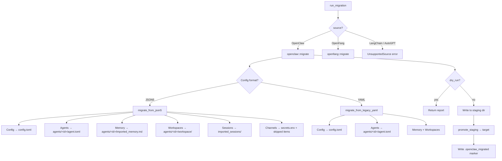

# Data Import & Migration

# Data Import & Migration (`librefang-import`)

Migrates agent configurations, memory, sessions, and related data from external agent frameworks into LibreFang's native format.

## Supported Sources

| Source | Status | Format |
|---|---|---|
| OpenClaw (modern) | Supported | Single `openclaw.json` (JSON5) |
| OpenClaw (legacy) | Supported | `config.yaml` + per-agent `agent.yaml` |
| OpenFang | Supported | Same TOML format, field remapping |
| LangChain | Planned | — |
| AutoGPT | Planned | — |

## Entry Points

The crate exposes one public function for executing migrations and two for pre-migration inspection:

```rust
// Execute a migration
pub fn run_migration(options: &MigrateOptions) -> Result<MigrationReport, MigrateError>;

// Pre-migration inspection (OpenClaw only)
pub fn detect_openclaw_home() -> Option<PathBuf>;
pub fn scan_openclaw_workspace(path: &Path) -> ScanResult;
```

### Callers

- **CLI** — `librefang-cli` calls `run_migration` via `cmd_migrate`, then prints the report summary.
- **TUI init wizard** — `tui/screens/init_wizard.rs` calls `detect_openclaw_home` and `scan_openclaw_workspace` to show the user what's available, then `run_migration` when confirmed.
- **HTTP API** — `src/routes/config.rs` exposes `migrate_detect`, `migrate_scan`, and `run_migrate` endpoints.

## Migration Options

```rust
pub struct MigrateOptions {
    pub source: MigrateSource,   // Which framework to import from
    pub source_dir: PathBuf,     // Path to the source workspace
    pub target_dir: PathBuf,     // Path to LibreFang home (~/.librefang)
    pub dry_run: bool,           // Report only, no disk writes
}
```

Set `dry_run: true` to get a full `MigrationReport` without modifying any files. The CLI and TUI both use this for preview-before-commit workflows.

## Architecture



## Atomic Migration Pipeline

All non-dry-run OpenClaw migrations follow a write-to-staging-then-promote pattern:

1. **Staging directory** — A sibling directory `<target>.migrate-staging` receives all output. If this directory already exists (from a previous failed run), migration aborts with `MigrateError::StagingExists` to prevent silent corruption.

2. **Per-entry atomic writes** — Each file is written to a `.tmp` sibling then renamed (`atomic_write`). Existing files in the target are backed up to `.bak.<timestamp>` siblings before any overwrite.

3. **Promotion** — `promote_staging` recursively moves files from staging into the real target. Files that already exist in the target are **never clobbered** (the staged copy is dropped and a warning is emitted). On cross-device renames, a copy-then-rename fallback preserves atomicity.

4. **Marker** — A `.openclaw_migrated` marker is written inside staging before promotion. Subsequent runs detect this marker and skip entirely to preserve user edits.

## OpenClaw Config Discovery

`find_config_file` searches the source directory for known config file names, in priority order:

1. `openclaw.json` (modern)
2. `clawdbot.json`, `moldbot.json`, `moltbot.json` (legacy names)
3. `config.yaml` (very old installs)

If a JSON file is found, the JSON5 code path runs. Otherwise, the legacy YAML path runs.

`detect_openclaw_home` checks standard locations (`~/.openclaw`, `~/.clawdbot`, `~/.moldbot`, `~/.moltbot`, `~/.config/openclaw`, `%APPDATA%/openclaw`, `%LOCALAPPDATA%/openclaw`) plus the `OPENCLAW_STATE_DIR` env override.

## Schema Version Validation

OpenClaw JSON5 configs may declare a `version` (or `schemaVersion`) field. The migrator accepts versions `1` and `2` only. Any other version produces `MigrateError::UnsupportedVersion`. A missing version field is allowed with a warning.

## What Gets Migrated

### Config

The top-level OpenClaw config is converted to LibreFang's `config.toml`:

| OpenClaw | LibreFang |
|---|---|
| `agents.defaults.model` | `[default_model]` provider/model/api_key_env |
| `agents.defaults.memory` | `[memory]` decay_rate |
| — | `config_version` (current) |
| — | `api_listen` (default) |

### Agents

Each agent in `agents.list` (JSON5) or `agents/<name>/agent.yaml` (legacy) becomes `agents/<id>/agent.toml`:

- **Model** — The `"provider/model"` string is split; fallback models become `[[fallback_models]]` entries.
- **Tools** — Individual tool names are mapped via `librefang_types::tool_compat::map_tool_name`. Unrecognized tools are reported as warnings. Tool profiles (`"minimal"`, `"coding"`, etc.) map to `ToolProfile::tools()`.
- **Capabilities** — Derived from the tool list: `shell_exec` → `[capabilities].shell`, `web_fetch`/`web_search` → `.network`, `agent_send`/`agent_list` → `.agent_message` + `.agent_spawn`.
- **Identity** — `extract_identity_prompt` handles both plain strings and structured objects, searching common keys (`systemPrompt`, `prompt`, `instructions`, etc.) recursively.
- **Tool blocklist** — OpenClaw's `tools.deny` list is preserved as `tool_blocklist` in the agent manifest.
- **Skills** — Per-agent skill allowlists from `entry.skills` are preserved as the `skills` array.
- **Workspace** — Custom workspace paths from `entry.workspace` are carried over.

### Memory

`memory/<agent>/MEMORY.md` (or `agents/<agent>/MEMORY.md` in legacy layouts) is copied to `agents/<agent>/imported_memory.md`. Empty files are skipped. Deduplication ensures the JSON5 layout takes precedence if both exist.

### Workspaces

`workspaces/<agent>/` (or `agents/<agent>/workspace/`) directories are copied recursively to `agents/<agent>/workspace/`.

### Sessions

`sessions/*.jsonl` files are copied to `imported_sessions/` in the target.

### Channel Secrets

All messaging channels have migrated to out-of-process sidecar adapters. The migrator extracts bot tokens and API keys from the OpenClaw channel config and writes them to `secrets.env` (with `0o600` permissions on Unix). Each channel is reported as a `SkippedItem` with instructions for configuring the corresponding sidecar.

Supported secret extraction:

| Channel | Secrets written |
|---|---|
| Telegram | `TELEGRAM_BOT_TOKEN` |
| Discord | `DISCORD_BOT_TOKEN` |
| Slack | `SLACK_BOT_TOKEN`, `SLACK_APP_TOKEN` |
| Mattermost | `MATTERMOST_TOKEN` |

All other channels (WhatsApp, Signal, Matrix, Google Chat, Teams, IRC, Feishu, iMessage, BlueBubbles) are reported as skipped with no secret extraction.

### Skipped Features

These OpenClaw features have no LibreFang equivalent and appear as skipped items in the report:

- **Cron jobs** — Use LibreFang's `ScheduleMode::Periodic`
- **Hooks** — Use the event system
- **Auth profiles** — Security-sensitive; set env vars manually
- **Skills** — Must be reinstalled via `librefang skill install`
- **Vector index** (`memory-search/index.db`) — Rebuilt automatically
- **Auth profiles file** (`auth-profiles.json`) — Security-sensitive
- **Session config** — Different scoping model
- **Memory backend config** — LibreFang uses SQLite with vector embeddings

## Security Measures

- **Path traversal prevention** (#3794) — `validate_migration_id` rejects agent IDs containing `..`, absolute paths, or NUL bytes. Only single normal path components are accepted.
- **Atomic file writes** — All output files are written via `atomic_write` (write to `.tmp`, then rename).
- **Backup before overwrite** — `write_with_backup` renames any existing target to `.bak.<timestamp>` before writing.
- **Secret file permissions** — `write_secret_env` restricts `secrets.env` to `0o600` on Unix.
- **Idempotency protection** — The `.openclaw_migrated` marker prevents accidental re-imports from overwriting user edits.

## Error Handling

```rust
pub enum MigrateError {
    SourceNotFound(PathBuf),       // source_dir doesn't exist
    ConfigParse(String),           // malformed config
    AgentParse(String),            // malformed agent definition
    Io(std::io::Error),            // filesystem errors
    Yaml(serde_yaml::Error),       // YAML parse errors
    Json5Parse(String),            // JSON5 parse errors
    TomlSerialize(toml::ser::Error), // TOML output errors
    UnsupportedSource(String),     // LangChain, AutoGPT, etc.
    InvalidId(String),             // path traversal in agent id (#3794)
    UnsupportedVersion(u32),       // unknown schema version (#3797)
    StagingExists(PathBuf),        // stale staging from failed run (#3798)
}
```

On failure, the staging directory is intentionally left in place so users can inspect partial output. A subsequent run will refuse to proceed until the staging directory is manually removed.

## Migration Report

`MigrationReport` tracks everything that happened during a run:

- **`imported`** — `Vec<MigrateItem>` listing every file written, with `kind` (Config, Agent, Memory, Session, Secret, Skill) and destination path.
- **`skipped`** — `Vec<SkippedItem>` for features that couldn't be auto-migrated, with human-readable `reason` strings.
- **`warnings`** — Non-fatal issues (unmapped tools, backed-up files, etc.).
- **`dry_run`** — Whether the report was produced without writing to disk.

The report is serialized to `migration_report.md` inside the target after a successful migration.

## Provider Mapping

`map_provider` normalizes OpenClaw provider names:

| OpenClaw | LibreFang |
|---|---|
| `anthropic`, `claude` | `anthropic` |
| `openai`, `gpt` | `openai` |
| `google`, `gemini` | `google` |
| `xai`, `grok` | `xai` |
| Others (groq, ollama, openrouter, deepseek, together, mistral, fireworks, cerebras, sambanova) | Passed through unchanged |

`default_api_key_env` maps each provider to its standard environment variable name (e.g., `ANTHROPIC_API_KEY`). Ollama returns an empty string (no key needed).

## OpenFang Migration

OpenFang uses the same TOML format as LibreFang (it's a community fork). The `openfang::migrate` function handles field remapping and schema drift detection, calling into `rewrite_toml_content` and `rewrite_env_content` for format adjustments. It uses `librefang_types::config::validation::detect_unknown_fields` to warn about unrecognized fields.