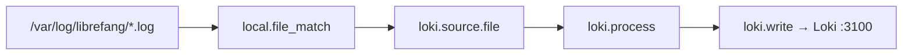

# deploy — alloy

# deploy/alloy

Grafana Alloy configuration for LibreFang's local development stack. Alloy tails the daemon's log files and ships them to Loki, attaching a stable `service="librefang"` label so that log lines are queryable alongside traces from the OTel/Tempo/Jaeger pipeline.

## Purpose

This module provides the log-collection piece of the local observability stack. The daemon writes log files to `/var/log/librefang/` (mounted read-only from the host). Alloy discovers those files, enriches each line with consistent labels, and pushes them to Loki. Once the daemon stamps `trace_id` into log lines (planned in a separate PR), Grafana's derived fields will enable trace ↔ log jumps in the explore view — the label plumbing is already in place to support that.

## Configuration

**File:** `config.alloy`

### Pipeline Overview



### Components

#### Logging

```alloy
logging {
    level  = "warn"
    format = "logfmt"
}
```

Controls Alloy's own diagnostic output. Set to `warn` to keep the container console quiet during normal dev work.

#### `local.file_match.librefang_logs`

Discovers log files matching the glob `/var/log/librefang/*.log`. The `sync_period` of 5 seconds means Alloy re-scans the directory every 5s to pick up new files (e.g., log rotation, or the daemon creating a new file at startup).

This glob captures both `daemon.log` and `tui.log` if both surfaces are writing to that directory.

#### `loki.source.file.librefang`

Tails the files discovered by `local.file_match` and forwards raw lines to the processing stage.

#### `loki.process.librefang`

Enriches log lines before they are sent to Loki:

| Stage | Action | Rationale |
|---|---|---|
| `stage.static_labels` | Adds `service="librefang"` and `job="librefang"` | The `service` label is what makes Grafana log queries match the service name reported by the OTel/Tempo/Jaeger tracing pipeline. This consistency is required for the trace ↔ log jump to work. |
| `stage.label_drop` | Removes `filename` | Prevents high-cardinality label explosion from per-file labels. |

#### `loki.write.local`

Pushes processed log entries to the local Loki instance at `http://loki:3100/loki/api/v1/push`. The hostname `loki` resolves via Docker Compose service discovery within the dev stack network.

## Integration Points

- **Daemon log output** — The daemon must write to `/var/log/librefang/*.log`. The container mount is configured elsewhere in the deployment setup (host path mounted read-only into the Alloy container).
- **Loki** — Expects a Loki service named `loki` listening on port 3100 within the same Docker network.
- **Grafana** — Queryable via LogQL using `{service="librefang"}`. The `service` label alignment with the trace pipeline enables cross-correlation in Grafana Explore.
- **Trace correlation** — Planned: once the daemon writes `trace_id` into log lines, Grafana derived fields will automatically link log entries to Tempo/Jaeger traces. No Alloy config change will be needed for this — the label plumbing is already in place.

## Querying Logs

In Grafana or via the Loki API, filter logs with:

```logql
{service="librefang"}
```

To narrow by log surface (once filename-based filtering is re-added or the daemon includes a surface identifier in the line content), extend the query accordingly. Note that `filename` is dropped at the Alloy level, so it is not available as a Loki label.